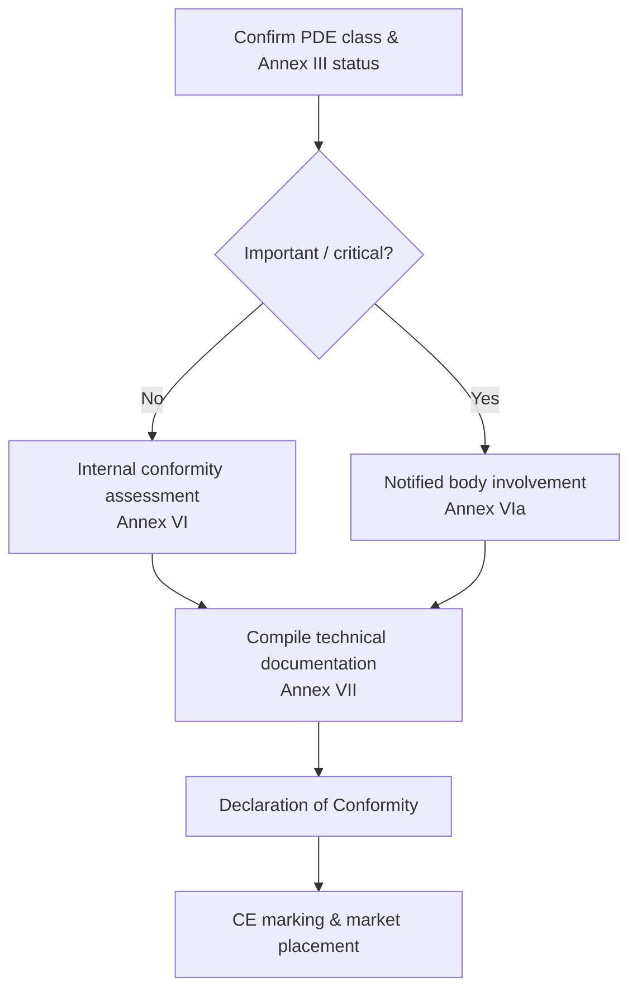

## CRA and the CE ecosystem

CRA is a **CE-marking regulation**, similar in spirit to RED or EMC: you must demonstrate that your product conforms to its essential requirements before placing it on the market \[1]   

For many embedded PDEs this will be a **self-assessment** route; for important/critical products a **notified body** is involved under Annex VI/VIa \[1]

---

## Evidence required

The core of conformity assessment is your **technical documentation** and the **process evidence** produced by your SDL, SBOM and vulnerability-handling workflows.\[1]   

Examples:

- architecture diagrams and threat models,  
- mapping of controls to Annex I requirements,  
- test reports and penetration-testing summaries,  
- provisioning and update process descriptions,  
- SBOMs plus VEX or equivalent vulnerability-statement formats,  
- CVD policy and incident / vulnerability-handling records.

---

## Role of standards

Until harmonised standards under CRA are cited in the Official Journal, you can rely on “state-of-the-art” standards referenced by the Commission to show conformity (Article 25).   

Typical examples:

- **IEC 62443-4-1 / 4-2** for industrial/embedded security,  
- **ETSI EN 303 645** for consumer IoT,  
- **NIST SSDF** for secure development lifecycle practices.

Applying recognised standards gives you a **presumption of conformity** for the corresponding controls and makes notified-body assessment smoother.

---

## Declaration of Conformity (DoC)

The DoC is a short document, signed by the manufacturer, that:

- identifies the product and versions,  
- lists applicable legislation (CRA, RED, EMC, LVD, …),  
- references standards and internal documents used to show conformity,  
- identifies the responsible person in the EU.   

Keep the DoC in sync with your technical file and update it when major firmware/feature changes occur so Article 22 duties remain fulfilled.

---

## Readiness checklist

Before claiming conformity, verify:

- [ ] Scope and classification confirmed (PDE, important/critical). See [Scope & Definitions](./scope-and-definitions).
- [ ] SDL defined and followed for the current release. See [SDL](./secure-development-lifecycle).
- [ ] Embedded technical controls mapped to Annex I requirements. See [Embedded Technical Controls](./embedded-technical-controls).
- [ ] Technical documentation and SBOM pack complete. See [Docs & SBOM](./documentation-and-sbom).
- [ ] Vulnerability-handling process operational; support period defined. See [Vulnerability Handling](./vulnerability-handling).

This checklist ties directly into the **Developer Checklist** used by engineering teams (see [Developer Checklist](./developer-checklist)).

[1]: https://eur-lex.europa.eu/legal-content/EN/TXT/?uri=CELEX:32024R2847 "Regulation (EU) 2024/2847 — Articles 16–25 and Annexes VI/VII"
