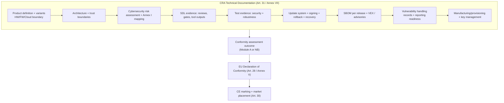

## Why this matters for embedded products

The CRA is a **CE-marking Regulation**: before you place a Product with Digital Elements (PDE) on the EU market, you must be able to **demonstrate conformity** with the CRA essential cybersecurity requirements (Annex I) and keep the evidence available in a **technical documentation package** (Art. 31 + Annex VII).  
Conformity is not only about the final firmware binary: the CRA explicitly includes **the "processes put in place by the manufacturer"** (Art. 31, Art. 32). That means your SDL, SBOM and vulnerability handling are **part of the compliance object**.

This page explains **(1) how to select the conformity route**, **(2) what a CE-ready evidence set looks like for embedded devices**, and **(3) how to keep it valid across releases**.

---

## 1) Identify the conformity route (normal / important / critical)

The CRA route depends on whether your PDE is:
- **"Normal" PDE** (not listed as Important/Critical),
- **Important** (Annex III, class I or class II),
- **Critical** (Annex IV).

The **conformity procedures are defined in Article 32** and implemented via **modules in Annex VIII**:
- **Module A**: Internal control (self-assessment)
- **Module B + C**: EU-type examination + conformity to type (NB involved)
- **Module H**: Full quality assurance (NB involved)
- **EU cybersecurity certification scheme** (where applicable) at **assurance level at least "substantial"** (Art. 27(8)-(9), Art. 32)

### Decision logic (Article 32)

```mermaid
flowchart TD
  A[Start: Product with Digital Elements] --> B{Is it listed in Annex IV?}
  B -- Yes --> C[CRITICAL PDE]
  C --> C1{EU cybersecurity certification scheme<br/>available & applicable?}
  C1 -- Yes --> C2["Use EU cybersecurity certification scheme<br/>(Art. 32(4)(a) + Art. 8(1))"]
  C1 -- No --> C3["Use one of Article 32(3) procedures<br/>(B+C or H or certification if later available)"]

  B -- No --> D{Is it listed in Annex III?}
  D -- No --> E[NORMAL PDE]
  E --> E1["Choose: Module A, or B+C, or H, or certification scheme<br/>(Art. 32(1))"]

  D -- Yes --> F{Annex III class?}
  F -- Class I --> G[IMPORTANT PDE - Class I]
  G --> G1{Did you apply harmonised standards / common specs / certification<br/>at least "substantial" for the relevant requirements?}
  G1 -- Yes --> G2["You may use Article 32(1) routes<br/>(incl. Module A) for those covered requirements"]
  G1 -- No --> G3["For uncovered requirements: must use B+C or H<br/>(Art. 32(2))"]

  F -- Class II --> H[IMPORTANT PDE - Class II]
  H --> H1["Must use: B+C or H or certification scheme (substantial+)<br/>(Art. 32(3))"]
```

### Key embedded takeaway

For many embedded teams, the "surprise" is **Important Class I**:
- you *might* be able to stay on **Module A** _only_ if the relevant essential requirements are covered by **harmonised standards**, **common specifications**, or **EU cybersecurity certification** at the right assurance level;  
- otherwise, you must involve a Notified Body via **B+C** or **H** for the uncovered parts (Art. 32(2)).

---

## 2) Technical documentation is the backbone (Art. 31 + Annex VII)

Article 31 is explicit:
- The technical documentation must contain **all relevant data/details** showing compliance of the product **and** the manufacturer processes with Annex I.  
- It must be prepared **before placing on the market** and **continuously updated**, at least for the support period.

For embedded products, a practical structure that maps well to audits:



### Embedded "must-have" specifics (what auditors will ask you to pin down)

- **Exact compliance object**: device HW revision(s), SoC SKU(s), firmware version(s), boot chain, remote services that affect security.
- **Trust boundaries**: which parts are inside your security scope (MCU, gateway, app, cloud).
- **Update and rollback**: signed images, anti-rollback strategy, recovery mode, failure logs.
- **Key lifecycle**: provisioning, storage, rotation, compromise response.
- **Evidence per release**: SBOM, test reports, security fixes, release notes, and which Annex I points they address.

---

## 3) Presumption of conformity: don't over-claim it (Art. 27)

The CRA gives **presumption of conformity** only when:
- you apply **harmonised standards** whose references are published in the Official Journal, or
- you apply **common specifications** adopted by the Commission, or
- you have an EU cybersecurity certificate/statement under an accepted scheme (Art. 27(8)-(9)).

Everything else (IEC 62443, ETSI EN 303 645, NIST SSDF, etc.) can still be excellent **state-of-the-art evidence**, but it is **not automatically a presumption** unless it becomes harmonised / referenced / translated into common specifications.

Practical approach for embedded:
- Use well-known standards to structure controls and evidence,
- Track whether/when they become **harmonised** (so you can claim presumption cleanly later),
- Keep the Annex I mapping as the "source of truth".

---

## 4) EU Declaration of Conformity (Art. 28 / Annex V) + simplified DoC (Annex VI)

The **EU Declaration of Conformity**:
- states that Annex I requirements have been demonstrated,
- must follow the **model structure in Annex V** and be kept **up to date** (Art. 28).

Embedded practical tips:
- Treat the DoC as a **versioned artifact** linked to:
  - firmware release identifiers,
  - SBOM identifiers,
  - test campaign IDs,
  - update server endpoints (if security-relevant).

If you ship a simplified DoC, it must follow **Annex VI** and include the exact link to the full DoC (Art. 28 + Annex VI).

---

## 5) CE marking (Art. 30): hardware *and* software realities

Article 30 clarifies how to affix CE marking:
- visible/legible/indelible on the product, or on packaging + DoC when not possible,
- and **for software PDEs**, CE marking can be on the DoC or on the website accompanying the software.

For embedded firmware delivered as part of a device:
- the "product" CE marking is typically on the device/packaging,
- but you still need software traceability in the technical documentation and DoC.

If a Notified Body is involved via Module H, the CE marking must include the NB identification number (Art. 30(4)).

---

## 6) "Substantial modification" and who becomes the manufacturer (Art. 21-22)

The CRA is strict about **who holds the obligations**:
- An importer/distributor becomes a manufacturer if they place it under their name/trademark **or** carry out a **substantial modification** (Art. 21).
- Any other actor performing a substantial modification and making the product available becomes a manufacturer for the affected part (or whole product if impact is global) (Art. 22).

Embedded examples that can become "substantial modification" in practice:
- changing secure boot keys / trust anchors,
- disabling security defaults,
- replacing crypto libraries,
- altering the update mechanism,
- enabling debug features in production,
- swapping a key security component (secure element, enclave config).

**Action**: define an internal rule: "what we classify as substantial modification" and force a compliance review gate when it occurs.

---

## 7) Minimal "CE-ready" checklist for an embedded release

- [ ] **Classification** done (Normal / Annex III class I/II / Annex IV) with rationale.
- [ ] **Route** selected per Art. 32 (Module A vs B+C vs H vs certification).
- [ ] **Annex I mapping** completed and linked to implementation evidence.
- [ ] **Technical documentation** (Art. 31 / Annex VII) updated for this release.
- [ ] **DoC** created/updated (Art. 28 / Annex V) and linked to release IDs.
- [ ] **CE marking** placement rules satisfied (Art. 30), including software case if applicable.
- [ ] **Support period + user info** kept available (Art. 13 + Annex II), aligned with your update reality.
- [ ] **Supply-chain evidence packet** prepared for importers/distributors/OEM integrators.

---

## Common problems teams hit in this section (and how to resolve them)

### 1) "Our product is a device, but security depends on the cloud/app"
**Problem:** you cannot "CE-mark only the board" if security relies on remote components.  
**Fix:** document the *full security-relevant system boundary* in technical documentation: what is part of the PDE security environment and what assumptions apply.

### 2) "We don't know if we are Annex III or Annex IV"
**Problem:** misclassification drives the wrong conformity route.  
**Fix:** keep a written cross-check against Annex III/IV items and link it to product features (function, deployment context, marketed purpose).

### 3) "We use IEC/ETSI/NIST-can we claim presumption of conformity?"
**Problem:** confusing "good evidence" with "legal presumption".  
**Fix:** only claim presumption when Art. 27 conditions are met (harmonised / common specs / accepted certification). Otherwise state "state-of-the-art alignment" + Annex I mapping.

### 4) "Firmware updates change behavior-do we need a new DoC every time?"
**Problem:** unmanaged release cadence breaks traceability.  
**Fix:** define a policy: which releases require DoC refresh (security-relevant changes, new interfaces, new crypto, new update flow) and keep traceable release IDs.

### 5) "We ship many variants (different SoCs / radio modules)"
**Problem:** evidence becomes unbounded.  
**Fix:** create a **variant matrix**: what differs, what remains identical, and which test/evidence applies to each variant.

### 6) "ODM/OEM integrates our module-who is the manufacturer?"
**Problem:** obligations may shift with branding and substantial modifications.  
**Fix:** contractually define responsibilities + provide an "evidence packet" per release, but remember: the legal role follows Art. 21-22 logic.

---

## References (official)

[1]: Regulation (EU) 2024/2847 (Cyber Resilience Act) - Official Journal (ELI): http://data.europa.eu/eli/reg/2024/2847/oj  

[2]: Regulation (EU) 2024/2847 - consolidated text (CELEX): https://eur-lex.europa.eu/legal-content/EN/TXT/?uri=CELEX:32024R2847


