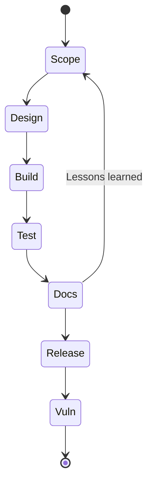

## How to use this checklist

This is a **living checklist** meant to sit in your repository (e.g. `doc/cra-checklist.md`). It connects day-to-day engineering tasks to CRA Annex I evidence so each release can demonstrate conformity without last-minute scrambling.[1]  

**Rule of thumb:** a checkbox is only “done” if it links to **evidence**:
- ticket/issue ID(s),
- MR/PR link(s),
- build artifacts / logs,
- test reports,
- SBOM + VEX (or equivalent),
- docs/risk assessment/threat model updates.

Tick items per release; link them to tickets, MR/PR IDs, and documents.

---

## Project setup

- [ ] Product classified as in scope of CRA (PDE class, important/critical). See [Scope & Definitions](./scope-and-definitions).
    + Evidence: classification note + decision record (ADR), product variants list.
- [ ] Security objectives defined for the product (what we must protect and what “acceptable risk” means).
    - Evidence: security requirements doc linked to issues/ADRs.
- [ ] Threat model created or updated for this release (assets, trust boundaries, attacker model, key abuse cases).
    - Evidence: threat model file + change log.
- [ ] Component inventory established (libraries, RTOS, bootloader, crypto, network stack, build tools).
    - Evidence: dependency list and ownership (who maintains/approves updates)..
---

## Design & implementation

- [ ] Architecture reviewed against [Embedded Technical Controls](./embedded-technical-controls) (identity, secure boot, comms, updates).
    - Evidence: architecture diagram(s) + control mapping notes.
- [ ] Debug / factory / maintenance interfaces protected or locked for production (ports, test hooks, boot modes). (see [Embedded Technical Controls](./embedded-technical-controls)).  
    - Evidence: manufacturing procedure + configuration/option-bytes + test proof.
- [ ] Secrets and keys handled safely (no secrets in source, encrypted at rest when relevant, provisioning defined).
    - Evidence: key/provisioning design + audit checks.
- [ ] Secure defaults implemented (no “admin/admin”, minimal services enabled, least privilege).
    - Evidence: default configuration doc + tests verifying defaults.
- [ ] Defensive coding and code review rules applied (input validation, safe parsing, error handling, consistent logging).
    - Evidence: coding standard + review checklist + MR links.
- [ ] Static analysis executed; findings triaged and tracked to closure or justified acceptance. See [SDL](./secure-development-lifecycle.md)
    - Evidence: tool reports + issue links.

---
## Build & release integrity (what we ship is controlled)

- [ ] Release build reproducible enough for traceability (version, commit/tag, config, toolchain captured).
    - Evidence: build metadata file (commit hash + build options).
- [ ] Release artifacts signed; signing logs stored and access-controlled. (see [SDL](./secure-development-lifecycle)).
    - Evidence: signature logs, key ID references, signing pipeline run.
- [ ] Hardware/firmware identity (versioning, anti-rollback if used) is defined and enforced.
    - Evidence: version policy + tests.
---

---

## Security testing (prove it)

- [ ] Unit + integration tests executed, including security-negative tests (bad inputs, invalid auth, corrupted packets).
    - Evidence: CI test report links.
- [ ] Static analysis + fuzzing on parsers/protocols completed (see [SDL](./secure-development-lifecycle)).  
- [ ] No known exploitable vulnerabilities open at release time (document any exceptions with VEX).   

---

## Build, SBOM and documentation

- [ ] Release build signed; signing logs stored (see [SDL](./secure-development-lifecycle)).  
- [ ] SBOM generated and stored with artefacts; VEX updated.   
- [ ] Technical documentation pack updated (risk assessment, design, tests, update process).   

---

## Vulnerability handling and updates

- [ ] CVD contact and policy live and referenced in docs (see [Vulnerability Handling](./vulnerability-handling)).  
- [ ] For each fixed vulnerability: advisory, release notes and VEX entry prepared.   
- [ ] Security update mechanism tested end-to-end (rollback, failure modes).   

Keep this checklist short enough that developers will actually use it, but detailed enough to satisfy **conformity assessment** reviewers and Article 24 expectations for supplier coordination.[1]

[1]: https://eur-lex.europa.eu/legal-content/EN/TXT/?uri=CELEX:32024R2847 "Regulation (EU) 2024/2847 — Annex I and Article 24"
