## What this checklist is (and what it is not)

This page is a **release-grade checklist** for embedded products under the EU Cyber Resilience Act (CRA). It turns CRA obligations into concrete engineering tasks, and forces every "done" item to point to **evidence** that belongs in your CRA technical documentation.

It is **not** a replacement for your legal analysis or your conformity assessment route selection. It's the day-to-day tool that makes those obligations implementable by firmware, platform, and DevSecOps teams.

> **Evidence rule:** a checkbox is only "done" if it links to *at least one* of: issue/ticket ID, PR/MR, CI run, test report, signed artifact, SBOM/VEX, design doc, ADR, or a dated decision record.

---

## CRA anchors (the clauses that drive this checklist)

You'll see the same few CRA anchors across most controls:

- **Designed, developed, produced** in line with Annex I Part I (manufacturer obligation).  
- **Cybersecurity risk assessment** documented and included in the technical documentation.  
- **Due diligence** on third-party components (including open source).  
- **Vulnerability handling** during the support period (Annex I Part II).  
- **Mandatory reporting** for *actively exploited vulnerabilities* and *severe incidents* (with strict timelines).  
- **Technical documentation** (Annex VII) + **user information** (Annex II).

If you need exact wording, always quote the Official Journal text in the CRA technical file.

---

## Recommended repository layout (Docusaurus + engineering evidence)

Keep "presentation docs" (Docusaurus) separate from "audit evidence" (technical file), but link them.

```
repo-root/
  docs/                         
  security/
    cra/
      releases/
        2025.12.0/
          00-scope-classification.md
          01-risk-assessment.md
          02-threat-model.md
          03-architecture.md
          04-controls-mapping.md
          05-test-evidence.md
          06-sbom-vex/
          07-release-attestation.md
          08-user-info-annex-ii.md
      templates/                # Copy/paste templates from this page
      adr/                      # Architecture Decision Records (security decisions)
  ci/
  firmware/
  bootloader/
```

---

## Evidence pipeline (how proof flows into the technical file)


---

## Ownership model (engineering RACI that auditors can understand)

A practical RACI for embedded products. Keep this table in your technical file (and update it per release).

| Work item | R (Responsible) | A (Accountable) | C (Consulted) | I (Informed) |
|---|---|---|---|---|
| Scope/classification decision record | Product security | Regulatory/Compliance | Firmware lead, Product | Sales, Support |
| Risk assessment + updates | Product security | Engineering director | QA, Platform | PSIRT |
| Secure boot / identity / debug locking | Firmware lead | Engineering director | HW lead, Manufacturing | Support |
| CI hardening + signing pipeline | DevOps/Build lead | Engineering director | Product security | QA |
| SBOM/VEX generation + archival | DevOps/Build lead | Product security | Firmware lead | Compliance |
| Security testing plan + execution | QA/Security test | QA lead | Firmware lead | Compliance |
| CVD + PSIRT process | PSIRT lead | Product security | Support, Legal | All teams |
| Article 14 reporting execution | PSIRT lead | Legal/Compliance | Product security | Exec staff |

---

## Release checklist (tick per release, attach evidence links)

### 0) Scope, classification, and product boundaries

- [ ] **PDE scope confirmed** (product with digital elements, including firmware and any remote data processing in scope).  
  Evidence: `00-scope-classification.md` + ADR ID.
- [ ] **Important/critical status checked** against Annex III/IV (and documented even if "not applicable").  
  Evidence: annex cross-check table + rationale.
- [ ] **Variant map frozen for this release** (SoC variants, HW revisions, feature flags, protocol profiles).  
  Evidence: `product-variants.yaml` + bill of materials per variant.
- [ ] **Intended use and operating environment stated** (consumer/industrial, connectivity assumptions, physical access assumptions).  
  Evidence: `intended-use.md` + threat model inputs.
- [ ] **Support period declared and recorded** (minimum duration and end-of-support policy).  
  Evidence: `support-period.md` + customer-facing plan.

> Tip for embedded: define scope per *image* (bootloader, app, radio stack), per *hardware SKU*, and per *cloud dependency*. Most "audit pain" comes from undefined boundaries.

---

### 1) Cybersecurity risk assessment (security-by-design entry point)

- [ ] **Cybersecurity risk assessment exists for this product** and is updated for this release.  
  Evidence: `01-risk-assessment.md` with changelog.
- [ ] **Risk assessment covers**: intended purpose + reasonably foreseeable use, conditions of use (operational environment), assets to protect, expected use time.  
  Evidence: risk assessment section headers and references.
- [ ] **Annex I Part I mapping included**: for each requirement, state applicability + how implemented or why not applicable.  
  Evidence: `04-controls-mapping.md`.


---

### 2) Threat model (embedded-focused)

- [ ] **System context diagram** created/updated: device, gateways, apps, remote processing, update servers, manufacturing.  
  Evidence: diagram + version history.
- [ ] **Trust boundaries identified** (secure vs non-secure execution, debug boundary, update boundary, external networks).  
  Evidence: threat model section "trust boundaries".
- [ ] **Attacker model documented** (remote attacker, local attacker with physical access, supply-chain adversary).  
  Evidence: `02-threat-model.md`.
- [ ] **Abuse cases / misuse cases** documented for: update path, debug/service mode, provisioning, radio/network stack.  
  Evidence: threat list + mitigations.

---

### 3) Secure boot, identity, and provisioning

- [ ] **Boot chain documented** from ROM ? first stage ? second stage ? application.  
  Evidence: `03-architecture.md` (boot chain section).
- [ ] **Authenticity & integrity verification enforced** at each boot stage (signature + hash policy).  
  Evidence: code/config + test report of failure cases.
- [ ] **Anti-rollback policy defined** (monotonic version, secure counter, fuse policy) and tested.  
  Evidence: version policy + test logs.
- [ ] **Device identity** defined (per-device key/cert strategy) and protected by a root-of-trust (secure element, enclave, OTP, or equivalent).  
  Evidence: key hierarchy doc + provisioning SOP.
- [ ] **Provisioning process hardened** (factory keys handling, separation of duties, audit logs).  
  Evidence: manufacturing procedure + access control evidence.

---

### 4) Runtime isolation and memory safety (MCU reality)

- [ ] **Privilege separation enabled where supported** (MPU/MMU regions, unprivileged tasks/userspace, secure partitions).  
  Evidence: RTOS config + memory map + tests.
- [ ] **Memory safety controls** enforced: bounds checking strategy, safe parsing rules for all external inputs (network, serial, USB, files).  
  Evidence: coding standard + PR checklist + targeted tests.
- [ ] **Exploit-hardening flags enabled** where toolchain supports them (stack protector, FORTIFY-like options, W^X where applicable).  
  Evidence: build flags + CI build logs.
- [ ] **Watchdog and fault recovery** implemented and tested (fail-safe mode, safe reboot, limited retry).  
  Evidence: HIL test logs.

---

### 5) Interface hardening (don't ship "debug-by-default")

- [ ] **Debug ports protected** (locked/disabled in field units or protected by an authenticated service procedure).  
  Evidence: option bytes/fuse settings + factory verification test.
- [ ] **All network services inventoried** (ports, protocols, versions) and reduced to minimum.  
  Evidence: `attack-surface.md` + scan results.
- [ ] **Management interfaces authenticated and authorised** (role separation, rate limits, lockout, secure session handling).  
  Evidence: API spec + tests.
- [ ] **Secure-by-default configuration** documented and validated (no default passwords, minimal privileges, conservative exposure).  
  Evidence: default config matrix + automated test.

---

### 6) Cryptography and key lifecycle

- [ ] **Crypto profile declared** (protocols, algorithms, key sizes, RNG requirements) and justified as "state of the art" for your use case.  
  Evidence: crypto profile doc + rationale.
- [ ] **Key lifecycle covered**: generation, storage, usage, rotation, revocation, compromise response.  
  Evidence: key management plan.
- [ ] **Certificate validation rules defined** (time source assumptions, pinning policy, renewal strategy, failure handling).  
  Evidence: comms security design + tests.

---

### 7) Build, CI/CD, and release integrity

- [ ] **Build provenance captured** (commit hash, toolchain version, configuration, reproducible-build strategy or traceability equivalent).  
  Evidence: `build-metadata.json` attached to artifacts.
- [ ] **Signing keys protected** (HSM/offline key ceremony/secure enclave) and access logged.  
  Evidence: signing SOP + audit log snapshot.
- [ ] **SBOM generated per build and per variant**, stored with artifacts.  
  Evidence: SBOM files in `06-sbom-vex/` + CI job logs.
- [ ] **Dependency governance active** (allow/deny lists, vulnerability scanning, license scanning, upgrade policy).  
  Evidence: dependency policy + scan results.

---

### 8) Security verification (prove the controls actually work)

- [ ] **Security test plan exists** and is executed for this release.  
  Evidence: `05-test-evidence.md` + CI logs.
- [ ] **Negative tests** cover: invalid signatures, corrupted updates, invalid certs, malformed packets, auth bypass attempts.  
  Evidence: test cases + results.
- [ ] **Fuzzing** performed on parsers/state machines (host harness + periodic HIL where feasible).  
  Evidence: fuzz reports + corpus location.
- [ ] **Pen-test / red-team style tests** planned proportionally to risk (especially for exposed services and update path).  
  Evidence: report summary + remediation tickets.

---

### 9) Documentation pack (technical file + user information)

- [ ] **Technical documentation bundle updated** for this release (architecture, risk assessment, controls mapping, tests, provisioning, updates).  
  Evidence: `security/cra/releases/<ver>/` bundle.
- [ ] **User-facing security info prepared** (support period, update method, secure configuration guidance, residual risks).  
  Evidence: `08-user-info-annex-ii.md` + link to published docs.
- [ ] **EU Declaration of Conformity inputs updated** (product identification, standards used, notified body info if applicable).  
  Evidence: DoC draft + version mapping list.

---

### 10) Vulnerability handling, updates, and mandatory reporting readiness

- [ ] **CVD contact published** (security page / security.txt), with encryption key and response timelines.  
  Evidence: URL + repo copy of content.
- [ ] **PSIRT workflow operational** (intake, triage, fix, advisory, rollout, postmortem).  
  Evidence: runbook + ticket templates.
- [ ] **Update mechanism tested end-to-end** (A/B or swap, power loss, rollback prevention, recovery path).  
  Evidence: HIL logs + automated update test results.
- [ ] **Article 14 reporting playbook exists** and is rehearsed: who files, what data, how to meet 24h/72h timelines for actively exploited vulnerabilities and severe incidents.  
  Evidence: reporting runbook + on-call rota + dry-run record.

```mermaid
sequenceDiagram
  participant R as Reporter/Researcher
  participant P as PSIRT Intake
  participant E as Engineering
  participant U as Update Pipeline
  participant C as Customers/Users
  R->>P: Report / advisory
  P->>P: Triage + scope via SBOM
  P->>E: Fix request + priority
  E->>U: Signed patch candidate
  U->>C: Rollout + release notes
  P->>P: VEX/advisory update + evidence archive
```



---

## Templates (copy/paste)

### Template A - Release evidence index (single page)

Create `07-release-attestation.md`:

```md
# CRA Release Evidence Index - <product> <version>

## Identification
- Product/SKU(s):
- HW revisions:
- Firmware image IDs (bootloader/app/radio):
- Build commit/tag:
- Release date:

## Scope & classification
- PDE scope decision (ADR):
- Annex III/IV check:

## Risk assessment
- Risk assessment doc:
- Changes since last release:

## Key controls
- Secure boot evidence:
- Debug locking evidence:
- Update mechanism evidence:
- Access control evidence:

## SBOM/VEX
- SBOM location(s):
- VEX location(s):
- Dependency scan report:

## Security testing
- CI run IDs:
- Fuzz report:
- Pen-test summary:

## User information (Annex II)
- Support period statement:
- Update instructions:
- Residual risks:

## Sign-off
- Firmware lead:
- Product security:
- QA:
- Date:
```

### Template B - ADR skeleton (security decision)

Create `security/cra/adr/ADR-XXXX.md`:

```md
# ADR-XXXX: <Decision title>

## Context
- Product scope:
- Threats driving this decision:
- Constraints (MCU resources, power, cost, boot ROM, etc.):

## Decision
- What we decided:
- Why (risk-based rationale):

## Security properties
- Confidentiality:
- Integrity:
- Availability:
- Update/maintenance impact:

## Alternatives considered
- Option A:
- Option B:

## Consequences
- What changes in implementation:
- Testing required:
- Documentation updates required:

## Links
- Tickets/PRs:
- Threat model section:
- Controls mapping section:
```

### Template C - SBOM/VEX "minimum bar"

```md
# SBOM/VEX minimum bar (per release)

- SBOM format: SPDX or CycloneDX
- Granularity: per firmware image + per variant
- Must include: bootloader, RTOS/kernel, middleware, crypto, protocol stacks, build tools (when feasible)
- VEX must state: affected / not affected / under investigation / fixed
- Storage: alongside signed artifacts with immutable retention policy
```

---

## Common problems teams hit in this section (and how to avoid them)

1. **Undefined scope**: teams forget that *firmware + remote data processing + update services* are part of the security story. Fix: draw a system context diagram early and freeze "what's in scope" per release.
2. **Variant explosion**: one "product" is actually 12 SKUs and 5 firmware feature sets. Fix: maintain a variant map and generate SBOM/test evidence per variant group.
3. **Support period ambiguity**: no one can point to a declared support period or end-of-support plan. Fix: create a single authoritative `support-period.md` and link it from user docs.
4. **Update path not testable**: update works "in the lab" but fails under power loss, low flash space, or partial downloads. Fix: HIL update rehearsal becomes a release gate.
5. **Debug left open**: SWD/JTAG or factory shell is still reachable in the field. Fix: make debug lock a manufacturing test item with logged evidence.
6. **SBOM is incomplete**: missing bootloader, crypto library, or toolchain information. Fix: bind SBOM generation to the build pipeline and treat SBOM as an artifact.
7. **No reporting readiness**: Article 14 timelines are operationally hard if you don't have an on-call and a prepared reporting template. Fix: do at least one dry run.
8. **Evidence scattered**: controls exist, but proof is spread across emails and laptops. Fix: one release evidence bundle folder per release, always.

---

## References

- Regulation (EU) 2024/2847 (Cyber Resilience Act) - Official Journal (ELI): http://data.europa.eu/eli/reg/2024/2847/oj/eng
- NIST SP 800-218 (SSDF): https://csrc.nist.gov/pubs/sp/800/218/final
- ISO/IEC 29147 (Vulnerability disclosure): https://www.iso.org/standard/45170.html
- ISO/IEC 30111 (Vulnerability handling processes): https://www.iso.org/standard/69725.html
- SPDX specifications: https://spdx.dev/specifications/
- CycloneDX specification: https://cyclonedx.org/specification/


