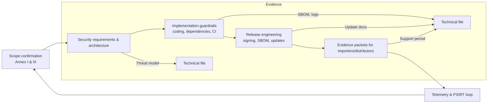

## Why developers have explicit legal duties

The CRA assigns cybersecurity obligations directly to manufacturers, importers, distributors, and **suppliers**, but most of the evidence lives inside engineering backlogs.[1] This page translates Annex I essential requirements and Articles 16–24 into concrete development-team responsibilities so that firmware, platform, and DevOps leads can show auditors that controls are owned, measured, and reviewed.

## Product coverage matrix

| CRA clause | Developer-owned activity | Example deliverables |
| --- | --- | --- |
| Annex I(1)(a–d) | Threat modelling, security requirements, design sign-off | System context diagram, STRIDE notes, documented mitigations |
| Annex I(1)(e–g) | Secure defaults, interface hardening, crypto profiles | Secure configuration matrix, API authentication spec, crypto bill of materials |
| Annex I(1)(h–j) | Logging strategy, vulnerability handling hooks | Event taxonomy, log export design, PSIRT intake automation |
| Annex I(2)(a–f) | Update mechanism, SBOM/VEX automation, support tooling | Update pipeline diagrams, SBOM CI job definition, support period declaration |
| Articles 21–24 | Supplier and importer coordination | Firmware drop schedule, evidence packet for ODM/OEM, RACI tables |

Use this matrix when writing RACI charts or drafting Statements of Work with contractors so that every CRA clause has a named engineering owner.

## Secure design and specification checkpoints

1. **Scope confirmation.** Re-affirm PDE classification, Annex III status, and intended operating environment (industrial, consumer, safety). Record the decision ID referencing [Scope & Definitions](./scope-and-definitions) and attach the CRA article citation.
2. **Security requirements baseline.** Convert threat-model outputs into requirements tagged with Annex I clauses. Example requirement IDs: `CRA-I1e-secure-boot`, `CRA-I2b-auto-update-fallback`. Maintain them in the same repository as functional specs.
3. **Architecture review.** Schedule cross-discipline reviews for identity, secure boot, comms security, diagnostics, and update paths. Capture action items with owners and due dates so you can prove timely closure during conformity assessment.

## Implementation guardrails

- **Coding standards and reviews.** Enforce MISRA-C, CERT C, or Rust unsafe-code policies via linters and mandatory reviewer checklists. Store tool configurations in the repo and archive review logs, as Annex I requires proof of process.
- **Dependency governance.** Maintain allow/deny lists, automate license scanning, and enforce minimum supported versions for crypto stacks, protocol libraries, and toolchains. Tie SBOM generation to the dependency manifest that developers maintain.
- **Hardening in CI.** Treat static analysis, fuzzing harnesses, and unit tests as blocking gates. Keep reproducible build scripts in source control so any auditor can rebuild the binary used for testing.

## Release engineering obligations

- **Signing and provenance.** Developers must provide signed artefacts, signing logs, and manifest metadata (hash, build number, SBOM reference) to the conformity team. Use Sigstore, Uptane, TUF, or similar frameworks to standardise metadata.
- **Update rehearsal.** Before shipping, run hardware-in-the-loop update rehearsals covering normal install, rollback prevention, interrupted power, and recovery scenarios. Capture console logs and telemetry snapshots as Annex I(2) evidence.
- **Support period artifacts.** Embed the declared support period into device metadata (e.g., management API, CLI `show info`, mobile app) so distributors can verify compliance.

## Collaboration with importers, distributors, and OEMs

Articles 21–24 expect seamless handover of security materials across the supply chain. Developers should:

- publish a **CRA evidence package** per release containing SBOM, VEX, SDL summary, and test reports,
- provide secure update documentation to OEM partners, including staging instructions and rollback recovery,
- share vulnerability advisories under coordinated disclosure terms, ensuring downstream parties can patch within SLA,
- automate notifications when cryptographic material or update endpoints change so distributors can revalidate CE compliance.

## Reference checklist

Combine this page with the [Developer Checklist](./developer-checklist) for per-release tracking, and link to [Fundamental Security Requirements](./fundamental-security-requirements) for deeper control descriptions. Each item should cite the relevant CRA clause, standard, or evidence location inside your technical file.

[1]: https://eur-lex.europa.eu/legal-content/EN/TXT/?uri=CELEX:32024R2847 "Regulation (EU) 2024/2847 — Articles 16–24 and Annex I"
