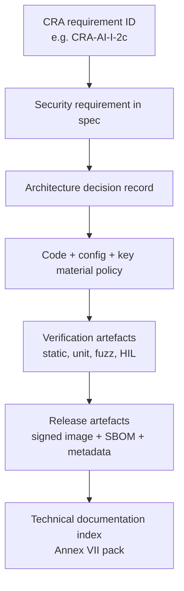
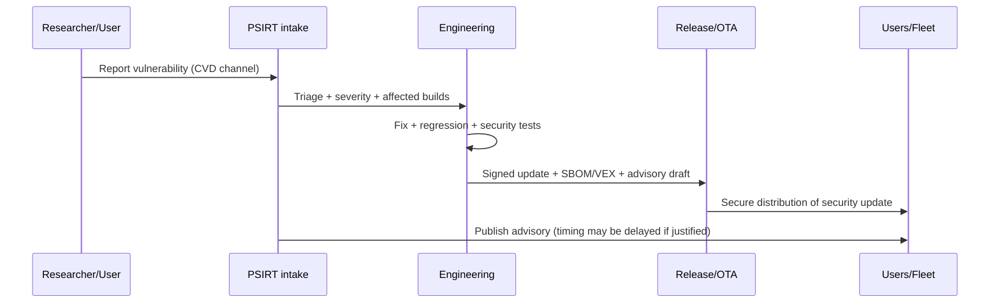
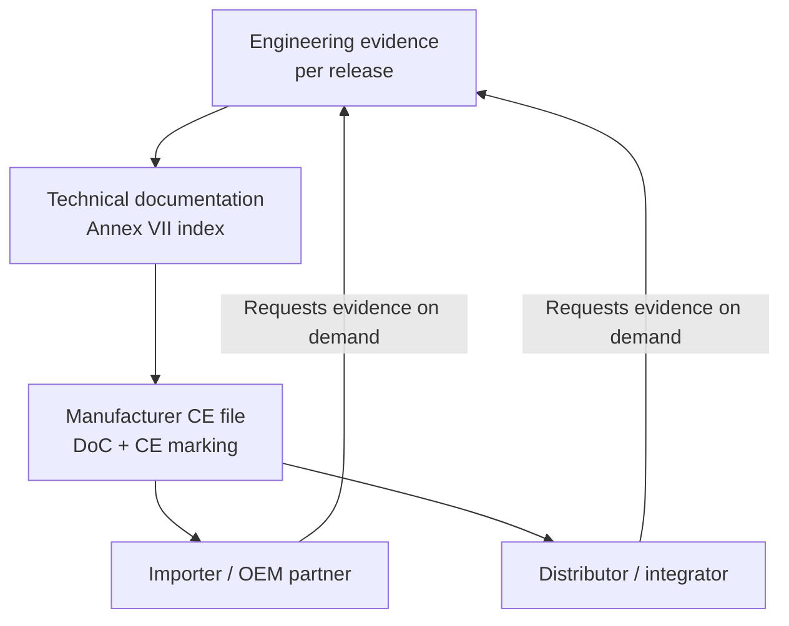

## What this page is (and isn't)

This is a **developer-facing translation** of the Cyber Resilience Act (CRA): it explains *what engineering must implement and keep as evidence* so the **manufacturer** can demonstrate compliance. It does **not** create "personal legal duties" for individual developers - the CRA places obligations on **economic operators** (manufacturer/importer/distributor/etc.).[1]

For embedded products, the key is simple: **we treat architecture + SDLC artefacts as compliance evidence** and we keep them versioned per release.[2][3]

---

## Legal anchors developers must implement

The CRA makes three ideas non-optional for engineering teams:

1. **Risk-based security engineering** (before release, and updated when needed). Manufacturers must perform a cybersecurity risk assessment and keep it in the technical documentation.[4][5]
2. **Essential cybersecurity requirements** built into the product (Annex I, Part I). In practice this becomes design requirements + implementation controls + verification.[2]
3. **Vulnerability handling + security updates** for the support period (Annex I, Part II + Article 13 support-period obligations). This is a sustained operational capability, not a one-off release task.[6][5]

:::note CRA "documentation" is a product feature
The CRA requires technical documentation to be created **before** placing on the market and to be **continuously updated at least during the support period**.[3] If engineering doesn't produce and version the artefacts, compliance fails - even if the device is "secure in practice".
:::

---

## Embedded ownership model (RACI that works in audits)

### Why RACI matters

Audits fail more often due to **unclear ownership** than due to missing crypto primitives. The CRA expects the manufacturer to show "the means used" and "the processes put in place" to meet Annex I requirements in the technical documentation.[3]

Below is a practical ownership baseline for an embedded PDE (MCU/SoC + firmware + optional cloud/OTA). Adapt the names to your org chart.

| Activity / evidence | Firmware | HW/Silicon security | Backend/OTA | DevOps/CI | PSIRT | Product/PM | Compliance |
| --- | --- | --- | --- | --- | --- | --- | --- |
| Cybersecurity risk assessment | R | C | C | C | C | A | C |
| Security requirements tagged to Annex I | R | C | C | C | C | A | C |
| Architecture decision records (ADR) | R | C | C | C | C | A | I |
| Secure boot / root-of-trust integration | R | A | C | C | I | I | I |
| Debug & lifecycle state policy | C | A | I | I | I | I | I |
| Secure update mechanism | R | C | A | C | C | C | I |
| SBOM + provenance generation | R | I | I | A | C | I | C |
| Security test plan & results | R | C | C | C | C | I | A |
| CVD policy + vuln intake pipeline | C | I | C | C | A | C | I |
| Support period statement & end-date | I | I | I | I | C | A | C |
| Technical documentation pack (Annex VII) | C | C | C | C | C | C | A |

Legend: **A** accountable (signs off), **R** responsible (does the work), **C** consulted, **I** informed.

---

## Traceability: turn CRA clauses into engineering IDs

A practical pattern is to tag backlog items, tests, and design docs with **stable IDs** that match CRA structure.

Example ID scheme:

- `CRA-AI-I-2c-sec-updates-auto-default` (Annex I, Part I, point (2)(c))
- `CRA-AI-II-7-secure-update-distribution` (Annex I, Part II, point (7))
- `CRA-A13-8-support-period` (Article 13(8))

Why it matters:
- it links **design ? code ? tests ? evidence**,
- it makes it trivial to generate an "evidence index" for Annex VII technical documentation.[3]

---

## SDLC checkpoints that map cleanly to CRA

### 1) Scope + classification checkpoint (gate 0)

Engineering must validate:
- the product is a **PDE** and the intended operating environment is recorded,
- whether the product is **important/critical** (Annex III/IV), because that affects conformity assessment depth,
- what the **support period** is, because it drives update strategy and lifecycle cost.[5][3]

Output artefacts (minimum):
- scope statement + product boundary diagram,
- initial risk assessment entry,
- support period rationale stub (to be finalised pre-release).

### 2) Security requirements checkpoint (gate 1)

From Annex I, Part I, point (2), we derive explicit system requirements, e.g.:
- **secure-by-default configuration**,[2]
- **protection against unauthorised access** and robust authentication/authorisation,[2]
- **confidentiality and integrity of data/code**, including secure comms and secure storage,[2]
- **minimal attack surface and reduced impact** (compartmentalisation, least privilege, memory protection),[2]
- **logging/monitoring hooks** so incidents can be detected and analysed,[2]
- **robust security update mechanism**, including secure distribution and update policy.[2][6]

Output artefacts:
- security requirements list tagged with CRA IDs,
- threat model summary + mitigations mapping,
- ADRs for major security decisions (root-of-trust, update strategy, identity).

### 3) Implementation guardrails (gate 2)

Article 13 expects the manufacturer to keep products compliant across production and change.[7] For embedded engineering, that means:

- **Reproducible builds**: build scripts + toolchain versions pinned.
- **Secure dependency governance**: dependency manifests versioned; third-party components must not compromise security (due diligence obligation).[5]
- **Coding rules enforced**: static analysis, mandatory reviews, unsafe-code policy for Rust/C/C++ modules.
- **Key handling rules**: keys never live in source control; signing is performed with controlled access (HSM or equivalent).

Output artefacts:
- CI pipeline config, SBOM job logs, build provenance metadata,
- review checklists and exceptions register,
- cryptographic material handling SOP (who can sign, how keys are protected).

### 4) Release engineering (gate 3)

Release is where "proof" is created:

- **Signed firmware artefacts** + hashes + versioning metadata.
- **SBOM** tied to the shipped build (CRA definition of SBOM is explicit).[8]
- **Update rehearsal evidence**: power-loss cases, rollback paths, recovery mode behaviour.
- **User-facing security instructions** (Annex II) must be consistent with what engineering shipped (e.g., how to install security updates).[9]

Output artefacts:
- release manifest (image hash, signing key ID, SBOM reference),
- test reports + HIL logs,
- release notes including security-relevant changes.

### 5) Post-market / PSIRT loop (gate 4)

Annex I, Part II requires a **vulnerability handling process** and secure, timely distribution of updates.[6] Article 13 also requires effective handling of vulnerabilities **for the support period**.[5]

Engineering must therefore maintain:
- an intake channel for vulnerabilities (single point of contact ties into manufacturer duties),[7]
- triage + fix workflow,
- secure update distribution mechanisms,
- a public advisory process (with the option to delay public disclosure in justified cases).[6]

## Supply chain handovers: what importers/distributors will ask engineering for

Even if we ship directly, our partners may be **importers** or **distributors**, and they have verification and cooperation obligations. Importers must be able to provide technical documentation on request and must inform the manufacturer when they become aware of vulnerabilities.[10] Distributors also must cooperate and provide information/documents needed to demonstrate conformity.[11]

So engineering should generate a per-release **CRA Evidence Pack** (minimum):

- signed firmware artefacts + hashes + release manifest,
- SBOM (and VEX if used) aligned to the shipped build,
- security test summary,
- update mechanism description + rollback/recovery behaviour,
- support period statement and end-date,
- vulnerability disclosure/contact details.

:::tip OEM/ODM caution: "substantial modification"
If an importer/distributor (or any other person) makes a **substantial modification** and then makes the product available, they can be treated as a **manufacturer** and become subject to Article 13 and 14 for what they changed (or potentially the whole product).[12][13] That should be reflected in contracts and integration guides.
:::

---

## Embedded-specific "must cover" list (mapped to Annex I)

This isn't the full control catalogue (see **Embedded Technical Controls**), but these topics are the ones that consistently appear in conformity assessment discussions for embedded products.

| Topic | Typical embedded implementation patterns | CRA anchor |
| --- | --- | --- |
| Secure-by-default | debug locked in production; secure comms enabled; least privilege defaults | Annex I Part I(2)(b)[2] |
| Minimal attack surface | disable unused services; reduce exposed ports/APIs; secure diagnostics | Annex I Part I(2)(j)[2] |
| Identity & access control | device identity, mutual auth, authorisation policy | Annex I Part I(2)(d)[2] |
| Confidentiality & integrity | TLS with modern ciphers; signed firmware; secure storage | Annex I Part I(2)(e-f)[2] |
| Availability | watchdog, rate limiting, safe failure modes | Annex I Part I(2)(h-i)[2] |
| Logging/monitoring hooks | event taxonomy; tamper-resistant logs; export strategy | Annex I Part I(2)(l)[2] |
| Updates | signed updates; secure distribution; rollback recovery | Annex I Part I(2)(c) + Part II(7-8)[2][6] |
| Vulnerability handling | CVD policy; contact point; public advisories | Annex I Part II(5-6)[6] |
| Third-party components | dependency due diligence; upstream reporting | Article 13(5-6)[5] |

---

## Common problems teams hit in this section (and how to avoid them)

1. **"We're secure but can't prove it."**  
   Fix: make evidence artefacts first-class outputs (ADRs, test reports, SBOM, update rehearsal logs) and index them in the technical documentation.[3]

2. **Scope drift in embedded systems.**  
   Fix: define the product boundary explicitly (device firmware + bootloader + companion app + cloud endpoints used for updates). Keep the scope diagram versioned per release.

3. **Role confusion across OEM/ODM/integrators.**  
   Fix: explicitly document who controls the firmware build, signing keys, update endpoints, and support period. If someone modifies security-relevant parts, treat it as a potential "substantial modification" case.[12][13]

4. **Support period underestimated.**  
   Fix: decide it early and validate it against expected lifetime; the CRA sets a minimum support period (with a limited exception when expected use is shorter).[5]

5. **SBOM exists but isn't tied to the shipped binary.**  
   Fix: generate SBOM in CI from the exact build inputs, store it with the release manifest, and keep the definition consistent with Article 3.[8]

6. **Update mechanism designed late.**  
   Fix: treat secure updates as an architecture requirement (bootloader strategy, partitioning, rollback, key rotation), not as a "feature" to add post-MVP.[2][6]

7. **Third-party components become the blind spot.**  
   Fix: maintain a dependency governance process; if we find a vulnerability in a component, we must report upstream and remediate per Annex I Part II.[5][6]

8. **No operational vulnerability handling.**  
   Fix: implement a PSIRT process with clear intake, triage, fix, and advisory steps, and ensure secure update distribution is ready to deliver fixes "without delay".[6]

---

## References

[1]: https://eur-lex.europa.eu/legal-content/EN/TXT/?uri=CELEX:32024R2847 "Regulation (EU) 2024/2847 (CRA) - Chapter II obligations of economic operators"

[2]: https://eur-lex.europa.eu/legal-content/EN/TXT/?uri=CELEX:32024R2847 "CRA Annex I, Part I - Essential cybersecurity requirements (secure-by-design / secure-by-default)"

[3]: https://eur-lex.europa.eu/legal-content/EN/TXT/?uri=CELEX:32024R2847 "CRA Article 31 + Annex VII - Technical documentation (continuous update at least during support period)"

[4]: https://eur-lex.europa.eu/legal-content/EN/TXT/?uri=CELEX:32024R2847 "CRA Article 13(2-4) - Cybersecurity risk assessment and inclusion in technical documentation"

[5]: https://eur-lex.europa.eu/legal-content/EN/TXT/?uri=CELEX:32024R2847 "CRA Article 13(5-9) - Due diligence for third-party components + support period + vulnerability handling during support period"

[6]: https://eur-lex.europa.eu/legal-content/EN/TXT/?uri=CELEX:32024R2847 "CRA Annex I, Part II - Vulnerability handling and security updates"

[7]: https://eur-lex.europa.eu/legal-content/EN/TXT/?uri=CELEX:32024R2847 "CRA Article 13(13-14) - Retention of technical documentation and keeping series production in conformity"

[8]: https://eur-lex.europa.eu/legal-content/EN/TXT/?uri=CELEX:32024R2847 "CRA Article 3(39) - Definition of SBOM"

[9]: https://eur-lex.europa.eu/legal-content/EN/TXT/?uri=CELEX:32024R2847 "CRA Annex II - User information including how security updates can be installed"

[10]: https://eur-lex.europa.eu/legal-content/EN/TXT/?uri=CELEX:32024R2847 "CRA Article 19 - Importer obligations (documentation availability, vulnerability awareness)"

[11]: https://eur-lex.europa.eu/legal-content/EN/TXT/?uri=CELEX:32024R2847 "CRA Article 20 - Distributor obligations (due care, cooperation, documentation)"

[12]: https://eur-lex.europa.eu/legal-content/EN/TXT/?uri=CELEX:32024R2847 "CRA Article 21 - Importers/distributors treated as manufacturers in certain cases"

[13]: https://eur-lex.europa.eu/legal-content/EN/TXT/?uri=CELEX:32024R2847 "CRA Article 22 - Other substantial modification cases treated as manufacturers"

