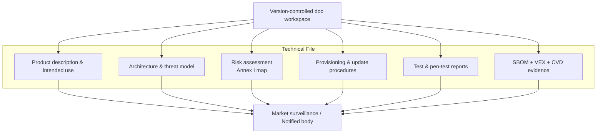

## Technical documentation under CRA

Annex VII describes what must be in the **technical file** for conformity assessment and aligns with the evidence requests in Articles 16–23.[1] For an embedded product this usually includes:   

- Product description and intended use.  
- System architecture diagrams (including trust boundaries).  
- Description of security features and assumptions.  
- Risk assessment and mapping to Annex I requirements.  
- Description of production / provisioning and update processes.  
- Test reports (security, functional, performance).  
- SBOM and vulnerability-handling evidence (CVD policy, VEX).  

Store this in version control or a documentation repo so it evolves with the product and is ready when market surveillance authorities ask for it under Article 41.[1]

---

## User-facing security information (Annex II)

CRA also requires specific **user information** (Annex II) so customers know how to operate the PDE securely.[2] Provide:   

- how security updates are delivered and installed (automatic vs manual),  
- the **support period** for security updates,  
- any **significant residual risks** that cannot be completely mitigated,  
- guidance for secure configuration and operation.

For embedded devices this typically lives in:

- product datasheets or security whitepapers,  
- admin manuals / web UI help,  
- firmware release notes.

---

## SBOM expectations

An SBOM is no longer “nice to have”; it is how you demonstrate you are managing known vulnerabilities and satisfying Annex I(2)(c)–(f).[1]

Recommended practice for firmware projects:   

- Use **SPDX** or **CycloneDX** as the exchange format.  
- Produce an SBOM **per build and per hardware/SoC variant**.  
- Include:  
  - bootloader (e.g. MCUboot),  
  - RTOS and kernel,  
  - middleware, protocol stacks and crypto libraries,  
  - applications,  
  - toolchain and key build-time tools.  
- Store SBOMs alongside build artefacts in CI.  

Attach **VEX documents** to communicate exploitability status for known CVEs (for example, if a vulnerable code path is not used on your device) and reference them in customer advisories as required by Articles 55–57.[1]

---

## Minimal security documentation pack

A practical minimal structure:

1. `01-product-and-arch/` – diagrams, threat model, list of security features.  
2. `02-sdl-and-testing/` – SDL description, test plans and results.  
3. `03-sbom-and-vuln-handling/` – SBOMs, VEX, CVD policy, incident records.  
4. `04-updates-and-provisioning/` – secure boot config, key provisioning, update flow.  
5. `05-user-facing-info/` – manuals, release notes with security-relevant changes.   

This structure aligns cleanly with what **conformity assessment** needs and mirrors Annex VII headings, making notified-body reviews straightforward.[1]

[1]: https://eur-lex.europa.eu/legal-content/EN/TXT/?uri=CELEX:32024R2847 "Regulation (EU) 2024/2847 — Annexes I, II, VII and Articles 16–57"
[2]: https://digital-strategy.ec.europa.eu/en/library/cyber-resilience-act-summary "CRA summary — European Commission"
