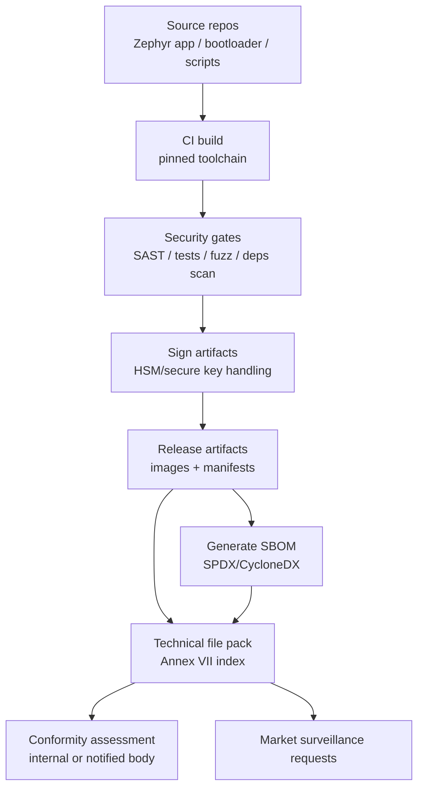
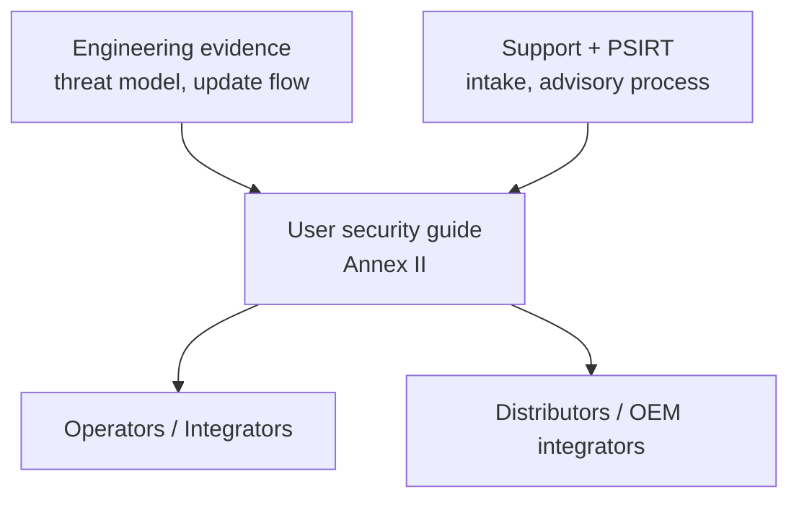
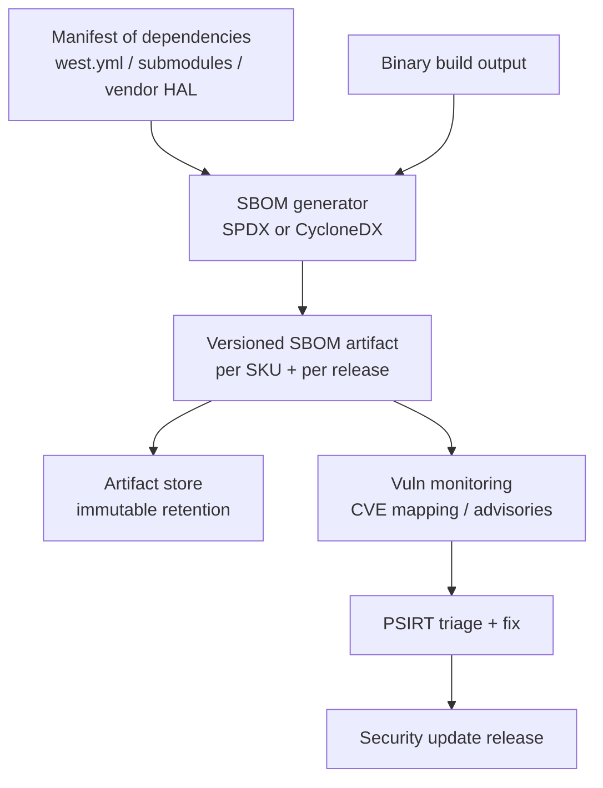

---
id: cra-docs-sbom
slug: /security/cra/documentation-and-sbom
title: Documentation, User Info, and SBOM
description: "CRA documentation and SBOM requirements, including evidence files, VEX, and user information."
sidebar_position: 6
last_update:
  author: 'Ayoub Bourjilat (AC6)'
  date: '2025-12-18'
---

## What the CRA expects to see

The CRA turns into three concrete "documentation outputs":

1. **Technical documentation (the "technical file")**  
   Required by **Article 31** and detailed in **Annex VII**. It is the structured evidence set used for conformity assessment and for market-surveillance checks.  
2. **User-facing security information and instructions**  
   Required by **Annex II**. This is what operators/customers need to deploy and run the product securely (including update instructions and support period).  
3. **Software Bill of Materials (SBOM)**  
   Required by **Annex I, Part II(1)** and referenced again in **Annex VII(8)** (availability to authorities upon reasoned request).

> **Key point:** CRA is not only "be secure"; it is "be secure *and be able to prove it* with consistent, versioned evidence".

---

## 1) Technical documentation (technical file)

### 1.1 Legal anchors you must map to your evidence set

- **Article 31(1)** requires the technical documentation to specify the means used to ensure the PDE meets the essential cybersecurity requirements (Annex I).  
- **Article 31(2)** requires the technical documentation to be kept **up-to-date**.  
- **Article 13(13)** requires keeping the technical documentation and the EU declaration of conformity available to market-surveillance authorities for **at least 10 years after placing on the market, or for the support period-whichever is longer**.  
- **Annex VII** provides the minimum content list.

**What this means for embedded teams:** treat the technical file as a versioned, reproducible "release evidence pack" tied to each shipped firmware/hardware variant.

---

### 1.2 Minimum technical file content (Annex VII) - translated for embedded

Below is Annex VII mapped to typical embedded deliverables (MCU/SoC + RTOS + bootloader + optional cloud/app).

#### (1) General product description
- Intended purpose and operating environment (consumer / industrial / safety-adjacent constraints).
- Software versions affecting compliance (e.g., MCUboot version, Zephyr baseline, crypto library versions, radio stack versions).
- Hardware photos/markings/internal layout (for boards/modules: labels, revision ID, key interfaces; include *at least* what a reviewer needs to identify the actual device).
- Reference to user information and instructions (Annex II).

#### (2) Design, development, production + vulnerability handling processes
- Architecture description with **component boundaries and trust boundaries**:
  - Boot chain (ROM ? 1st stage ? MCUboot ? app)
  - Secure world / non-secure world split (TrustZone-M / TrustZone-A if present)
  - Key storage + lifecycle state (OTP/fuses/secure element/PUF/sealed flash region)
  - Remote data processing (if the product depends on it for intended functions)
- Vulnerability handling process specification:
  - intake channel, triage, fix workflow, release, advisory publication
  - coordinated disclosure policy reference (where it is published)
  - **secure distribution of updates** description (how you prevent malicious updates)

#### (3) Control of design and development changes
- Change-control process for:
  - security-relevant configuration changes
  - crypto changes (algorithms, key sizes, trust anchors)
  - update pipeline changes (signing keys, metadata format, update endpoints)
- Evidence: traceable change records (tickets/PRs) linked to releases.

#### (4) Risk assessment and cybersecurity risk mitigation
- Risk assessment covering:
  - assets (secrets, safety functions, availability, IP)
  - attackers (remote, local, insider, supply-chain)
  - attack surfaces (network, debug, update path, physical ports, removable media)
- Link each identified risk to mitigation controls and to Annex I requirements.

#### (5) Harmonised standards / common specifications applied (if any)
- List the standards you claim conformance to (if you use them) and the scope:
  - e.g., ETSI EN 303 645 for consumer IoT baseline practices
  - IEC 62443-4-2 for technical security requirements (component level)
  - NIST SSDF for SDLC structure (process evidence)
- If you do **not** apply a standard, document your alternative approach and rationale.

#### (6) Test reports and results
For embedded, security-relevant testing typically includes:
- secure boot negative tests (bad signature, rollback attempt, corrupted header)
- update robustness tests (power loss during swap, interrupted download)
- protocol fuzzing on parsers/state machines (host harness + HIL smoke)
- static analysis reports for critical modules (parsers, auth, crypto use)
- penetration-test summary (as applicable to exposure and class)

#### (7) EU declaration of conformity
- Stored alongside the technical file, linked to product identifiers and software versions.

#### (8) SBOM availability to market surveillance authorities
- SBOM prepared and **provided upon reasoned request** (Annex VII(8)).

---

### 1.3 Evidence traceability model (make audits painless)

Your main job is to make every claim trace back to a build and a device variant.



**Practical tip:** keep a single `evidence-index.yaml` per release, listing exact file paths + hashes for every required evidence item.

Example (minimal):

```yaml
release_id: "prodX-1.2.0+build.458"
hardware_variants:
  - sku: "GW-MCXN-RevB"
    hw_rev: "B"
    secure_boot: "mcuboot-rsa3072"
artifacts:
  firmware_image:
    file: "artifacts/gw-mcxn/app_signed.bin"
    sha256: "..."
  sbom:
    file: "sbom/gw-mcxn-1.2.0.cdx.json"
    sha256: "..."
  test_report:
    file: "tests/security/update-powercut-report.md"
    sha256: "..."
```

---

## 2) User-facing security information (Annex II)

Annex II is not marketing text; it is **operational security guidance**.

At minimum, your instructions should cover (Annex II):
- product and manufacturer identification and contact details,
- a vulnerability reporting contact point (and where it is published),
- the intended purpose and essential functionalities and security properties,
- secure setup and operation guidance (including configuration),
- instructions on how to receive/verify/install security updates,
- the **support period** for security updates,
- and any important constraints / assumptions needed to stay secure.



**Embedded-specific expectations (what good looks like):**
- **Update UX is explicit:** "how do I trigger an update?", "how do I verify status?", "what happens on failure?", "how do I recover?"
- **Security posture is explicit:** which services are exposed, which are disabled, default credentials policy (ideally: none), debug state in production.
- **Scope boundary is explicit:** what is inside the product's responsibility vs external infrastructure (e.g., gateways, mobile apps, cloud endpoints).

---

## 3) SBOM under CRA (what it is *and* what it is not)

### 3.1 What CRA explicitly requires

**Annex I, Part II(1)**: the manufacturer shall **draw up an SBOM** covering *at least* the top-level dependencies of the product, in a **commonly used machine-readable format**.  
**Annex VII(8)**: the SBOM is part of the technical documentation set and must be **provided to market-surveillance authorities upon reasoned request**.

Annex II(9) adds: **if** you decide to make the SBOM available to users, you must provide information on where it can be accessed.

> **Important:** CRA does *not* mandate "publish your full SBOM to the internet". It mandates **having one, keeping it consistent, and being able to provide it to authorities**.

---

### 3.2 Embedded SBOM scope (what you should include)

For firmware-based products, an SBOM that is "audit-proof" typically includes:

- **Boot chain components**
  - ROM immutable assumptions (documented, not a software component)
  - 1st stage bootloader (if applicable)
  - MCUboot + configuration (signature scheme, rollback policy)
- **RTOS and middleware**
  - Zephyr/FreeRTOS version + module hashes
  - networking stacks (TCP/IP, TLS/DTLS, CoAP/MQTT, BLE)
  - crypto libraries (mbedTLS, TinyCrypt, PSA crypto, vendor HAL crypto)
- **Application components**
  - protocol parsers, management interfaces (mcumgr/DFU), device management agent
- **Build tooling that impacts the binary**
  - compiler toolchain version, link scripts, code generators (as appropriate)

> **Rule of thumb:** if a component can introduce a vulnerability into the shipped binary (or into the update pipeline that produces it), it belongs in your SBOM or in a clearly linked "build BOM".

---

### 3.3 SBOM generation pipeline (recommended)



**Best practice for variants:** generate **one SBOM per build target** (SKU / SoC / feature set), because embedded variants often compile in/out different stacks (BLE, Wi-Fi, cellular, secure element drivers, etc.).

---

### 3.4 About VEX (useful, but not a CRA keyword)

CRA requires vulnerability handling and SBOM; it does not mandate a specific "VEX" format.  
However, in practice, **a VEX-like statement** is the cleanest way to explain why a CVE does or does not apply to your exact build.

If you use VEX, keep it strict:
- identify the component + version
- state *affected / not affected / under investigation*
- explain the condition (feature not built, code path unreachable, patched downstream, etc.)
- link to the exact build/SBOM ID

---

## Minimal, audit-ready "documentation pack" (embedded-friendly)

A structure that maps cleanly to Annex VII and survives product variants:

1. `00-index/`
   - `evidence-index.yaml` (release IDs, hashes, variants)
2. `01-product-description/`
   - SKUs, hardware revisions, intended use, supported environments
3. `02-architecture-and-threat-model/`
   - context diagram, trust boundaries, boot chain, data flows
4. `03-risk-and-requirements/`
   - risk assessment, Annex I mapping table, security requirements list
5. `04-sdl-and-testing/`
   - SDL description, security test plans and results, fuzz harness notes
6. `05-production-provisioning-updates/`
   - provisioning procedure, key handling, update distribution and recovery
7. `06-sbom-and-vuln-handling/`
   - SBOMs, vulnerability intake process, advisory templates
8. `07-user-facing-info/`
   - user/admin security guide, update instructions, support period statement

---

## Common problems teams hit (and how to avoid them)

Use this as your "pre-audit sanity check".

1. **"Which exact thing is the product?"**  
   Embedded products often include device + app + gateway + cloud. If you don't define the boundary, your docs will be inconsistent.  
2. **Firmware variants explode the evidence set.**  
   Different radios / crypto backends / secure element options ? different SBOMs and different tests. Plan the variant model early.  
3. **SBOM exists but cannot be proven to match the shipped binary.**  
   Fix with immutable artifact storage + evidence-index + reproducible build constraints.  
4. **Update instructions are vague.**  
   Annex II expects clear operational steps and failure/recovery behaviour, not "supports OTA".  
5. **Key handling is "tribal knowledge".**  
   Provisioning and signing are core to compliance; document who can sign, where keys live, and how key rotation/revocation is handled.  
6. **Security test evidence is not release-linked.**  
   "We fuzzed once last year" is not evidence. Tie results to release IDs and store reports immutably.  
7. **Support period is not concrete.**  
   If support period is unclear, you will fail operational expectations quickly. Put it in product materials and device UI/metadata where possible.

---

## References (primary sources)

[1]: Regulation (EU) 2024/2847 (Cyber Resilience Act), EUR-Lex (consolidated text) - Articles 13 and 31; Annexes I, II, VII: https://eur-lex.europa.eu/legal-content/EN/TXT/?uri=CELEX:32024R2847


