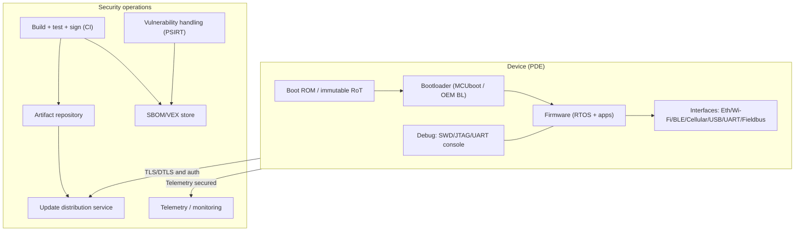
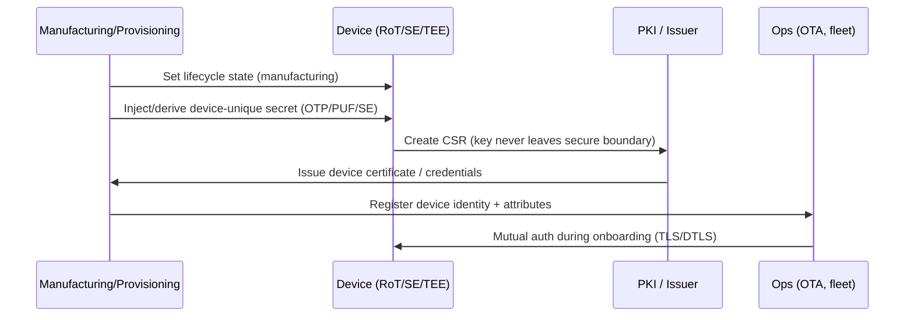
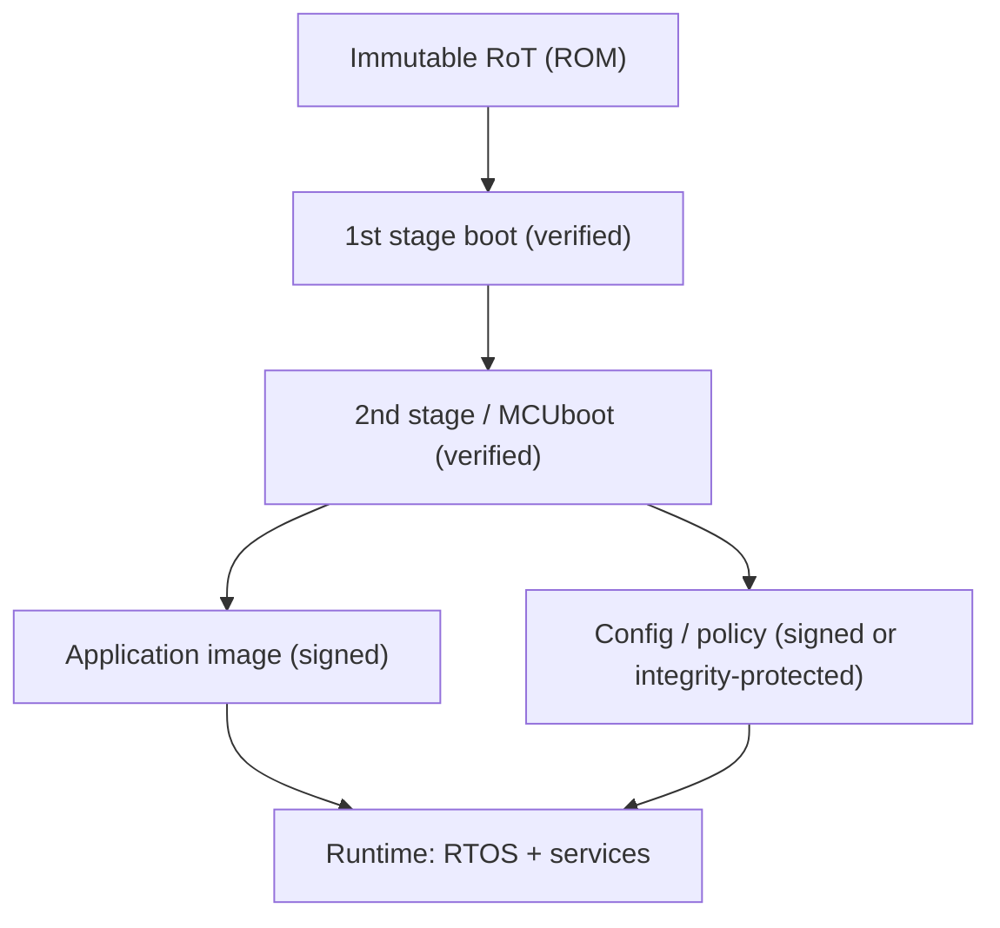
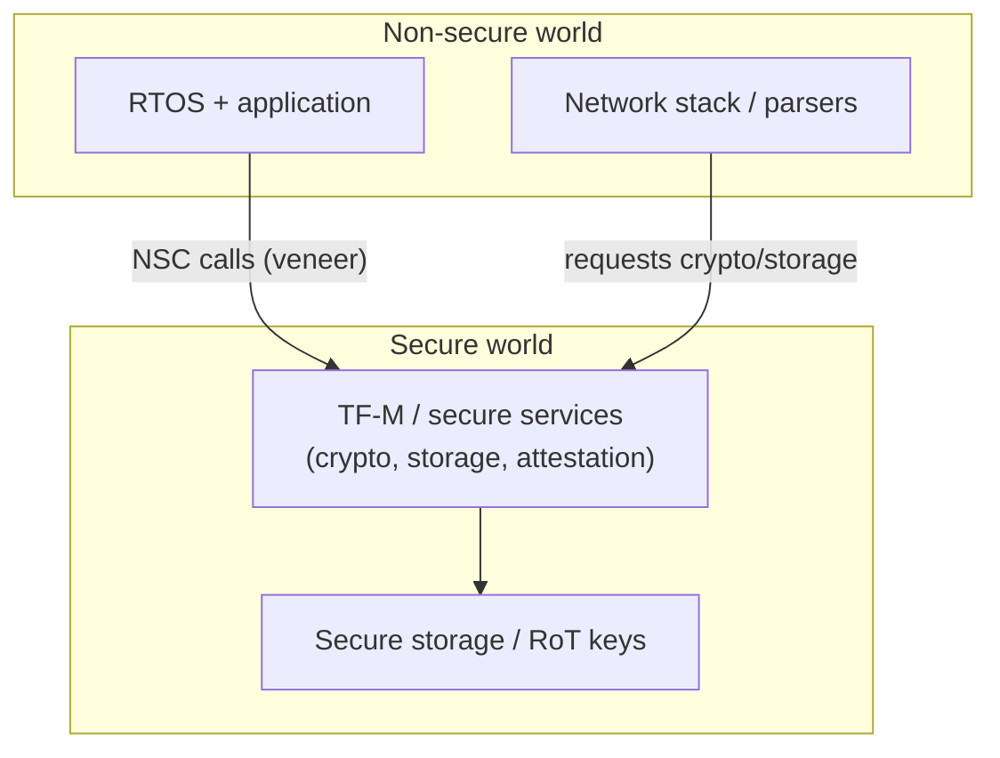
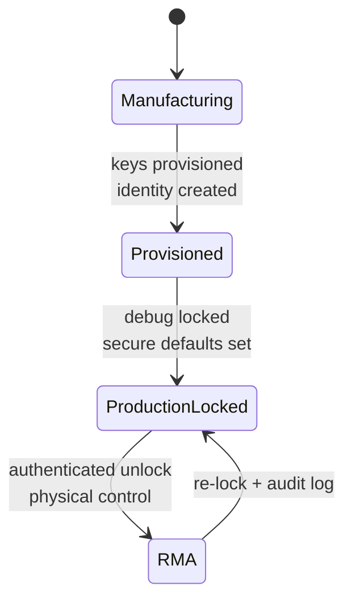
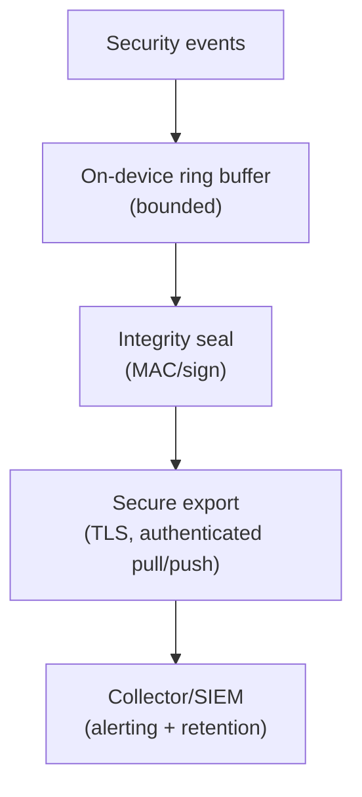
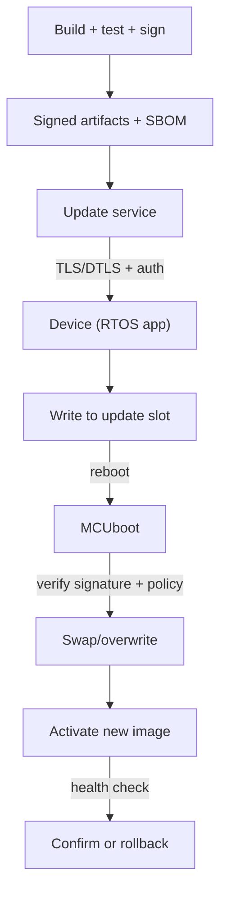
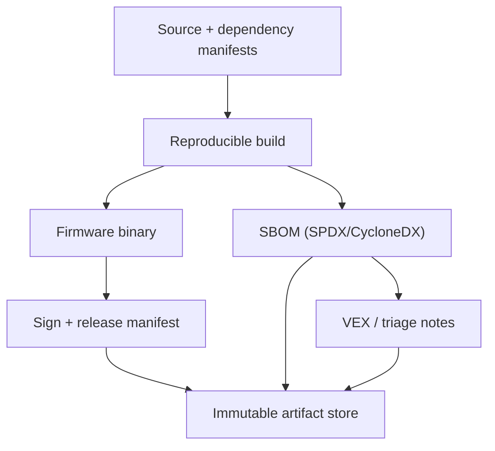

## Purpose of this mapping

This page maps **CRA Annex I** requirements to **implementable technical controls** in embedded products: CPU/SoC features, firmware/boot chain, RTOS configuration, and the update + vulnerability handling stack.

It is written to be used as **evidence guidance**: each mapping includes the CRA clause, what a conformity assessor will expect to see in an embedded architecture, and what artifacts should exist in the **technical documentation (Annex VII)**.[1]

---

## 0) Embedded reference model (what we map against)

For embedded systems, CRA compliance almost always spans **device + firmware + update backend**. Your mapping is only credible if the product boundary is explicit (see also *Scope & Definitions*).

Key idea: most CRA clauses map to **multiple layers** (silicon ? boot ? runtime ? ops).

---

## 1) CRA "property" requirements ? embedded controls (Annex I Part I)

Annex I Part I(2)(a-m) is the actionable list. Below is a **control mapping** that stays faithful to the legal wording.

### 1.1 Quick mapping table (what to implement and where)

| CRA clause | Embedded control objective | Typical embedded controls (examples) | Evidence artifacts (Annex VII-friendly) |
| --- | --- | --- | --- |
| I(2)(a) no known exploitable vulns at release | Prevent shipping known exploitable issues | SBOM + CVE triage; secure config; fuzzing parsers; SAST for C/C++; dependency gating | SBOM per build; CVE/VEX log; security test report |
| I(2)(b) secure-by-default + reset | Safe defaults on day 0 + factory reset | debug locked; minimal services; unique creds; secure comms on; factory reset wipes secrets | Secure defaults matrix; factory reset spec + test |
| I(2)(c) security updates (auto by default + opt-out) | Patchability + safe update UX | signed OTA; rollback-safe; staged rollout; auto update default (where applicable) + opt-out + postpone | Update architecture; rollout procedure; update failure tests |
| I(2)(d) protect from unauthorised access + report | Strong authN/authZ + audit | device identity; mutual auth; access control policy; rate limits; auth logs | Identity model; auth protocol spec; event taxonomy |
| I(2)(e) confidentiality | Protect secrets and sensitive data | TLS/DTLS; encrypted storage; secure element/TEE; key zeroization | Crypto profile; key mgmt plan; data-flow classification |
| I(2)(f) integrity of data/commands/programs/config + report | Prevent unauthorised modification + detect/report | secure boot; signed configs; integrity checks; anti-rollback; corruption events | Boot chain doc; config signing design; corruption test logs |
| I(2)(g) data minimisation | Only collect what is necessary | telemetry minimisation; sampling/retention; disable unneeded identifiers | Telemetry schema + justification; retention policy |
| I(2)(h) availability of essential functions | Resilience + DoS mitigation | watchdog; resource budgets; input bounds; rate limiting; recovery mode | Robustness tests; resource limits; recovery procedure |
| I(2)(i) minimise negative impact on others | Avoid harming other networks/devices | backoff and rate caps; avoid scan-like behavior; safe retry policy | Network behavior spec; rate-limit config |
| I(2)(j) limit attack surfaces | Reduce exposed interfaces | disable unused ports; compile-time removal; authenticated mgmt; secure diagnostics | Interface inventory; port/service matrix; hardening config |
| I(2)(k) reduce impact using exploitation mitigation | Contain compromise | MPU/MMU; TrustZone; privilege separation; hardening flags; sandboxing | Isolation design; build flags; pen-test summary |
| I(2)(l) record/monitor relevant internal activity + opt-out | Security logging with user control | event taxonomy; tamper-resistant logs; secure export; opt-out semantics | Logging design; log protection scheme; export API |
| I(2)(m) secure deletion + secure transfer | Decommission safely | secure wipe (internal + external flash); authenticated migration | Secure wipe design + verification; user instructions |
| I(1) "appropriate level based on risks" | Proportionality backed by risk assessment | threat model; risk register; control rationale per environment | Risk assessment mapping to Annex I controls |

**Source:** CRA Annex I Part I(1)-(2).[1]

---

## 2) Hardware root of trust and device identity

### 2.1 Why this is foundational

If you cannot establish a trustworthy identity and boot state, you cannot credibly meet:
- unauthorised access protection (I(2)(d)),
- integrity (I(2)(f)),
- secure updates (I(2)(c)),
- exploitation impact reduction (I(2)(k)).[1]

### 2.2 Practical embedded design pattern

**Goal:** each device has **unique cryptographic identity** anchored in hardware-protected material.

**Typical implementation options** (choose what your SoC supports):

- **OTP / eFuse** for device-unique keys or key-encryption-keys (KEK)
- **PUF-derived keys** (device-unique without storing raw key bits)
- **Secure element** (external) or **secure enclave / TEE** (internal)
- **TrustZone** partition for crypto + secure storage (Armv8-M/A designs)

#### Identity and provisioning pipeline

**Evidence you should keep (technical file):**
- provisioning specification (what is injected/derived and where),
- lifecycle state diagram (manufacturing ? production ? RMA),
- certificate/key rotation and revocation plan.

---

## 3) Secure boot and measured integrity (program + configuration)

### 3.1 CRA anchor

- integrity protection for programs and configuration (I(2)(f))  
- attack surface reduction and exploitation mitigation (I(2)(j), I(2)(k))  
- secure updates and anti-rollback in practice (I(2)(c)).[1]

### 3.2 Embedded secure boot chain (minimal credible design)

**Controls to decide explicitly:**
- signature scheme (key type, rotation strategy),
- anti-rollback (monotonic counters / version policy),
- failure behavior (recovery mode vs rollback slot),
- configuration integrity (signed bundles, authenticated commands).

**Verification evidence:**
- negative tests (bad signature, downgraded version, corrupted flash),
- power-loss mid-update tests (see update section),
- secure boot log events (boot verdict recorded) mapping to I(2)(l).[1]

---

## 4) Runtime isolation and memory-safety controls

### 4.1 CRA anchor

- reduce impact of incidents using exploitation mitigation (I(2)(k))  
- limit attack surface (I(2)(j))  
- protect confidentiality/integrity (I(2)(e)-(f)).[1]

### 4.2 What "exploitation mitigation" means on embedded

On MCUs you may not have a full MMU, but you still can (and should) use:
- **MPU** regioning (privileged vs unprivileged, read-only code, no-execute data where available),
- **TrustZone-M** separation (Secure/Non-secure partition + secure gateways),
- hardened builds (stack canaries, bounds checks, W^X where supported, control-flow protections when toolchain supports it).

#### TrustZone-M partition sketch (conceptual)

**Evidence you should keep:**
- memory map (secure vs non-secure regions, MPU regions),
- list of privileged APIs (what requires secure world / kernel mode),
- test plan proving isolation boundaries (negative tests).

---

## 5) Interface hardening and debug lifecycle

### 5.1 CRA anchor

- secure-by-default configuration (I(2)(b))  
- unauthorised access protection + reporting (I(2)(d))  
- attack surface limitation (I(2)(j)).[1]

### 5.2 Embedded "interface inventory" is mandatory in practice

Make a single list of:
- physical ports (USB, UART, CAN, SWD/JTAG),
- radio surfaces (BLE, Wi-Fi, NFC),
- software services (web UI, RPC, mgmt protocols, update endpoints).

Then mark each as:
- **enabled in production?**
- **authenticated/authorised?**
- **rate limited?**
- **logged?**
- **how to disable?**

#### Debug lifecycle state machine (example)

**Evidence you should keep:**
- lifecycle policy (when debug is enabled, how unlock works, audit trails),
- production configuration report (secure defaults, services disabled),
- penetration test notes for management plane.

---

## 6) Cryptography and key management (state-of-the-art)

### 6.1 CRA anchor

- confidentiality protection "by state of the art mechanisms" (I(2)(e))  
- integrity protection and corruption reporting (I(2)(f)).[1]

### 6.2 What auditors expect (embedded edition)

You must be able to show:
- **which protocols** you use (TLS/DTLS, MQTT over TLS, etc.),
- **which cipher suites** and key sizes (policy, not just "we use TLS"),
- how keys are generated, stored, rotated, revoked, and recovered (RMA).

Keep it simple and defensible:
- prefer well-maintained crypto libraries,
- avoid obsolete protocols and weak key sizes,
- enforce certificate validation rules suitable for your environment.

**Evidence you should keep:**
- crypto profile document,
- certificate trust model (root CA, intermediates, pinning rules),
- key lifecycle SOP and incident plan for key compromise.

---

## 7) Logging / monitoring hooks (device-level)

### 7.1 CRA anchor

Annex I Part I(2)(l) requires recording and monitoring "relevant internal activity" including access or modification of data/services/functions, with an opt-out mechanism.[1]

### 7.2 Embedded implementation patterns

Even constrained devices must produce security-relevant events. Typical event classes:

- boot verdicts (secure boot success/fail),
- authentication/authorisation outcomes,
- update attempts (download, verify, activate, rollback),
- configuration changes,
- integrity faults (signature check failure, corruption flags),
- debug unlock attempts / lifecycle changes.

#### Logging pipeline sketch

**Evidence you should keep:**
- event taxonomy + severity mapping,
- log protection design (tamper resistance / integrity),
- "opt-out" definition and behavior (what is disabled and what remains required for safety/security).

---

## 8) Secure update path (device + fleet)

### 8.1 CRA anchor (exact)

- Part I(2)(c): security updates, automatic updates enabled by default where applicable, opt-out, notifications, postpone option.[1]  
- Part II(2): remediate vulnerabilities without delay, provide security updates; separate security updates from functionality updates where feasible.[1]  
- Part II(7)-(8): secure distribution mechanisms; disseminate without delay (and generally free of charge); advisory messages.[1]

### 8.2 Minimum embedded technical properties for an update mechanism

An update design is credible if it meets all of these properties:

1. **Authenticity**: only manufacturer-authorised images can be installed (signature verification).
2. **Integrity**: corruption is detected before activation (hashing, verification).
3. **Anti-rollback**: policy prevents downgrades to vulnerable builds.
4. **Power-fail safety**: device can recover after interruption (A/B, swap, recovery mode).
5. **Status transparency**: device can report update state securely.
6. **Fleet control**: staged rollout and rollback at fleet level (risk management).

#### Zephyr + MCUboot style update sketch (conceptual)

**Evidence you should keep:**
- update architecture doc (device + backend),
- test suite results for the failure matrix (interrupted download, interrupted swap, corrupted image),
- advisory templates (Part II(8)) and rollout records.

---

## 9) SBOM and supply-chain technical controls (firmware realities)

### 9.1 CRA anchor

Annex I Part II(1) requires identifying and documenting vulnerabilities and components, including drawing up an **SBOM** in a commonly used machine-readable format, covering at least top-level dependencies.[1]

### 9.2 Embedded SBOM specifics (what must be included)

For firmware, SBOM should cover at minimum:
- bootloader,
- RTOS,
- network/crypto libraries,
- middleware (parsers, serialization stacks),
- vendor HALs and secure elements SDKs,
- build toolchain components where relevant to provenance.

#### SBOM flow that survives audits

**Evidence you should keep:**
- SBOM per release tied to build hash,
- CVE triage log and (optionally) VEX statements,
- evidence that vulnerabilities are remediated without delay (Part II(2)).[1]

---

## 10) "Knobs" checklist (what engineers actually configure)

Below is a practical list of common embedded security knobs that directly support Annex I:

### Hardware / SoC knobs
- lifecycle state (manufacturing/production/RMA)
- secure storage availability (OTP/PUF/SE/TEE)
- debug lock policy (permanent vs controlled unlock)
- monotonic counters / anti-rollback storage
- TRNG availability and health checks

### Boot / firmware knobs
- signature verification enabled for boot and updates
- image version policy and rollback rules
- recovery mode entry/exit policy
- configuration integrity (signed config / authenticated commands)

### RTOS / runtime knobs
- privilege separation (MPU/MMU, userspace)
- isolated crypto services (TEE or secure partition where possible)
- compiler hardening flags enabled
- input validation policies for all parsers/protocol handlers
- resource limits (heap, queues, connections) for availability

### Networking knobs
- TLS/DTLS enforced and configured (protocol versions, suites)
- certificate validation and trust anchors
- rate limiting/backoff policies to avoid harming other networks (I(2)(i))

### Observability / logging knobs
- security event taxonomy + retention
- integrity protection for logs
- secure export authentication

---

## Common problems teams hit when doing this mapping (embedded-specific)

If this page feels "hard to apply", it is usually one of these issues:

1. **Undefined PDE boundary**: device is documented, but OTA/provisioning/telemetry services are not (mapping breaks for updates/logging).  
2. **Variant explosion**: multiple memory maps/boot chains exist (A/B vs swap) but evidence covers only one path.  
3. **No lifecycle state policy**: manufacturing vs production vs RMA is not defined, so debug/keys/rollback are inconsistent.  
4. **Identity model not specified**: "device has TLS" but no clear per-device identity, certificate issuance, or revocation plan.  
5. **Anti-rollback missing**: update mechanism exists but allows downgrade to vulnerable firmware (conflicts with the purpose of I(2)(c)).  
6. **Logging exists but is unsafe**: logs are unauthenticated and can be forged, or export is unauthenticated (weakens I(2)(l)).  
7. **Secure wipe not implemented**: factory reset exists but secrets remain in flash/external storage (I(2)(m)).  
8. **SBOM without triage**: SBOM is produced but there is no process to assess impact and remediate without delay (Part II(2)).  
9. **"Opt-out" ambiguity**: opt-out for logs/auto-updates is not clearly defined for your product type; document the interpretation and user instructions (Annex II).  
10. **Evidence not versioned**: controls exist, but artifacts are not linked to a specific release hash in the technical documentation (Annex VII failure mode).

---

## References

[1]: Regulation (EU) 2024/2847 (Cyber Resilience Act) - Annex I (Part I & Part II) (EUR-Lex) https://eur-lex.europa.eu/legal-content/EN/TXT/?uri=CELEX:32024R2847

[2]: ETSI EN 303 645 v3.1.3 (Consumer IoT baseline) https://www.etsi.org/deliver/etsi_en/303600_303699/303645/03.01.03_60/en_303645v030103p.pdf

[3]: IEC 62443-4-2 (IACS component technical security requirements) (standard reference; obtain via IEC/ISA)

[4]: CRA Annex VII - Technical documentation requirements (EUR-Lex) https://eur-lex.europa.eu/legal-content/EN/TXT/?uri=CELEX:32024R2847

