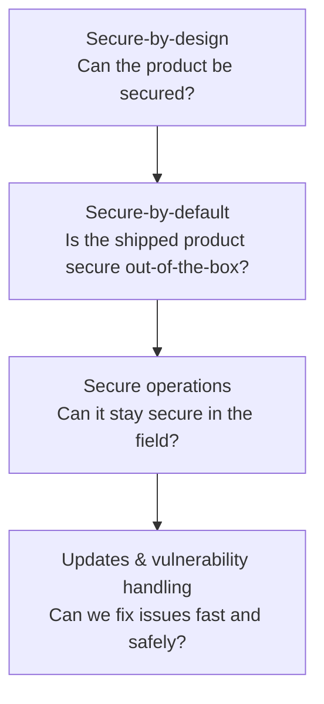
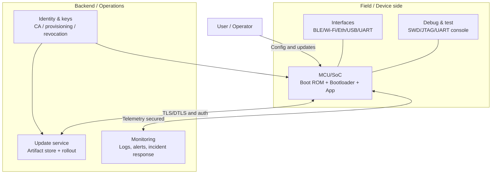
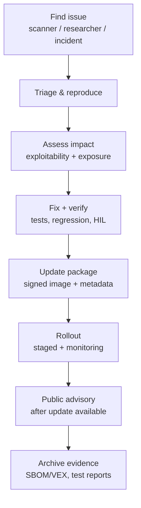
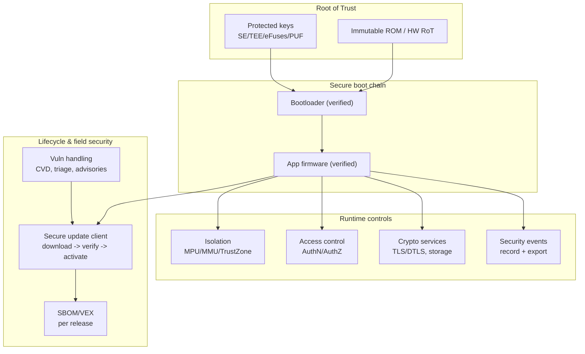
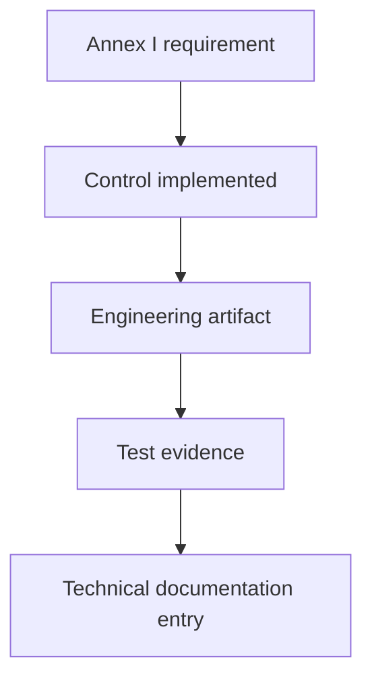

---
id: cra-fundamental-security
slug: /security/cra/fundamental-security-requirements
title: Fundamental Security Requirements
sidebar_position: 3
---

## What the CRA is really asking for (in engineering terms)

The Cyber Resilience Act (CRA) is technology-neutral, but it is **not vague**: it requires that products with digital elements (PDEs) are **designed, developed and produced** to reach an “appropriate level of cybersecurity based on the risks” (Annex I, Part I(1)), and then it lists **concrete properties** you must deliver (Annex I, Part I(2)(a-m)).[1]

For embedded systems, that translates to a very practical question:

> Can we show-using design artifacts, test results, and operational procedures-that our device, firmware and update ecosystem protect **confidentiality, integrity, availability**, and that we can keep the product secure **throughout its support period**?[1][2]

This page is written for MCU/SoC products (sensors, gateways, PLCs, industrial/consumer devices) and it turns CRA language into implementable controls and evidence you can store in the **technical documentation** (Annex VII).[4]

---

## Secure-by-design vs secure-by-default (don’t mix them up)

Both are required, but they are not the same thing:

- **Secure-by-design** = the *architecture decisions* that make security possible (root of trust, boot chain, isolation, key lifecycle, update path, logging hooks). In CRA terms, this is driven by the risk assessment (Art. 13(2)-(3)) and must result in meeting Annex I requirements.[2][1]
- **Secure-by-default** = the *shipping configuration* that is safe on day 0, without the user having to be a security expert. CRA explicitly requires a **secure-by-default configuration** at market placement (Annex I, Part I(2)(b)).[1]

A good way to think about it:

If secure-by-design is weak (no trustworthy boot, no key protection, no update mechanism), secure-by-default becomes a checkbox exercise and you won’t have credible evidence.

---

## Embedded reference model (what auditors will try to understand)

CRA evidence is easiest when you define a **reference architecture** and then show how each requirement is implemented across trust boundaries.

**Key point:** auditors will look for clarity on (1) what is inside the PDE, (2) what external services are required for security (updates, identity, monitoring), and (3) how compromise is contained.

---

## CRA essential requirements translated for embedded devices

Annex I Part I is the core “security properties” checklist. Below, I keep the CRA clause reference and translate it into embedded controls + evidence you can actually ship.

### Part I(1): “Appropriate level of cybersecurity based on the risks”

This is the top rule: you must justify your security posture using a documented and maintained **cybersecurity risk assessment** (Art. 13(2)-(3)).[2] That risk assessment must indicate how Annex I Part I(2) applies to your product and how you implement it.[2][1]

Practical embedded outcome:
- define the **security environment** (deployment, physical access assumptions, network exposure),
- identify assets (keys, credentials, safety-related functions, proprietary IP),
- define attacker capabilities (remote, local, supply-chain),
- then choose controls proportional to that risk profile.

### Part I(2)(a): “No known exploitable vulnerabilities” at release time

CRA requires PDEs to be made available **without known exploitable vulnerabilities**.[1]

Embedded translation:
- vulnerability scanning for **all third-party components** (RTOS, TLS stack, bootloader, libraries),
- firmware composition is traceable (SBOM), and known CVEs are triaged (VEX where relevant),
- security testing (static analysis + fuzzing for parsers/protocol handling) is part of the release gate.

Evidence you keep:
- release security report, CVE triage log, SBOM snapshot, security test results.[4][1]

### Part I(2)(b): Secure-by-default configuration + reset to original state

CRA explicitly requires **secure-by-default configuration** and the possibility to **reset to its original state**.[1]

Embedded translation (examples):
- debug ports locked in production (or gated via signed challenge / RMA process),
- no default admin passwords; if credentials exist, they are unique and rotated,
- network services off by default unless required (no open telnet/FTP; minimize listeners),
- factory reset wipes user secrets and restores hardened baseline.

Evidence you keep:
- “secure defaults matrix” (features/services vs default state) + factory reset behavior spec.[4][1]

### Part I(2)(c): Security updates (including default auto-update + opt-out)

CRA requires that vulnerabilities can be addressed via **security updates** and, where applicable, **automatic security updates enabled by default**, with a clear opt-out and the ability to temporarily postpone updates.[1] User instructions must also explain how to turn off auto-updates.[3]

Embedded translation:
- secure update mechanism: signed images, verified before activation, rollback-safe,
- update policy: staged rollout, compatibility checks, recovery path if power fails mid-update,
- management UX: clear update state and control (opt-out and postpone where applicable).

Evidence you keep:
- update architecture diagram, signing policy, rollout procedure, and update failure test logs.[4][1]

### Part I(2)(d): Protection from unauthorised access + reporting

CRA requires protection from unauthorised access using appropriate control mechanisms and to **report on possible unauthorised access**.[1]

Translation:
- device identity (unique credential/cert per device),
- authentication and authorization for management actions (config, debug unlock, updates),
- rate limits / lockouts for brute-force,
- logging hooks for authentication failures and privilege changes.

Evidence you keep:
- access control model (roles), auth protocol spec, and event/log taxonomy.[4][1]

### Part I(2)(e): Confidentiality of data at rest and in transit

CRA requires protecting confidentiality of stored/transmitted/processed data (e.g., encryption at rest/in transit with state-of-the-art mechanisms).[1]

Translation:
- TLS/DTLS with modern cipher suites,
- encrypted storage for secrets (keys, tokens) using secure element/TEE or derived keys,
- protect sensitive assets in RAM where possible (isolation + zeroization on reset).

Evidence you keep:
- crypto profile, key management plan, and “data classification & flows” document.[4][1]

### Part I(2)(f): Integrity of data, commands, programs and configuration + reporting

CRA requires protection of integrity against manipulation not authorised by the user, and to **report on corruptions**.[1]

Translation:
- secure boot verifying firmware signatures (and measured boot where feasible),
- integrity-protected configuration (signed config bundles, monotonic counters),
- attestation or periodic integrity checks for critical regions (boot flags, security state),
- corruption reporting via logs/telemetry (e.g., failed signature checks, CRC failures).

Evidence you keep:
- secure boot chain description, config integrity design, integrity failure test cases.[4][1]

### Part I(2)(g): Data minimisation (yes, it applies to embedded)

CRA requires processing only data that is adequate, relevant, and limited to what is necessary for intended purpose (data minimisation).[1]

Embedded translation:
- only collect telemetry required for security/operations,
- avoid “always-on” identifiers unless needed,
- define retention windows and on-device sampling policies.

Evidence you keep:
- telemetry schema with justification per field + retention policy.[4][1]

### Part I(2)(h) + (i): Availability and not harming others

CRA requires protecting availability of essential/basic functions, including resilience and DoS mitigation, and minimising negative impact on other devices/networks.[1]

Embedded translation:
- watchdog + safe recovery mode,
- rate limiting for network endpoints; bounds on resource usage (CPU, heap, queues),
- robust input validation for protocol parsers,
- “fail secure”/“fail close” decisions for safety/security critical paths.

Evidence you keep:
- availability threat analysis, robustness test results, and resource budget limits.[4][1]

### Part I(2)(j) + (k): Attack surface reduction + exploitation mitigation

CRA requires limiting attack surface (especially external interfaces) and reducing impact of incidents using exploitation mitigations.[1]

Embedded translation:
- disable unused peripherals and protocol stacks at compile time,
- split privileged vs unprivileged execution (MPU/MMU; TrustZone-M/A if available),
- hardened builds: stack canaries, W^X where applicable, control-flow hardening where supported,
- strict parsing for all inbound data (commands, OTA manifests, BLE characteristics).

Evidence you keep:
- interface inventory, isolation design, compiler/hardening flags, and rationale for tradeoffs.[4][1]

### Part I(2)(l): Logging and monitoring of relevant internal activity (with opt-out)

CRA requires recording and monitoring relevant internal activity (access to or modification of data/services/functions) and includes an opt-out mechanism for the user.[1]

Translation:
- security event list: boot verdicts, auth failures, debug unlock attempts, update failures, integrity alarms,
- tamper-resistant log storage (bounded ring + integrity protection) or secure export,
- an explicit opt-out path for the user when the product context requires it (document what “opt-out” means for your device class).

Evidence you keep:
- event taxonomy + log protection scheme + export interface security.[4][1]

### Part I(2)(m): Secure deletion + secure transfer

CRA requires a way for users to securely and easily remove all data and settings permanently, and ensure secure transfer when data can be moved to another system.[1][3]

Translation:
- “secure wipe” that covers credentials, user data, and config (including in external flash),
- secure decommissioning procedure in user documentation,
- if migration exists (e.g., moving config to a new unit), the transfer must be authenticated and confidentiality-protected.

Evidence you keep:
- secure wipe design + verification method (how you prove it wipes) + user instructions.[3][4][1]

---

## Annex I Part II: Vulnerability handling (your lifecycle muscle)

Part II is mandatory and is where many embedded teams fail because they treat security as a one-time release checklist.

CRA requires (among other things): **SBOM**, timely remediation via security updates, regular testing, public disclosure after updates, a coordinated vulnerability disclosure (CVD) policy and contact address, and secure update distribution (potentially automatic), with security updates provided without delay and generally free of charge.[1]

What to plan for:
- **power-loss tolerant updates** (A/B slots, swap/overwrite strategy, recovery mode),
- **fleet segmentation** (variants, memory maps, regional SKUs),
- **long support periods** where silicon constraints make backporting hard,
- security updates separated from feature updates where feasible.[1]

---

## Putting it all together: a “minimum credible” embedded security blueprint

This is not the only valid design, but it’s a common pattern that maps cleanly to Annex I:

Where each block maps back to Annex I Part I(2) properties and Part II processes.[1]

---

## Evidence: what should end up in the technical documentation

CRA’s technical documentation must include (at least) the system architecture description, risk assessment showing how Annex I applies, vulnerability handling process specs (including SBOM and secure update distribution), and test reports.[4][2]

Use an “evidence map” so you can answer audit questions in minutes:

Examples:
- Annex I(2)(c) updates → signed OTA design → update test logs → Annex VII item 2(b) + item 6 evidence.[1][4]
- Annex I(2)(j) attack surface → interface inventory → port scanning + fuzz results → Annex VII item 2(a) + item 6.[1][4]
- Part II(1) SBOM → SBOM in CycloneDX/SPDX → archive per release → Annex VII item 2(b) + item 8 (on request).[1][4]

---

## Common issues teams hit on embedded products (use as a review checklist)

If you’re unsure how to implement or document this chapter, it’s usually one of these problems:

1. **Unclear security environment**: physical access assumptions are missing, so “appropriate level of cybersecurity” can’t be justified.[2][1]
2. **No single update story**: multiple SKUs/boot paths exist, but only one is documented/tested (breaks Annex I(2)(c) evidence).[1][4]
3. **Debug isn’t governed**: SWD/JTAG/UART policies are “tribal knowledge” (hurts secure-by-default and attack surface reduction).[1]
4. **Identity model is fuzzy**: no clear device identity, roles, or access control for maintenance actions (fails Annex I(2)(d)).[1]
5. **Key lifecycle is not defined**: provisioning, rotation, revocation, and RMA are not engineered (weak confidentiality/integrity controls).[1]
6. **Logging is treated as “nice to have”**: no event taxonomy, no protection, no export story, and no user opt-out definition.[1]
7. **Secure wipe is forgotten**: factory reset exists but secrets remain in flash/external storage (fails Annex I(2)(m) and user instructions).[1][3]
8. **SBOM without operations**: SBOM is generated once, but there is no triage/VEX workflow and no linkage to release gates (fails Part II(1-2)).[1]
9. **“Availability” is not tested**: watchdog and recovery paths exist but were never exercised under DoS/resource exhaustion conditions.[1]
10. **Evidence is scattered**: artifacts exist but are not referenced and versioned in the technical file (Annex VII pain).[4]

If you fix only one thing: build a **repeatable release pipeline** that produces (1) signed artifacts, (2) SBOM/VEX, (3) security test results, and (4) a short “Annex I coverage report” that points to the evidence for each clause.[1][4]

---

## References

[1]: Regulation (EU) 2024/2847 (Cyber Resilience Act) - Annex I (Part I & Part II) (EUR-Lex) https://eur-lex.europa.eu/legal-content/EN/TXT/?uri=CELEX:32024R2847

[2]: Regulation (EU) 2024/2847 - Article 13 (risk assessment, lifecycle integration, due diligence, vulnerability handling linkage) (https://eur-lex.europa.eu/legal-content/EN/TXT/?uri=CELEX:32024R2847)

[3]: Regulation (EU) 2024/2847 - Annex II (user information: support period, update install, auto-update opt-out instructions, decommissioning) (https://eur-lex.europa.eu/legal-content/EN/TXT/?uri=CELEX:32024R2847)

[4]: Regulation (EU) 2024/2847 - Annex VII (technical documentation content: architecture, SBOM/CVD/update distribution, risk assessment mapping, test reports) (https://eur-lex.europa.eu/legal-content/EN/TXT/?uri=CELEX:32024R2847)

[5]: Regulation (EU) 2024/2847 - Article 3 definitions (e.g., SBOM, vulnerability, exploitable vulnerability, actively exploited vulnerability, significant cybersecurity risk) (https://eur-lex.europa.eu/legal-content/EN/TXT/?uri=CELEX:32024R2847)

[6]: NIST SP 800-218 (SSDF) (https://csrc.nist.gov/publications/detail/sp/800-218/final)

[7]: ETSI EN 303 645 v3.1.3 (Consumer IoT baseline) https://www.etsi.org/deliver/etsi_en/303600_303699/303645/03.01.03_60/en_303645v030103p.pdf

[8]: IEC 62443-4-2 (IACS component technical security requirements) (standard reference; obtain via IEC/ISA)

