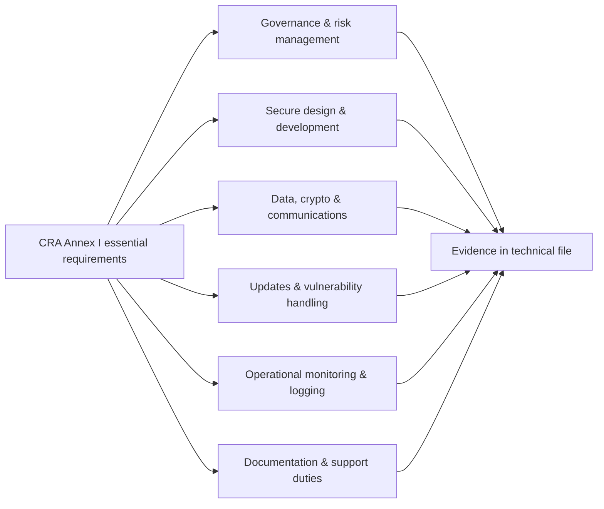
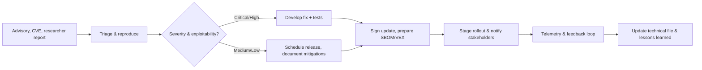

## How we do it ?

When you strip the Cyber Resilience Act down to its technical core, it is essentially a list of security properties that every product with digital elements must provide. Annex I describes them in legal language; this section rewrites them as concrete engineering goals for embedded systems.

We group the CRA requirements around the classic confidentiality–integrity–availability (CIA) triad plus two cross-cutting themes: protection against known vulnerabilities and resilience over the whole lifecycle (secure configuration, logging/monitoring, and updates). The idea is simple: if your design and implementation can convincingly deliver these properties for your device, its firmware and its remote data processing, you are very close to satisfying Annex I.

The rest of this chapter turns each of those abstract properties into something you can actually build: what it means for an MCU/RTOS-based product, which mechanisms typically implement it (TrustZone, secure boot, MPU, TLS, SBOM, etc.), and which CRA clauses it maps back to.

## Annex I overview (security view)

| Annex I clause | Operational translation | Primary evidence |
| --- | --- | --- |
| I.1(a-d) | Risk-based design, documented threat models, and proportional mitigations | Threat model, asset register, SDL outputs |
| I.1(e-g) | Secure-by-default configuration, reduction of attack surface, and protection of data | Secure configuration matrix, interface hardening spec |
| I.1(h-j) | Vulnerability handling, logging, and policies for coordinated disclosure | PSIRT playbook, logging and telemetry plan |
| I.2(a-f) | Secure updates, continuity of security support, SBOM and documentation availability | Update architecture spec, SBOM exports, support policy |

## Governance and risk management

Start with a cybersecurity management system that describes the PDE’s mission profile, asset inventory, threat assumptions, and risk appetite. Score every risk, track mitigations as deliverables, and push the register through the same sprint or release cadence as the product backlog so Annex I(1)(a) evidence is always fresh. Assign a named owner for each control (engineering, QA, product, support) and define escalation paths when telemetry or incidents show elevated exposure. Archive outputs—context documents, risk heat maps, mitigation decisions—in the CRA technical file and reference them during conformity assessment reviews.

## Secure architecture and design controls

Architecture documentation must show how confidentiality, integrity, availability, authentication, authorisation, and secure defaults shape the PDE. Produce layered diagrams that expose trust boundaries, interconnects, and dependency chains from silicon to cloud. Highlight where root-of-trust elements live, how keys are stored, which subsystems enforce access control, and what happens when components fail. For every third-party module or framework, describe its security pedigree, update cadence, and long-term support guarantees. Explicitly capture recovery behaviour (fail-secure modes, watchdogs, graceful degradation) so reviewers can trace control coverage to Annex I clauses without guesswork.

## Development environment and build integrity

The build system is itself part of the attack surface. Lock down CI/CD infrastructure with MFA, role-based access controls, and hardened runners; isolate signing keys inside HSMs or secure enclaves; and enforce reproducible builds so tampering can be detected. Record the automated checks every release must pass—static analysis, dependency scanning, fuzzing, integration suites—and require manual security reviews before artifacts are signed. Keep strong separation between development, staging, and production, logging every privileged action in tamper-evident audit trails. Pin toolchains and libraries to vetted versions and document the verification steps so Annex I evidence demonstrates that vulnerabilities are not introduced by the pipeline.

## Protective technical measures on the device

Embed security at boot, during runtime, and across every exposed interface.

1. **Boot integrity.** Chain trust from immutable ROM through each boot stage, enforce signature verification, prevent rollback, and document recovery procedures for failure cases. Anchor keys in secure storage (eFuses, PUFs, enclaves) and record the provisioning process.
2. **Runtime protections.** Enable MPU/MMU segmentation, execute-in-place protections, stack canaries, watchdog timers, secure clock sources, and least-privilege task modes. Combine these with coding standards (MISRA, CERT C, Rust safety) to reduce exploitability.
3. **Interface discipline.** Lock debug ports, disable unused peripherals, authenticate and authorise every management plane action, validate configuration inputs, and sign remote configuration bundles.

The CRA is technology-neutral, but auditors expect to see these concrete defences or well-reasoned equivalents tied back to requirements.

## Data, cryptography, and secure communications

Catalogue every data type the PDE creates or processes, classify it, and document how confidentiality, integrity, and availability are preserved from manufacture through decommissioning. Reference the cryptographic profiles you follow—ETSI EN 303 645, IEC 62443, NIST curves—and explain why chosen algorithms and key sizes meet CRA expectations. Maintain a key management plan that covers generation, storage, rotation, revocation, and compromise response, with trust anchors housed in secure elements or equivalent. For communications, enforce TLS/DTLS with vetted cipher suites, require mutual authentication where feasible, validate certificates (CRL/OCSP/pinning), and protect against downgrade or replay attacks. Link these controls back to your data inventory so reviewers can see complete coverage.

## Logging, monitoring, and tamper evidence

Annex I(1)(i) demands that PDEs capture meaningful security telemetry and expose it safely. Define the event taxonomy (boot verdicts, authentication attempts, configuration changes, update status, integrity alarms) and the tamper-resistant storage or export mechanism. Even constrained devices need retention rules—rolling buffers with cryptographic sealing, secure export to collectors, or authenticated pull interfaces. Layer in detection logic such as rate limits, anomaly scoring, or hardware sensors and describe how alerts feed into your SOC or support workflows. Physical tamper evidence (switches, lifecycle counters, secure state machines) should trigger the same reporting pipeline so operational teams can respond consistently.

## Secure update and vulnerability handling lifecycle

Annex I(2) focuses on keeping PDEs secure after release. Your update system must authenticate payloads, verify integrity, prevent rollback, and provide clear status feedback to operators. Automate update distribution with staged rollouts, fail-safe install logic, and cryptographic metadata describing provenance, component versions, and dependencies. Equally important is the vulnerability handling workflow: coordinate intake channels, triage, CVE assignment, remediation, and advisories in a documented PSIRT process aligned with ISO/IEC 29147 and 30111.

Back up the diagram with concrete service-level targets (e.g., critical vulnerabilities patched within 14 days), notification templates, and integration points with ENISA reporting if incidents meet CRA thresholds. Maintain VEX statements for high-visibility CVEs even when your PDE is unaffected to prove due diligence.

## Support period, documentation, and SBOM obligations

Manufacturers must declare the minimum support period, restate it in customer-facing materials, and notify distributors well before end-of-support. Generate machine-readable SBOMs (SPDX, CycloneDX) for every release and archive older versions so authorities can request them on short notice. Publish deployment and hardening guides that mirror the secure-by-default posture described earlier, and ensure the Declaration of Conformity, risk analyses, test logs, and PSIRT evidence stay synchronised with product changes.

## Evidence matrix for conformity assessment

| Requirement area | Mandatory evidence | Storage location suggestion |
| --- | --- | --- |
| Governance & risk | Risk register, mitigation plan, control owners | CRA technical file (GRC workspace) |
| Design & architecture | Threat models, DFDs, secure boot diagrams | System design repo / model-based tool export |
| Development pipeline | SDL procedure, toolchain attestation, test reports | DevSecOps portal, CI logs |
| Device protections | Configuration matrix, penetration-test reports | Product security SharePoint or doc repo |
| Data & crypto | Key management plan, crypto policy, certificate inventory | PKI management system |
| Logging & monitoring | Event taxonomy, log protection spec, monitoring SLA | Observability platform runbooks |
| Updates & PSIRT | PSIRT charter, SLAs, update rollout records, VEX | Security response tracker |
| Documentation & SBOM | User/admin manuals, SBOMs, Declaration of Conformity | Docs portal, artifact storage |

Keep the matrix updated release by release so the conformity assessment body (or your internal QA) can find artifacts instantly.

## References

\[1]: "CRA Regulation (EU) 2024/2847 (Annex I and Articles 16-24)" https://eur-lex.europa.eu/legal-content/EN/TXT/?uri=CELEX:32024R2847 
