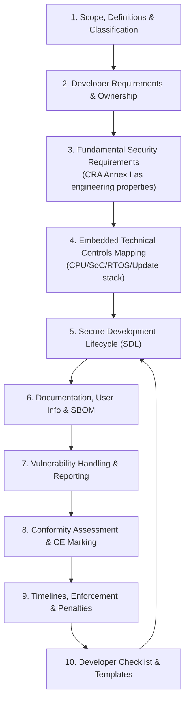
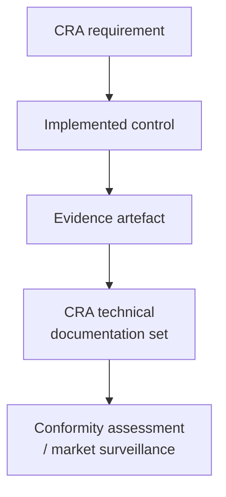

---
id: cra-overview
slug: /security/cra
title: CRA for Embedded Products - Practical Implementation Guide
sidebar_position: 1
---
import DocCardList from '@theme/DocCardList';
import {useCurrentSidebarCategory} from '@docusaurus/theme-common';

## Why this guide exists

The Cyber Resilience Act (CRA) is not only about *having* security features - it’s about being able to **demonstrate** that your product was **designed, developed, produced, and maintained** with cybersecurity in mind, and that you can keep it secure after release. In practice, that means turning legal requirements into:

- **engineering decisions** (architecture, boot chain, isolation, crypto, update path),
- **repeatable processes** (SDL, supply-chain control, PSIRT),
- and **evidence** you can package into the CRA technical documentation.

This documentation set is written to help embedded teams do exactly that: **convert CRA obligations into implementable controls + measurable evidence**, release after release.

> This is an engineering implementation guide. For legal interpretation and edge cases (scope exclusions, role allocation, contract wording), validate with your legal/compliance team.

---

## What you’ll achieve if you follow it

By the end, you should have a CRA-ready baseline that is *auditable*:

- A **clear scope decision** (is it a PDE? important/critical? what variants are covered?)
- A **risk-driven security requirements set** mapped to CRA Annex I
- An **architecture that acts as evidence** (trust boundaries, identity, boot, updates, data flows)
- A **Secure Development Lifecycle** with recorded outputs (reviews, testing, tooling, gating)
- A **documentation pack** aligned with CRA technical documentation expectations (Annex VII) and user info (Annex II)
- An operational **vulnerability handling + reporting workflow**
- A **conformity assessment path** (self-assessment vs notified body route) and CE readiness
- A **release checklist** that links every claim to evidence (tickets, PRs, logs, SBOM/VEX)

---

## How the pages fit together (read in this order)

---

## The “evidence-first” mindset (the real CRA accelerator)

The fastest way to become CRA-ready is to treat every security decision as **two outputs**:

1) **a technical control** (something implemented or configured), and  
2) **an evidence artefact** (something you can point to later).

Examples:
- “Secure boot enforced” ? configuration + signed images + verification logs + test results  
- “Update mechanism is secure” ? update design + policy + rollback tests + staged rollout logs  
- “No known exploitable vulnerabilities at release” ? SBOM + VEX + triage record + fix commits  

This is why every page in this guide ends with: **what you must produce** (artefacts) and **where it should live** (repo, CI logs, technical file).

---

## Explore CRA topics

<DocCardList items={useCurrentSidebarCategory()?.items ?? []} />

---

## Embedded-specific reality check (what this guide focuses on)

Most CRA guidance is technology-neutral. Here we make it concrete for embedded products:

- **MCU/SoC constraints** (MPU/MMU, TrustZone-M/A, secure storage, debug lockdown)
- **RTOS realities** (privilege separation, userspace, secure bootloader integration)
- **field update constraints** (A/B slots, power loss handling, rollback policies)
- **supply-chain visibility** for firmware (SBOM per build + per variant)
- **device ? app ? gateway ? cloud** boundaries (what is part of the PDE “system” in practice)

---

## Typical problems this guide helps you avoid

You’ll see these repeatedly in real audits and real incidents:

- “We don’t know what exactly is **in scope** (device only? app? cloud?)”
- “We can’t explain **why** we chose these controls (no risk-to-control mapping)”
- “We have security features, but **no evidence trail** (no logs, no docs, no repeatability)”
- “We ship multiple variants, but SBOMs and configs are **not variant-aware**”
- “Updates exist, but rollback, key handling, and failure modes are **not proven**”
- “Vulnerability handling is informal (no PSIRT workflow, no response targets)”
- “CE/DoC is handled late, and engineering cannot answer **technical file** questions quickly”

If one of these sounds familiar, start with **Scope & Definitions**, then move to **Fundamental Security Requirements** and **Embedded Technical Controls**.

---

## Where the requirements come from

This guide is grounded in the CRA legal text, mainly:
- **Annex I** (essential requirements)  
- **Annex II** (user-facing security information)  
- **Annex VII** (technical documentation content)  
- and the CRA provisions covering vulnerability handling/reporting and conformity assessment routes.

[1]: https://eur-lex.europa.eu/legal-content/EN/TXT/?uri=CELEX:32024R2847 "Regulation (EU) 2024/2847 - Cyber Resilience Act (CRA)"

