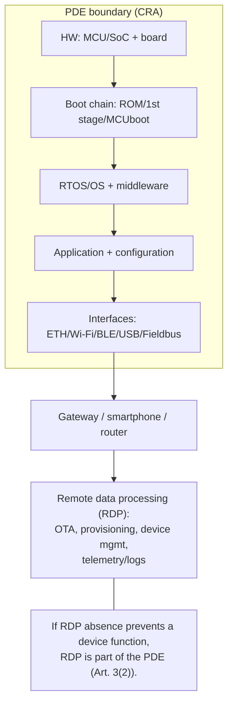
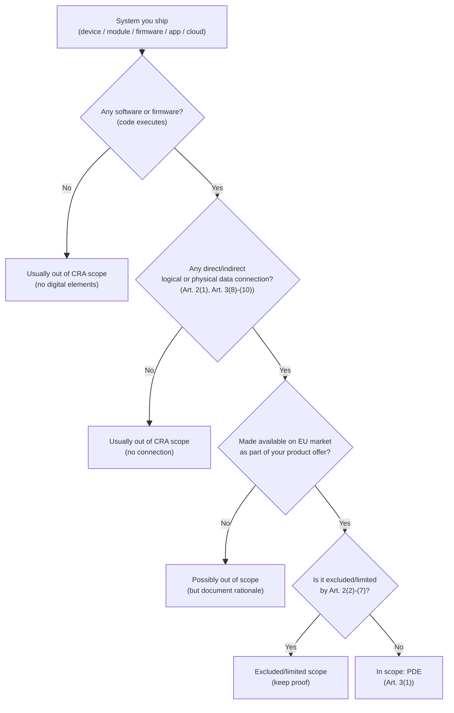
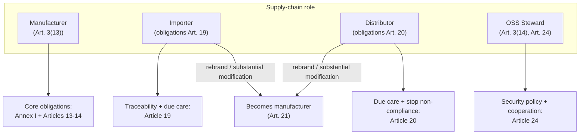
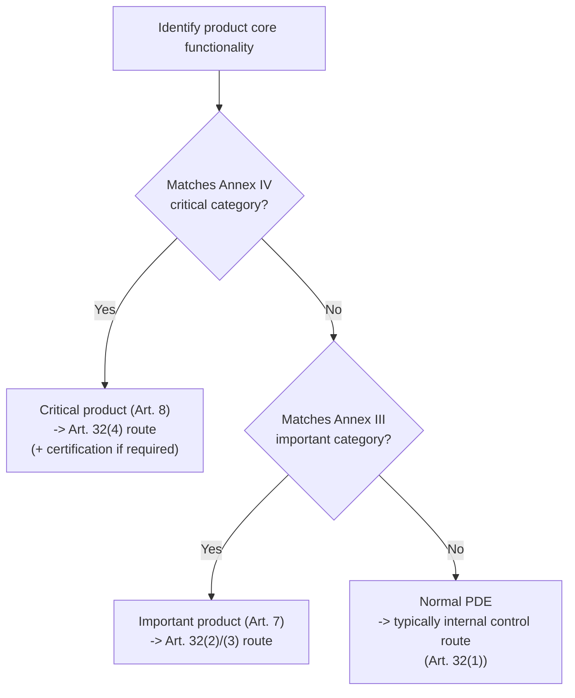

---
id: cra-scope-definitions
slug: /security/cra/scope-and-definitions
title: Scope, Definitions, and Classification
sidebar_position: 2
---

## Why scope matters (for embedded teams)

The Cyber Resilience Act (CRA) is a **CE‑marking regulation for cybersecurity**: it defines *what* must be built into a product, *how* the manufacturer must handle vulnerabilities over time, and *what evidence* must exist in the technical file.

For an embedded product, getting scope right early determines:

- the **target security level** you must engineer (Annex I),
- the **conformity assessment route** (self vs. third party), driven by whether you fall under **Annex III / Annex IV**,
- the size and lifetime of your **technical documentation** (including updates during the support period),
- and the operational obligations for **vulnerability handling** and **security updates**.

---

## 1) CRA scope: the legal trigger, translated into engineering terms

The CRA applies to **products with digital elements** made available on the EU market **when the intended purpose or reasonably foreseeable use includes a direct or indirect logical or physical data connection to a device or network** (Art. 2(1)).

if your device (or its software) can exchange data through *any* interface that can reasonably connect to a networked environment, assume the CRA applies.

### Data connection (what “counts”)

The CRA explicitly defines:

- **logical connection**: a virtual representation implemented through a software interface (Art. 3(8));
- **physical connection**: a connection implemented using physical means, including wires or radio waves (Art. 3(9));
- **indirect connection**: connection does not take place directly, but as part of a larger system that is directly connectable (Art. 3(10)).

So for embedded products, the following are all “connections” in CRA terms:

- Ethernet, Wi‑Fi, cellular, Thread, BLE, Zigbee, LoRaWAN
- USB (CDC/DFU), UART, SPI, I²C when used via a gateway / host
- CAN / CAN‑FD, Modbus, RS‑485, PROFINET, EtherCAT when bridged to IP
- debug interfaces (SWD/JTAG) if accessible in the field (risk assessment)

---

## 2) Core definitions you must use consistently

### 2.1 Product with Digital Elements (PDE)

A **product with digital elements** means a software or hardware product **and its remote data processing solutions**, including components placed on the market separately (Art. 3(1)).

Engineering interpretation:

- A single “PDE” can be the **device + firmware + mobile app + cloud backend**, if the remote part is required for a device function.
- A **software-only deliverable** can be a PDE by itself (e.g., a gateway agent).
- A module/SDK/library can be a PDE if you place it on the market separately under your control.

### 2.2 Remote data processing (RDP)

**Remote data processing** is data processing at a distance, designed/developed by (or under the responsibility of) the manufacturer, **and without which the PDE would be prevented from performing one of its functions** (Art. 3(2)).

This matters a lot in embedded ecosystems because OTA, provisioning, telemetry, and fleet management often live off-device.

#### PDE boundary diagram (typical embedded product)

---

## 3) What is out of scope (and what is NOT)

### 3.1 Explicit exclusions (Art. 2)

The CRA **does not apply** to:

- certain sector-regulated product families listed in Art. 2(2)-(4) (e.g. specific medical device regimes; aviation certification regimes);
- spare parts replacing identical components manufactured to the same specifications (Art. 2(6));
- products developed or modified exclusively for national security or defence, or specifically designed to process classified information (Art. 2(7)).

Also, the CRA can be limited/excluded where other Union rules already address the same cybersecurity risks at the same or higher level (Art. 2(5)).

### 3.2 The common “FOSS is out of scope” mistake

**Do not use Art. 2 as a blanket FOSS carve-out.** The CRA instead introduces a *specific regime* for **open-source software stewards** (Art. 3(14), Art. 24) and treats commercial placement and roles very carefully.

if you ship a commercial device that includes open-source components, your device is still a PDE and you still own the obligations as manufacturer.

---

## 4) “Is my embedded product in scope?” - a decision workflow

If you get to **“In scope: PDE”**, continue with:
- *Fundamental Security Requirements* (Annex I, Part I),
- *Secure Development Lifecycle / Processes* (Annex I, Part II),
- *Vulnerability handling & reporting* (Art. 14 + Annex I Part II),
- and *Conformity assessment* (Art. 32 + Annex VIII).

---

## 5) Roles: who owns which obligations?

The CRA assigns obligations to **economic operators** (Art. 3(12)). For embedded supply chains, the key roles are:

### 5.1 Manufacturer (you own the security story)

A **manufacturer** is any natural or legal person who develops/manufactures a PDE (or has it designed/developed/manufactured) and markets it under its name or trademark, whether paid, monetised, or free of charge (Art. 3(13)).

In practice, if you control **firmware content**, **security update policy**, and the **CE dossier**, you are the manufacturer even if hardware is ODM/EMS.

Manufacturer obligations are primarily in **Articles 13 and 14** (e.g., ensure Annex I compliance; draw up documentation and EU DoC; vulnerability handling; incident reporting; support period; provide updates).

### 5.2 Importer

Importer obligations are in **Article 19** (traceability, keeping DoC, making technical documentation available to authorities, corrective actions, reporting significant cybersecurity risk, etc.).

### 5.3 Distributor

Distributor obligations are in **Article 20** (due care; verify CE marking and documentation presence; avoid marketing non‑compliant products; inform manufacturer of vulnerabilities; cooperate with authorities).

### 5.4 When an importer/distributor becomes the “manufacturer”

If an importer or distributor places a PDE on the market under its own name/trademark **or performs a substantial modification**, they are treated as manufacturer and become subject to Articles 13 and 14 (Art. 21).

Other persons performing substantial modification and making the product available are also treated as manufacturers for the modified scope (Art. 22).

### 5.5 Open-source software stewards (if relevant)

An **open-source software steward** is defined in Art. 3(14). Their obligations are in Art. 24 (cybersecurity policy, cooperation with authorities, and specific incident obligations where they operate the infrastructure used for development).

#### Role mapping diagram

---

## 6) Classification: normal vs important vs critical products

This is what changes your conformity assessment route and the depth of scrutiny.

### 6.1 Important products (Annex III)

Products with the **core functionality** of categories listed in **Annex III** are **important products** and are subject to the conformity assessment procedures referenced in Art. 32(2) and (3) (Art. 7(1)).

Annex III is split into **Class I** and **Class II**; the Commission can update the list (Art. 7(3)) and will publish technical descriptions (Art. 7(4)).

### 6.2 Critical products (Annex IV)

Products with core functionality listed in **Annex IV** are **critical products**. They must demonstrate conformity either via a European cybersecurity certification scheme (if mandated) or through the higher-assurance conformity routes (Art. 8 + Art. 32(4)).

### 6.3 Practical classification workflow

**Engineering tip:** “core functionality” is not the same as “contains a library”. If you embed an SSH server inside a sensor, the question is whether SSH is a core function for the marketed product, not merely present.

---

## 7) CRA vocabulary you will reuse later (define once, reuse everywhere)

Use the CRA definitions so your risk assessment, architecture docs and update policy are consistent:

- **cybersecurity risk** and **significant cybersecurity risk** (Art. 3(37)-(38))
- **SBOM** (Art. 3(39))
- **vulnerability / exploitable / actively exploited** (Art. 3(40)-(42))
- **incident impacting the security of the PDE** (Art. 3(44))

These terms drive how you decide if something triggers reporting and how you argue “no known exploitable vulnerabilities” at release.

---

## 8) Practical embedded deliverables that *prove scope decisions*

For audits and market surveillance, you should be able to show a clean trace:

1. **Scope statement** (1 page): PDE boundary + RDP boundary + interfaces. (Art. 2(1), Art. 3(1)-(2))
2. **Connectivity inventory**: physical/logical interfaces, which are exposed in production, and how they are protected. (Art. 3(8)-(10))
3. **Role statement**: manufacturer/importer/distributor mapping + who maintains update infra. (Art. 3(12)-(14), Art. 19-21, Art. 24)
4. **Classification decision**: Annex III / IV cross-check with “core functionality” rationale. (Art. 7-8)
5. **Change-control rule**: what counts as “substantial modification” internally, and how you re-run the classification + risk assessment. (Art. 21-22)

---

## 9) Common problems teams hit in this section (and how to resolve them)

### A) “Where do we draw the PDE boundary?”
**Typical issue:** teams only document the device, but OTA, provisioning, or telemetry is required for device operation.  
**Fix:** if absence of the remote processing prevents a function, treat it as RDP within the PDE boundary (Art. 3(2)). Document it in the architecture diagram and the risk assessment.

### B) “Is USB / UART / BLE really a ‘network connection’?”
**Typical issue:** “it’s local, so CRA doesn’t apply.”  
**Fix:** CRA scope includes indirect connections (Art. 2(1) + Art. 3(10)). If the interface can realistically bridge to a networked system, include it in scope and threat model.

### C) “We use open source, are we exempt?”
**Typical issue:** mixing up FOSS stewardship with manufacturer obligations.  
**Fix:** your commercial product remains a PDE; you remain manufacturer (Art. 3(13)). FOSS steward duties (Art. 24) don’t remove manufacturer duties.

### D) “We are a distributor but we add our firmware”
**Typical issue:** distributor assumes “light” obligations, but reflashes firmware and rebrands.  
**Fix:** rebranding or substantial modification can make you the manufacturer (Art. 21-22). Treat your release like a manufacturer release (Articles 13-14).

### E) “Important/critical classification is unclear”
**Typical issue:** component present vs core functionality confusion.  
**Fix:** document what the marketed product is *for*; map to Annex III/IV by **core function** (Art. 7-8). Keep the rationale in the technical file.

### F) “We don’t know what to put in the technical file yet”
**Fix:** at minimum keep scope boundary diagrams, interface inventory, role mapping, classification decision, and change-control rule. CRA requires technical documentation to be created before placing on the market and updated during the support period (Art. 31).

---

## References (normative)

[1] Regulation (EU) 2024/2847 (Cyber Resilience Act) - consolidated text (EUR‑Lex): https://eur-lex.europa.eu/legal-content/EN/TXT/?uri=CELEX:32024R2847  
[2] CRA Article 2 (Scope) - see [1], Art. 2(1)-(7).  
[3] CRA Article 3 (Definitions: PDE, RDP, logical/physical/indirect connection, manufacturer, OSS steward) - see [1], Art. 3(1)-(14).  
[4] CRA Article 7-8 (Important/Critical products) and Annex III-IV - see [1], Art. 7-8 and Annexes.  
[5] CRA Articles 19-22 and 24 (Importer/Distributor duties, when they become manufacturer; OSS stewards) - see [1], Art. 19-22 and Art. 24.  

