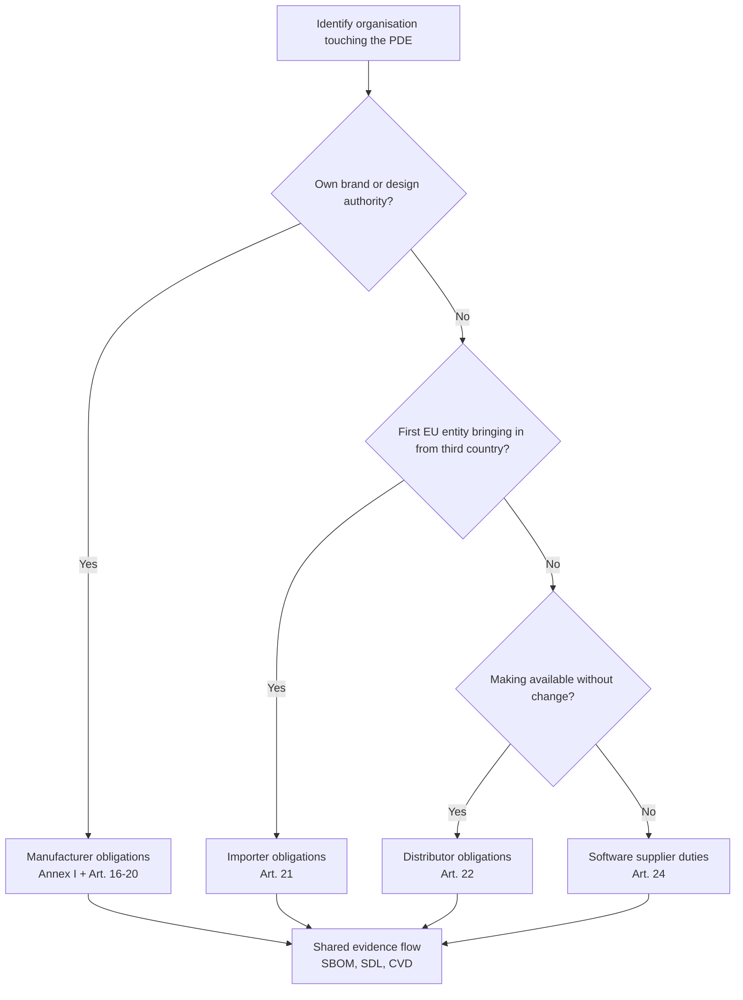

## Why scope matters

Before investing engineering time, you need to know **whether your product is in scope of the CRA** and, if so, **which class** it falls into. That drives:

- how strict the **conformity assessment** must be,
- how much **technical documentation** you must maintain,
- and which **post-market obligations** apply.   

The CRA uses the umbrella term **“product with digital elements” (PDE)** defined in Art. 3(1).[1] In practice most embedded devices, gateways and firmware images you work on will fall under this definition.

> 📘 **Reference.** Whenever you need the exact legal wording, open the Official Journal publication of Regulation (EU) 2024/2847.[1]

Article 2(2) also clarifies what is **out of scope**—for example, products developed exclusively for national security/military, top-secret research prototypes not made available on the market, or pure software offered free of charge without monetisation.[2] Use these carve-outs sparingly and document your rationale inside the CRA technical file.

---

## Is my embedded product in scope?

Ask yourself these questions (all derived from CRA Art. 2–3).[1][2]

1. **Does the product contain software or firmware that can run code?**  
   - Microcontroller, SoC, PLC, router, gateway, smart sensor, etc.  
2. **Is it placed on the EU market (or put into service) as a product?**  
   - Sold as a device, integrated into a machine, or delivered as part of a system.  
3. **Can it be connected directly or indirectly to a network?**  
   - Ethernet, Wi-Fi, cellular, fieldbus, BLE, USB, proprietary RF…  

If the answer to all three is “yes”, you are almost certainly dealing with a **PDE under the CRA**.   

Purely internal tools (e.g. a one-off programming jig used only in your lab) are usually out of scope, but boards, modules or firmware that ship to customers are not.

---

## Roles: who is “the manufacturer”?

The CRA cares about roles, not internal job titles. Chapter II maps each role to concrete legal duties, so you need a precise definition before planning documentation or delegation.

**Manufacturer.** The manufacturer is any natural or legal person that places a PDE on the market under its own name or trademark while steering the design, bill of materials, and secure development lifecycle.[3] If you control firmware content or the CE marking dossier, you are the manufacturer even when hardware originates from an ODM or EMS partner.

**Importer.** The importer is the first EU-based actor receiving a third-country product for distribution. Importers must verify that the Declaration of Conformity covers the actual firmware build, confirm CE marking and technical documentation availability, and halt shipments if CRA conditions are not fulfilled.

**Distributor.** Distributors circulate the PDE without altering it. They keep traceability data, avoid marketing non-compliant batches, and support corrective actions triggered by vulnerability handling or market-surveillance notices.

**Software supplier.** A firmware, SDK, or cloud-service contributor becomes a supplier within the meaning of Art. 24, yet the manufacturer remains accountable unless a different legal role is agreed in writing. Suppliers still need evidence of SDL activities and vulnerability handling to feed into the manufacturer’s technical file.

---

## Criticality classes (important / critical products)

The CRA distinguishes between **ordinary PDEs** and those considered **important** or **critical** (higher risk). Examples include:

- identity management systems, security tokens,
- certain industrial control components,
- OSes and hypervisors that run other PDEs (cross-check Annex III directly).[3]  

For important/critical classes:

- **third-party conformity assessment** is often mandatory,  
- security failures are likely to attract more regulatory scrutiny.

If you are building low-power MCUs for sensors or simple gateways, you are typically in the **“normal PDE”** category—but always verify against Annex III before assuming self-assessment is sufficient.[3] Document the annex cross-check inside your CRA task tracker (Jira/Notion, etc.) so auditors can reconstruct the decision.

---

## Key CRA terms you’ll see

- **Vulnerability**: a weakness that can be exploited to compromise confidentiality, integrity or availability.  
- **Security update (patch)**: a software/firmware change that mitigates one or more vulnerabilities or otherwise improves security.  
- **Support period**: the time during which the manufacturer commits to providing security updates and vulnerability handling.  
- **Placing on the market**: the first time a product is supplied for distribution or use in the EU, not each sale.   

Keep these definitions in mind (they map directly to CRA Art. 3 and Annex I obligations)[1]. They show up again in the sections on **SDL**, **vulnerability handling**, and **conformity assessment**. When in doubt, quote the exact definition text inside design reviews or product requirement documents so everyone reasons from the same baseline.

\[1]: CRA Regulation (EU) 2024/2847(Article 3 and Annex I) https://eur-lex.europa.eu/legal-content/EN/TXT/?uri=CELEX:32024R2847

\[2]: CRA Regulation (EU) 2024/2847 (Article 2): https://eur-lex.europa.eu/legal-content/EN/TXT/?uri=CELEX:32024R2847 

\[3]: CRA Regulation (EU) 2024/2847 (Chapter II and Annex III): https://eur-lex.europa.eu/legal-content/EN/TXT/?uri=CELEX:32024R2847 
