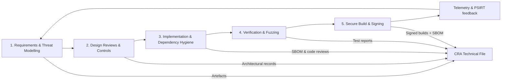

## Why an SDL is required

CRA doesn’t just check the final binary; it requires that the product be **“designed, developed and produced”** with cybersecurity in mind (Annex I(1)(a–d)).[1] That implies a repeatable **secure development lifecycle** that auditors can inspect.   

We align the SDL with **NIST SSDF** and **IEC 62443-4-1**, both recognised in Commission guidance as acceptable frameworks for demonstrating Annex I coverage.[2][3] Reference these documents directly when describing your SDL in the technical file.

---

## 1. Security requirements and threat modelling

At project start:

- Identify **assets**, **entry points** and **threat actors** for your device and system.  
- Derive a short list of **security requirements** mapped to CRA Annex I controls (see “Fundamental Security Requirements”).   

Use a lightweight STRIDE-style model for embedded systems: Spoofing, Tampering, Repudiation, Information disclosure, Denial of service, Elevation of privilege.

---

## 2. Design reviews and technical controls

During architecture and design:

- Decide how to implement identity, secure boot, communication security, and update path (see “Embedded Technical Controls”).   
- Document design rationale and chosen standards (ETSI EN 303 645, IEC 62443-4-2, etc.) as conformity evidence (see [References](./references)).  

---

## 3. Implementation quality and dependency hygiene

During coding:

- Apply coding standards (MISRA-C, CERT C) and static analysis.  
- Review all **third-party dependencies**; only accept components with maintained upstream projects and license compatibility.  
- Keep an SBOM in the repo and update it as dependencies change.   

---

## 4. Verification: static, dynamic and fuzz testing

Before each release:

- Run **static analysis** on critical modules (parsers, protocol handling, crypto use).  
- Implement **unit/integration tests** that exercise security features (access control, secure boot failure modes).  
- Add **fuzzing** for parsers and protocol state machines; for embedded, use host-based harnesses plus HW-in-the-loop on nightly jobs.   

Record results, defects and fixes so they can be linked to CRA conformity evidence and to Annex I(1)(h) obligations on vulnerability handling and testing.[1]

---

## 5. Secure build, signing and release

For each build intended for release:

- Use reproducible builds where feasible (pinned toolchain versions, deterministic flags).  
- Sign firmware images with offline-protected keys; keep signing logs.  
- Generate an **SBOM + VEX** package and attach it to the release artefacts.   

These artefacts feed directly into **technical documentation** and the **developer checklist** and satisfy Annex I(2)(a–c) expectations for update readiness.[1]

[1]: https://eur-lex.europa.eu/legal-content/EN/TXT/?uri=CELEX:32024R2847 "Regulation (EU) 2024/2847 — Annex I"
[2]: https://csrc.nist.gov/pubs/sp/800/218/final "NIST SP 800-218 (SSDF)"
[3]: https://webstore.iec.ch/publication/33615 "IEC 62443-4-1 SDL requirements"
