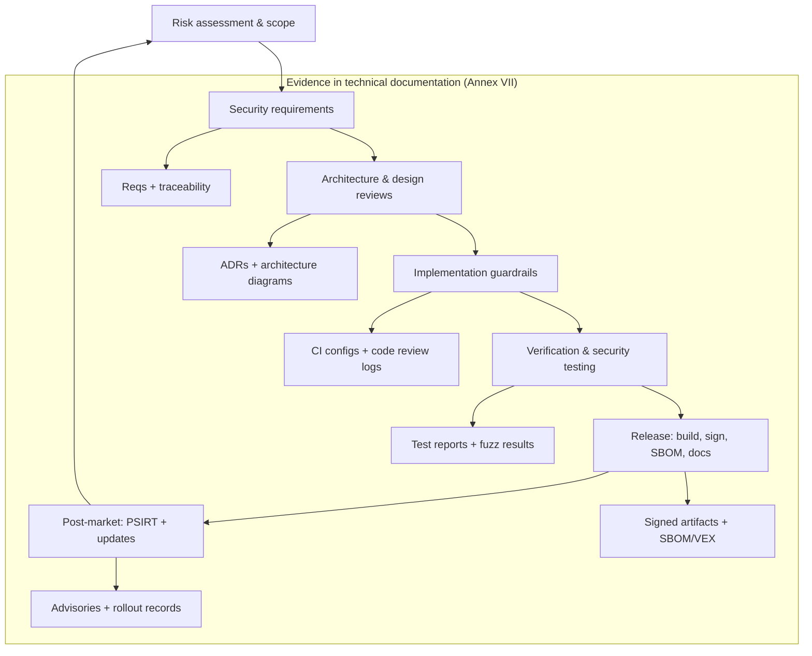
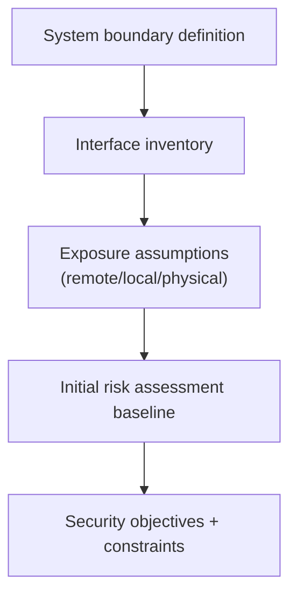
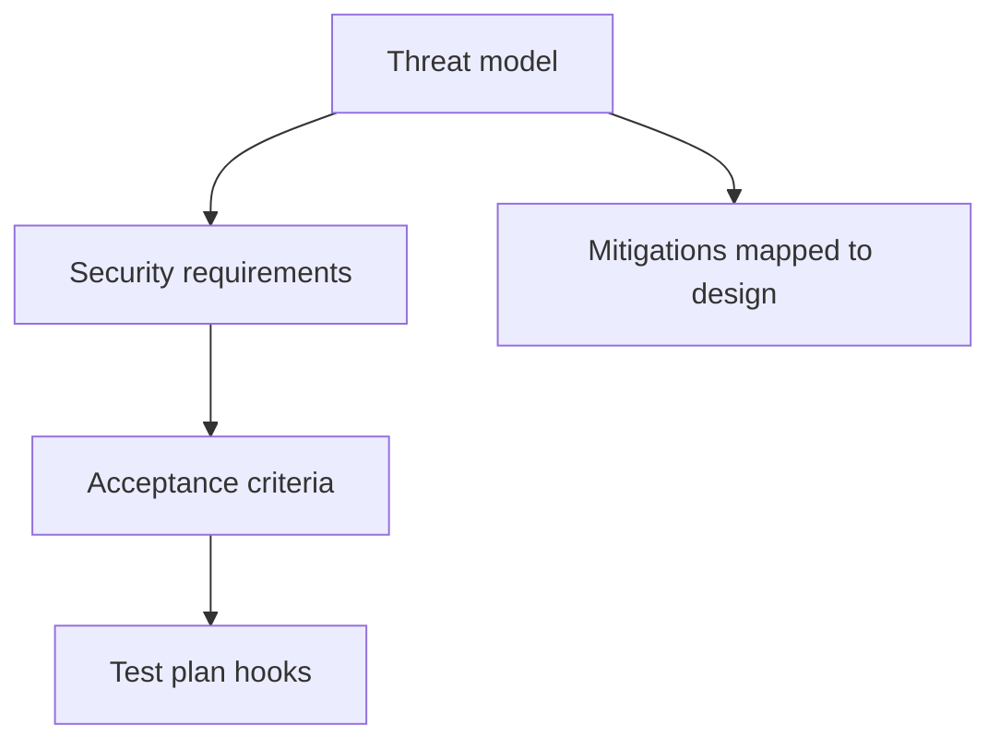
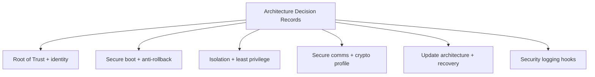
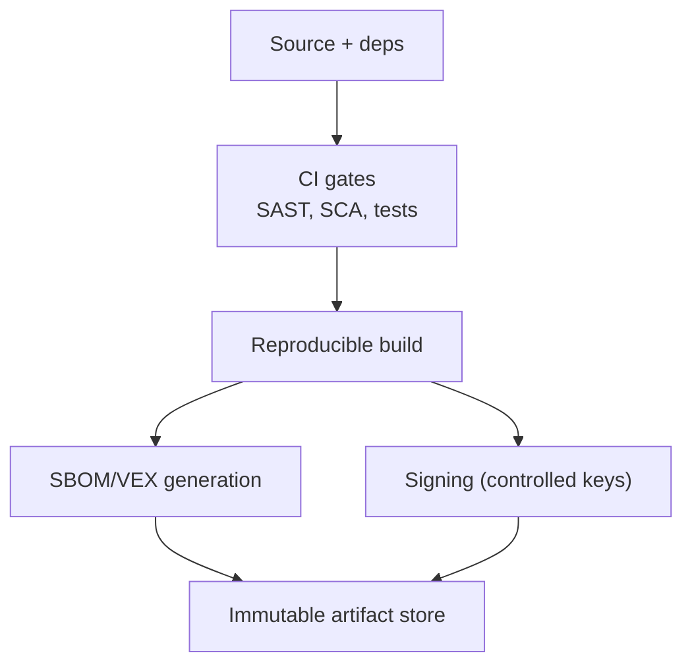
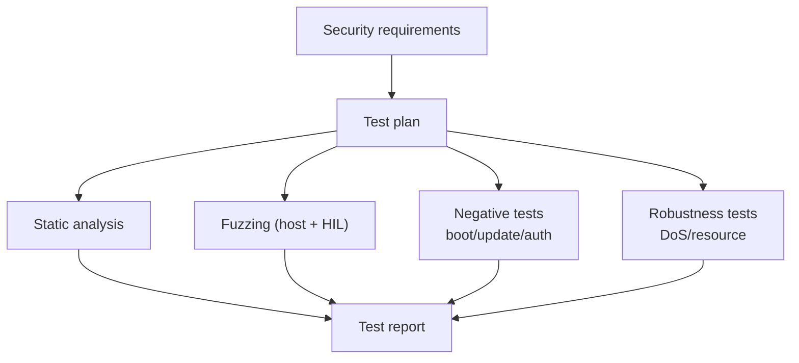
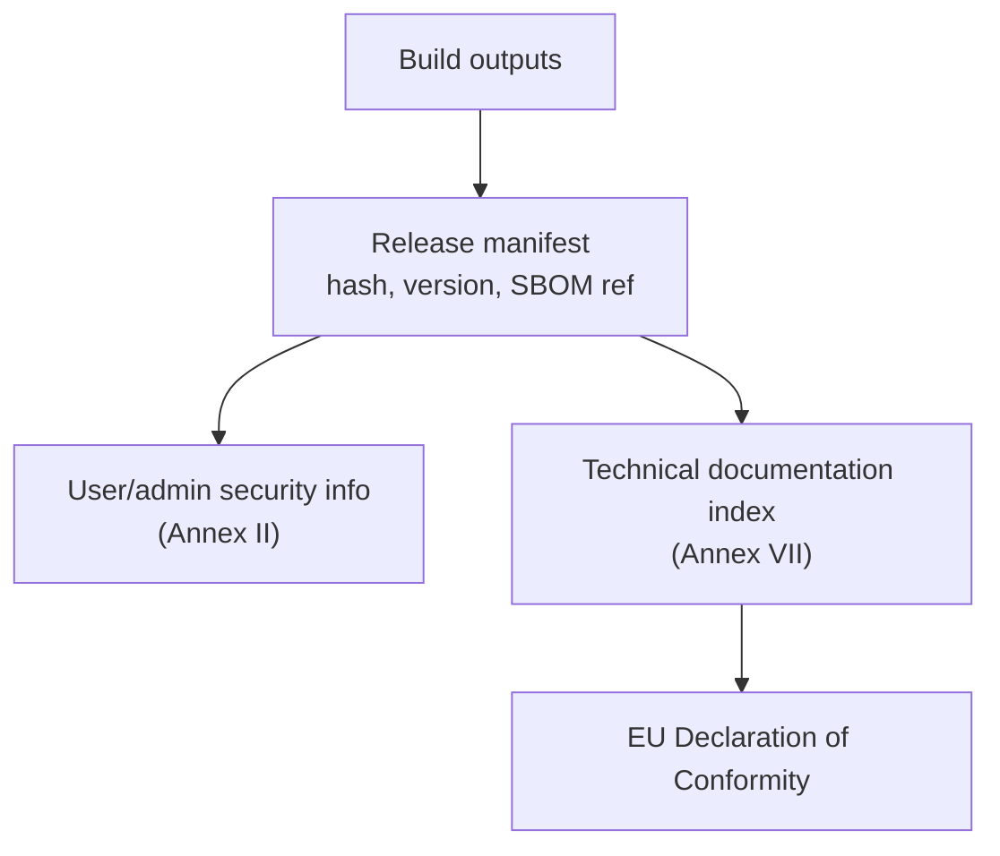
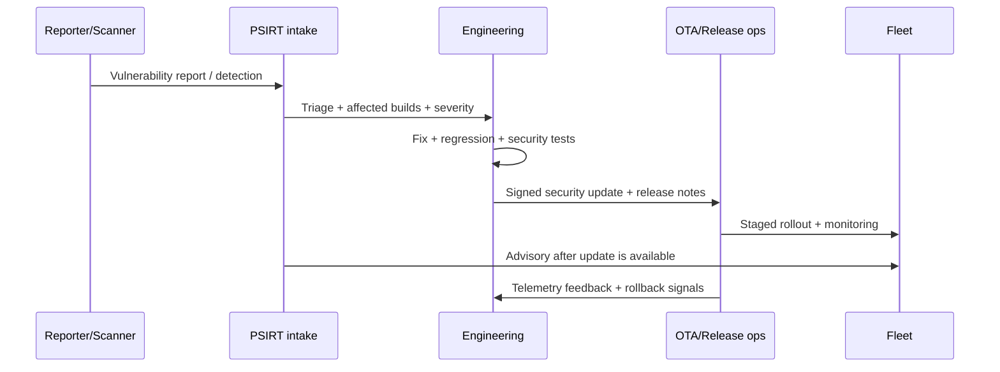
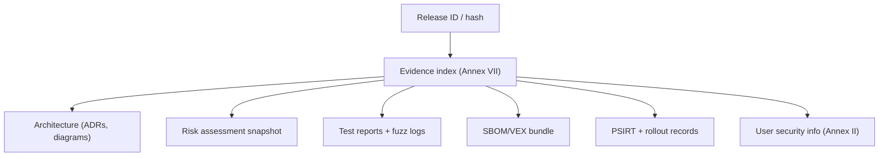

## Why an SDL is required (CRA view)

The CRA does **not** only evaluate the final firmware image. It requires that, when placing a product with digital elements (PDE) on the market, the manufacturer ensures it has been **designed, developed and produced** in accordance with the essential cybersecurity requirements in **Annex I Part I**.[1]

The CRA then goes further:

- Manufacturers must run a **cybersecurity risk assessment**, document it, and take its outcome into account during **planning, design, development, production, delivery and maintenance** phases.[2]
- Technical documentation must be created **before** placing the product on the market and **continuously updated** at least during the **support period** (and must contain the elements listed in Annex VII).[3]
- Conformity can be demonstrated using **harmonised standards** or **common specifications** (presumption of conformity), which is why an SDL needs to be "standardisable" and auditable.[4]

In embedded engineering terms: **SDL is the mechanism that proves Annex I is implemented**, release after release.

---

## What a CRA-ready SDL looks like for embedded products

A CRA-ready SDL for embedded devices has three properties:

1. **Evidence-first**: every phase produces artifacts that can be indexed in the technical file (Annex VII).[3]
2. **Risk-driven**: controls are selected and justified via the product's risk assessment (Art. 13(2)-(4)).[2]
3. **Lifecycle-complete**: it covers design ? release ? field maintenance, including vulnerability handling and security updates (Annex I Part II).[1]

---

## Embedded SDL phases (with gates, outputs, and CRA anchors)

### Gate 0 - Product scope, boundary, and classification

**Objective:** define the PDE boundary and your "security environment" so risk is assessable.

Embedded specifics you must capture:
- device interfaces (logical/physical/indirect connections),
- debug and manufacturing access assumptions,
- remote dependencies required for operation (updates, identity, telemetry),
- product variants (memory map, boot chain, radio stack, regional SKUs).

**Outputs (minimum):**
- scope statement + system context diagram,
- interface inventory + exposure assumptions,
- initial risk assessment baseline.

**CRA anchors:** risk assessment across lifecycle phases (Art. 13(2)-(4)); technical documentation needs (Art. 31 + Annex VII).[2][3]

---

### Gate 1 - Security requirements and threat modelling

**Objective:** turn Annex I Part I "security properties" into explicit engineering requirements, then validate them against threats.

Embedded threat modelling must include:
- remote threats (protocol parsers, auth bypass, update spoofing),
- local threats (UART/USB abuse, debug access, fault injection assumptions),
- supply-chain threats (dependency compromise, build pipeline tampering).

**Outputs (minimum):**
- security requirements list tagged to Annex I clauses,
- threat model with mitigations,
- testable security acceptance criteria (what "pass" means).

**CRA anchors:** Annex I Part I essential requirements; risk assessment indicating how Annex I(2) is applied (Art. 13(3)).[1][2]

---

### Gate 2 - Architecture design reviews (secure-by-design decisions)

**Objective:** lock early decisions that are expensive to change later (root of trust, isolation, update path).

Embedded design checkpoints to formalise:
- root of trust & device identity (key storage, provisioning, revocation),
- secure boot chain & anti-rollback policy,
- isolation boundaries (MPU/MMU/TrustZone; least privilege),
- secure communications profile (protocols, cipher suites, credential validation),
- security logging hooks and export model,
- update strategy (A/B slots, swap, recovery mode) and failure matrix.

**Outputs (minimum):**
- architecture diagrams with trust boundaries,
- ADRs (architecture decision records) for each major choice,
- key management and provisioning design (even if outsourced).

**CRA anchors:** Annex I Part I(2) properties (secure-by-default, access control, confidentiality/integrity, attack surface reduction, logging, updates); technical documentation content (Annex VII).[1][3]

---

### Gate 3 - Implementation guardrails (code + dependencies + build integrity)

**Objective:** prevent preventable vulnerabilities and prevent build/pipeline compromise.

Embedded-specific guardrails:
- coding rules for unsafe languages (C/C++): banned APIs, integer overflow rules, bounds checks,
- parser safety: strict input validation, length checks, state machine hardening,
- dependency governance: version pinning, vulnerability monitoring, allow/deny lists,
- build integrity: reproducible builds where feasible, controlled signing, tamper-evident CI logs.

**Outputs (minimum):**
- CI policy: required checks and block conditions,
- dependency manifest + SBOM generation job,
- secure key handling SOP for signing (who/where/how).

**CRA anchors:** "no known exploitable vulnerabilities" at release (Annex I Part I(2)(a)); due diligence for third-party components (Art. 13(5)-(6)); technical documentation must describe the means used (Art. 31(1)).[1][3][2]

---

### Gate 4 - Verification and security testing (prove the properties)

**Objective:** show the implemented controls actually meet the Annex I properties and remain effective.

For embedded products, "security testing" should include:
- static analysis for memory safety and misuse of crypto/APIs,
- protocol and file-format fuzzing (host harness + nightly HIL),
- negative tests for secure boot and update paths (bad signature, downgrade attempts),
- robustness tests for availability (resource exhaustion, rate limiting, watchdog/recovery).

**Outputs (minimum):**
- security test plan linked to requirements,
- test reports with pass/fail, bugs, and closure evidence,
- fuzzing corpus + crash triage logs for parsers.

**CRA anchors:** Annex I Part I(2) (integrity, access control, availability, logging); Annex I Part II vulnerability handling expectations (regular testing is a core expectation in practice) and technical documentation test evidence (Annex VII).[1][3]

---

### Gate 5 - Release engineering (create compliance-grade artifacts)

**Objective:** produce the exact artifacts that make a release defensible.

Minimum release package for embedded products:
- signed firmware images + hashes + version policy metadata,
- SBOM per build (and VEX/triage notes where used),
- update instructions and security configuration guidance for users/operators,
- "Annex I coverage" summary linking clause ? control ? evidence.

**CRA anchors:** security updates and related user information (Annex I Part I(2)(c) + Annex II); technical documentation before market placement (Art. 31(2)); EU declaration of conformity states Annex I fulfillment (Art. 28(1)).[1][3][5]

---

### Gate 6 - Post-market: PSIRT + security updates (stay compliant in the field)

**Objective:** keep the PDE secure throughout the support period with a functioning vulnerability handling process and secure update distribution.

Core embedded obligations in practice:
- intake channel for vulnerabilities (single point of contact),
- triage (exposure + exploitability + affected builds),
- secure distribution of security updates (signed, integrity checked, rollback-safe),
- advisory/notification after updates are available (align timing with your policy).

**Outputs (minimum):**
- PSIRT process doc + workflow tooling,
- security update rollout records (staged rollout, fleet segmentation),
- advisory templates + vulnerability closure evidence.

**CRA anchors:** vulnerability handling requirements (Annex I Part II); risk assessment updated during support period (Art. 13(3)); technical documentation continuously updated during support period (Art. 31(2)).[1][2][3]

---

## Mapping SDL to NIST SSDF and IEC 62443-4-1 (optional but useful)

The CRA is the legal baseline. Frameworks like **NIST SSDF (SP 800-218)** and **IEC 62443-4-1** are commonly used to structure SDL activities and produce consistent evidence, but they are not a legal substitute for Annex I.[6][7]

A practical alignment for embedded teams:

- **Prepare (SSDF PO)** ? Gate 0-1 (scope, roles, risk model, requirements)
- **Protect (SSDF PS)** ? Gate 2-3 (secure architecture, build integrity, dependency governance)
- **Produce (SSDF PW)** ? Gate 4-5 (testing, signing, SBOM, release evidence)
- **Respond (SSDF RV)** ? Gate 6 (PSIRT + updates)

---

## What to store where (so audits don't turn into archaeology)

A CRA-friendly storage model is to keep:
- design artifacts (ADRs, diagrams) in the architecture repo,
- CI and release artifacts in immutable storage with retention,
- PSIRT records in a tracker with exportable evidence,
- and a **single technical documentation index** that points to all artifacts per release hash (Annex VII).[3]

---

## Common problems teams hit (and why they matter under CRA)

If your SDL feels "heavy", it's usually because one of these foundational points is missing:

1. **PDE boundary not defined**: device is documented, but OTA/provisioning/telemetry services are not ? you cannot prove update/logging obligations.[2][3]
2. **Support period decided late**: update strategy and cost model are not aligned with required lifecycle handling (risk assessment and documentation must be updated during support period).[2][3]
3. **Variant explosion without evidence**: multiple SKUs/boot chains exist but only one is tested/documented ? evidence doesn't represent what ships.
4. **Signing and keys treated like a build detail**: key custody and signing logs are missing ? you can't prove update authenticity and integrity.[1][3]
5. **No negative testing**: secure boot/update path is implemented but never attacked in tests (downgrade, corruption, replay) ? integrity controls are unproven.
6. **SBOM created once**: SBOM exists but is not tied to the exact release hash and there is no triage/VEX workflow ? "no known exploitable vulnerabilities" is not defensible.[1]
7. **Debug lifecycle not governed**: SWD/JTAG/UART policies rely on tribal knowledge ? breaks secure-by-default and attack surface minimisation.[1]
8. **PSIRT is "email-based"**: no documented vulnerability intake/triage/update/advisory flow ? Annex I Part II expectations become unverifiable.[1]
9. **Evidence scattered**: artifacts exist but are not indexed per release in the technical documentation ? audits become slow and error-prone (Art. 31 + Annex VII).[3]
10. **Process ignores standards evolution**: series production does not react to updated harmonised standards/common specifications ? CRA requires procedures to maintain conformity over time.[2][4]

---

## References

[1]: Regulation (EU) 2024/2847 (CRA) - Annex I (Part I & Part II) (EUR-Lex) https://eur-lex.europa.eu/legal-content/EN/TXT/?uri=CELEX:32024R2847

[2]: CRA - Article 13 (manufacturer obligations: risk assessment integrated across lifecycle; updated during support period; included in technical documentation; production conformity procedures) https://eur-lex.europa.eu/legal-content/EN/TXT/?uri=CELEX:32024R2847

[3]: CRA - Article 31 + Annex VII (technical documentation: drawn up before market placement; continuously updated at least during support period; content requirements) https://eur-lex.europa.eu/legal-content/EN/TXT/?uri=CELEX:32024R2847

[4]: CRA - Article 27 (presumption of conformity via harmonised standards and common specifications; standardisation requests) https://eur-lex.europa.eu/legal-content/EN/TXT/?uri=CELEX:32024R2847

[5]: CRA - Article 28 (EU Declaration of Conformity states Annex I fulfillment) + Annex II (user security information) https://eur-lex.europa.eu/legal-content/EN/TXT/?uri=CELEX:32024R2847

[6]: NIST SP 800-218 (Secure Software Development Framework - SSDF) https://csrc.nist.gov/pubs/sp/800/218/final

[7]: IEC 62443-4-1 (Secure product development lifecycle requirements) (standard reference; obtain via IEC/ISA)

