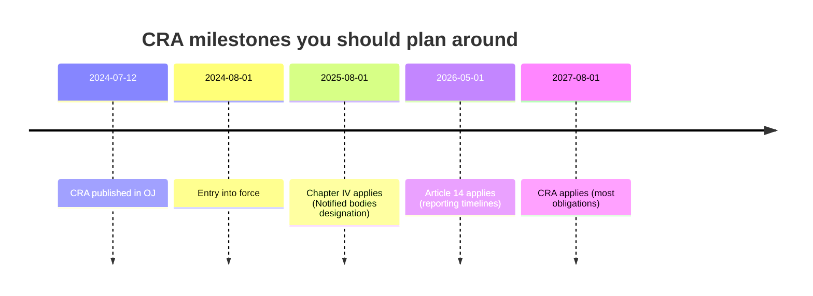
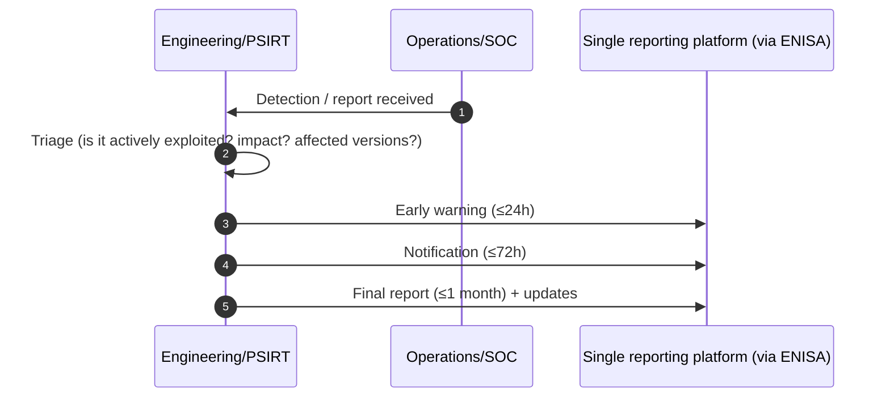
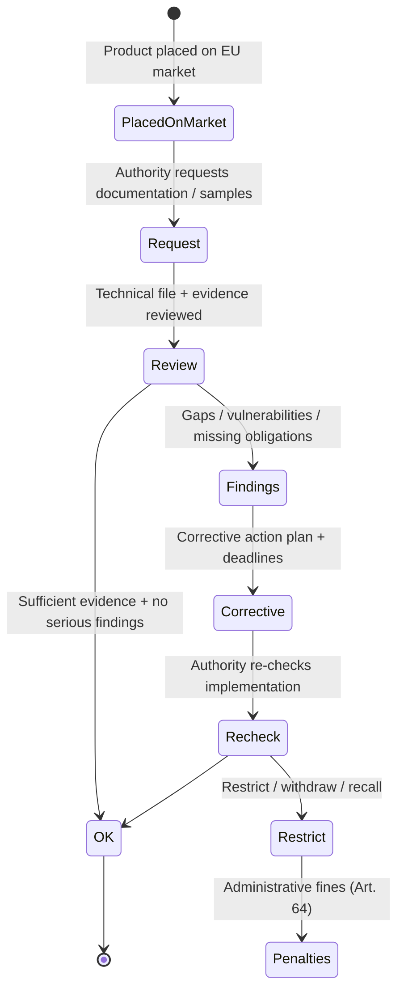
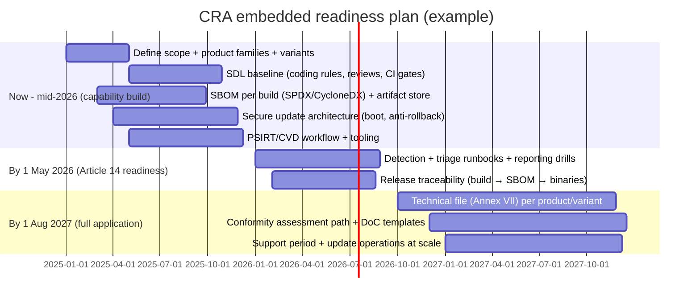

---
id: cra-timelines
slug: /security/cra/timelines-and-enforcement
title: Timelines, Enforcement, and Penalties
sidebar_position: 9
---

## Why timelines matter (especially for embedded)

The CRA is a **CE-marking regulation**: once it applies, you cannot “patch compliance” later. For embedded products with long lifetimes (MCUs in the field for 10+ years), the hard part is usually not the crypto primitive - it’s planning **support period**, **update logistics**, **evidence retention**, and **incident/vulnerability reporting** across product variants.

---

## Key CRA dates you should plan against

Regulation (EU) 2024/2847 (CRA) was published in the Official Journal on **12 July 2024**. It enters into force on **1 August 2024** (20 days after publication). Article 71 staggers application dates:

- **+12 months (1 Aug 2025):** Chapter IV (designation of notified bodies)
- **+21 months (1 May 2026):** Article 14 (vulnerability/incident reporting timelines)
- **+36 months (1 Aug 2027):** Main CRA obligations apply (Annex I essential requirements, documentation, updates, CE/DoC, market surveillance, etc.)

Do not mix **entry into force** with **application**: obligations become enforceable only when they apply.

| Date (application) | What starts applying | What it means in practice (embedded view) |
|---|---|---|
| **1 Aug 2025** | **Chapter IV** (notification of conformity assessment bodies) | Notified bodies can be designated early so industry can prepare assessments before full application. |
| **1 May 2026** | **Article 14** (reporting timelines) | You must be ready to report certain actively exploited vulnerabilities / incidents with strict timelines. This is a *process capability* milestone. |
| **1 Aug 2027** | **CRA applies (most provisions)** | Full CRA obligations become applicable, including Annex I essential requirements, technical documentation, vulnerability handling, updates, CE/DoC duties, and market surveillance powers. |

**Engineering implication:** if you wait until late 2027 to build your processes, you’ll miss the point - the CRA expects **repeatable evidence**, not a one-time scramble.

---

## What “existing products” means for long-lived devices

For embedded vendors, a typical trap is assuming “we shipped that model years ago, so it’s not impacted.”

In CE terminology, what matters is **when you place a product on the market** (first supply for distribution/use in the EU). If you keep shipping the *same model* after CRA applies, you will need a compliant release + technical file **for the version you place on the market at that time**.

Practical embedded cases to plan for:

- **Same hardware, new firmware:** treat it as a new release that must remain within the CRA evidence envelope (SBOM/VEX, tests, update path, declared support period).
- **Hardware respin (new MCU/SoC revision):** re-check risk analysis, security properties (debug lock, TRNG, secure storage), and Annex III classification impact.
- **Product families / SKUs:** ensure you can generate evidence **per variant** (different radios, crypto accelerators, memory sizes, boot chains).

---

## Reporting timelines you must be able to meet (Article 14)

Once **Article 14** applies (**1 May 2026**), you need operational readiness to detect, triage, and report. The CRA sets time windows like:

- **Early warning** within **24 hours** after becoming aware of an *actively exploited vulnerability* or incident, followed by
- a **notification** within **72 hours**, and
- a **final report** within **1 month** (with follow-ups if needed).

**Embedded reality check:** to hit these timelines, you need logging/telemetry (even minimal), a PSIRT workflow, and the ability to map a report to impacted firmware builds fast (SBOM + release traceability).

---

## Market surveillance and enforcement: what happens when authorities check you

When CRA applies, national market surveillance authorities can:

- request your **technical documentation**,
- test products,
- require **corrective actions** (fix, restrict, withdraw/recall),
- and apply penalties for non-compliance.

A useful mental model for embedded teams:

**What tends to fail in embedded products:**
- update path is not secure or not documented,
- lack of SBOM for firmware + toolchain components,
- no credible vulnerability handling / CVD process,
- weak defaults (open debug, default passwords, exposed services),
- “paper security”: claims without test evidence.

---

## Penalties (Article 64): the numbers you should know

The CRA defines maximum administrative fine tiers in **Article 64**. For planning, treat these as *board-level risk* and *program-level priority drivers*:

| Non-compliance category (simplified) | Maximum administrative fines (upper bound) |
|---|---|
| Breach of **essential requirements** (Annex I) and certain core obligations (incl. reporting) | up to **€15,000,000** or **2.5%** of total worldwide annual turnover (whichever is higher) |
| Breach of various **economic-operator duties** (e.g., documentation, cooperation, some supply-chain obligations) | up to **€10,000,000** or **2%** of turnover |
| **Incorrect, incomplete or misleading information** to authorities | up to **€5,000,000** or **1%** of turnover |

Special notes that matter in practice:
- The CRA includes **adjustments for micro and small enterprises** on certain reporting timelines (Article 64).
- **Open-source software stewards** have a much lower maximum fine cap (Article 64).

---

## A practical embedded roadmap aligned to CRA dates

This is a realistic plan that matches how embedded products actually ship (boards, firmware branches, long support):

---

## Phased compliance (PT1, PT2, PT3) and standards strategy

Many teams structure CRA readiness in three phases:

- **PT1 (baseline readiness):** map scope and risk classification (Annex III), define support period, update policy, SBOM/VEX generation, PSIRT workflow, initial technical file outline. Use this phase to align with **horizontal standards** (general cyber requirements) even before they are harmonized.
- **PT2 (implementation and evidence):** implement controls and testing that align with emerging **harmonized standards** once cited in the OJ. If no harmonized standards are yet available, follow candidate EN/ISO/IEC drafts and recognized **horizontal standards** (e.g., 62443-4-2, 81001-5-1, ETSI EN 303 645) and map them to Annex I. For sector-specific products, apply **vertical standards** relevant to your domain (e.g., automotive, medical, industrial).
- **PT3 (assessment and market placement):** finalize the technical file (Annex VII), run the chosen conformity assessment path (self-assessment vs third-party depending on criticality), prepare the DoC and CE marking, and ensure surveillance/update operations are set for the declared support period.

Key reminders:

- Harmonized standards provide a presumption of conformity but may lag. Start with horizontal standards and update your mappings when harmonized texts are published.
- Vertical standards must be applied when the product falls in that domain; document the rationale and evidence per product/variant.
- Keep your mappings in the technical file: Annex I requirement -> control -> test/evidence -> standard applied (harmonized/horizontal/vertical).

---

## Typical problems teams hit in this section

Use this list as a self-check before you leave “timelines & enforcement” and move to implementation.

1. **Confusing entry-into-force vs application.**  
   You plan from the wrong date and miss the earlier process milestones (Aug 2025 / May 2026).

2. **No clear “placing on the market” model for firmware.**  
   You can’t answer: *which firmware build is tied to the CE technical file for this shipment batch?*

3. **Undefined support period for embedded devices.**  
   Sales promises 5-10 years, engineering plans 18 months. CRA forces this to be explicit and evidenced.

4. **Offline or intermittent connectivity.**  
   You still need a credible update mechanism: signed updates, integrity checks, recovery path, and user guidance on how updates are applied.

5. **Variant explosion.**  
   Different MCUs, radios, memory sizes, boot flows - you need evidence per variant, not “one PDF for everything.”

6. **Reporting readiness is underestimated.**  
   24h/72h windows are not compatible with “we’ll look at it next sprint.” You need on-call PSIRT capability and clear thresholds.

7. **Supplier evidence gaps.**  
   ODM/OEM/SDK suppliers don’t provide SBOMs, test evidence, or vulnerability status - you can’t close your own obligations.

---

## References

[1]: Regulation (EU) 2024/2847 (Cyber Resilience Act), Article 71 (application dates) and Article 14 (reporting timelines): https://eur-lex.europa.eu/eli/reg/2024/2847/oj  

[2]: Regulation (EU) 2024/2847, Article 64 (administrative fines): https://eur-lex.europa.eu/eli/reg/2024/2847/oj

