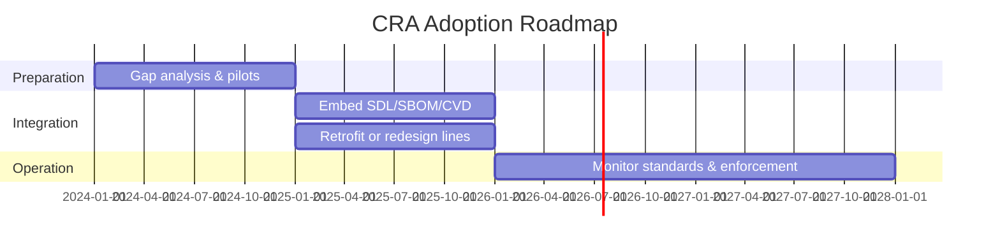

## Rollout timeline (high level)

The CRA enters into force and then applies after a **transition period** (24 months for most provisions, 36 months for vulnerability reporting).[1] Manufacturers get time to adapt, but existing products will need to be addressed as new firmware or hardware revisions are placed on the market.   

Use this time to:

- set up your SDL,  
- define your documentation and SBOM strategy,  
- and audit existing product lines.

---

## Existing vs new products

Key points for embedded vendors:   

- New designs should be made **CRA-ready** from day one.  
- For existing products with long lifetimes, plan whether you will:  
  - retrofit CRA controls (secure boot, updates, SBOM, CVD), or  
  - phase out models that cannot reasonably be hardened.

---

## Market surveillance and enforcement

National authorities and notified bodies can, under Articles 43–49:

- request your technical documentation,  
- test products for basic security issues,  
- order corrective actions or withdrawals.   

Fines can be significant, especially for ignoring vulnerability handling or failing to provide security updates during the declared support period (Articles 53–68).[1]

---

## Recommended phased adoption

A practical roadmap:

1. **Year 0–1** – Gap analysis and pilot project.  
   - Map current practices to CRA controls.  
   - Choose baseline standards (IEC 62443-4-1/-4-2, ETSI EN 303 645) — see [References](./references).  

2. **Year 1–2** – Integrate into product lines.  
   - Embed SDL, SBOM and CVD into CI/CD.  
   - Update provisioning and update pipelines.

3. **Ongoing** – Monitor standardisation and guidance.  
   - Track CRA harmonised standards via STAN4CRA.   

This phased approach matches how regulators expect manufacturers to mature their security posture and aligns with Commission implementation guidance.[2]

[1]: https://eur-lex.europa.eu/legal-content/EN/TXT/?uri=CELEX:32024R2847 "Regulation (EU) 2024/2847 — Articles 71–72 and 43–68"
[2]: https://digital-strategy.ec.europa.eu/en/policies/cra-summary "CRA summary — European Commission"
