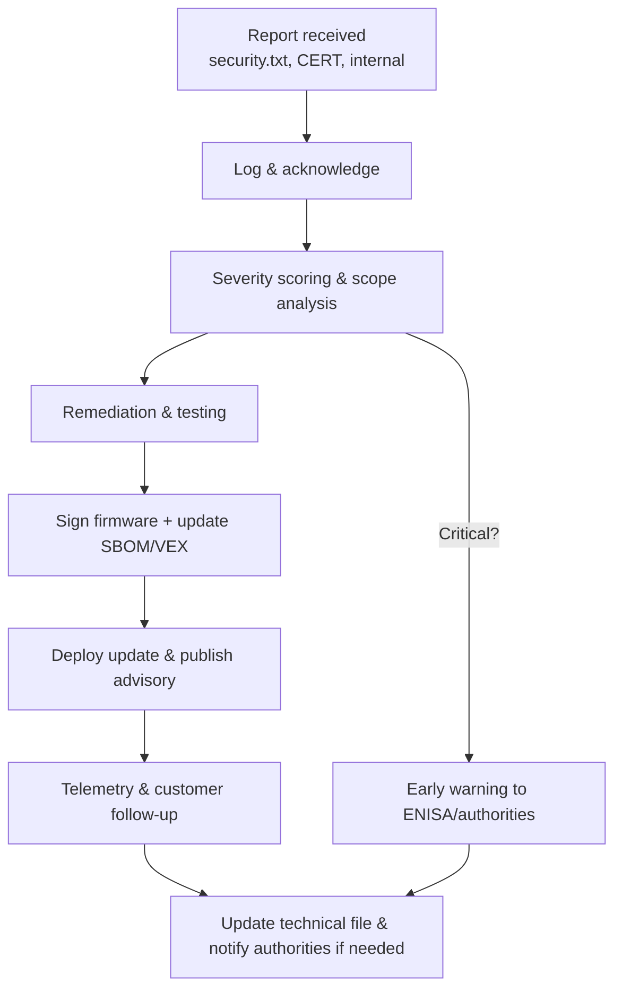

## Why vulnerability handling is a first-class CRA obligation

Annex I, Part II and Articles 53–57 add explicit duties for:

- receiving vulnerability reports,  
- triaging and fixing them,  
- providing security updates, and  
- reporting certain incidents to authorities.   

This is not optional; it’s part of the product’s lifecycle.

---

## Coordinated Vulnerability Disclosure (CVD) policy

Follow ISO/IEC 29147 and 30111:   

- Publish a **security.txt** or security page with:  
  - contact address,  
  - encryption key,  
  - expected response timelines,  
  - scope of testing and legal safe harbour statement.  
- Internally define:  
  - who receives reports,  
  - how they are logged (ticket system),  
  - how initial acknowledgement and status updates are handled.

This policy should be referenced in your technical documentation pack and linked from user information as Annex II requires.

---

## Intake, triage and remediation

A simple embedded-focused workflow:

1. **Intake**  
   - log each report with reporter details, affected versions, and PoC if provided;  
   - quickly evaluate severity (CVSS, exploitability).  

2. **Triage**  
   - reproduce the issue on representative hardware,  
   - identify all affected product variants using **SBOMs** and configuration data.   

3. **Remediation**  
   - fix the root cause; add tests to avoid regressions;  
   - prepare an updated firmware with signed images and updated SBOM/VEX;  
   - document the change in release notes and security advisory.

4. **Deployment and follow-up**  
   - roll out updates via your secure update pipeline;  
   - monitor for crashes/telemetry that might indicate incomplete fixes.

---

## Reporting obligations

For certain incidents, especially those with significant impact on security or safety, CRA requires **early warning and incident reporting** to competent authorities (through ENISA’s platforms).[1]   

Make sure:

- you can **detect** such incidents (logging/monitoring),  
- you know who in your organisation is responsible for filing reports,  
- and your technical documentation contains enough detail to explain impact and mitigations.

---

## Using VEX to communicate exploitability

When a CVE appears in one of your dependencies:

- Use VEX documents to state whether the vulnerability is:  
  - affected / not affected / under investigation / fixed.  
- Link VEX entries to SBOM components and product versions.   

This shows regulators and customers that you are systematically managing known vulnerabilities, as required by CRA Annex I(2) and Articles 55–57.[1]

[1]: https://eur-lex.europa.eu/legal-content/EN/TXT/?uri=CELEX:32024R2847 "Regulation (EU) 2024/2847 — Annex I Part II and Articles 53–57"
