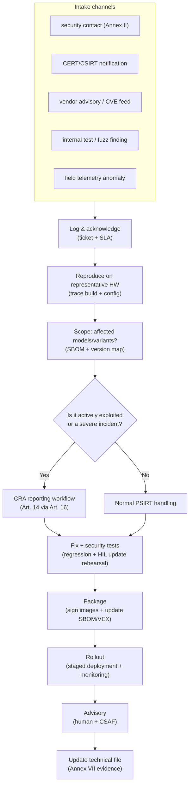
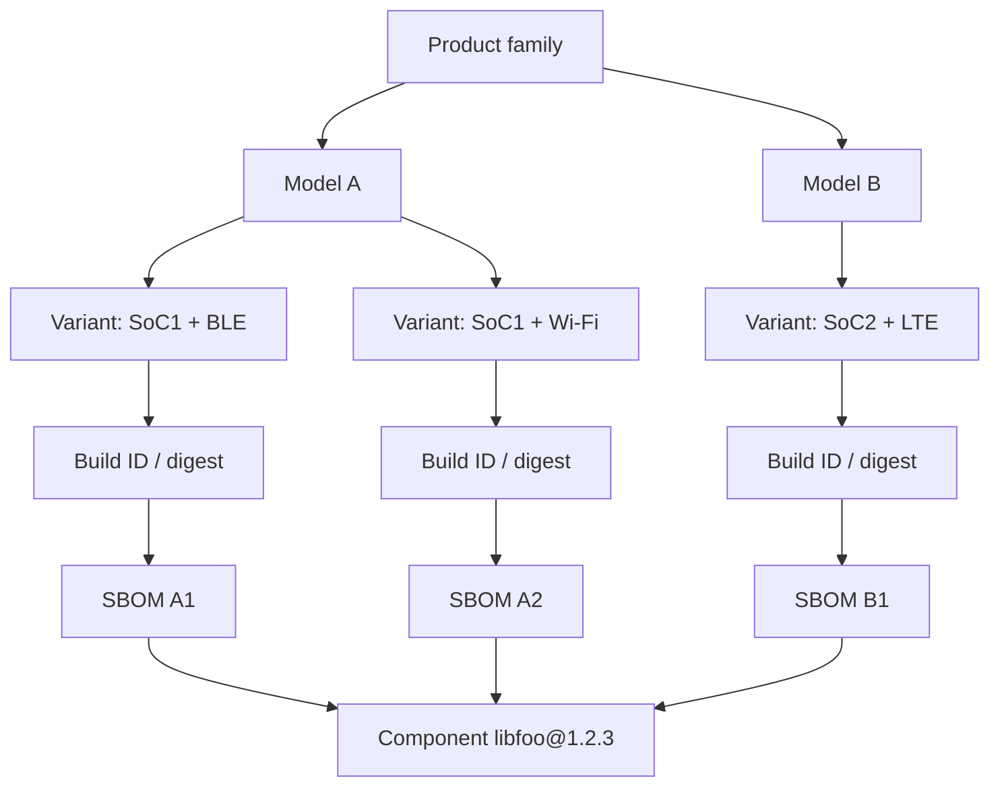

---
id: cra-vuln-handling
slug: /security/cra/vulnerability-handling
title: Vulnerability Handling and Reporting
sidebar_position: 7
---

## Why vulnerability handling is a first-class CRA obligation

Under the Cyber Resilience Act (CRA), security is not “ship it and forget it”. For **products with digital elements (PDEs)**, manufacturers must:

- handle vulnerabilities effectively **throughout the support period** (Art. 13(8)),
- implement the **vulnerability-handling requirements** in **Annex I, Part II**,
- maintain the required **technical documentation** (Annex VII),
- provide **user-facing information** and a reporting contact point (Annex II),
- and **notify** specific events via the **single reporting platform** (Art. 14-16).

For embedded products, this means your PSIRT process, SBOM/VEX, update pipeline, and incident telemetry are *compliance controls*, not “nice-to-have”.

---

## Definitions you must get right (CRA Article 3)

These terms drive your reporting triggers and evidence:

- **Vulnerability**: a weakness that can be exploited by a cyber threat.
- **Exploitable vulnerability**: can be effectively used under practical operational conditions.
- **Actively exploited vulnerability**: reliable evidence shows a malicious actor exploited it in a system without permission of the system owner.
- **Incident having an impact on the security of the PDE**: negatively affects (or is capable of affecting) the PDE’s ability to protect **availability, authenticity, integrity, or confidentiality** of data/functions.
- **SBOM (software bill of materials)**: formal record with details and supply chain relationships of components included in the software elements.

**Why this matters for embedded:** your triage must distinguish “a CVE exists in a dependency” from “we are affected” and from “it is actively exploited in the field”. Those are different obligations, different timelines, and different external communications.

---

## Annex I Part II as an engineering checklist (embedded view)

Annex I Part II is effectively the minimum PSIRT + update system specification. You should map each item to concrete mechanisms and artefacts:

### 1) Identify and document vulnerabilities + components (SBOM)

**Requirement (Annex I Part II(1))**  
Maintain an SBOM in a **commonly used, machine-readable format**, covering at least **top-level dependencies**.

**Embedded implementation notes**
- Generate SBOM **per build** and **per variant** (SoC, radio stack, feature flags, bootloader, crypto backend).
- Treat your **toolchain** and build-time generators as “security-relevant components” (they can introduce vulnerabilities).
- Ensure SBOM correlates to a **firmware identity** (build ID + signing key ID + image digest).

**Outputs**
- `sbom.cdx.json` or `sbom.spdx.json` attached to build artefacts
- component/version mapping table (variant → SBOM)

### 2) Remediate without delay (security updates, separate where feasible)

**Requirement (Annex I Part II(2))**  
Address and remediate vulnerabilities **without delay**, including by providing **security updates**; where technically feasible, provide security updates **separately** from feature updates.

**Embedded implementation notes**
- Maintain a **security-fix-only branch** strategy for safety/industrial customers who cannot accept feature deltas.
- Keep compatibility rules explicit (bootloader ↔ application image formats; radio firmware constraints).
- Define downgrade/rollback policy (anti-rollback fuses, version monotonicity) and match it to recovery strategy.

**Outputs**
- security patch release procedure
- update compatibility matrix + rollback rules

### 3) Regular tests and security reviews

**Requirement (Annex I Part II(3))**  
Apply effective and regular **tests and reviews** of the PDE’s security.

**Embedded implementation notes**
- Combine host-based fuzzing (protocol parsers, file/packet decoders) with **HIL regression** on representative boards.
- Make security test results traceable to a build and to a vulnerability ticket.

**Outputs**
- fuzzing reports + corpus archive
- HIL update rehearsal logs (power loss, brownout, rollback attempts)

### 4) Publish information about fixed vulnerabilities (with safe delay option)

**Requirement (Annex I Part II(4))**  
Once a security update is available, disclose fixed vulnerabilities with:
- description,
- affected product identification,
- impacts and severity,
- and clear remediation info.

You may delay publication *only* when security risks of immediate publication outweigh security benefits, and users have been given the possibility to apply the patch.

**Embedded implementation notes**
- Publish advisories in **CSAF** (machine-readable) when your customer base is industrial/enterprise.
- Your “affected product identification” must map to something the field can read (model + HW rev + firmware version + build ID).

**Outputs**
- advisory (human + CSAF)
- “affected versions” list derived from SBOM/variant mapping

### 5) Coordinated Vulnerability Disclosure (CVD) policy

**Requirement (Annex I Part II(5))**  
Put in place and enforce a **CVD policy**.

**Embedded implementation notes**
- Document a safe-harbour statement and testing boundaries (e.g., no physical tamper, no attacks on third-party networks).
- Define acknowledgement and status-update timelines (avoid “black hole” inboxes).

**Outputs**
- `security.md` + published policy page
- internal PSIRT SOP (roles, triage, disclosure gates)

### 6) Facilitate reporting (contact address)

**Requirement (Annex I Part II(6))** + **Annex II(2)**  
Provide a single point of contact where vulnerabilities can be reported and where the CVD policy can be found.

**Embedded implementation notes**
- Ensure the contact is reachable for the full support period.
- Provide encryption options (PGP) and authenticated channels for sensitive reports.

**Outputs**
- contact address + public key
- link included in user documentation

### 7) Secure distribution of updates (automatic where applicable)

**Requirement (Annex I Part II(7))**  
Provide mechanisms to **securely distribute updates**, and where applicable for security updates, in an **automatic manner**.

**Embedded implementation notes**
- Secure update = authentication + integrity + anti-rollback + safe install + recovery path.
- For constrained devices, “automatic” can still mean “device checks + notifies + installs on maintenance window”, but the mechanism must be reliable and secure.

**Outputs**
- update threat model
- update metadata specification (manifest, signatures, version constraints)

### 8) Disseminate security updates without delay, free of charge (default)

**Requirement (Annex I Part II(8))**  
Security updates must be disseminated **without delay** and, unless otherwise agreed with a business user for a tailor-made PDE, **free of charge**, with advisory messages.

**Embedded implementation notes**
- Your release tooling must support “urgent security” channels (fast-track signing + staged rollout).
- Advisory messages should include operational constraints (downtime, reboot, storage requirement).

**Outputs**
- security update release notes template
- rollout plan + monitoring dashboard snapshot

---

## Embedded PSIRT operating model (what auditors look for)

A credible embedded PSIRT has **clear ownership**, **repeatable artefacts**, and **traceability** from report → fix → shipped update → disclosure → evidence update.

---

## Variant-aware scoping (the embedded trap)

In embedded, the same “product” can exist in dozens of combinations:
- multiple SoCs,
- regional radio firmware,
- optional features compiled in/out,
- different bootloaders,
- different cloud endpoints.

If you can’t map “CVE-XXXX in libfoo” to “these shipped binaries”, you won’t be able to:
- prove due diligence (Annex I Part II(1)),
- scope impact quickly,
- produce accurate advisories (Annex I Part II(4)),
- or notify authorities with credible information (Art. 14).

A practical approach is to maintain a **Product Coverage Graph**:

**Rule of thumb:** if you can answer “which binaries are affected?” within hours, your system is mature enough for CRA-grade reporting pressure.

---

## Reporting obligations (CRA Article 14) - triggers and timelines

### What events trigger mandatory reporting?

**1) Actively exploited vulnerability** in your PDE (Art. 14(1)).  
**2) Severe incident having an impact** on the security of your PDE (Art. 14(3)-(5)).

Both are notified **simultaneously** to:
- the **CSIRT designated as coordinator**, and
- **ENISA**,
via the **single reporting platform** (Art. 16).

### Mandatory timeline (embedded-friendly interpretation)

For an **actively exploited vulnerability**:
- **≤ 24h**: early warning (Art. 14(2)(a))
- **≤ 72h**: vulnerability notification with general info + mitigations (Art. 14(2)(b))
- **≤ 14 days after a corrective/mitigating measure is available**: final report (Art. 14(2)(c))

For a **severe incident**:
- **≤ 24h**: early warning (Art. 14(4)(a))
- **≤ 72h**: incident notification with initial assessment + mitigations (Art. 14(4)(b))
- **≤ 1 month after the incident notification**: final report (Art. 14(4)(c))

**Operational implication:** you need a “reporting-ready” minimum dataset *before* full root-cause analysis is complete.

### Minimum dataset to keep ready (so you can hit 24h/72h)

- PDE identification: model, firmware versions, build IDs, distribution footprint (Member States where known)
- detection date/time + evidence of active exploitation (or incident indicators)
- initial severity and likely impact (CIA + safety impact where relevant)
- mitigations available now (config guidance, disable interface, firewall rules, key rotation)
- status of a fix (in progress / available / staged rollout)

---

## Informing users (CRA Article 14(8)) - don’t forget this step

When you become aware of an **actively exploited vulnerability** or a **severe incident**, you must inform impacted users (and where appropriate, all users) and provide mitigation/corrective measures. Where appropriate, this should be in a **structured, machine-readable format** that is easily automatically processable.

In practice for embedded, this means:
- customer advisory + release notes,
- machine-readable advisory (CSAF) for enterprise fleets,
- and (if available) device/app notifications that the field will actually see.

---

## Supply-chain coordination (ODM/OEM + upstream + distributors)

CRA expects vulnerability handling to work across the supply chain:

- **Upstream reporting**: if you identify a vulnerability in an integrated component (including open source), you must report it to the entity maintaining that component and remediate it; if you created a fix, share relevant code/docs where appropriate (Art. 13(6)).
- **Distributors** must inform the manufacturer without undue delay when they become aware of a vulnerability (Art. 20).
- **Open-source software stewards** have documented vulnerability-handling policy duties; parts of Art. 14 can apply where they are involved in development (Art. 24).

**Embedded reality check:** define, contractually, who owns:
- CVE monitoring,
- emergency rebuilds + signing,
- hosted update endpoints,
- customer communications,
- and post-market telemetry.

If it’s not written, it will fail under pressure.

---

## What you must store in the technical file (Annex VII)

Your technical documentation must include a description of design/development/production **and vulnerability handling processes**, including:
- SBOM,
- CVD policy,
- evidence of a reporting contact address,
- and description of the technical solutions for secure update distribution.

Treat the technical file as a living system: every advisory, SBOM/VEX, and reporting event must be traceable and retrievable.

---

## Common problems teams hit in this section (and how to de-risk them)

1. **“What is our product boundary?”**  
   Does your PSIRT scope include only firmware, or also mobile apps, gateways, cloud APIs, and provisioning tools? Decide and document it, or your reporting will be inconsistent.

2. **Variant explosion**  
   Same “product” shipped with different radios/SoCs/compile flags. If you don’t track variant → build → SBOM, impact analysis becomes guesswork.

3. **No telemetry = no “awareness”**  
   Article 14 timelines start when you “become aware”. If you have no detection and no customer escalation path, you will learn too late and still be judged on timeliness.

4. **Offline / air-gapped deployments**  
   You still need a secure update mechanism and a dissemination plan. “USB update” is acceptable only if authenticity/integrity and operational controls are strong.

5. **Signing key operations aren’t ready for emergencies**  
   If signing requires a single person and a laptop, you won’t meet 24h/72h needs. Use controlled, audited signing (HSM or equivalent process).

6. **“Security update” mixed with feature updates**  
   Customers may refuse feature changes. Maintain a path to deliver security-only updates where technically feasible (Annex I Part II(2)).

7. **Public disclosure without a product identifier strategy**  
   Advisories must let users identify affected products. If the field can’t map “affected versions” to what they run, disclosure is not useful.

8. **Supplier/OEM handover gaps**  
   Who publishes the advisory? Who pushes the update? Who answers researchers? Without a RACI, the manufacturer will still be accountable.

9. **Confusion around “actively exploited” vs “exploitable”**  
   “Exploitable” is not automatically “actively exploited”. Your evidence threshold and decision log must be explicit.

10. **Support period mismatch**  
   Support period must reflect expected use time and is at least five years unless expected use is shorter (Art. 13(8)). If you can’t patch for that long, redesign your architecture or your business model.

---

## References

[1]: Regulation (EU) 2024/2847 (Cyber Resilience Act), Official Journal text (ELI): http://data.europa.eu/eli/reg/2024/2847/oj

[2]: Regulation (EU) 2024/2847 - Definitions (Article 3), manufacturer obligations (Article 13), reporting (Articles 14-17), user info (Annex II), vulnerability handling requirements (Annex I Part II), technical documentation (Annex VII): https://eur-lex.europa.eu/legal-content/EN/TXT/?uri=CELEX:32024R2847

