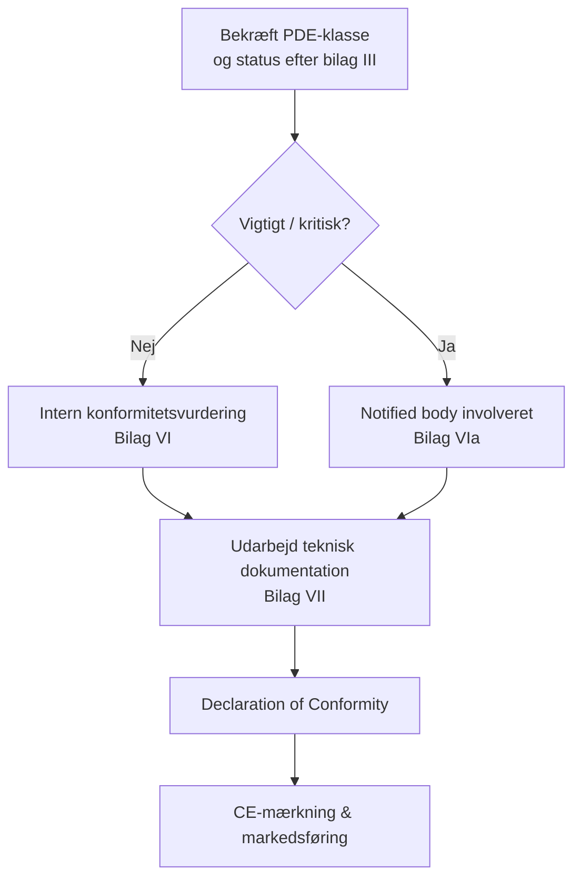

## CRA og CE‑økosystemet

CRA er en **CE‑mærkningsforordning**, beslægtet med RED eller EMC: du skal vise, at produktet opfylder sine væsentlige krav, før det bringes i omsætning.[1]  

For mange indlejrede PDE’er er vejen **selv‑evaluering**; for vigtige/kritiske produkter skal en **notified body** involveres efter bilag VI/VIa.[1]

