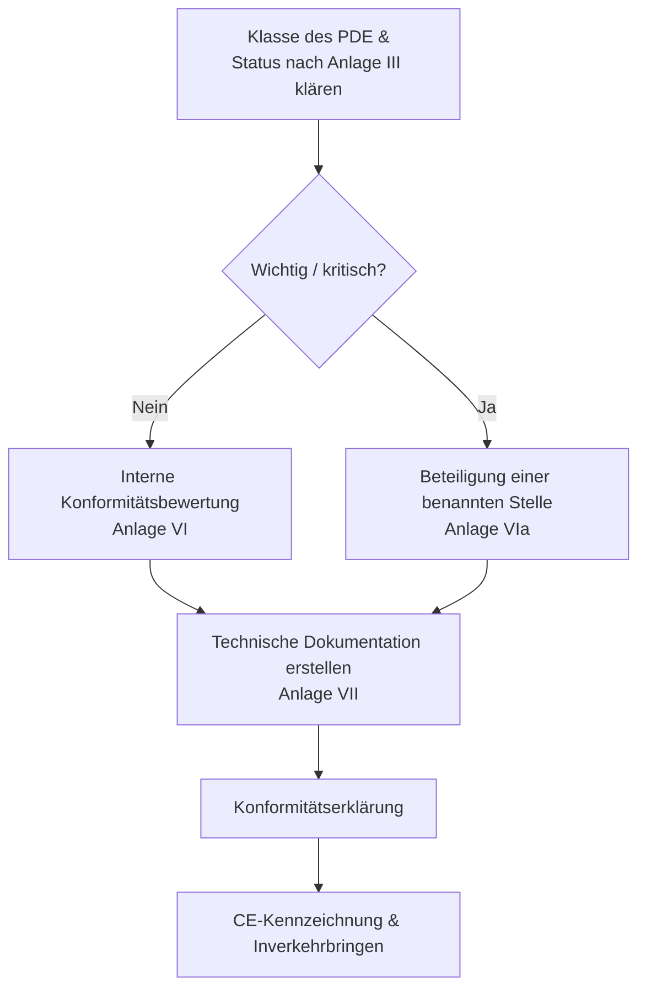

## CRA und das CE‑Ökosystem

Der CRA ist eine **CE‑Kennzeichnungs‑Verordnung**, ähnlich wie RED oder EMV: Sie müssen nachweisen, dass Ihr Produkt die wesentlichen Anforderungen erfüllt, bevor es in Verkehr gebracht wird.[1]  

Für viele eingebettete PDEs wird dies ein Weg der **Selbstbewertung** sein; bei wichtigen/kritischen Produkten ist ein **benannter Stelle** nach den Anlagen VI/VIa einzubinden.[1]

---

## Erforderliche Nachweise

Kern der Konformitätsbewertung sind Ihre **technische Dokumentation** und die **Prozessnachweise**, die durch SDL, SBOM und Schwachstellenmanagement entstehen.[1]  

Beispiele:

- Architekturschemata und Bedrohungsmodelle,  
- Mapping der Kontrollen auf die Anforderungen der Anlage I,  
- Testberichte und zusammengefasste Penetrationstests,  
- Beschreibungen von Provisioning‑ und Update‑Prozessen,  
- SBOMs plus VEX oder vergleichbare Formate für Vulnerability‑Statements,  
- CVD‑Richtlinie und Aufzeichnungen zu Vorfällen/Schwachstellen.

---

## Rolle von Normen

Solange CRA‑Normen noch nicht als harmonisierte Normen im Amtsblatt veröffentlicht sind, können Sie sich auf „state‑of‑the‑art“‑Normen stützen, die von der Kommission referenziert werden, um Konformität zu belegen (Art. 25).  

Typische Beispiele:

- **IEC 62443‑4‑1 / 4‑2** für industrielle/embedded Sicherheit,  
- **ETSI EN 303 645** für Consumer‑IoT,  
- **NIST SSDF** für Secure Development Lifecycles.

Die Anwendung anerkannter Normen verschafft Ihnen eine **Vermutung der Konformität** für die entsprechenden Kontrollen und erleichtert die Bewertung durch benannte Stellen.

---

## Konformitätserklärung (DoC)

Die DoC ist ein kurzes, vom Hersteller unterzeichnetes Dokument, das:

- Produkt und Versionen identifiziert,  
- die anwendbare Gesetzgebung aufführt (CRA, RED, EMV, Niederspannung usw.),  
- die Normen und internen Dokumente nennt, die zur Konformitätsdemonstration verwendet werden,  
- die verantwortliche Person in der EU benennt.  

Halten Sie die DoC synchron mit der technischen Dokumentation und aktualisieren Sie sie bei wesentlichen Firmware‑/Funktionsänderungen, damit die Pflichten nach Art. 22 erfüllt bleiben.

---

## Checkliste zur Vorbereitung

Vor der Behauptung der Konformität sollten Sie prüfen:

- [ ] Scope und Klassifizierung bestätigt (PDE, wichtig/kritisch). Siehe [Scope & Definitionen](./scope-and-definitions).  
- [ ] SDL für das aktuelle Release definiert und eingehalten. Siehe [SDL](./secure-development-lifecycle).  
- [ ] Technische Embedded‑Kontrollen auf die Anforderungen der Anlage I abgebildet. Siehe [Embedded Technical Controls](./embedded-technical-controls).  
- [ ] Technische Dokumentation und SBOM‑Paket vollständig. Siehe [Documentation & SBOM](./documentation-and-sbom).  
- [ ] Schwachstellenmanagement‑Prozess in Betrieb; Supportzeitraum definiert. Siehe [Vulnerability Handling](./vulnerability-handling).  

Diese Checkliste ist direkt mit der **Developer Checklist** verknüpft, die von den Engineering‑Teams genutzt wird (siehe [Developer Checklist](./developer-checklist)).

[1]: https://eur-lex.europa.eu/legal-content/EN/TXT/?uri=CELEX:32024R2847 "Regulation (EU) 2024/2847 — Articles 16-25 and Annexes VI/VII"

