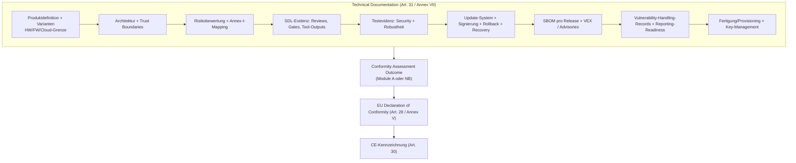

---
id: cra-conformity-assessment
slug: /security/cra/conformity-assessment
title: Konformitätsbewertung und CE-Kennzeichnung
sidebar_position: 8

last_update:
  author: 'Ayoub Bourjilat (AC6)'
  date: '2025-12-19'
---

## Warum es für Embedded zählt

CRA ist eine **CE-Marking-Verordnung**: Vor dem Inverkehrbringen eines PDE müssen Sie die Erfüllung der Essential Requirements (Anhang I) nachweisen und die Evidenz im **Technical File** bereithalten (Art. 31 + Anhang VII). Conformity umfasst auch die **Herstellerprozesse** (Art. 31, Art. 32) – SDL, SBOM, Vulnerability Handling sind Teil des Compliance-Objekts.

---

## 1) Route bestimmen (normal / important / critical)

Abhängig von: **Normal** (nicht Annex III/IV), **Important** (Anhang III Klasse I/II), **Critical** (Anhang IV).

**Art. 32** + **Anhang VIII Module**:
- **Module A**: interne Kontrolle (Self-Assessment)
- **Module B + C**: EU-Typprüfung + Konformität mit Typ (NB)
- **Module H**: Full Quality Assurance (NB)
- **EU-Cybersecurity-Zertifizierung** (falls anwendbar) mit Assurance ≥ „substantial“ (Art. 27(8)-(9), Art. 32)

```mermaid
flowchart TD
  A[Start: PDE] --> B{Annex IV?}
  B -- Yes --> C[CRITICAL]
  C --> C1{Zertifizierungsschema verfügbar?}
  C1 -- Yes --> C2["Nutze Cybersecurity-Schema<br/>(Art. 32(4)(a) + Art. 8(1))"]
  C1 -- No --> C3["Nutze Art. 32(3) Verfahren<br/>(B+C oder H)"]

  B -- No --> D{Annex III?}
  D -- No --> E[NORMAL]
  E --> E1["Wähle: Module A / B+C / H / Zertifizierung<br/>(Art. 32(1))"]

  D -- Yes --> F{Klasse?}
  F -- Class I --> G[IMPORTANT Class I]
  G --> G1{Harmonisierte Standards / Common Specs / Zertifizierung (substantial+) angewandt?}
  G1 -- Yes --> G2["Art. 32(1) Wege möglich<br/>(inkl. Module A) für abgedeckte Anforderungen"]
  G1 -- No --> G3["Für offene Anforderungen: B+C oder H<br/>(Art. 32(2))"]

  F -- Class II --> H[IMPORTANT Class II]
  H --> H1["Muss: B+C oder H oder Zertifizierung (substantial+)<br/>(Art. 32(3))"]
```

**Takeaway:** Important Class I kann Module A nutzen, aber nur wenn relevante Anforderungen durch harmonisierte Standards/Common Specs/Zertifizierung abgedeckt sind; sonst NB (B+C/H) für offene Punkte.

---

## 2) Technical File ist das Rückgrat (Art. 31 + Anhang VII)

- Enthält alle relevanten Daten/Details zur Konformität von Produkt **und** Prozessen mit Anhang I. 
- Muss **vor** Markt erstellt und **laufend aktualisiert** werden (mind. Supportperiode).

Struktur für Embedded:



Auditoren fragen: exaktes Compliance-Objekt (HW-Revs, SoCs, FW-Versionen, Boot-Chain, Remote Services), Trust Boundaries, Update/Rollback, Key-Lifecycle, Evidenz pro Release (SBOM, Tests, Fixes, Notes, Annex-I-Mapping).

---

## 3) Presumption of Conformity (Art. 27)

Nur wenn: 
- **harmonisierte Standards** (OJ-Referenz), oder
- **Common Specs** (Kommission), oder
- **EU-Cybersecurity-Zertifikat** anerkannt (Art. 27(8)-(9)).

IEC/ETSI/NIST etc. sind gute „State of the Art“-Evidenz, aber keine automatische Presumption, bis harmonisiert/referenziert.

---

## 4) DoC (Art. 28 / Anhang V) + vereinfachte DoC (Anhang VI)

- Erklärt Erfüllung von Anhang I.
- Modellstruktur nach Anhang V; aktuell halten.
- DoC versioniert, verknüpft mit Firmware-IDs, SBOM-IDs, Testkampagnen, sicherheitsrelevanten Update-Endpunkten.
- Vereinfachte DoC nach Anhang VI inkl. Link zur vollständigen DoC.

---

## 5) CE-Kennzeichnung (Art. 30)

- Sichtbar/lesbar/unteilbar am Produkt, oder Verpackung + DoC, wenn nicht möglich.
- **Software-PDE**: CE-Kennzeichnung kann auf DoC oder Website.
- NB beteiligt (Module H)? → NB-ID an CE-Zeichen (Art. 30(4)).

---

## 6) „Substantial Modification“ und Herstellerrolle (Art. 21-22)

Importer/Distributor wird Manufacturer bei eigener Marke oder **wesentlicher Änderung** (Art. 21). Andere mit wesentlicher Änderung und Inverkehrbringen werden Manufacturer für den betroffenen Teil (Art. 22).

Embedded-Beispiele für „wesentlich“: Secure-Boot-Keys/Trust Anchors ändern, Security-Defaults abschalten, Krypto-Libs tauschen, Update-Mechanismus ändern, Debug in Produktion aktivieren, Security-Komponenten tauschen.

Interne Regel definieren: was als „substantial modification“ gilt und Compliance-Gate auslösen.

---

## 7) „CE-ready“ Checkliste (Embedded)

- [ ] Klassifizierung (Normal/Annex III/IV) mit Begründung
- [ ] Route gemäß Art. 32 gewählt (A vs B+C vs H vs Zertifizierung)
- [ ] Anhang-I-Mapping + Implementierungs-Evidenz
- [ ] Technical File (Art. 31 / Anhang VII) für Release aktualisiert
- [ ] DoC erstellt/aktualisiert (Art. 28 / Anhang V) und verknüpft mit Release-IDs
- [ ] CE-Kennzeichnung erfüllt (Art. 30), inkl. Software-Fall
- [ ] Supportperiode + User-Info verfügbar (Art. 13 + Anhang II)
- [ ] Supply-Chain-Evidenzpaket für Importer/Distributoren/OEMs

---

## Häufige Probleme (und Lösungen)

1) **Produkt = Gerät, Sicherheit hängt aber an Cloud/App** → Systemgrenze dokumentieren (was gehört zur PDE-Sicherheitsumgebung, welche Annahmen gelten).

2) **Annex III/IV unklar** → schriftlicher Cross-Check gegen Funktionen/Marketing.

3) **IEC/ETSI/NIST = Presumption?** → Nur wenn Art. 27 erfüllt. Sonst „State of the Art“ + Anhang-I-Mapping.

4) **Firmware-Updates ändern Verhalten – neue DoC?** → Policy definieren, welche Releases DoC-Refresh brauchen (Security-relevant, neue Interfaces/Krypto/Update-Flow) + Release-IDs tracken.

5) **Viele Varianten (SoC/Radio)** → Variantenmatrix: was unterscheidet sich, was ist identisch, welche Tests/Evidenz pro Variante.

6) **ODM/OEM integriert Modul – wer ist Hersteller?** → Vertraglich regeln, Evidenzpaket pro Release liefern; rechtliche Rolle folgt Art. 21-22.

---

## Referenzen

[1]: Regulation (EU) 2024/2847 (CRA) - Official Journal http://data.europa.eu/eli/reg/2024/2847/oj  
[2]: Regulation (EU) 2024/2847 - konsolidierter Text https://eur-lex.europa.eu/legal-content/EN/TXT/?uri=CELEX:32024R2847

