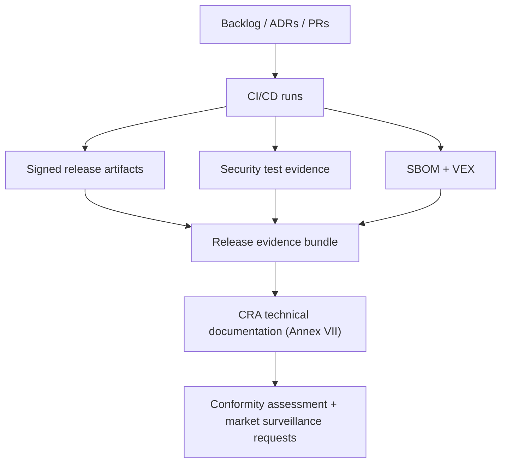
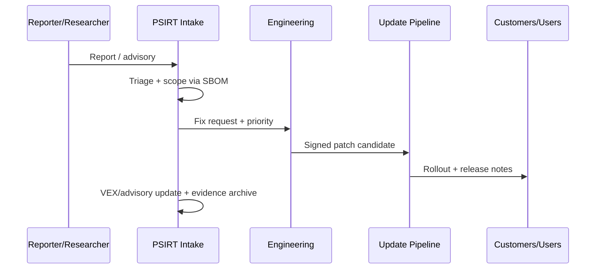

---
id: cra-developer-checklist
slug: /security/cra/developer-checklist
title: Entwickler-Checkliste und Vorlagen
sidebar_position: 10
---

## Was diese Checkliste ist (und nicht ist)

Release-taugliche Checkliste für Embedded-Produkte unter CRA. Sie übersetzt Pflichten in Engineering-Tasks und verlangt **Evidenz** (Tickets/PRs/CI/Testberichte/Artefakte/SBOM/VEX/Docs/ADRs/Datierte Entscheidungen).

Nicht Ersatz für Rechtsanalyse oder Wahl des Konformitätsweges; sie macht Pflichten für Firmware/Plattform/DevSecOps umsetzbar.

> **Evidenzregel:** „done“ nur, wenn auf mindestens einen Nachweis verlinkt.

---

## CRA-Anker (treibende Klauseln)

- **Design, Entwicklung, Produktion** gem. Anhang I Teil I.  
- **Cybersecurity Risk Assessment** dokumentiert, in Technischer Doku.  
- **Due Diligence** für Third-Party (inkl. OSS).  
- **Vulnerability Handling** während Supportperiode (Anhang I Teil II).  
- **Reporting** für *actively exploited vulnerabilities* und *severe incidents* (Zeitschienen).  
- **Technical Documentation** (Anhang VII) + **User Info** (Anhang II).

---

## Repo-Layout (Docusaurus + Evidenz)

```
repo-root/
  docs/
  security/
    cra/
      releases/
        2025.12.0/
          00-scope-classification.md
          01-risk-assessment.md
          02-threat-model.md
          03-architecture.md
          04-controls-mapping.md
          05-test-evidence.md
          06-sbom-vex/
          07-release-attestation.md
          08-user-info-annex-ii.md
      templates/
      adr/
  ci/
  firmware/
  bootloader/
```

---

## Evidenz-Pipeline



---

## Zuständigkeiten (RACI)

| Work item | R | A | C | I |
|---|---|---|---|---|
| Scope/Classification | Product Security | Regulatory/Compliance | Firmware lead, Product | Sales, Support |
| Risk Assessment | Product Security | Engineering Director | QA, Platform | PSIRT |
| Secure Boot/Identity/Debug Locking | Firmware lead | Engineering Director | HW lead, Manufacturing | Support |
| CI-Hardening + Signing | DevOps/Build lead | Engineering Director | Product Security | QA |
| SBOM/VEX | DevOps/Build lead | Product Security | Firmware lead | Compliance |
| Security Testing | QA/Security Test | QA lead | Firmware lead | Compliance |
| CVD + PSIRT | PSIRT lead | Product Security | Support, Legal | All |
| Reporting (Art. 14) | PSIRT lead | Legal/Compliance | Product Security | Exec |

---

## Release-Checkliste (pro Release)

### 0) Scope/Klassifikation/Produktgrenzen
- [ ] PDE-Scope bestätigt (incl. Remote Data Processing).
- [ ] Important/Critical nach Anhang III/IV geprüft (dokumentiert, auch wenn N/A).
- [ ] Variantenkarte fixiert (SoC, HW-Revs, Feature Flags, Protokollprofile).
- [ ] Zweck/Umgebung definiert (Consumer/Industrie, Konnektivitäts-/Zugangsannahmen).
- [ ] Supportperiode deklariert (min. Dauer, End-of-Support-Policy).

### 1) Cybersecurity Risk Assessment
- [ ] Existiert + aktualisiert für Release.
- [ ] Deckt ab: Zweck/foreseeable use, Nutzungsbedingungen, Assets, erwartete Nutzungszeit.
- [ ] Annex I Part I Mapping enthalten (Anwendbarkeit + Umsetzung/Begründung N/A).

### 2) Threat Model
- [ ] Kontextdiagramm aktualisiert (Device/Gateway/App/Cloud, Update, Fertigung).
- [ ] Trust Boundaries identifiziert.
- [ ] Angreifermodelle (remote, lokal mit physischem Zugriff, Supply Chain).
- [ ] Abuse/Misuse Cases (Update-Pfad, Debug/Service, Provisioning, Funk/Netzwerk).

### 3) Secure Boot, Identity, Provisioning
- [ ] Boot Chain dokumentiert (ROM → 1st → 2nd → App).
- [ ] Authentizität/Integrität je Stage durchgesetzt (Signatur + Hash-Policy).
- [ ] Anti-Rollback-Policy definiert + getestet.
- [ ] Device Identity definiert + RoT-geschützt.
- [ ] Provisioning gehärtet (Key-Handling, Duties, Audit-Logs).

### 4) Runtime-Isolation/Memory Safety
- [ ] Privilegseparation (MPU/MMU, Userspace, Secure Partitions) wo möglich.
- [ ] Memory-Safety-Kontrollen (Bounds Checks, sichere Parserregeln).
- [ ] Hardening-Flags aktiv (Stack Protector, FORTIFY/W^X/CFI wo unterstützt).
- [ ] Watchdog/Fault-Recovery implementiert + getestet.

### 5) Interface-Hardening
- [ ] Debug-Ports geschützt/gesperrt (oder authentifizierte Serviceprozedur).
- [ ] Netzwerkservices inventarisiert und minimiert.
- [ ] Management-Interfaces auth/authz, Rate Limits, Lockout, sichere Sessions.
- [ ] Secure-by-default-Konfiguration dokumentiert/verifiziert.

### 6) Kryptografie/Key Lifecycle
- [ ] Crypto-Profil deklariert und als „State of the Art“ begründet.
- [ ] Key-Lifecycle abgedeckt (Generierung, Speicherung, Nutzung, Rotation, Revocation, Kompromiss).
- [ ] Zertifikatsvalidierungsregeln definiert (Zeitquelle, Pinning, Erneuerung, Fehlverhalten).

### 7) Build, CI/CD, Release-Integrität
- [ ] Build Provenance erfasst (Commit, Toolchain, Config, Repro-Strategie oder Traceability).
- [ ] Signier-Keys geschützt (HSM/offline Ceremony/Secure Enclave), Zugriff geloggt.
- [ ] SBOM pro Build/Variante erzeugt und gespeichert.
- [ ] Dependency Governance aktiv (Allow/Deny, Vuln-Scan, Lizenz-Scan, Upgrade-Policy).

### 8) Security-Verifikation
- [ ] Security-Testplan existiert und ausgeführt.
- [ ] Negative Tests (Signaturfehler, korrupte Updates, ungültige Certs, malformed Packets, Auth-Bypass).
- [ ] Fuzzing (Parser/State Machines; Host + HIL wo möglich).
- [ ] Pen/Red-Team-Tests proportional zum Risiko (exponierte Services/Updatepfad).

### 9) Dokumentationspaket (Technical File + User Info)
- [ ] Technical File aktualisiert (Architektur, Risiko, Controls Mapping, Tests, Provisioning, Updates).
- [ ] User Security Info vorbereitet (Supportperiode, Update-Anleitung, sichere Konfig, Restrisiken).
- [ ] DoC-Inputs aktualisiert (Produkt-ID, genutzte Standards, NB-Info falls zutreffend).

### 10) Vulnerability Handling, Updates, Reporting
- [ ] CVD-Kontakt veröffentlicht (Security Page / security.txt), mit Key + Antwortzeiten.
- [ ] PSIRT-Workflow operativ (Intake, Triage, Fix, Advisory, Rollout, Postmortem).
- [ ] Update-Mechanismus End-to-End getestet (A/B/Swap, Power Loss, Rollback-Prävention, Recovery).
- [ ] Article-14-Playbook vorhanden + geübt (wer meldet, welche Daten, 24h/72h-Fristen).



---

## Templates

### A - Release-Evidence-Index (`07-release-attestation.md`)

```md
# CRA Release Evidence Index - <product> <version>

## Identification
- Product/SKU(s):
- HW revisions:
- Firmware image IDs (bootloader/app/radio):
- Build commit/tag:
- Release date:

## Scope & classification
- PDE scope decision (ADR):
- Annex III/IV check:

## Risk assessment
- Risk assessment doc:
- Changes since last release:

## Key controls
- Secure boot evidence:
- Debug locking evidence:
- Update mechanism evidence:
- Access control evidence:

## SBOM/VEX
- SBOM location(s):
- VEX location(s):
- Dependency scan report:

## Security testing
- CI run IDs:
- Fuzz report:
- Pen-test summary:

## User information (Annex II)
- Support period statement:
- Update instructions:
- Residual risks:

## Sign-off
- Firmware lead:
- Product security:
- QA:
- Date:
```

### B - ADR-Skeleton (`security/cra/adr/ADR-XXXX.md`)

```md
# ADR-XXXX: <Decision title>

## Context
- Product scope:
- Threats driving this decision:
- Constraints (MCU resources, power, cost, boot ROM, etc.):

## Decision
- What we decided:
- Why (risk-based rationale):

## Security properties
- Confidentiality:
- Integrity:
- Availability:
- Update/maintenance impact:

## Alternatives considered
- Option A:
- Option B:

## Consequences
- What changes in implementation:
- Testing required:
- Documentation updates required:

## Links
- Tickets/PRs:
- Threat model section:
- Controls mapping section:
```

### C - SBOM/VEX Mindestniveau

```md
# SBOM/VEX minimum bar (per release)

- SBOM format: SPDX or CycloneDX
- Granularity: per firmware image + per variant
- Must include: bootloader, RTOS/kernel, middleware, crypto, protocol stacks, build tools (when feasible)
- VEX must state: affected / not affected / under investigation / fixed
- Storage: alongside signed artifacts with immutable retention policy
```

---

## Häufige Probleme (und Lösungen)

1) **Scope undefiniert** → Device/Cloud/Updates nicht klar → Audit-Pain. 
2) **Varianten-Explosion** → Produkt ist 12 SKUs/5 Feature-Sets; Variant Map + SBOM/Tests pro Gruppe pflegen. 
3) **Supportperiode unklar** → End-of-Support nicht belegbar. 
4) **Updatepfad nicht testbar** → Stromausfall/Flash-Mangel/partielle Downloads nicht geprobt → HIL-Rehearsal als Gate. 
5) **Debug offen** → SWD/JTAG/Factory Shell im Feld erreichbar → Debug-Lock als Fertigungstest mit Log. 
6) **SBOM unvollständig** → Bootloader/Krypto/Toolchain fehlen → SBOM an Build-Pipeline binden. 
7) **Keine Reporting-Readiness** → Art. 14-Deadlines ohne On-Call/Template kaum haltbar → mindestens einen Dry Run. 
8) **Evidenz verstreut** → keine Release-Bundles → pro Release Evidence-Bundle zwingend.

---

## Referenzen

- CRA: http://data.europa.eu/eli/reg/2024/2847/oj
- NIST SP 800-218 (SSDF): https://csrc.nist.gov/pubs/sp/800/218/final
- ISO/IEC 29147: https://www.iso.org/standard/45170.html
- ISO/IEC 30111: https://www.iso.org/standard/69725.html
- SPDX: https://spdx.dev/specifications/
- CycloneDX: https://cyclonedx.org/specification/
