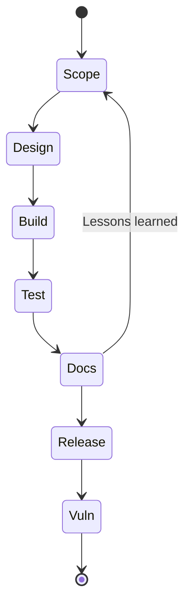

## Wie Sie diese Checkliste nutzen

Dies ist eine **lebende Checkliste**, die in Ihrem Repository liegen sollte (z. B. `doc/cra-checklist.md`). Sie verknüpft alltägliche Engineering‑Aufgaben mit den Evidenzen aus Anlage I, damit jede Version ohne Last‑Minute‑Aktionen Konformität nachweisen kann.[1]  

**Daumenregel:** Eine Checkbox ist nur dann „fertig“, wenn sie auf **Evidenz** verweist:

- Ticket‑/Issue‑ID(s),  
- MR/PR‑Links,  
- Build‑Artefakte / Logs,  
- Testberichte,  
- SBOM + VEX (oder Äquivalent),  
- aktualisierte Doku/Risikobewertungen/Threat Models.

Haken Sie Punkte pro Release ab und verlinken Sie sie mit Tickets, MR/PRs und Dokumenten.

---

## Projekt‑Setup

- [ ] Produkt als im Scope des CRA klassifiziert (PDE‑Klasse, wichtig/kritisch). Siehe [Scope & Definitionen](./scope-and-definitions).  
    + Evidenz: Klassifizierungs‑Notiz + Entscheidungsdokument (ADR), Liste der Produktvarianten.  
- [ ] Sicherheitsziele für das Produkt definiert (was geschützt werden muss und was „akzeptables Risiko“ bedeutet).  
    - Evidenz: Security‑Requirements‑Dokument mit Verknüpfung zu Issues/ADRs.  
- [ ] Threat Model für dieses Release erstellt oder aktualisiert (Assets, Trust Boundaries, Angreifermodelle, wichtige Abuse‑Cases).  
    - Evidenz: versioniertes Threat Model (Diagramme, Text, Risikoverweise).  

---

## Architektur und Design

- [ ] Strategie für Identität und Authentifizierung festgelegt (Device Identity, Secret Management, Rollen).  
    - Evidenz: API/CLI‑Spezifikation, Rollenmatrix, Dokumentation zur Schlüsselablage.  
- [ ] Secure‑Boot‑Kette definiert (Root of Trust, Image‑Format, Anti‑Rollback).  
    - Evidenz: Boot‑Diagramme, BootROM‑Parameter, Beschreibung der Rollback‑Policy.  
- [ ] Sichere Kommunikationskanäle spezifiziert (TLS, DTLS, VPN, proprietäre Tunnel).  
    - Evidenz: Kryptoprofil, Liste erlaubter Cipher Suites, Zertifikatsanforderungen.  
- [ ] Logging‑ und Telemetriestrategie definiert (Security‑Events, Quoten, Exportziele).  
    - Evidenz: Event‑Taxonomie, Log‑Schemas, Konfiguration der Ziele.  

---

## Implementierung und Abhängigkeits‑Hygiene

- [ ] Sichere Coding‑Standards angewendet (MISRA‑C, CERT C, Regeln für `unsafe`‑Code in Rust etc.).  
    - Evidenz: Tool‑Konfigurationen, Lint‑Berichte, Auszüge aus Review‑Checklisten.  
- [ ] Statische Analyse für kritische Module eingerichtet (Parser, Protokoll‑Stacks, Kryptonutzung).  
    - Evidenz: CI‑Jobs, Berichte pro Release.  
- [ ] Governance für Abhängigkeiten definiert (Allow/Deny‑Listen, Freigabe‑Prozess).  
    - Evidenz: Policy‑Dokument, Freigabe‑Tickets.  
- [ ] SBOM wird automatisiert aus den Manifests erzeugt (pro Build, pro Hardware‑Variante).  
    - Evidenz: SBOM‑Artefakte in CI, Verweise in Release‑Notes.  

---

## Tests, Verifikation und Sicherheit

- [ ] Testplan deckt Sicherheitsfunktionen ab (Auth, Autorisierung, Updates, Logging).  
    - Evidenz: versionierter Testplan, automatisierte Testfälle, Skripte.  
- [ ] Integrations‑ oder HIL‑Tests ausgeführt (Boot‑Pfade, Update‑Szenarien, Power‑Loss).  
    - Evidenz: Logs, Screenshots, Kampagnenberichte.  
- [ ] Fuzzing/Robustheitstests für exponierte Schnittstellen (Protokolle, Parser).  
    - Evidenz: Fuzzing‑Skripte, Coverage‑Metriken, aus Findings entstandene Tickets.  

---

## Betrieb, Support und End‑of‑Life

- [ ] Supportzeitraum definiert und kommuniziert (Dauer, in der Sicherheitsupdates bereitgestellt werden).  
    - Evidenz: Angabe in Produkt‑Doku, Firmware‑Readme, Verträgen.  
- [ ] Veröffentlichungsprozess für Updates dokumentiert (Kanäle, Frequenz, Release‑Notes).  
    - Evidenz: Runbooks, Release‑Kalender, OEM‑Anleitungen.  
- [ ] Schwachstellenmanagement‑Prozess aktiv (CVD, PSIRT, CVE‑Tracking).  
    - Evidenz: CVD‑Policy, PSIRT‑Tickets, erzeugte VEX‑Dokumente.  
- [ ] End‑of‑Life‑Strategie definiert (Supportende, Kommunikation, Migrationsoptionen).  
    - Evidenz: EoL‑Hinweis, Kunden‑FAQ, Übergangsplan.  

[1]: https://eur-lex.europa.eu/legal-content/EN/TXT/?uri=CELEX:32024R2847 "Regulation (EU) 2024/2847 — Annex I and Articles 16-24"

