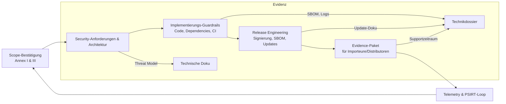

## Warum Entwickler explizite Pflichten haben

Der CRA weist Cybersicherheits‑Pflichten direkt Herstellern, Importeuren, Händlern und **Lieferanten** zu, doch die meisten Nachweise entstehen in den Engineering‑Backlogs.[1] Diese Seite übersetzt die Anforderungen der Anlage I und der Artikel 16–24 in konkrete Verantwortlichkeiten der Entwicklungsteams, damit Firmware‑, Plattform‑ und DevOps‑Leads gegenüber Auditoren zeigen können, dass Kontrollen zugewiesen, gemessen und überprüft werden.

## Produkt‑Coverage‑Matrix

| CRA‑Klausel | Entwicklergetriebene Aktivität | Beispiel‑Deliverables |
| --- | --- | --- |
| Annex I(1)(a–d) | Threat Modelling, Security‑Anforderungen, Design‑Freigaben | System‑Kontextdiagramm, STRIDE‑Notizen, dokumentierte Mitigations |
| Annex I(1)(e–g) | Sichere Defaults, Härtung der Schnittstellen, Kryptoprofile | Matrix sicherer Konfigurationen, API‑Auth‑Spezifikation, Crypto‑Bill‑of‑Materials |
| Annex I(1)(h–j) | Logging‑Strategie, Hooks für Schwachstellenmanagement | Event‑Taxonomie, Log‑Export‑Design, automatisiertes PSIRT‑Intake |
| Annex I(2)(a–f) | Update‑Mechanismus, SBOM/VEX‑Automatisierung, Support‑Tools | Diagramme der Update‑Pipelines, SBOM‑CI‑Jobs, Erklärung des Supportzeitraums |
| Articles 21–24 | Koordination mit Lieferanten und Importeuren | Firmware‑Release‑Schedule, Evidenz‑Paket für ODM/OEM, RACI‑Tabellen |

Nutzen Sie diese Matrix bei RACI‑Tabellen oder Statements of Work mit Dienstleistern, damit jede CRA‑Klausel einen benannten Engineering‑Owner hat.

## Checkpoints für Design und Spezifikation

1. **Scope‑Bestätigung.** PDE‑Klassifizierung, Status nach Anlage III und Einsatzumgebung (Industrie, Consumer, Safety) erneut bestätigen. Entscheidungs‑ID erfassen, die auf [Scope & Definitionen](./scope-and-definitions) und die CRA‑Artikel verweist.  
2. **Baseline an Security‑Requirements.** Outputs des Threat Modelling in Anforderungen überführen, die mit Annex‑I‑Klauseln getaggt sind. Beispiel‑IDs: `CRA-I1e-secure-boot`, `CRA-I2b-auto-update-fallback`. Im selben Repo wie die funktionalen Spezifikationen pflegen.  
3. **Architektur‑Review.** Cross‑Funktionale Reviews für Identität, Secure Boot, Kommunikationssicherheit, Diagnose und Update‑Pfad planen. Maßnahmen mit Ownern und Fälligkeitsdaten erfassen, um eine fristgerechte Abarbeitung bei der Konformitätsbewertung nachweisen zu können.  

## Guardrails in der Implementierung

- **Coding‑Standards und Reviews.** MISRA‑C, CERT C oder Rust‑`unsafe`‑Policies via Linter und Review‑Checklisten erzwingen. Tool‑Configs im Repo versionieren und Review‑Logs archivieren, da Annex I Prozessnachweise fordert.  
- **Dependency‑Governance.** Allow/Deny‑Listen, Lizenz‑Scans und Mindestversionen für Crypto‑Stacks, Protokollbibliotheken und Toolchains etablieren. SBOM‑Erzeugung fest an die von Entwicklern gepflegten Dependency‑Manifeste koppeln.  
- **Härtung in CI.** Statische Analyse, Fuzzing‑Harnesses und Tests als blockierende Gates behandeln. Reproduzierbare Build‑Skripte im Source‑Control halten, damit Auditoren das getestete Binary nachbauen können.  

## Release Engineering‑Pflichten

- **Signierung und Provenienz.** Entwickler liefern signierte Artefakte, Signier‑Logs und Manifest‑Metadaten (Hash, Build‑Nummer, SBOM‑Referenz) an das Konformitätsteam. Verwenden Sie Sigstore, Uptane, TUF o. Ä., um Metadaten zu standardisieren.  
- **Update‑Proben.** Vor dem Release Hardware‑in‑the‑Loop‑Tests durchführen (Normal‑Update, Rollback‑Schutz, Stromausfall, Recovery). Logs und Telemetrie als Annex‑I(2)‑Evidenz archivieren.  
- **Supportzeitraum‑Artefakte.** Den deklarierten Supportzeitraum in Gerätemetadaten einbetten (Management‑API, CLI `show info`, App), damit Distributoren die Einhaltung prüfen können.  

## Zusammenarbeit mit Importeuren, Distributoren und OEMs

Die Artikel 21–24 erwarten einen nahtlosen Übergang der Sicherheitsinformationen entlang der Lieferkette. Entwickler sollten:

- pro Release ein **CRA‑Evidenzpaket** (SBOM, VEX, SDL‑Summary, Testberichte) bereitstellen,  
- sichere Update‑Doku für OEM‑Partner liefern, inkl. Staging‑Schritten und Rollback‑Recovery,  
- Schwachstellenhinweise unter koordinierten Offenlegungsbedingungen teilen, damit Downstream‑Parteien fristgerecht patchen können.  

[1]: https://eur-lex.europa.eu/legal-content/EN/TXT/?uri=CELEX:32024R2847 "Regulation (EU) 2024/2847 — Annex I and Articles 16–24"

