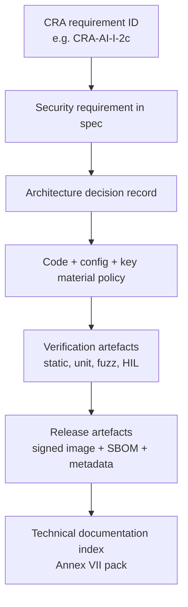
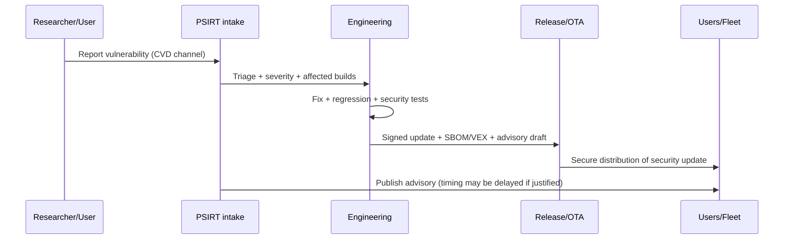
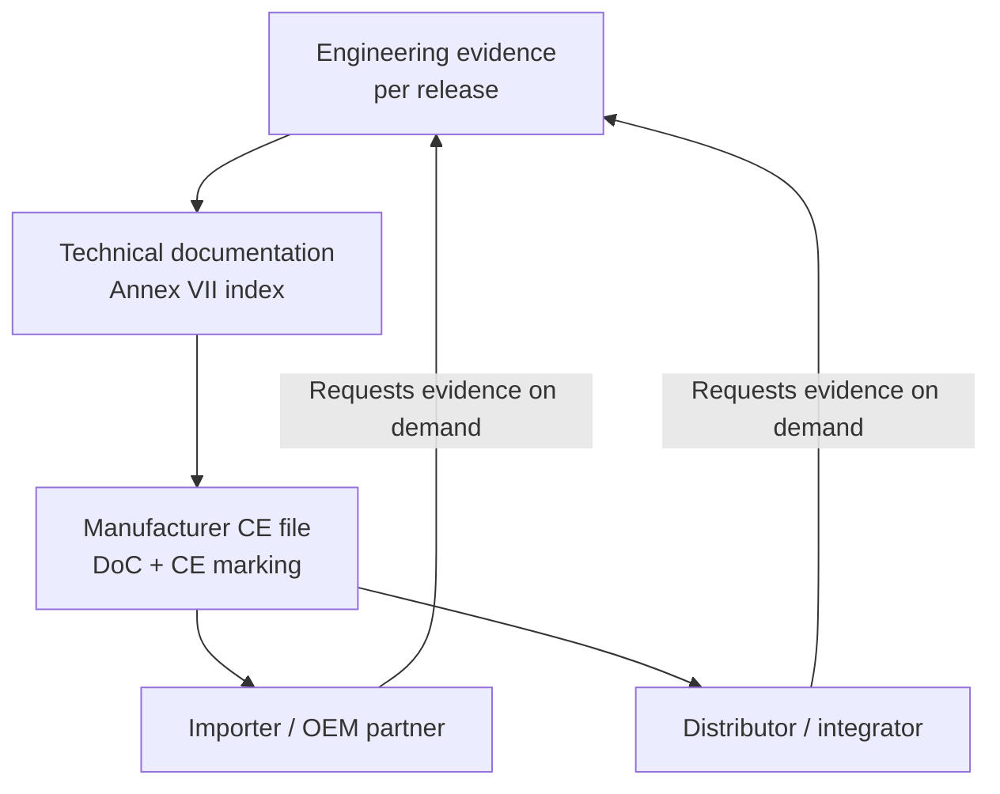

---
id: cra-developer-requirements
slug: /security/cra/developer-requirements
title: Entwickleranforderungen und Zuständigkeiten
sidebar_position: 2.5
---

## Was diese Seite ist (und nicht ist)

Dies ist eine **entwicklerorientierte Übersetzung** des CRA: Sie erklärt, *was Engineering implementieren und als Evidenz behalten muss*, damit der **Hersteller** Konformität nachweisen kann. Sie schafft **keine persönlichen Rechtspflichten** für Einzelentwickler – der CRA legt Pflichten auf **Economic Operators** (Manufacturer/Importer/Distributor usw.).[1]

Für Embedded gilt: **Architektur + SDLC-Artefakte sind Compliance-Evidenz** und werden pro Release versioniert.[2][3]

---

## Juristische Anker, die Entwickler umsetzen müssen

Der CRA macht drei Punkte unverzichtbar:

1. **Risikobasierte Sicherheitsentwicklung** (vor Release, bei Bedarf aktualisiert). Hersteller müssen eine Cybersecurity-Risikobewertung durchführen und im Technical File halten.[4][5]
2. **Wesentliche Sicherheitsanforderungen** im Produkt (Anhang I, Teil I): Designanforderungen + Kontrollen + Verifikation.[2]
3. **Vulnerability Handling + Security Updates** für die Supportperiode (Anhang I, Teil II + Art. 13 Supportperiode). Laufende Betriebsfähigkeit, kein Einmal-Task.[6][5]

:::note CRA "documentation" ist ein Produktfeature
Technische Dokumentation muss **vor** Markteinführung erstellt und **kontinuierlich** mindestens während der Supportperiode aktualisiert werden.[3] Ohne Artefakte scheitert die Compliance, selbst wenn das Gerät „praktisch sicher“ ist.
:::

---

## Eigentumsmodell für Embedded (RACI, das Audits besteht)

### Warum RACI wichtig ist

Audits scheitern häufiger an **unklarer Zuständigkeit** als an fehlenden Kryptos. CRA erwartet, dass der Hersteller in der Technischen Doku „die eingesetzten Mittel“ und „eingeführten Prozesse“ zeigt.[3]

Ein pragmatisches RACI für ein Embedded-PDE (MCU/SoC + Firmware + optional Cloud/OTA). Passen Sie Rollen an Ihre Organisation an.

| Aktivität / Evidenz | Firmware | HW/Silicon Security | Backend/OTA | DevOps/CI | PSIRT | Product/PM | Compliance |
| --- | --- | --- | --- | --- | --- | --- | --- |
| Cybersecurity Risk Assessment | R | C | C | C | C | A | C |
| Security Requirements getaggt auf Anhang I | R | C | C | C | C | A | C |
| Architecture Decision Records (ADR) | R | C | C | C | C | A | I |
| Secure Boot / Root of Trust | R | A | C | C | I | I | I |
| Debug & Lifecycle-Policy | C | A | I | I | I | I | I |
| Secure Update Mechanism | R | C | A | C | C | C | I |
| SBOM + Provenance | R | I | I | A | C | I | C |
| Security Testplan & Ergebnisse | R | C | C | C | C | I | A |
| CVD + Vuln Intake | C | I | C | C | A | C | I |
| Supportperioden-Aussage | I | I | I | I | C | A | C |
| Technisches Doku-Paket (Anhang VII) | C | C | C | C | C | C | A |

Legende: **A** accountable, **R** responsible, **C** consulted, **I** informed.

---

## Rückverfolgbarkeit: CRA-Klauseln in Engineering-IDs

Taggen Sie Backlog, Tests und Design mit **stabilen IDs**, die zur CRA-Struktur passen.

Beispielschema:

- `CRA-AI-I-2c-sec-updates-auto-default`
- `CRA-AI-II-7-secure-update-distribution`
- `CRA-A13-8-support-period`

Warum es zählt:
- verknüpft **Design → Code → Tests → Evidenz**, 
- erleichtert ein „Evidence Index“ für Anhang VII.[3]

---

## SDLC-Checkpoints, die sauber auf CRA mappen

### 1) Scope + Klassifizierung (Gate 0)

Validieren:
- Produkt ist ein **PDE** und Betriebsumgebung dokumentiert,
- ob **Important/Critical** (Anhang III/IV), denn das beeinflusst Tiefe der Bewertung,
- **Supportperiode**, weil sie Update-Strategie und Aufwand steuert.[5][3]

Outputs (Minimum):
- Scope-Statement + Systemkontextdiagramm,
- initialer Risk-Assessment-Eintrag,
- Stub für Supportperioden-Begründung.

### 2) Sicherheitsanforderungen (Gate 1)

Aus Anhang I, Teil I, Punkt (2) abgeleitete Anforderungen, z.B.:
- **Secure-by-default-Konfiguration**,[2]
- **Schutz vor unbefugtem Zugriff** (Authn/Authz),[2]
- **Vertraulichkeit/Integrität für Daten/Code**,[2]
- **Minimale Angriffsfläche/geringe Auswirkung** (Kapselung, Least Privilege, Memory Protection),[2]
- **Logging/Monitoring-Hooks**, [2]
- **Robuster Update-Mechanismus** (sichere Verteilung, Update-Policy).[2][6]

Outputs:
- Liste der Security Requirements mit CRA-IDs,
- Threat-Model-Summary + Mitigations-Mapping,
- ADRs für große Security-Entscheidungen.

### 3) Implementation Guardrails (Gate 2)

Art. 13 verlangt, Produkte über Produktion/Änderung konform zu halten.[7] Für Embedded:

- **Reproduzierbare Builds**: Build-Skripte + Toolchain-Versionen pinnen.
- **Sichere Dependency-Governance**: Manifeste versioniert; Third-Party darf Security nicht kompromittieren (Due Diligence).[5]
- **Coding Rules**: SAST, Reviews, Unsafe-Policy für Rust/C/C++.
- **Key Handling**: Keys nicht im Repo; Signieren kontrolliert (HSM o.ä.).

Outputs:
- CI-Pipeline-Config, SBOM-Job-Logs, Build-Provenance,
- Review-Checklisten, Ausnahmenregister,
- SOP für Key Handling (wer signiert, Schutz der Keys).

### 4) Release Engineering (Gate 3)

Hier entsteht „Beweis“:

- **Signierte Firmware** + Hashes + Versions-Metadaten.
- **SBOM** zur ausgelieferten Build (CRA-Definition von SBOM ist explizit).[8]
- **Update-Rehearsal-Evidenz**: Stromausfall, Rollback, Recovery.
- **User-facing Security Info** (Anhang II) konsistent zu dem, was geliefert wurde (z.B. Update-Howto).[9]

Outputs:
- Release-Manifest (Image-Hash, Signing-Key-ID, SBOM-Ref),
- Testberichte + HIL-Logs,
- Release Notes inkl. sicherheitsrelevanter Änderungen.

### 5) Post-Market / PSIRT (Gate 4)

Anhang I, Teil II fordert **Vulnerability Handling** und sichere, zeitnahe Updates.[6] Art. 13 fordert wirksame Behandlung **während der Supportperiode**.[5]

Engineering muss haben:
- Intake-Kanal für Schwachstellen (Single Point of Contact),[7]
- Triage + Fix-Workflow,
- sichere Update-Distribution,
- Advisory-Prozess (mit Möglichkeit zur Verzögerung, wenn gerechtfertigt).[6]

## Supply-Chain-Handover: was Importer/Distributoren fragen

Auch wenn Sie direkt liefern, Partner können **Importer** oder **Distributoren** sein mit Prüf-/Kooperationspflichten. Importer müssen technische Doku bereitstellen und den Hersteller informieren, wenn sie von Schwachstellen erfahren.[10] Distributoren müssen kooperieren und Infos/Dokumente liefern, die Konformität zeigen.[11]

Engineering sollte pro Release ein **CRA Evidence Pack** erzeugen (Minimum):

- signierte Firmware + Hashes + Release-Manifest,
- SBOM (und VEX, falls genutzt) zur ausgelieferten Build,
- Security-Test-Summary,
- Beschreibung des Update-Mechanismus + Rollback/Recovery,
- Supportperioden-Statement + Enddatum,
- Kontakt für Vulnerability Disclosure.

:::tip OEM/ODM-Hinweis: „substantial modification“
Wenn Importeur/Distributor (oder andere) **wesentlich ändern** und das Produkt bereitstellen, können sie Manufacturer werden und unterliegen Art. 13/14 für das Geänderte (evtl. das Gesamtprodukt).[12][13] Das sollte in Verträgen/Integrationsguides abgebildet sein.
:::

---

## Embedded-spezifische „must cover“-Liste (Anhang I)

| Thema | Typische Patterns | CRA-Anker |
| --- | --- | --- |
| Secure-by-default | Debug in Produktion gesperrt; sichere Comms an; Least-Privilege-Defaults | Annex I Part I(2)(b)[2] |
| Minimale Angriffsfläche | Unnötige Dienste aus; Ports/APIs minimieren; sichere Diagnostik | Annex I Part I(2)(j)[2] |
| Identity & Access Control | Geräteidentität, Mutual Auth, Authz-Policy | Annex I Part I(2)(d)[2] |
| Confidentiality & Integrity | TLS mit modernen Ciphers; signierte Firmware; Secure Storage | Annex I Part I(2)(e-f)[2] |
| Availability | Watchdog, Rate Limits, sichere Failover | Annex I Part I(2)(h-i)[2] |
| Logging/Monitoring Hooks | Event-Taxonomie; manipulationssichere Logs; Export-Strategie | Annex I Part I(2)(l)[2] |
| Updates | signierte Updates; sichere Verteilung; Rollback-Recovery | Annex I Part I(2)(c) + Part II(7-8)[2][6] |
| Vulnerability Handling | CVD-Policy; Kontaktpunkt; Advisories | Annex I Part II(5-6)[6] |
| Third-Party Components | Dependency Due Diligence; Upstream melden | Art. 13(5-6)[5] |

---

## Häufige Probleme (und wie man sie vermeidet)

1. **„Wir sind sicher, können es aber nicht beweisen.“**  
   Lösung: Evidenzartefakte als First-Class Outputs (ADR, Testrapporte, SBOM, Update-Logs) und im Technical File indexieren.[3]

2. **Scope-Drift.**  
   Lösung: Produktgrenze explizit definieren (Firmware + Bootloader + App + Cloud-Endpoints für Updates). Scopedigramm pro Release versionieren.

3. **Rollenverwirrung bei OEM/ODM/Integratoren.**  
   Lösung: dokumentieren, wer Build, Signing Keys, Update-Endpoints, Supportperiode steuert. Sicherheitsrelevante Änderungen als „substantial modification“ betrachten.[12][13]

4. **Supportperiode unterschätzt.**  
   Lösung: früh festlegen und gegen erwartete Lebensdauer prüfen; CRA setzt Mindest-Support (mit begrenzter Ausnahme bei kürzerer Nutzung).[5]

5. **SBOM existiert, aber nicht zur Binary verknüpft.**  
   Lösung: SBOM im CI aus Build-Inputs erzeugen, mit Release-Manifest speichern, Definition konsistent mit Art. 3.[8]

6. **Update-Mechanismus spät.**  
   Lösung: sichere Updates als Architektur-Requirement behandeln (Bootloader-Strategie, Partitionierung, Rollback, Key-Rotation), nicht als spätes Feature.[2][6]

7. **Drittkomponenten werden Blind Spot.**  
   Lösung: Dependency-Governance; Vulnerabilities in Komponenten melden/patchen gemäß Anhang I Teil II.[5][6]

8. **Kein operatives Vuln-Handling.**  
   Lösung: PSIRT-Prozess mit Intake, Triage, Fix, Advisory; sichere Update-Distribution bereit, um „ohne Verzögerung“ zu liefern.[6]

---

## Referenzen

[1]: https://eur-lex.europa.eu/legal-content/EN/TXT/?uri=CELEX:32024R2847 "Regulation (EU) 2024/2847 (CRA) - Chapter II obligations of economic operators"

[2]: https://eur-lex.europa.eu/legal-content/EN/TXT/?uri=CELEX:32024R2847 "CRA Annex I, Part I"

[3]: https://eur-lex.europa.eu/legal-content/EN/TXT/?uri=CELEX:32024R2847 "CRA Article 31 + Annex VII"

[4]: https://eur-lex.europa.eu/legal-content/EN/TXT/?uri=CELEX:32024R2847 "CRA Article 13(2-4)"

[5]: https://eur-lex.europa.eu/legal-content/EN/TXT/?uri=CELEX:32024R2847 "CRA Article 13(5-9)"

[6]: https://eur-lex.europa.eu/legal-content/EN/TXT/?uri=CELEX:32024R2847 "CRA Annex I, Part II"

[7]: https://eur-lex.europa.eu/legal-content/EN/TXT/?uri=CELEX:32024R2847 "CRA Article 13(13-14)"

[8]: https://eur-lex.europa.eu/legal-content/EN/TXT/?uri=CELEX:32024R2847 "CRA Article 3(39)"

[9]: https://eur-lex.europa.eu/legal-content/EN/TXT/?uri=CELEX:32024R2847 "CRA Annex II"

[10]: https://eur-lex.europa.eu/legal-content/EN/TXT/?uri=CELEX:32024R2847 "CRA Article 19"

[11]: https://eur-lex.europa.eu/legal-content/EN/TXT/?uri=CELEX:32024R2847 "CRA Article 20"

[12]: https://eur-lex.europa.eu/legal-content/EN/TXT/?uri=CELEX:32024R2847 "CRA Article 21"

[13]: https://eur-lex.europa.eu/legal-content/EN/TXT/?uri=CELEX:32024R2847 "CRA Article 22"
