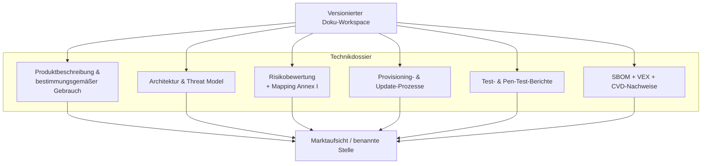

## Technische Dokumentation unter CRA

Anlage VII beschreibt, was im **Technikdossier** für die Konformitätsbewertung enthalten sein muss und passt zu den Evidenzanforderungen der Artikel 16-23.[1] Für ein Embedded‑Produkt gehören typischerweise dazu:  

- Produktbeschreibung und bestimmungsgemäßer Gebrauch,  
- Systemarchitektur‑Diagramme (inkl. Trust Boundaries),  
- Beschreibung von Sicherheitsfunktionen und Annahmen,  
- Risikoanalyse und Mapping auf die Anforderungen der Anlage I,  
- Beschreibung von Produktions‑/Provisioning‑ und Update‑Prozessen,  
- Testberichte (Security, Funktion, Performance),  
- SBOM und Nachweise zum Schwachstellenmanagement (CVD‑Policy, VEX).  

Bewahren Sie diese Unterlagen in einem versionierten Workspace oder Doku‑Repo auf, damit sie sich mit dem Produkt weiterentwickeln und bei Anfragen der Marktüberwachung (Art. 41) bereitstehen.[1]

---

## Sicherheitsinformationen für Nutzer (Anlage II)

Der CRA verlangt außerdem spezifische **Nutzerinformationen** (Anlage II), damit Kunden wissen, wie sie das PDE sicher betreiben.[2] Dokumentieren Sie u. a.:

- wie Sicherheitsupdates bereitgestellt und installiert werden (automatisch vs. manuell),  
- den **Supportzeitraum** für Sicherheitsupdates,  
- etwaige **wesentliche Restrisiken**, die nicht vollständig mitigiert werden können,  
- Hinweise zu sicherer Konfiguration und sicherem Betrieb.

Für Embedded‑Geräte liegt dies meist in:

- Produktdatenblättern oder Security‑Whitepapers,  
- Admin‑Handbüchern / Online‑Hilfe im Web‑UI,  
- Firmware‑Release‑Notes.  

---

## Erwartungen an SBOMs

Eine SBOM ist nicht mehr nur „nice to have“, sondern zentral, um zu zeigen, dass Sie bekannte Schwachstellen managen und die Punkte (c)-(f) der Anlage I(2) erfüllen.[1]

Empfehlungen für Firmware‑Projekte:

- **SPDX** oder **CycloneDX** als Austauschformat verwenden,  
- pro Build und pro Hardware/SoC‑Variante eine SBOM erzeugen,  
- u. a. enthalten:
  - Bootloader (z. B. MCUboot),  
  - RTOS und Kernel,  
  - Middleware, Protokoll‑Stacks und Kryptobibliotheken,  
  - Applikationen,  
  - Toolchain und wesentliche Build‑Tools,  
- SBOMs zusammen mit den Build‑Artefakten in CI ablegen.  

Ergänzen Sie **VEX‑Dokumente**, um den Exploitability‑Status bekannter CVEs zu kommunizieren (z. B. wenn ein verwundbarer Pfad auf Ihrem Gerät nicht genutzt wird), und verweisen Sie darauf in Kundenhinweisen, wie es die Artikel 55-57 verlangen.[1]

---

## Minimales Security‑Dokupaket

Eine pragmatische Struktur:

1. `01-product-and-arch/` - Diagramme, Threat Model, Liste der Sicherheitsfeatures.  
2. `02-sdl-and-testing/` - Beschreibung des SDL, Testpläne und Ergebnisse.  
3. `03-sbom-and-vuln-handling/` - SBOMs, VEX, CVD‑Policy, Incident‑Records.  
4. `04-updates-and-provisioning/` - Secure‑Boot‑Konfiguration, Key‑Provisioning, Update‑Flows.  
5. `05-user-facing-info/` - Handbücher, Release‑Notes mit sicherheitsrelevanten Änderungen.  

Diese Struktur passt gut zu den Anforderungen der **Konformitätsbewertung** und spiegelt die Gliederung der Anlage VII wider, was die Arbeit benannter Stellen erleichtert.[1]

[1]: https://eur-lex.europa.eu/legal-content/EN/TXT/?uri=CELEX:32024R2847 "Regulation (EU) 2024/2847 — Annexes I, II, VII and Articles 16-57"  
[2]: https://digital-strategy.ec.europa.eu/en/library/cyber-resilience-act-summary "CRA summary — European Commission"

