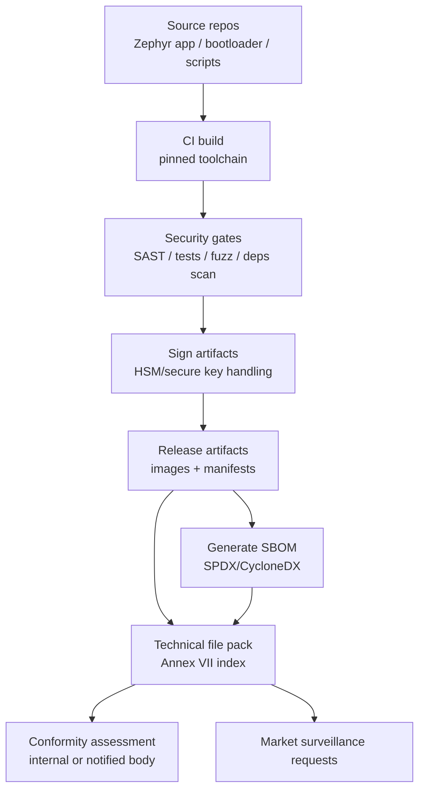
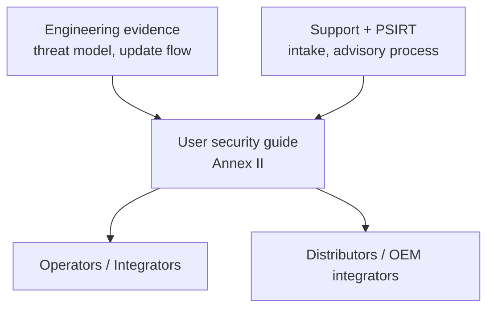
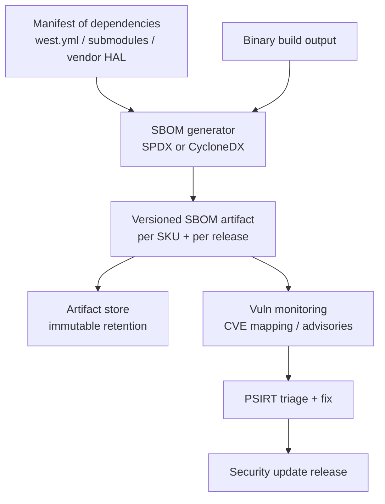

---
id: cra-docs-sbom
slug: /security/cra/documentation-and-sbom
title: Dokumentation, Nutzerinfo und SBOM
sidebar_position: 6

last_update:
  author: 'Ayoub Bourjilat (AC6)'
  date: '2025-12-19'
---

## Was der CRA sehen will

Drei „Dokuausgaben“:

1. **Technische Dokumentation (Technical File)**  
   Gefordert in **Art. 31**, Inhalte in **Anhang VII**. Strukturierte Evidenz für Conformity Assessment und Market Surveillance.  
2. **Nutzerorientierte Sicherheitsinfo und Anweisungen**  
   Gefordert in **Anhang II**. Was Betreiber/Kunden brauchen, um sicher zu deployen/betreiben (inkl. Updates, Supportperiode).  
3. **Software Bill of Materials (SBOM)**  
   Gefordert in **Anhang I, Teil II(1)**, erneut in **Anhang VII(8)** (Bereitstellung auf begründete Anfrage).

> **Kernpunkt:** CRA ist „sei sicher *und beweise es* mit konsistenter, versionierter Evidenz“.

---

## 1) Technische Dokumentation (Technical File)

### 1.1 Juristische Anker

- **Art. 31(1)**: Doku muss die Mittel zeigen, mit denen PDE die Essential Requirements (Anhang I) erfüllt.  
- **Art. 31(2)**: Doku muss **aktuell** gehalten werden.  
- **Art. 13(13)**: Doku + EU DoC mind. **10 Jahre nach Inverkehrbringen oder Supportperiode (das längere)** bereithalten.  
- **Anhang VII**: Mindestinhalt.

**Für Embedded:** Technical File als versioniertes „Release-Evidence-Paket“ je Firmware-/HW-Variante.

### 1.2 Mindestinhalt (Anhang VII) – auf Embedded übertragen

(1) Produktbeschreibung: Zweck/Umgebung, Softwareversionen, HW-Markings/Layouts, Verweis auf User-Infos (Anhang II).  
(2) Prozesse für Design/Entwicklung/Produktion + Vulnerability Handling (Intake, Triage, Fix, Release, Advisory, **sichere Update-Distribution**).  
(3) Change-Control (Security-Konfig, Krypto, Update-Pipeline; nachweisbare Änderungs-Records).  
(4) Risikobewertung + Mitigation (Assets, Angreifer, Angriffsflächen; Mapping zu Anhang I).  
(5) Harmonisierte Standards/Common Specs angewendet (oder Alternativen + Begründung).  
(6) Testberichte (Secure Boot Negativtests, Update-Robustheit, Fuzzing, SAST, Pen-Test-Summary).  
(7) EU Declaration of Conformity.  
(8) SBOM-Bereitstellung auf Anfrage.

### 1.3 Evidenz-Nachverfolgung (Audit erleichtern)

Praktisch: `evidence-index.yaml` pro Release (Pfade + Hashes aller Evidenzstücke).

---

## 2) Nutzerorientierte Sicherheitsinfos (Anhang II)

Nicht Marketingtext, sondern **operative Security-Guidance**.

Mindestens abdecken (Anhang II): Identität/Kontakt, CVD-Kontaktpunkt, Zweck/Funktionen/Sicherheitseigenschaften, sichere Inbetriebnahme/Betrieb, wie Updates empfangen/verifiziert/installiert werden, **Supportperiode**, wichtige Randbedingungen.

Erwartung: klares Update-UX, klare Security-Posture (Exponierung, Defaults, Debug-Status), klarer Scope (was liegt beim Produkt, was extern).

---

## 3) SBOM unter CRA (was und was nicht)

- **Anhang I, Teil II(1)**: SBOM in gängigem maschinenlesbarem Format, mind. Top-Level Dependencies.  
- **Anhang VII(8)**: SBOM Teil der Doku, Bereitstellung auf Anfrage.  
- **Anhang II(9)**: Wenn SBOM Nutzern bereitgestellt wird, angeben, wo.

> CRA verlangt nicht „SBOM veröffentlichen“, sondern **haben, konsistent halten, auf Anfrage liefern**.

### SBOM-Scope Embedded

Firmware-SBOM, „audit-proof“:
- Boot-Chain-Komponenten (ROM-Annahmen dokumentiert; 1st Stage; MCUboot + Config)
- RTOS/Middleware (Zephyr/FreeRTOS-Version, Netz-Stacks, Krypto-Libs)
- Application-Komponenten (Parser, mgmt-Agent, mcumgr/DFU)
- Build-Tools, die Binär beeinflussen (Compiler, Linkskripte, Generatoren)

Varianten: **eine SBOM pro Build-Target** (SKU/SoC/Feature-Set).

### VEX (optional aber nützlich)

CRA verlangt kein VEX-Format; VEX-ähnliche Statements helfen, warum eine CVE zutrifft oder nicht (affected / not affected / under investigation / fixed, mit Build-/SBOM-ID, Bedingungen).

---

## „Audit-ready“ Doku-Paket (embedded-freundlich)

1) `00-index/` (Evidence-Index)  
2) `01-product-description/` (SKUs, HW-Revs, Purpose, Umgebungen)  
3) `02-architecture-and-threat-model/` (Kontext, Trust Boundaries, Boot, Flüsse)  
4) `03-risk-and-requirements/` (Risiko, Anhang-I-Mapping, Security-Req-Liste)  
5) `04-sdl-and-testing/` (SDL, Testpläne/-ergebnisse, Fuzz-Notizen)  
6) `05-production-provisioning-updates/` (Provisioning, Key Handling, Update-Distribution/Recovery)  
7) `06-sbom-and-vuln-handling/` (SBOMs, Vuln-Intake, Advisory-Muster)  
8) `07-user-facing-info/` (User/Admin-Sicherheitsguide, Update-Howto, Supportperiode)  

---

## Häufige Probleme (und wie man sie vermeidet)

1. **Produktgrenze unklar** → Inkonsistente Doku.  
2. **Variante-Explosion** → unterschiedliche Radios/Krypto/SE = unterschiedliche SBOMs/Tests; Variantenmodell früh planen.  
3. **SBOM nicht nachweisbar zur Binary** → immutable Storage + Evidence-Index + Repro-Build-Regeln.  
4. **Vage Update-Instruktionen** → Anhang II verlangt klare Schritte + Fehler/Recovery-Verhalten.  
5. **Key Handling ist Tribal Knowledge** → Provisioning/Signieren dokumentieren; wer darf signieren; wie Rotation/Revocation.  
6. **Security-Tests nicht release-gebunden** → Ergebnisse an Release-ID koppeln, Berichte immutable speichern.  
7. **Supportperiode unklar** → explizit machen, in Produktmaterialien/Metadaten zeigen.

---

## Referenzen

[1]: Regulation (EU) 2024/2847 (CRA), Art. 13 und 31; Anhänge I, II, VII: https://eur-lex.europa.eu/legal-content/EN/TXT/?uri=CELEX:32024R2847

