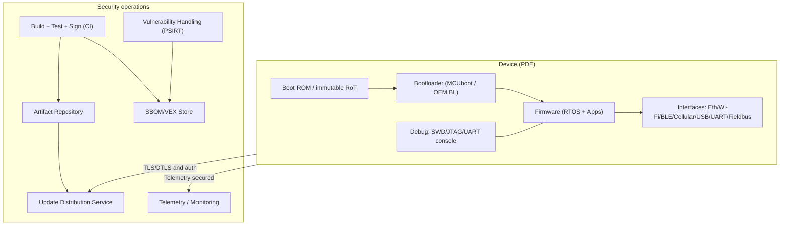
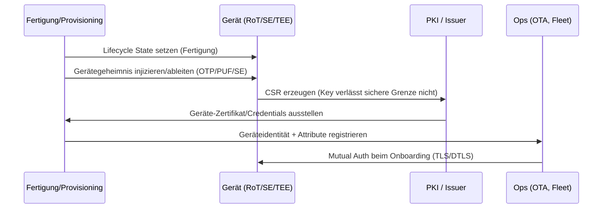
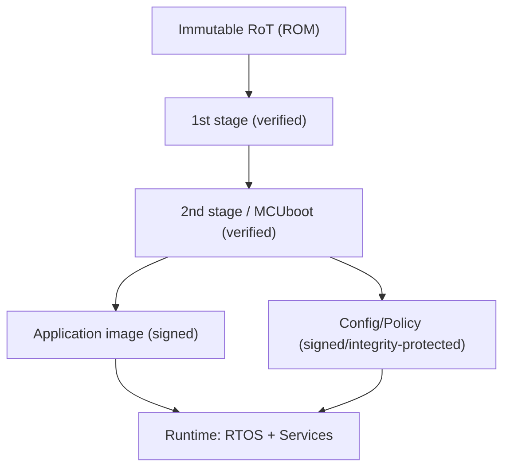
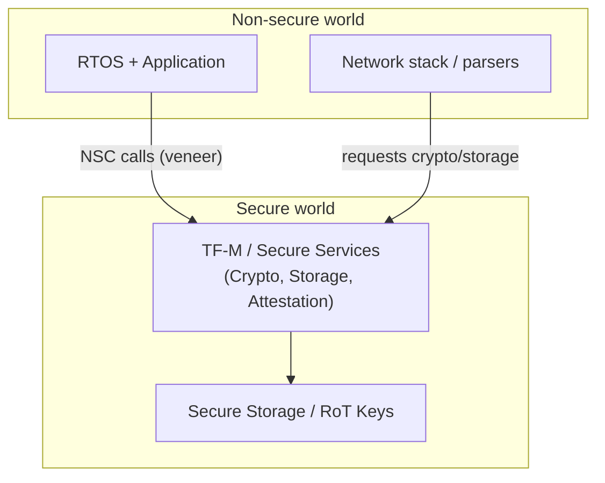
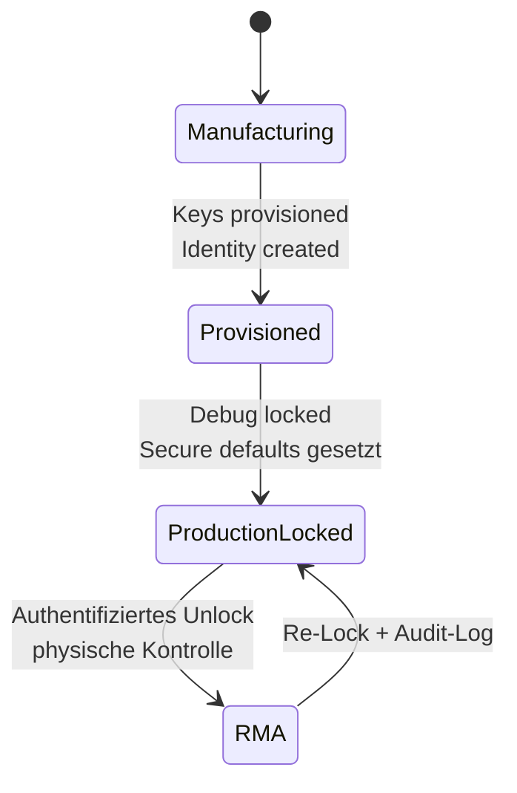
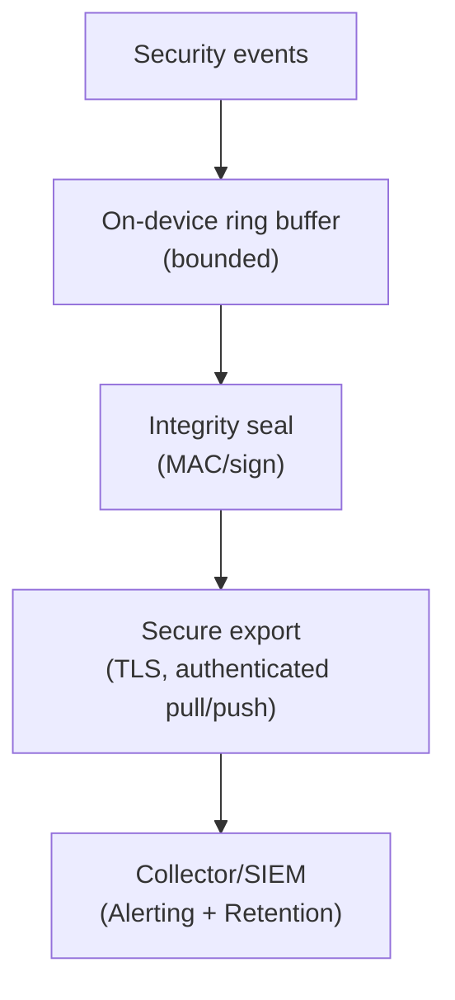
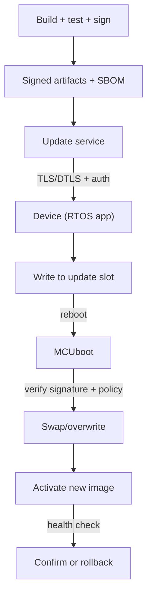
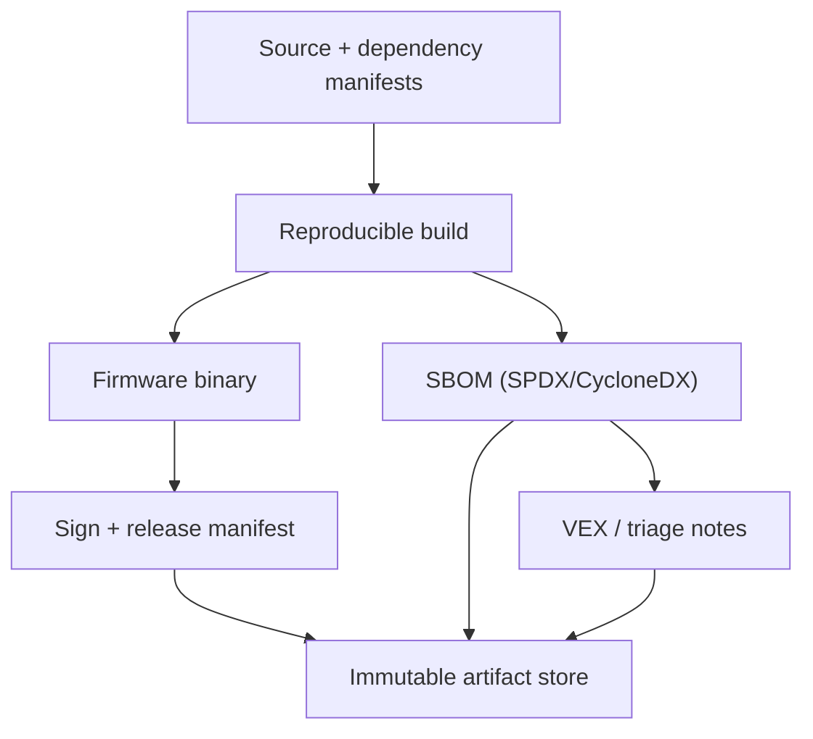

---
id: cra-embedded-controls
slug: /security/cra/embedded-technical-controls
title: Mapping eingebetteter technischer Kontrollen
sidebar_position: 4

last_update:
  author: 'Ayoub Bourjilat (AC6)'
  date: '2025-12-19'
---

## Zweck dieses Mappings

Diese Seite mappt **CRA Anhang I** auf **implementierbare technische Kontrollen** in Embedded-Produkten: CPU/SoC-Features, Firmware/Boot-Chain, RTOS-Konfig und Update + Vulnerability Handling Stack.

Sie dient als **Evidenzhilfe**: jede Zuordnung enthält CRA-Klausel, was ein Prüfer in einer Embedded-Architektur erwartet, und welche Artefakte im **Technical File (Anhang VII)** liegen sollten.[1]

---

## 0) Referenzmodell (Worauf wir mappen)

CRA-Konformität umfasst fast immer **Gerät + Firmware + Update-Backend**. Das Mapping ist nur glaubwürdig, wenn die Produktgrenze klar ist (siehe *Scope & Definitions*).

Kernaussage: die meisten CRA-Klauseln mappen auf **mehrere Ebenen** (Silizium → Boot → Runtime → Ops).

---

## 1) „Property“-Anforderungen des CRA → Embedded-Kontrollen (Anhang I Teil I)

Anhang I Teil I(2)(a–m) ist die Umsetzungscheckliste. Unten ein **Kontrollmapping**.

### 1.1 Schnellübersicht (was wo umzusetzen ist)

| CRA-Klausel | Ziel in Embedded | Typische Kontrollen | Evidenz (Annex VII) |
| --- | --- | --- | --- |
| I(2)(a) keine bekannten exploitable Vulns | Keine bekannten exploitable Schwachstellen shippen | SBOM + CVE-Triage; sichere Konfig; Fuzzing für Parser; SAST | SBOM pro Build; CVE/VEX-Log; Security-Testreport |
| I(2)(b) secure-by-default + Reset | Sichere Defaults + Factory Reset | Debug gesperrt; minimale Services; unique Creds; Secure Comms on; Reset löscht Secrets | Secure-Defaults-Matrix; Reset-Spez + Tests |
| I(2)(c) Security Updates (Auto-Default + Opt-out) | Patchbarkeit + sicheres Update-UX | Signierte OTA; rollback-sicher; Staged Rollout; Auto-Update Default (wo anwendbar) + Opt-out + Aufschub | Update-Architektur; Rollout-Prozess; Update-Fehlertests |
| I(2)(d) Schutz vor unbefugtem Zugriff + Report | Starkes AuthN/AuthZ + Audit | Geräteidentität; Mutual Auth; Access-Control-Policy; Rate Limits; Auth-Logs | Identitätsmodell; Auth-Protokoll; Event-Taxonomie |
| I(2)(e) Vertraulichkeit | Schutz für Secrets/sensible Daten | TLS/DTLS; verschlüsselte Ablage; Secure Element/TEE; Key-Zeroization | Kryptoprofil; Key-Management-Plan; Data-Flow-Klassifizierung |
| I(2)(f) Integrität + Report | Unbefugte Änderung verhindern + melden | Secure Boot; signierte Configs; Integritätschecks; Anti-Rollback; Corruption-Events | Boot-Chain-Doku; Config-Signierung; Korruptionstest-Logs |
| I(2)(g) Datenminimierung | Nur nötige Daten verarbeiten | Telemetrie-Minimierung; Sampling/Retention; IDs minimieren | Telemetrie-Schema + Begründung; Retention-Policy |
| I(2)(h) Verfügbarkeit wesentlicher Funktionen | Resilienz + DoS-Schutz | Watchdog; Ressourcenbudgets; Input-Bounds; Rate Limits; Recovery Mode | Robustheitstests; Ressourcengrenzen; Recovery-Prozedur |
| I(2)(i) Andere nicht beeinträchtigen | Keine Störung anderer Netze/Geräte | Backoff/Rate Caps; keine Scan-Muster; sichere Retry-Policy | Netzverhalten-Spec; Rate-Limit-Konfig |
| I(2)(j) Angriffsflächen begrenzen | Exponierte Interfaces reduzieren | Unnötige Ports deaktivieren; Compile-Time-Removal; authent. Management; sichere Diagnose | Interface-Inventar; Port/Service-Matrix; Hardening-Konfig |
| I(2)(k) Exploit-Mitigations | Auswirkungen eindämmen | MPU/MMU; TrustZone; Privilegtrennung; Hardening-Flags; Sandboxing | Isolationsdesign; Build-Flags; Pentest-Summary |
| I(2)(l) Logging/Monitoring + Opt-out | Sicherheitsrelevante Logs mit Nutzerkontrolle | Event-Taxonomie; manipulationssichere Logs; sicherer Export; Opt-out-Verhalten | Logging-Design; Logschutz; Export-API |
| I(2)(m) Secure Deletion + Transfer | Sichere Außerbetriebnahme | Secure Wipe (intern + extern); authentifizierte Migration | Wipe-Design + Verifikation; Nutzeranleitung |
| I(1) angemessenes Niveau basierend auf Risiko | Proportionalität belegt durch Risk Assessment | Threat Model; Risk Register; Control-Rationale je Umfeld | Risk Assessment mit Annex-I-Mapping |

Quelle: CRA Anhang I Teil I(1)-(2).[1]

---

## 2) Root of Trust und Geräteidentität

Ohne vertrauenswürdige Identität/Bootstatus können Sie nicht glaubwürdig erfüllen:
- Schutz vor unbefugtem Zugriff (I(2)(d)),
- Integrität (I(2)(f)),
- sichere Updates (I(2)(c)),
- Exploit-Mitigations (I(2)(k)).[1]

### Praxispattern

**Ziel:** eindeutige Geräteidentität, verankert in HW-geschütztem Material.

Optionen (je nach SoC):
- **OTP/eFuse** für Gerätekeys oder KEK
- **PUF-abgeleitete Keys** (keine Rohschlüssel gespeichert)
- **Secure Element** (extern) oder **Secure Enclave/TEE** (intern)
- **TrustZone**-Partition für Krypto + Secure Storage

Evidenz fürs Technical File:
- Provisioning-Spez (was, wo gespeichert/abgeleitet),
- Lifecycle-Diagramm (Fertigung → Produktion → RMA),
- Plan für Key-Rotation/Revocation.

---

## 3) Secure Boot und gemessene Integrität

**CRA-Anker:** Integrität (I(2)(f)), Angriffsfläche/Exploit-Mitigations (I(2)(j)/(k)), sichere Updates/Anti-Rollback (I(2)(c)).[1]

Kontrollen entscheiden:
- Signaturschema (Key-Typ, Rotation),
- Anti-Rollback (monotone Counter/Versionspolicy),
- Failover (Recovery vs Rollback-Slot),
- Konfigintegrität (signierte Bundles, authentifizierte Befehle).

Evidenz: Negative Tests (falsche Signatur, Downgrade, Korruption), Stromausfalltests, Boot-Events für I(2)(l).[1]

---

## 4) Laufzeit-Isolation und Memory Safety

**Anker:** I(2)(k) Exploit-Mitigations, I(2)(j) Angriffsfläche, I(2)(e)-(f) Vertraulichkeit/Integrität.[1]

Auf MCU ohne MMU trotzdem:
- **MPU**-Regionen (privileged/unprivileged, Read-Only Code, NX-Data wo möglich),
- **TrustZone-M**-Trennung (Secure/Non-secure + Gateways),
- Hardening (Stack Canaries, Bounds Checks, W^X, CFI wenn unterstützt).

Evidenz: Memory Map (Secure/Non-secure, MPU), Liste privilegierter APIs, Testplan für Isolation.

---

## 5) Interface-Hardening und Debug-Lifecycle

**Anker:** secure-by-default (I(2)(b)), unbefugter Zugriff + Reporting (I(2)(d)), Angriffsfläche (I(2)(j)).[1]

Interface-Inventar anlegen:
- physische Ports (USB, UART, CAN, SWD/JTAG),
- Funk (BLE, Wi-Fi, NFC),
- Services (Web-UI, RPC, Mgmt, Update-Endpoints).

Markieren: aktiv in Produktion? Auth/Authorisiert? Rate-Limit? Logging? Wie abschalten?

Evidenz: Lifecycle-Policy (wann Debug an/aus, Unlock-Prozess, Logs), Produktionskonfig-Report (Secure Defaults, Dienste aus), Pentest-Notizen Management-Ebene.

---

## 6) Kryptografie und Key Management

**Anker:** Vertraulichkeit „Stand der Technik“ (I(2)(e)), Integrität + Korruptionsreporting (I(2)(f)).[1]

Zeigen Sie:
- **Protokolle** (TLS/DTLS, MQTT over TLS ...),
- **Cipher Suites** und Keygrößen (Policy, nicht nur „TLS“),
- Key-Generierung, -Speicherung, -Rotation, -Revocation, RMA.

Nutzen Sie gepflegte Kryptobibliotheken, vermeiden Sie veraltete Protokolle/schwache Keys, erzwingen Sie passende Zertifikatsvalidierung.

Evidenz: Kryptoprofil, Trustmodell (Root CA, Pins), SOP für Key-Lifecycle und Plan bei Key-Compromise.

---

## 7) Logging/Monitoring (Device-Level)

**Anker:** Anhang I Teil I(2)(l) Logging relevanter interner Aktivität mit Opt-out.[1]

Events: Boot-Verdicts, Auth/Authorisation, Updates (Download/Verify/Activate/Rollback), Config-Änderungen, Integritätsfehler, Debug-Unlock-Versuche.

Evidenz: Event-Taxonomie + Severity, Log-Schutzdesign, Opt-out-Definition (was wird deaktiviert, was bleibt für Safety/Security erforderlich).

---

## 8) Sicherer Update-Pfad (Gerät + Fleet)

**Anker:** I(2)(c); Teil II(2), (7), (8): Updates sicher verteilen, automatisch wo anwendbar, ohne Verzögerung, Advisory.[1]

Eigenschaften:
1. **Authentizität** (nur Hersteller-Images),
2. **Integrität** (Prüfung vor Aktivierung),
3. **Anti-Rollback**, 
4. **Power-Fail-Sicherheit** (A/B, Swap, Recovery),
5. **Status-Transparenz**, 
6. **Fleet-Kontrolle** (Staged Rollout/rollback).

Evidenz: Update-Architektur (Gerät + Backend), Testmatrix (abgebrochener Download/Swap, korrupte Images), Advisory-Muster und Rollout-Logs.

---

## 9) SBOM und Supply-Chain-Kontrollen

**Anker:** Anhang I Teil II(1) SBOM (Top-Level Dependencies, maschinenlesbar).[1]

Firmware-SBOM sollte enthalten: Bootloader, RTOS, Netzwerk/Krypto-Libs, Middleware (Parser, Serialisierung), Vendor-HAL/SE-SDKs, ggf. Toolchain-Komponenten.

Evidenz: SBOM pro Release mit Build-Hash, CVE-Triage/ggf. VEX, Nachweis, dass Vulnerabilities „ohne Verzögerung“ behoben werden (Teil II(2)).[1]

---

## 10) „Knobs“-Checkliste (was Ingenieure wirklich einstellen)

**Hardware/SoC**: Lifecycle-State, Secure Storage (OTP/PUF/SE/TEE), Debug-Lock-Policy, monotone Counter/Anti-Rollback, TRNG + Health.

**Boot/Firmware**: Signaturprüfung aktiv, Versionspolicy/Anti-Rollback, Recovery-Policy, Config-Integrität.

**RTOS/Runtime**: Privilegtrennung, isolierte Krypto-Services, Hardening-Flags, Input-Validation für alle Parser, Ressourcengrenzen.

**Netzwerk**: TLS/DTLS erzwungen + konfiguriert, Zertifikatsvalidierung/Trust Anchors, Rate-Limits/Backoff (I(2)(i)).

**Observability**: Event-Taxonomie + Retention, Log-Integrität, sichere Export-Authentifizierung.

---

## Häufige Probleme (Embedded)

1. **PDE-Grenze undefiniert** → Updates/Logging-Mapping bricht. 
2. **Varianten-Explosion** → mehrere Memory Maps/Bootchains, aber nur eine Evidenz. 
3. **Kein Lifecycle-State-Policy** → Debug/Keys/Rollback inkonsistent. 
4. **Identitätsmodell fehlt** → „Gerät hat TLS“ ohne klare Identität/Cert-Issuance/Revocation. 
5. **Anti-Rollback fehlt** → Downgrades möglich. 
6. **Unsichere Logs** → fälschbar/ohne Auth-Export. 
7. **Secure Wipe nicht implementiert**. 
8. **SBOM ohne Triage**. 
9. **Opt-out unklar** (Logs/Auto-Update). 
10. **Evidenz nicht versioniert** (Anhang VII-Schmerz).

---

## Referenzen

[1]: Regulation (EU) 2024/2847 (CRA) - Annex I (Teil I & II) https://eur-lex.europa.eu/legal-content/EN/TXT/?uri=CELEX:32024R2847

[2]: ETSI EN 303 645 v3.1.3 https://www.etsi.org/deliver/etsi_en/303600_303699/303645/03.01.03_60/en_303645v030103p.pdf

[3]: IEC 62443-4-2 (IACS-Komponenten-Sicherheitsanforderungen)

[4]: CRA Anhang VII - Technical Documentation https://eur-lex.europa.eu/legal-content/EN/TXT/?uri=CELEX:32024R2847

