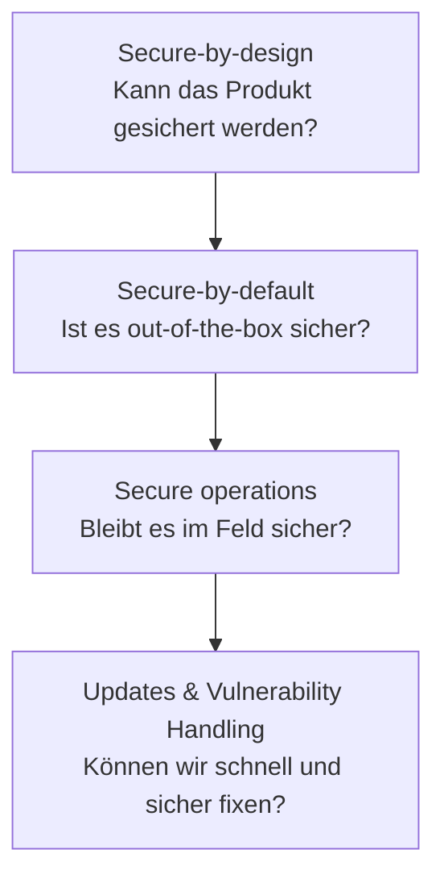
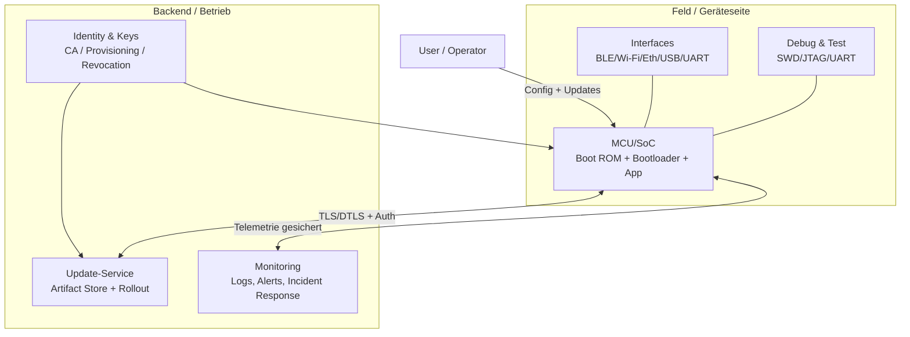
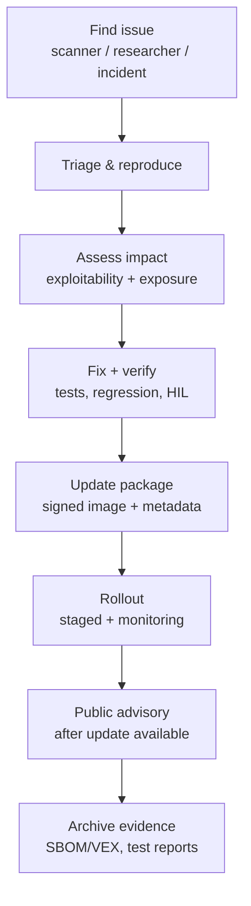
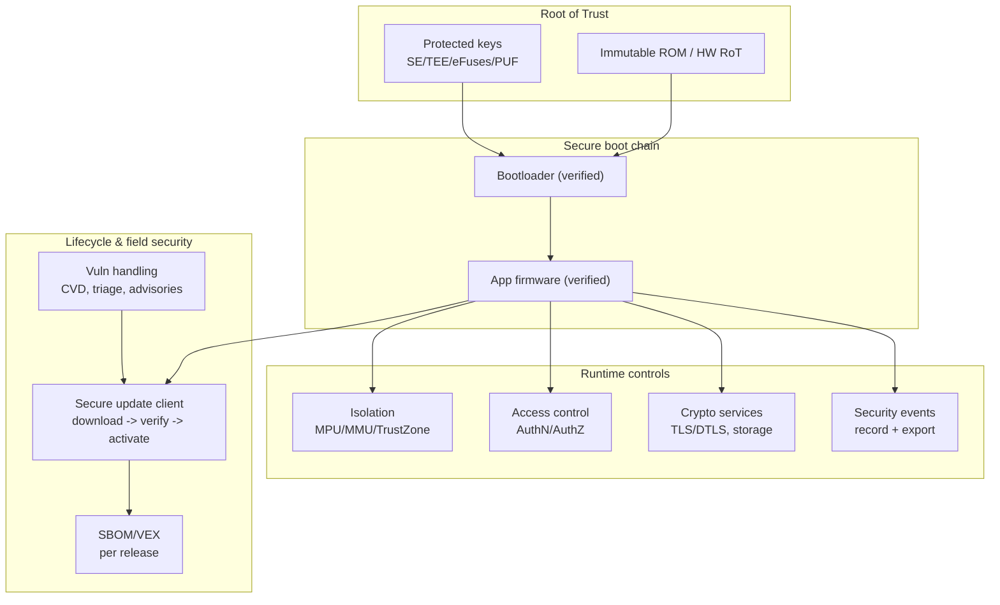
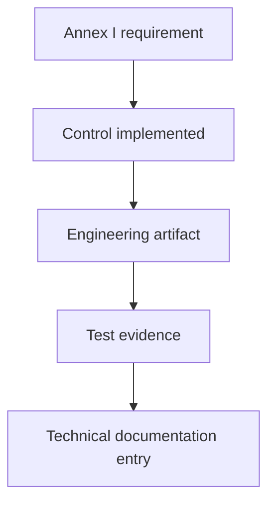

---
id: cra-fundamental-security
slug: /security/cra/fundamental-security-requirements
title: Grundlegende Sicherheitsanforderungen
sidebar_position: 3

last_update:
  author: 'Ayoub Bourjilat (AC6)'
  date: '2025-12-19'
---

## Was der CRA wirklich fordert (engineering-Übersetzung)

Der Cyber Resilience Act (CRA) ist technikneutral, aber **nicht vage**: Produkte mit Digitalen Elementen (PDE) müssen **so entworfen, entwickelt und produziert** werden, dass sie ein „angemessenes Sicherheitsniveau basierend auf den Risiken“ erreichen (Anhang I, Teil I(1)), und benennt **konkrete Eigenschaften** (Anhang I, Teil I(2)(a–m)).[1]

Für Embedded heißt das: 

> Können wir – mit Designartefakten, Testergebnissen und Betriebprozessen – zeigen, dass Gerät, Firmware und Update-Ökosystem **Vertraulichkeit, Integrität, Verfügbarkeit** schützen und wir das Produkt **über die Supportperiode** sicher halten?[1][2]

Diese Seite richtet sich an MCU/SoC-Produkte (Sensoren, Gateways, PLCs, Industrie-/Consumergeräte) und übersetzt CRA-Sprache in umsetzbare Kontrollen und Evidenz für die **Technische Dokumentation** (Anhang VII).[4]

---

## Secure-by-design vs. Secure-by-default (nicht verwechseln)

Beides ist gefordert, aber verschieden:

- **Secure-by-design** = *Architekturentscheidungen*, die Sicherheit ermöglichen (Root of Trust, Boot-Chain, Isolation, Key-Lifecycle, Update-Pfad, Logging-Hooks). Getrieben von der Risikobewertung (Art. 13(2)-(3)) und muss Anhang I erfüllen.[2][1]
- **Secure-by-default** = *Auslieferungskonfiguration*, die am Tag 0 sicher ist, ohne Security-Expertise beim Nutzer. CRA verlangt **secure-by-default** bei Markteinführung (Anhang I, Teil I(2)(b)).[1]

Ist Secure-by-design schwach (kein vertrauenswürdiger Boot, kein Key-Schutz, kein Update-Mechanismus), wird Secure-by-default zur Checkbox ohne belastbare Evidenz.

---

## Embedded-Referenzmodell (was Auditoren verstehen wollen)

Auditoren prüfen (1) was im PDE ist, (2) welche externen Dienste für Sicherheit nötig sind (Updates, Identity, Monitoring), (3) wie Kompromittierung eingehegt wird.

---

## CRA-Anforderungen (Anhang I) übersetzt für Embedded

### Teil I(1): „angemessenes Sicherheitsniveau basierend auf Risiko“

Zentrale Regel: dokumentierte/aktualisierte **Cybersecurity-Risikobewertung** begründet die Sicherheitslage (Art. 13(2)-(3)).[2] Sie zeigt, wie Teil I(2) angewendet/implementiert wird.[2][1]

- Sicherheitsumfeld definieren (Betrieb, physischer Zugang, Netzwerkexponierung)
- Assets identifizieren (Keys, Credentials, Safety-Funktionen, IP)
- Angreiferfähigkeiten festlegen (remote, lokal, Supply-Chain)
- Kontrollen proportional zum Risiko wählen

### Teil I(2)(a): „keine bekannten exploitable Vulnerabilities“ beim Release

- Schwachstellenscans für **alle Third-Party-Komponenten** (RTOS, TLS-Stack, Bootloader, Libs)
- Zusammensetzung nachvollziehbar (SBOM), CVEs triagieren (VEX, falls genutzt)
- Security-Tests (SAST + Fuzzing für Parser/Protokolle) als Release-Gate

Evidenz: Release-Sicherheitsreport, CVE-Triage-Log, SBOM-Snapshot, Security-Testresultate.[4][1]

### Teil I(2)(b): Secure-by-default + Reset

- **Secure Defaults**: Debug-Ports in Produktion gesperrt/strong control; keine Default-Passwörter; minimal exponierte Dienste
- **Reset**: Factory Reset löscht Secrets und stellt gehärtete Basis wieder her

Evidenz: Secure-Defaults-Matrix; Spezifikation Factory Reset + Tests.[4][1]

### Teil I(2)(c): Security-Updates (Auto-Default + Opt-out)

- Signierte Updates, Verifikation vor Aktivierung, rollback-sicher
- Update-Policy: Staged Rollout, Kompatibilitätschecks, Recovery bei Stromausfall
- UX: Opt-out/aufschieben wo anwendbar

Evidenz: Update-Architektur, Signing-Policy, Rollout-Prozess, Fehler-Testlogs.[4][1]

### Teil I(2)(d): Schutz vor unbefugtem Zugriff + Reporting

- Geräteidentität (unique Credential/Cert), Authn/Authz für Management, Rate Limits/Lockout
- Logging von Auth-Fails/Privilege-Changes

Evidenz: Access-Control-Modell, Auth-Protokoll, Event-Taxonomie.[4][1]

### Teil I(2)(e): Vertraulichkeit Daten ruhend/übertragen

- TLS/DTLS mit modernen Cipher Suites
- Verschlüsselte Ablage für Secrets (Secure Element/TEE oder abgeleitete Keys)
- Schutz sensibler Assets in RAM (Isolation, Zeroization)

Evidenz: Kryptoprofil, Key-Management-Plan, Data-Flow-Klassifizierung.[4][1]

### Teil I(2)(f): Integrität von Daten/Befehlen/Programmen/Konfig + Reporting

- Secure Boot mit Signaturprüfung (ggf. Measured Boot)
- Integritätsschutz für Konfig (signierte Bundles, monotone Counter)
- Attestation oder Checks kritischer Bereiche (Boot-Flags, Security-State)
- Logging/Telemetry bei Korruption (Signaturfehler, CRC)

Evidenz: Boot-Chain-Beschreibung, Config-Integrität-Design, Tests.[4][1]

### Teil I(2)(g): Datenminimierung

- Nur notwendige Telemetrie sammeln
- Keine dauerhaften Identifikatoren ohne Bedarf
- Retention und Sampling-Policy definieren

Evidenz: Telemetrie-Schema mit Begründung je Feld + Retention-Policy.[4][1]

### Teil I(2)(h)+(i): Verfügbarkeit + andere nicht schädigen

- Watchdog + sicheres Recovery
- Rate Limits, Ressourcenbudgets (CPU, Heap, Queues)
- Robuste Input-Validierung für Parser
- Fail-Secure/Fail-Close-Entscheidungen

Evidenz: Availability-Analyse, Robustheitstests, Budgetgrenzen.[4][1]

### Teil I(2)(j)+(k): Angriffsfläche reduzieren + Exploit-Mitigations

- Unnötige Peripherie/Protokolle abschalten, compile-time entfernen
- Privilegtrennung (MPU/MMU; TrustZone), Hardening-Flags (Stack Canary, W^X, CFI wo möglich)
- Striktes Parsing für eingehende Daten

Evidenz: Interface-Inventar, Isolationsdesign, Build-/Hardening-Flags + Tradeoff-Begründung.[4][1]

### Teil I(2)(l): Logging/Monitoring relevanter interner Aktivität (mit Opt-out)

- Event-Liste: Boot-Verdicts, Auth-Fails, Debug-Unlock-Versuche, Update-Fails, Integritätsalarme
- Manipulationssichere Logs (Ringpuffer + Integrität) oder sichere Export-Schnittstelle
- Opt-out definieren, was deaktiviert werden kann vs. was für Sicherheit nötig bleibt

Evidenz: Event-Taxonomie, Log-Schutzschema, Export-API.[4][1]

### Teil I(2)(m): Secure Deletion + sicherer Transfer

- Secure Wipe für Credentials/User-Daten/Config (auch externe Flash)
- Sichere Außerbetriebnahme im User-Guide
- Migration (falls vorhanden) authentifiziert + vertraulich

Evidenz: Wipe-Design + Verifikation + Nutzeranleitung.[3][4][1]

---

## Anhang I Teil II: Vulnerability Handling (Lebenszyklusfähigkeit)

Pflicht: SBOM, zeitnahe Remediation via Security Updates, regelmäßige Tests, Advisories nach Fix, CVD-Policy/Kontakt, sichere Update-Distribution, Updates ohne Verzögerung und i.d.R. kostenfrei.[1]

Planen für:
- **stromausfallsichere Updates** (A/B, Swap/Overwrite, Recovery)
- **Varianten-Segmentierung** (SoC/Radio/Region)
- **lange Supportperioden**, wenn Backport schwer
- Security-Updates getrennt von Feature-Updates, wo machbar[1]

---

## „Minimum Credible“ Embedded Security Blueprint

Jeder Block mappt auf Anhang I Teil I(2) und Teil II.[1]

---

## Evidenz: was ins Technical File gehört

Die technische Dokumentation muss u.a. Systemarchitektur, Risikobewertung (Anhang-I-Mapping), Vulnerability Handling (inkl. SBOM, sichere Update-Distribution) und Testberichte enthalten.[4][2]

Beispiele:
- Anhang I(2)(c) Updates → signiertes OTA-Design → Update-Testlogs → Anhang VII Punkt 2(b) + 6.[1][4]
- Anhang I(2)(j) Angriffsfläche → Interface-Inventar → Portscan + Fuzz → Anhang VII Punkt 2(a) + 6.[1][4]
- Teil II(1) SBOM → SBOM (CycloneDX/SPDX) → pro Release archiviert → Anhang VII Punkt 2(b) + 8.[1][4]

---

## Häufige Probleme (Review-Checkliste)

1. **Sicherheitsumfeld unklar** (physischer Zugang nicht definiert) → „angemessenes Niveau“ nicht begründbar.[2][1]
2. **Kein einheitliches Update-Konzept** (mehrere SKUs/Bootpfade, aber nur eine Doku/Test) → Anhang I(2)(c)-Evidenz bricht.[1][4]
3. **Debug nicht geregelt** → Secure-by-default & Angriffsfläche leiden.[1]
4. **Identitätsmodell unscharf** → keine klare Geräteidentität/Rollen/Authz → verfehlt I(2)(d).[1]
5. **Key-Lifecycle undefiniert** → Provisioning/Rotation/Revocation/RMA nicht designt → schwacher Schutz.[1]
6. **Logging als „Nice-to-have“** → keine Event-Taxonomie, kein Schutz, keine Opt-out-Definition.[1]
7. **Secure Wipe vergessen** → Factory Reset lässt Secrets zurück → verfehlt I(2)(m) + User-Infos.[1][3]
8. **SBOM ohne Betrieb** → SBOM erzeugt, aber keine Triage/VEX/Release-Kopplung → verfehlt Teil II(1-2).[1]
9. **Verfügbarkeit nicht getestet** → Watchdog/Recovery existiert, aber kein DoS/Stress-Test.[1]
10. **Evidenz verstreut** → Artefakte nicht referenziert/versioniert im Technical File → Anhang VII wird schmerzhaft.[4]

Wenn nur eins: bauen Sie eine **wiederholbare Release-Pipeline**, die (1) signierte Artefakte, (2) SBOM/VEX, (3) Security-Testresultate und (4) einen kurzen „Anhang-I-Coverage-Report“ liefert.[1][4]

---

## Referenzen

[1]: Regulation (EU) 2024/2847 (CRA) - Anhang I (Teil I & II) (EUR-Lex) https://eur-lex.europa.eu/legal-content/EN/TXT/?uri=CELEX:32024R2847

[2]: Regulation (EU) 2024/2847 - Artikel 13 (Risk Assessment, Lifecycle-Integration, Due Diligence, Vuln-Handling) https://eur-lex.europa.eu/legal-content/EN/TXT/?uri=CELEX:32024R2847

[3]: Regulation (EU) 2024/2847 - Anhang II (User-Information) https://eur-lex.europa.eu/legal-content/EN/TXT/?uri=CELEX:32024R2847

[4]: Regulation (EU) 2024/2847 - Anhang VII (Technical Documentation) https://eur-lex.europa.eu/legal-content/EN/TXT/?uri=CELEX:32024R2847

[5]: Regulation (EU) 2024/2847 - Artikel 3 (Definitionen inkl. SBOM, vulnerability, exploitable, actively exploited, significant cyber risk) https://eur-lex.europa.eu/legal-content/EN/TXT/?uri=CELEX:32024R2847

[6]: NIST SP 800-218 (SSDF) https://csrc.nist.gov/publications/detail/sp/800-218/final

[7]: ETSI EN 303 645 v3.1.3 https://www.etsi.org/deliver/etsi_en/303600_303699/303645/03.01.03_60/en_303645v030103p.pdf

[8]: IEC 62443-4-2 (IACS-Komponentenanforderungen) (Standardbezug)

