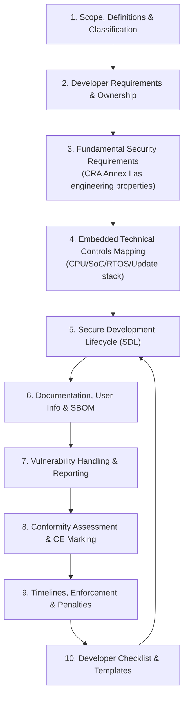
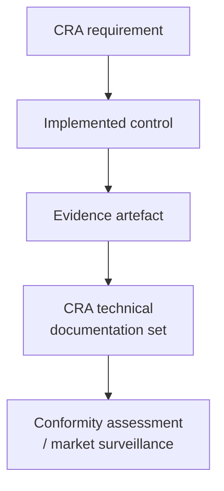

---
id: cra-overview
slug: /security/cra
title: CRA für eingebettete Produkte – Praktische Implementierungsanleitung
sidebar_position: 1

last_update:
  author: 'Ayoub Bourjilat (AC6)'
  date: '2025-12-19'
---

import DocCardList from '@theme/DocCardList';
import {useCurrentSidebarCategory} from '@docusaurus/theme-common';

## Warum es diese Anleitung gibt

Der Cyber Resilience Act (CRA) verlangt nicht nur *Sicherheitsfeatures*, sondern den Nachweis, dass Ihr Produkt **entwickelt, hergestellt und gewartet** wurde, um cybersicher zu sein – und dass Sie es nach dem Release sicher halten können. Praktisch heißt das, juristische Pflichten in Folgendes zu übersetzen:

- **Engineering-Entscheidungen** (Architektur, Boot-Chain, Isolation, Krypto, Update-Pfad),
- **wiederholbare Prozesse** (SDL, Supply-Chain-Kontrolle, PSIRT),
- und **Evidenz**, die in die CRA-Technische Dokumentation passt.

Diese Doku hilft Embedded-Teams dabei: **CRA-Pflichten in umsetzbare Kontrollen + messbare Evidenz** zu überführen – Release für Release.

> Dies ist eine ingenieursfokussierte Anleitung. Für rechtliche Auslegung und Sonderfälle (Scope-Ausnahmen, Rollenzuteilung, Vertragsformulierungen) mit Legal/Compliance abstimmen.

---

## Was Sie erreichen, wenn Sie folgen

Am Ende haben Sie eine CRA-fähige Basis, die *auditierbar* ist:

- Eine **klare Scope-Entscheidung** (PDE? important/critical? welche Varianten?)
- Ein **risikobasiertes Set an Sicherheitsanforderungen** gemappt auf CRA Anhang I
- Eine **Architektur als Evidenz** (Trust Boundaries, Identity, Boot, Updates, Datenflüsse)
- Einen **Secure Development Lifecycle** mit dokumentierten Outputs (Reviews, Tests, Tools, Gates)
- Ein **Dokumentationspaket** passend zu CRA Technischer Dokumentation (Anhang VII) und User-Info (Anhang II)
- Einen laufenden **Prozess für Vulnerability Handling + Reporting**
- Einen **Konformitätspfad** (Selbstbewertung vs Notified Body) und CE-Readiness
- Eine **Release-Checkliste**, die jede Aussage mit Evidenz verknüpft (Tickets, PRs, Logs, SBOM/VEX)

---

## Wie die Seiten zusammenhängen (in dieser Reihenfolge lesen)

---

## Das „Evidence-first“-Mindset (der echte CRA-Beschleuniger)

Der schnellste Weg zu CRA-Readiness ist, jede Sicherheitsentscheidung als **zwei Outputs** zu sehen:

1) **eine technische Kontrolle** (implementiert/konfiguriert), und  
2) **ein Beweisartefakt** (etwas, worauf Sie verweisen können).

Beispiele:
- "Secure Boot erzwungen" ? Konfiguration + signierte Images + Verifikationslogs + Testergebnisse  
- "Update-Mechanismus ist sicher" ? Update-Design + Policy + Rollback-Tests + Staged-Rollout-Logs  
- "Keine bekannten exploitable Vulnerabilities zum Release" ? SBOM + VEX + Triage-Record + Fix-Commits  

Deshalb endet jede Seite mit: **was Sie produzieren müssen** (Artefakte) und **wo es liegen soll** (Repo, CI-Logs, Technical File).

---

## CRA-Themen erkunden

<DocCardList items={useCurrentSidebarCategory()?.items ?? []} />

---

## Embedded-Realität (Fokus dieser Anleitung)

Die meisten CRA-Hinweise sind technikneutral. Hier machen wir es konkret für eingebettete Produkte:

- **MCU/SoC-Beschränkungen** (MPU/MMU, TrustZone-M/A, Secure Storage, Debug-Lock)
- **RTOS-Realität** (Privilegseparation, Userspace, Secure-Bootloader-Integration)
- **Feld-Updates** (A/B-Slots, Stromausfall-Handling, Rollback-Policies)
- **Supply-Chain-Sichtbarkeit** für Firmware (SBOM pro Build + pro Variante)
- **Device ? App ? Gateway ? Cloud**-Grenzen (was gehört praktisch zum PDE-System)

---

## Typische Probleme, die diese Anleitung vermeidet

Diese tauchen oft in Audits/Incidents auf:

- "Wir wissen nicht genau, was **im Scope** ist (nur Device? App? Cloud?)"
- "Wir können nicht erklären, **warum** wir diese Kontrollen wählten (kein Risk-to-Control-Mapping)"
- "Wir haben Security-Features, aber **keine Evidenzkette** (keine Logs/Dokumente/Repeatability)"
- "Wir liefern Varianten, aber SBOMs/Configs sind **nicht variantenbewusst**"
- "Updates existieren, aber Rollback/Key-Handling/Fehlermodi sind **nicht belegt**"
- "Vuln-Handling ist informell (kein PSIRT-Workflow, keine Reaktionsziele)"
- "CE/DoC kommt spät, Engineering kann **Technical File**-Fragen nicht schnell beantworten"

Wenn das bekannt klingt: starten mit **Scope & Definitions**, dann **Fundamental Security Requirements** und **Embedded Technical Controls**.

---

## Woher die Anforderungen kommen

Die Anleitung stützt sich auf den CRA-Rechtstext, vor allem:
- **Anhang I** (Essential Requirements)  
- **Anhang II** (User-facing Security Information)  
- **Anhang VII** (Inhalt der Technischen Dokumentation)  
- sowie CRA-Regeln zu Vulnerability Handling/Reporting und Conformity Assessment.

[1]: https://eur-lex.europa.eu/legal-content/EN/TXT/?uri=CELEX:32024R2847 "Regulation (EU) 2024/2847 - Cyber Resilience Act (CRA)"

