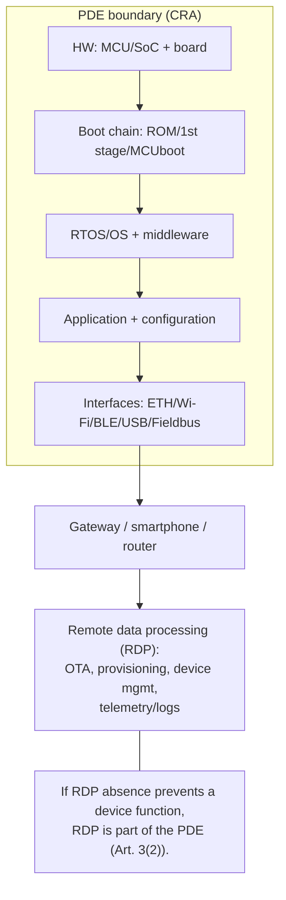
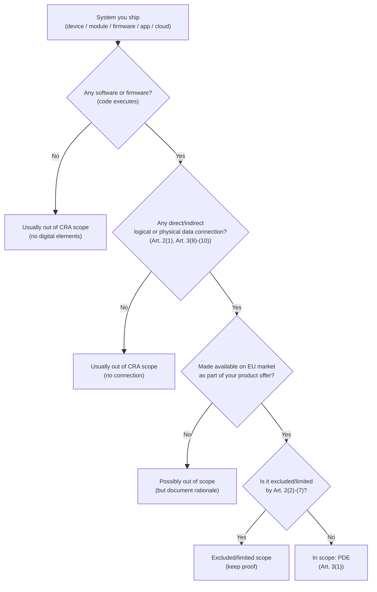
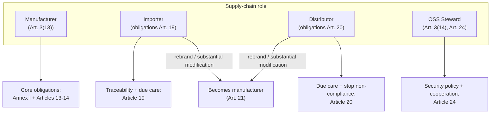
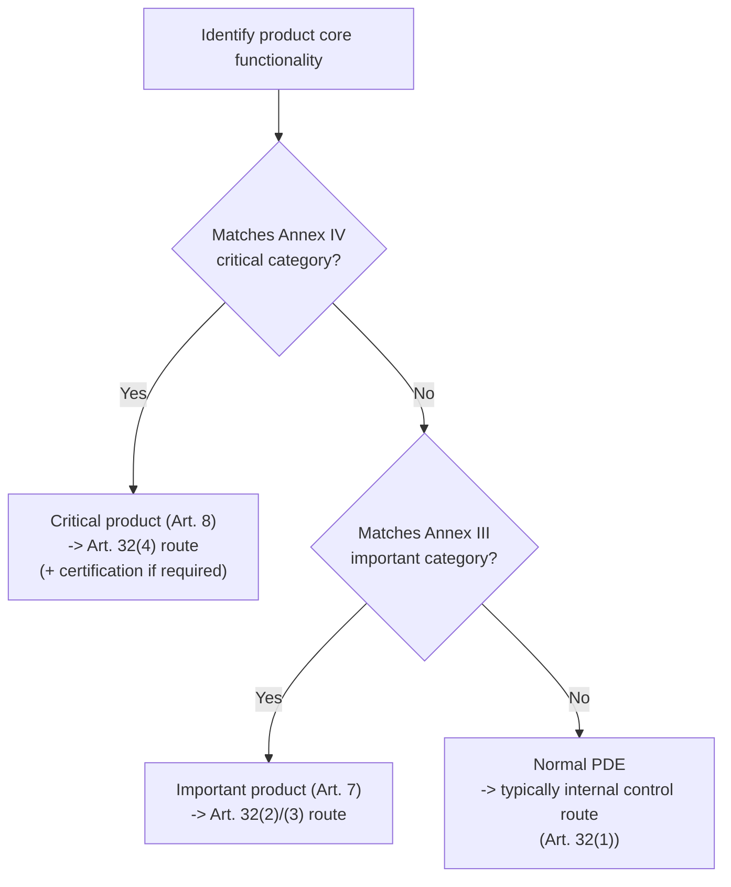

---
id: cra-scope-definitions
slug: /security/cra/scope-and-definitions
title: Scope, Definitionen und Klassifizierung
sidebar_position: 2
---

## Warum Scope zählt (für Embedded-Teams)

Der CRA ist eine **CE-Marking-Verordnung für Cybersicherheit**: er definiert *was* ins Produkt muss, *wie* der Hersteller Schwachstellen über Zeit handhabt und *welche Evidenz* im Technical File liegen muss.

Für ein Embedded-Produkt bestimmt frühes Scoping:

- die **Zielsicherheitsstufe** (Anhang I),
- die **Conformity-Route** (selbst vs Drittpartei), abhängig von **Anhang III/IV**, 
- Umfang/Lebensdauer der **Technischen Dokumentation** (inkl. Updates während der Supportperiode),
- operative Pflichten für **Vulnerability Handling** und **Security Updates**.

---

## 1) CRA-Scope: der rechtliche Auslöser in Engineering-Sprache

CRA gilt für **Products with Digital Elements**, die auf dem EU-Markt bereitgestellt werden, **wenn Zweck oder vorhersehbare Nutzung eine direkte oder indirekte logische oder physische Datenverbindung** zu Gerät oder Netzwerk einschließt (Art. 2(1)).

Wenn Ihr Gerät (oder seine Software) über irgendein Interface Daten in ein vernetztes Umfeld bringen kann, gilt CRA.

### Datenverbindung (was zählt)

CRA definiert:

- **logische Verbindung**: virtuelle Verbindung über Software-Interface (Art. 3(8));
- **physische Verbindung**: per Kabel oder Funk (Art. 3(9));
- **indirekte Verbindung**: Verbindung als Teil eines größeren Systems, das direkt verbindbar ist (Art. 3(10)).

Für Embedded heißt das, alle folgenden sind „Verbindungen“ im CRA-Sinn:

- Ethernet, Wi-Fi, Cellular, Thread, BLE, Zigbee, LoRaWAN
- USB (CDC/DFU), UART, SPI, I2C via Gateway/Host
- CAN/CAN-FD, Modbus, RS-485, PROFINET, EtherCAT bei Bridge zu IP
- Debug-Interfaces (SWD/JTAG), wenn im Feld erreichbar (Risikoanalyse)

---

## 2) Kernbegriffe, die Sie konsistent nutzen müssen

### 2.1 Product with Digital Elements (PDE)

Ein **Product with Digital Elements** ist ein Software- oder Hardwareprodukt **und seine Remote Data Processing-Lösungen**, inklusive Komponenten, die separat in Verkehr gebracht werden (Art. 3(1)).

Engineering-Interpretation:

- Ein PDE kann **Gerät + Firmware + App + Cloud** sein, wenn der Remote-Teil für Funktionen nötig ist.
- Ein **Software-only**-Liefergegenstand kann PDE sein (z.B. Gateway-Agent).
- Modul/SDK/Library kann PDE sein, wenn Sie es separat vermarkten.

### 2.2 Remote Data Processing (RDP)

**Remote Data Processing** ist Verarbeitung aus der Ferne, entworfen/entwickelt vom Hersteller oder unter dessen Verantwortung, **ohne die das PDE eine Funktion nicht erbringen könnte** (Art. 3(2)).

Wichtig, weil OTA, Provisioning, Telemetrie, Flottenmanagement oft off-device liegen.

#### PDE-Grenzdiagramm (typisch Embedded)

---

## 3) Was ist out-of-scope (und was nicht)

### 3.1 Explizite Ausnahmen (Art. 2)

CRA gilt **nicht** für:

- bestimmte sektorregulierte Produktfamilien in Art. 2(2)-(4);
- Ersatzteile, die identische Komponenten ersetzen (Art. 2(6));
- Produkte für nationale Sicherheit/Verteidigung oder für klassifizierte Informationen (Art. 2(7)).

CRA kann begrenzt sein, wenn andere EU-Regeln dieselben Cyberrisiken bereits adressieren (Art. 2(5)).

### 3.2 Häufiger Irrtum „FOSS ist raus“

**Keine generelle FOSS-Ausnahme.** CRA hat ein eigenes Regime für **Open-Source Software Stewards** (Art. 3(14), Art. 24) und regelt kommerzielle Platzierung sorgfältig.

Wenn Sie ein kommerzielles Gerät mit OSS shippen, bleibt es ein PDE und Sie sind Hersteller.

---

## 4) „Ist mein Embedded-Produkt im Scope?“ – Entscheidungsworkflow

Wenn **"In scope: PDE"**, weiter mit:
- *Fundamental Security Requirements* (Anhang I, Teil I),
- *Secure Development Lifecycle / Prozesse* (Anhang I, Teil II),
- *Vulnerability Handling & Reporting* (Art. 14 + Anhang I Teil II),
- *Conformity Assessment* (Art. 32 + Anhang VIII).

---

## 5) Rollen: wer hat welche Pflichten?

CRA weist Pflichten **Economic Operators** zu (Art. 3(12)). Für Embedded-Ketten sind zentral:

### 5.1 Manufacturer (Sie besitzen die Sicherheitsstory)

**Manufacturer**: wer ein PDE entwickelt/herstellt (oder herstellen lässt) und es unter eigenem Namen/Marke vermarktet, egal ob bezahlt/gratis (Art. 3(13)).

Praktisch: wenn Sie **Firmware-Inhalt**, **Update-Policy** und **CE-Dossier** steuern, sind Sie Hersteller, auch bei ODM/EMS-Hardware.

Pflichten stehen primär in **Art. 13 und 14** (Annex I-Konformität sicherstellen; Doku/DoC; Vulnerability Handling; Incident Reporting; Supportperiode; Updates).

### 5.2 Importeur

Pflichten in **Art. 19** (Nachverfolgbarkeit, DoC bereithalten, Technical Documentation vorlegen, Maßnahmen, Risiken melden etc.).

### 5.3 Distributor

Pflichten in **Art. 20** (Sorgfalt; CE/Docs prüfen; keine non-compliant Produkte vertreiben; Vulnerabilities melden; kooperieren).

### 5.4 Wann Importeur/Distributor „Manufacturer“ wird

Wenn Importeur/Distributor unter eigener Marke vertreibt oder **wesentlich ändert**, werden sie Hersteller mit Pflichten nach Art. 13/14 (Art. 21).

Andere, die wesentlich ändern und in Verkehr bringen, werden Hersteller für den geänderten Umfang (Art. 22).

### 5.5 Open-Source Software Stewards (falls relevant)

Definiert in Art. 3(14). Pflichten in Art. 24 (Security Policy, Kooperation, spezifische Incident-Pflichten, wenn sie Infra betreiben).

#### Rollendiagramm

---

## 6) Klassifizierung: normal vs important vs critical

Bestimmt Route und Tiefe der Prüfung.

### 6.1 Important Products (Anhang III)

Produkte mit **Kernfunktion** aus **Anhang III** sind **Important Products** und unterliegen Verfahren nach Art. 32(2)/(3) (Art. 7(1)).

Anhang III hat **Class I** und **Class II**; Kommission kann Liste anpassen (Art. 7(3)) und technische Beschreibungen veröffentlichen (Art. 7(4)).

### 6.2 Critical Products (Anhang IV)

Produkte mit Kernfunktion in **Anhang IV** sind **Critical Products**. Konformität über Cybersecurity Certification (falls gefordert) oder hoch­wertige Verfahren (Art. 8 + Art. 32(4)).

### 6.3 Klassifizierungs-Workflow

**Engineering-Tipp:** „Core functionality“ ≠ „enthält eine Library“. Eine SSH-Server-Library macht ein Sensorprodukt nicht automatisch zu SSH-Kerngerät.

---

## 7) CRA-Vokabular (einmal definieren, überall nutzen)

Nutzen Sie die CRA-Definitionen für konsistente Risk Assessment, Architektur und Update-Policy:

- **cybersecurity risk** / **significant cybersecurity risk** (Art. 3(37)-(38))
- **SBOM** (Art. 3(39))
- **vulnerability / exploitable / actively exploited** (Art. 3(40)-(42))
- **incident impacting the security of the PDE** (Art. 3(44))

Diese steuern Reporting-Trigger und die Aussage „keine bekannten exploitable Vulnerabilities“ beim Release.

---

## 8) Praktische Embedded-Lieferobjekte, die Scope-Entscheidungen belegen

Für Audits/Surveillance sollten Sie zeigen können:

1. **Scope Statement** (1 Seite): PDE-Grenze + RDP-Grenze + Interfaces. (Art. 2(1), Art. 3(1)-(2))
2. **Konnektivitätsinventar**: physische/logische Interfaces, was in Produktion offen ist, wie geschützt. (Art. 3(8)-(10))
3. **Rollendeklaration**: Mapping Manufacturer/Importer/Distributor + wer Update-Infra betreibt. (Art. 3(12)-(14), Art. 19-21, Art. 24)
4. **Klassifizierungsentscheidung**: Anhang III/IV-Check mit Begründung „core functionality“. (Art. 7-8)
5. **Change-Control-Regel**: was intern als „substantial modification“ gilt und wie Klassifizierung + Risiko neu bewertet wird. (Art. 21-22)

---

## 9) Häufige Probleme und Lösungen

### A) „Wo ziehen wir die PDE-Grenze?“
**Problem:** nur das Gerät dokumentiert, aber OTA/Provisioning/Telemetry nötig.  
**Lösung:** wenn RDP-Abwesenheit Funktionen verhindert, RDP als Teil der PDE behandeln (Art. 3(2)), in Architekturdiagramm und Risiko festhalten.

### B) „Ist USB/UART/BLE wirklich eine Netzverbindung?“
**Problem:** „lokal, also gilt CRA nicht“.  
**Lösung:** CRA-Scope umfasst indirekte Verbindungen (Art. 2(1) + Art. 3(10)). Wenn das Interface realistisch in ein Netzwerk bridged, in Scope/Threat Model aufnehmen.

### C) „Wir nutzen OSS, sind wir ausgenommen?“
**Problem:** OSS-Stewardship vs Manufacturer-Pflichten verwechselt.  
**Lösung:** kommerzielles Produkt bleibt PDE; Sie bleiben Manufacturer (Art. 3(13)). OSS-Steward-Pflichten (Art. 24) ersetzen Herstellerpflichten nicht.

### D) „Wir sind Distributor, aber flashen unsere Firmware“
**Problem:** Distributor glaubt an leichte Pflichten, reflasht und rebrandet.  
**Lösung:** Rebranding oder wesentliche Änderung kann Manufacturer-Rolle auslösen (Art. 21-22). Release wie Hersteller-Release behandeln.

### E) „Important/Critical unklar“
**Problem:** Vorhandensein einer Komponente vs Kernfunktion.  
**Lösung:** dokumentieren, wofür das Produkt vermarktet wird; Anhang III/IV nach **Kernfunktion** mappen (Art. 7-8). Begründung ins Technical File.

### F) „Wir wissen nicht, was ins Technical File gehört“
**Lösung:** mindestens Scope-Diagramme, Interface-Inventar, Rollenmapping, Klassifizierung, Change-Control-Regel. CRA verlangt Doku vor Inverkehrbringen und während Supportperiode (Art. 31).

---

## Referenzen (normativ)

[1] Regulation (EU) 2024/2847 (CRA) - konsolidierter Text (EUR-Lex): https://eur-lex.europa.eu/legal-content/EN/TXT/?uri=CELEX:32024R2847  
[2] CRA Artikel 2 (Scope) - siehe [1], Art. 2(1)-(7).  
[3] CRA Artikel 3 (Definitionen: PDE, RDP, logische/physische/indirekte Verbindung, Manufacturer, OSS Steward) - siehe [1], Art. 3(1)-(14).  
[4] CRA Artikel 7-8 (Important/Critical Products) + Anhang III-IV - siehe [1].  
[5] CRA Artikel 19-22 und 24 (Importer/Distributor-Pflichten, wann sie Manufacturer werden; OSS Stewards) - siehe [1].  
