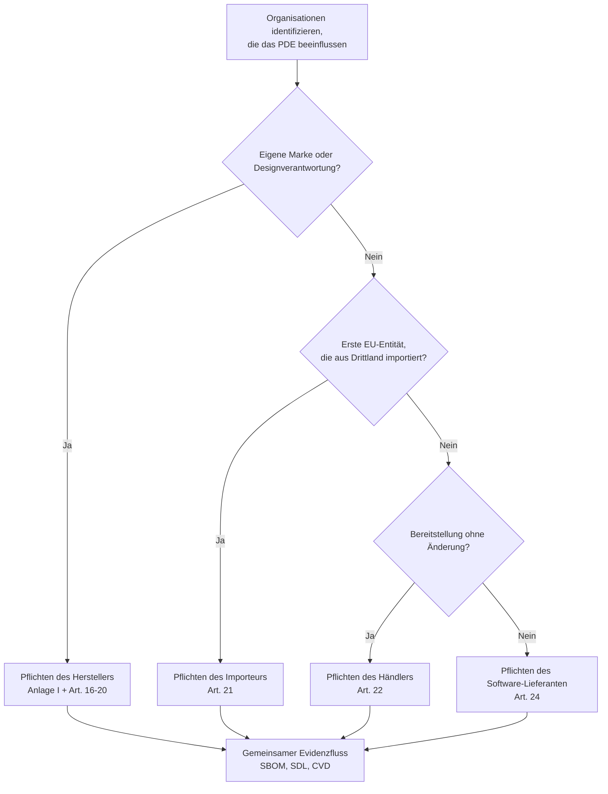

## Warum der Scope wichtig ist

Bevor Entwicklungsressourcen gebunden werden, müssen Sie wissen, **ob Ihr Produkt in den Geltungsbereich des CRA fällt** und, falls ja, **welcher Klasse** es zugeordnet ist. Das bestimmt:

- wie streng die **Konformitätsbewertung** ausfallen muss,  
- wie umfangreich die **technische Dokumentation** sein muss,  
- und welche **Pflichten nach dem Inverkehrbringen** gelten.  

Der CRA verwendet den Sammelbegriff **„Product with Digital Elements“ (PDE)**, definiert in Art. 3(1).[1] In der Praxis fallen die meisten Embedded‑Geräte, Gateways und Firmware‑Images, an denen Sie arbeiten, darunter.

> 📘 **Referenz.** Wenn Sie den genauen Rechtswortlaut benötigen, schlagen Sie die Veröffentlichung der Verordnung (EU) 2024/2847 im Amtsblatt nach.[1]

Art. 2(2) stellt außerdem klar, was **nicht in den Scope** fällt – etwa Produkte ausschließlich für nationale Sicherheit/Militär, streng geheime Forschungsprototypen ohne Marktbereitstellung oder reine Software, die unentgeltlich ohne Monetarisierung bereitgestellt wird.[2] Nutzen Sie diese Ausnahmen sparsam und dokumentieren Sie Ihre Begründung im CRA‑Technikdossier.

---

## Fällt mein Embedded‑Produkt in den Scope?

Stellen Sie sich diese Fragen (abgeleitet aus Art. 2–3 CRA).[1][2]

1. **Enthält das Produkt Software oder Firmware, die Code ausführen kann?**  
   - Mikrocontroller, SoC, SPS, Router, Gateway, Smart Sensor etc.  
2. **Wird es als Produkt auf dem EU‑Markt bereitgestellt (oder in Betrieb genommen)?**  
   - Verkauf als Gerät, Integration in eine Maschine oder Lieferung als Teil eines Systems.  
3. **Kann es direkt oder indirekt mit einem Netzwerk verbunden werden?**  
   - Ethernet, WLAN, Mobilfunk, Feldbus, BLE, USB, proprietäre Funkprotokolle…  

Wenn Sie alle drei Fragen mit „Ja“ beantworten, handelt es sich sehr wahrscheinlich um ein **PDE im Sinne des CRA**.  

Reine interne Tools (z. B. ein einmalig verwendetes Programmier‑Jig im Labor) sind meist außerhalb des Scopes, aber Boards, Module oder Firmware, die an Kunden ausgeliefert werden, nicht.

---

## Rollen: Wer ist „Hersteller“?

Der CRA betrachtet Rollen, nicht Jobtitel. Kapitel II ordnet jeder Rolle konkrete rechtliche Pflichten zu, daher brauchen Sie eine präzise Definition, bevor Sie Dokumentation oder Verantwortlichkeiten planen.

**Hersteller.** Hersteller ist jede natürliche oder juristische Person, die ein PDE unter ihrem eigenen Namen oder ihrer eigenen Marke in Verkehr bringt und die Gestaltung, Stückliste und den sicheren Entwicklungsprozess steuert.[3] Wenn Sie den Firmware‑Inhalt oder das CE‑Dossier verantworten, sind Sie Hersteller – selbst wenn die Hardware von einem ODM/EMS stammt.

**Importeur.** Importeur ist die erste in der EU ansässige Stelle, die ein Drittlandsprodukt zur weiteren Verteilung erhält. Importeuren obliegt u. a., zu prüfen, ob die Konformitätserklärung den tatsächlichen Firmware‑Stand abdeckt, CE‑Kennzeichnung und technische Dokumentation vorliegen und Sendungen zu stoppen, wenn CRA‑Vorgaben nicht erfüllt sind.

**Händler/Distributor.** Distributoren bringen das PDE ohne Änderungen in Verkehr. Sie halten Nachverfolgungsdaten bereit, vermeiden den Vertrieb nicht‑konformer Chargen und unterstützen Korrekturmaßnahmen aus dem Schwachstellenmanagement oder aus Marktüberwachungs‑Anordnungen.

**Software‑Lieferant.** Ein Firmware‑, SDK‑ oder Cloud‑Anbieter wird zum Lieferanten im Sinne von Art. 24, doch bleibt der Hersteller verantwortlich, sofern vertraglich nichts anderes geregelt ist. Lieferanten müssen dennoch SDL‑Aktivitäten und Schwachstellenmanagement nachweisen, damit der Hersteller sie in sein Technikdossier übernehmen kann.

---

## Kritikalitätsklassen (wichtige / kritische Produkte)

Der CRA unterscheidet zwischen **normalen PDEs** und solchen, die als **wichtig** oder **kritisch** eingestuft werden (höheres Risiko). Beispiele:

- Identitätsmanagement‑Systeme, Sicherheitstoken,  
- bestimmte Komponenten der industriellen Steuerung,  
- Betriebssysteme und Hypervisoren, die andere PDEs ausführen (siehe Anlage III).[3]  

Für wichtige/kritische Klassen gilt häufig:

- **Drittparteien‑Konformitätsbewertung** ist verpflichtend,  
- Sicherheitsmängel führen eher zu regulatorischer Aufmerksamkeit.

Wenn Sie z. B. stromsparende MCUs für Sensoren oder einfache Gateways entwickeln, gehören Sie typischerweise zur Kategorie **„normales PDE“** – prüfen Sie aber immer Anlage III, bevor Sie von reiner Selbsteinschätzung ausgehen.[3] Dokumentieren Sie diese Prüfung in Ihrem CRA‑Task‑Tracker (Jira/Notion etc.), damit Auditoren den Entscheidungsweg nachvollziehen können.

---

## Wichtige CRA‑Begriffe

- **Vulnerability (Schwachstelle)**: eine Schwäche, die zur Verletzung von Vertraulichkeit, Integrität oder Verfügbarkeit ausgenutzt werden kann.  
- **Security Update (Sicherheitsupdate/Patch)**: Software‑/Firmware‑Änderung, die eine oder mehrere Schwachstellen mitigiert oder die Sicherheit erhöht.  
- **Supportzeitraum**: Zeitraum, in dem der Hersteller Sicherheitsupdates und Schwachstellenmanagement bereitstellt.  
- **Inverkehrbringen**: erstes Bereitstellen eines Produkts zur Verteilung oder Nutzung im EU‑Binnenmarkt, nicht jeder einzelne Verkauf.  

Behalten Sie diese Definitionen im Kopf (sie hängen direkt mit Art. 3 und Anlage I zusammen)[1]. Sie tauchen in den Abschnitten **SDL**, **Schwachstellenmanagement** und **Konformitätsbewertung** wieder auf. Bei Unklarheiten zitieren Sie die exakte Definition in Design‑Reviews oder Produktanforderungen, damit alle auf derselben Basis argumentieren.

\[1]: CRA Regulation (EU) 2024/2847(Article 3 and Annex I) https://eur-lex.europa.eu/legal-content/EN/TXT/?uri=CELEX:32024R2847  
\[2]: CRA Regulation (EU) 2024/2847 (Article 2): https://eur-lex.europa.eu/legal-content/EN/TXT/?uri=CELEX:32024R2847  
\[3]: CRA Regulation (EU) 2024/2847 (Chapter II and Annex III): https://eur-lex.europa.eu/legal-content/EN/TXT/?uri=CELEX:32024R2847

