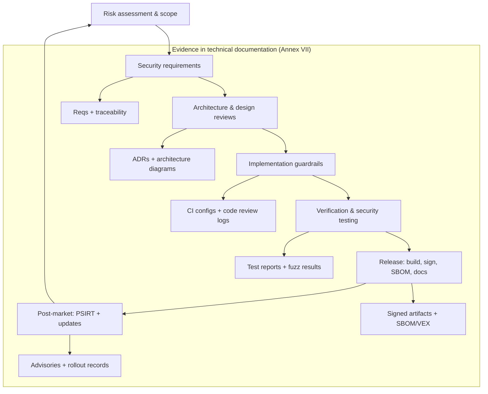
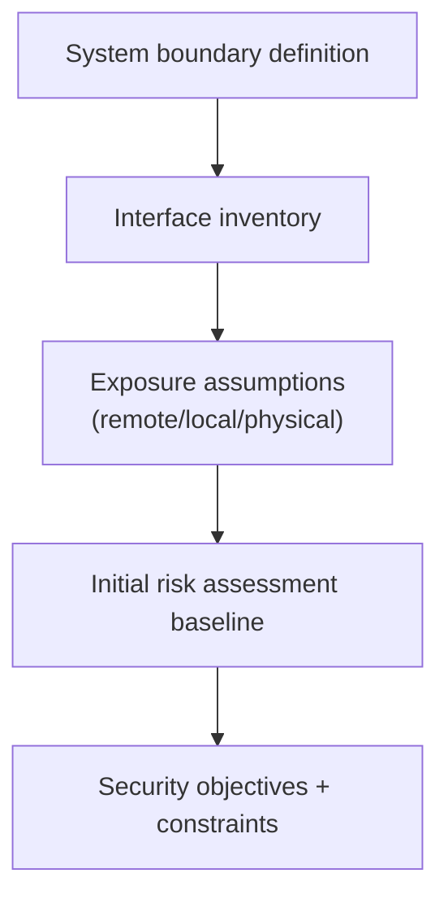
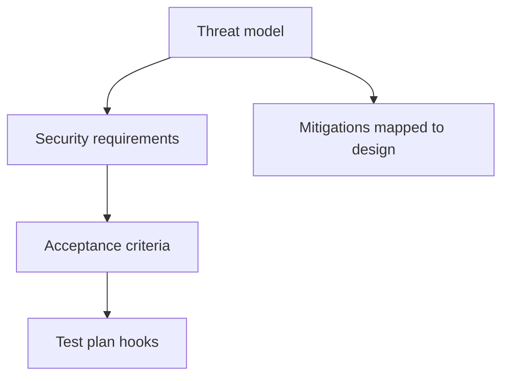
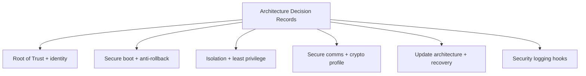
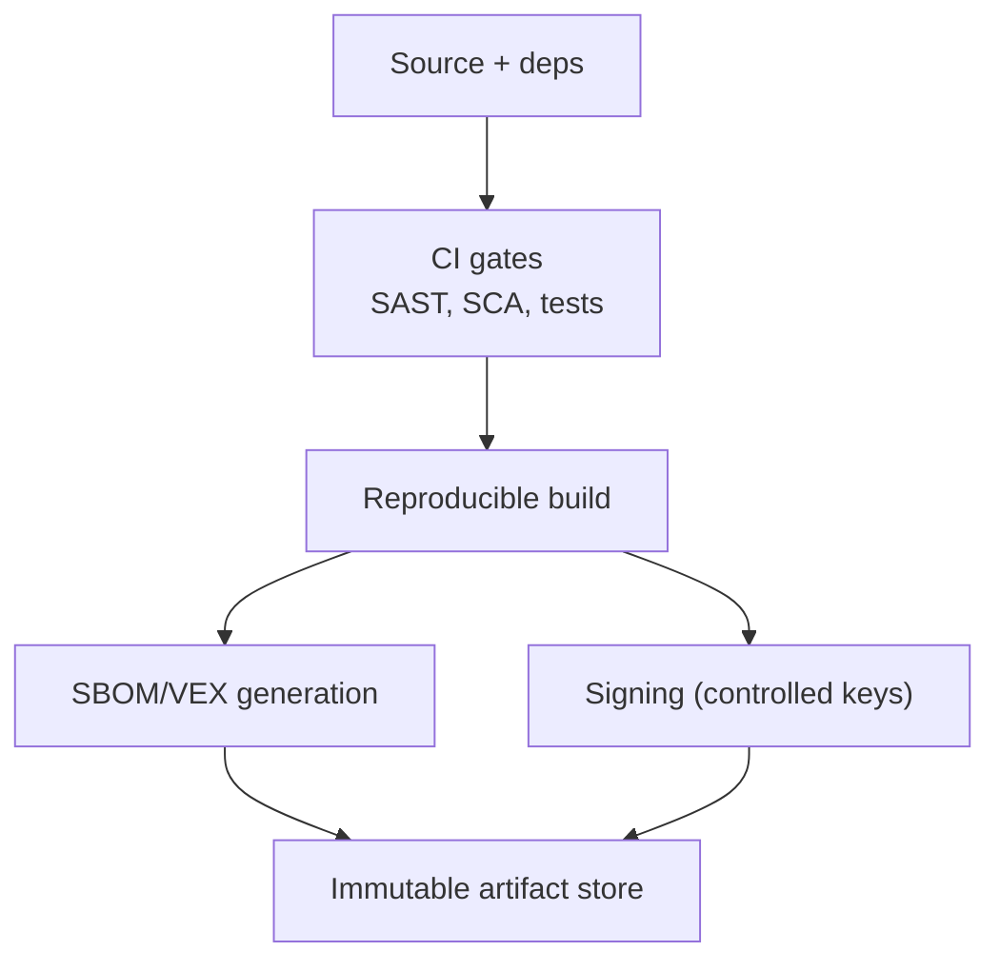
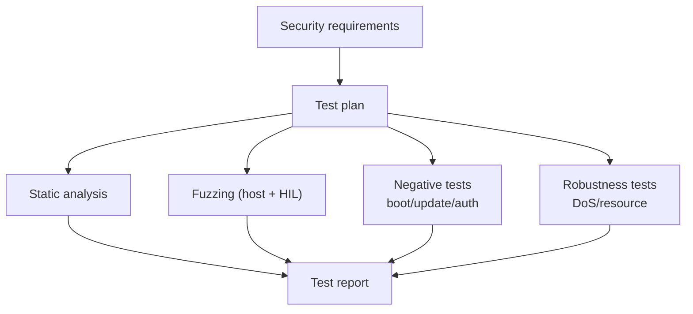
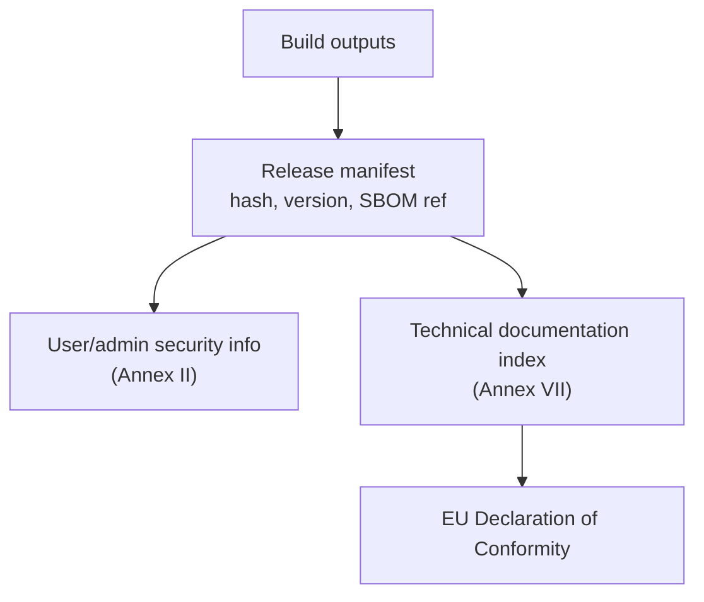
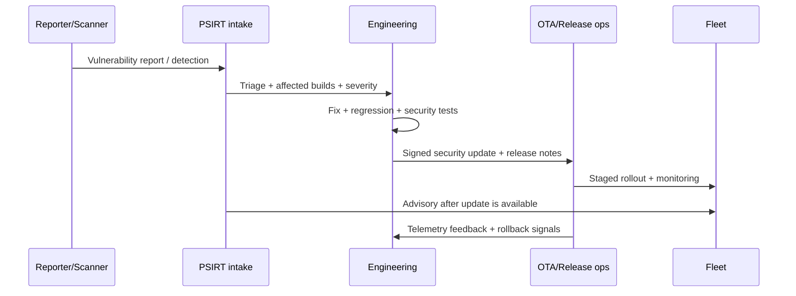
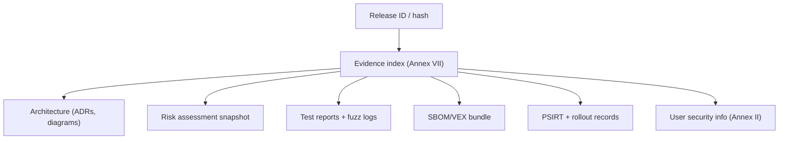

---
id: cra-sdl
slug: /security/cra/secure-development-lifecycle
title: Secure Development Lifecycle (SDL)
sidebar_position: 5

last_update:
  author: 'Ayoub Bourjilat (AC6)'
  date: '2025-12-19'
---

## Warum ein SDL (CRA-Sicht)

CRA bewertet **nicht nur die finale Firmware**. Hersteller müssen vor dem Inverkehrbringen sicherstellen, dass das PDE **entwickelt und produziert** wurde gemäß den Essential Requirements (Anhang I Teil I).[1]

Weiter fordert CRA:
- **Cybersecurity Risk Assessment**, dokumentiert, einbezogen in Planung/Design/Entwicklung/Produktion/Bereitstellung/Wartung.[2]
- Technische Doku **vor** Markteinführung erstellen und **kontinuierlich aktualisieren** mind. während der **Supportperiode**; Inhalte in Anhang VII.[3]
- Konformität kann über **harmonisierte Standards** oder **Common Specs** gezeigt werden; SDL muss standardisierbar/auditierbar sein.[4]

Für Embedded: **SDL ist der Nachweis, dass Anhang I umgesetzt ist**, Release für Release.

---

## Wie ein CRA-reifes SDL für Embedded aussieht

1. **Evidence-first**: jede Phase erzeugt Artefakte, die im Technical File indexiert werden.[3]
2. **Risk-driven**: Kontrollen begründet durch Risikobewertung (Art. 13(2)-(4)).[2]
3. **Lifecycle-komplett**: Design → Release → Feld, inkl. Vulnerability Handling & Security Updates (Anhang I Teil II).[1]

---

## SDL-Phasen (Gates, Outputs, CRA-Anker)

### Gate 0 - Produktgrenze & Klassifizierung

Ziel: PDE-Grenze und „Security Environment“ definieren.
- Interfaces (logisch/physisch/indirekt)
- Debug/Manufacturing-Annahmen
- Remote-Abhängigkeiten (Updates, Identity, Telemetrie)
- Varianten (Memory Map, Boot Chain, Radio, Region)

Outputs: Scope-Statement + Kontextdiagramm; Interface-Inventar + Expositionsannahmen; initiales Risk Assessment.

CRA: Risiko über Lebenszyklus (Art. 13(2)-(4)); technische Doku (Art. 31 + Anhang VII).[2][3]

---

### Gate 1 - Security Requirements & Threat Modelling

Ziel: Anhang I Teil I in explizite Anforderungen umsetzen, gegen Threats validieren.

Outputs: Security-Requirements-Liste (mit CRA-IDs), Threat Model + Mitigations, testbare Akzeptanzkriterien.

CRA: Anhang I Teil I; Risk Assessment zeigt Anwendung von I(2) (Art. 13(3)).[1][2]

---

### Gate 2 - Architektur-Reviews (Secure-by-Design)

Ziel: frühe Entscheidungen festzurren (RoT/Identity, Boot, Isolation, Update, Logging, Comms).

Outputs: Architekturdiagramme mit Trust Boundaries; ADRs; Key-Management/Provisioning-Design.

CRA: Anhang I Teil I(2) (Secure-by-default, Access Control, CIA, Angriffsfläche, Logging, Updates); Anhang VII.[1][3]

---

### Gate 3 - Implementation Guardrails (Code/Deps/Build)

Ziel: vermeidbare Schwachstellen und Pipeline-Kompromittierung verhindern.

Outputs: CI-Policy (Checks/Blocker), Dependency-Manifest + SBOM-Job, SOP für Signing/Key-Handling.

CRA: keine bekannten exploitable Vulns (I(2)(a)); Due Diligence Third-Party (Art. 13(5)-(6)); technische Doku (Art. 31(1)).[1][3][2]

---

### Gate 4 - Verifikation & Security Testing

Ziel: beweisen, dass Kontrollen wirken.

Outputs: Security-Testplan; Reports (Pass/Fail, Bugs, Evidence); Fuzz-Korpus + Crash-Triage.

CRA: Anhang I Teil I(2) (Integrität, Access Control, Availability, Logging); Teil II (laufende Tests); Anhang VII (Testevidenz).[1][3]

---

### Gate 5 - Release Engineering

Ziel: Release-artefakte liefern, die auditierbar sind.

Outputs: signierte Images + Hashes + Versions-Metadaten; SBOM pro Build (VEX/Triage-Notizen falls genutzt); Update- und Security-Konfig-Anleitung; „Annex-I-Coverage“-Kurzreport.

CRA: Security Updates + User-Info (Anhang I(2)(c) + Anhang II); technische Doku vor Markt (Art. 31(2)); DoC erklärt Erfüllung (Art. 28(1)).[1][3][5]

---

### Gate 6 - Post-Market: PSIRT + Security Updates

Ziel: PDE während Supportperiode sichern (Vuln-Handling + sichere Updates).

Outputs: PSIRT-Prozess + Tooling; Update-Rollout-Records; Advisory-Templates + Closure-Evidence.

CRA: Vuln-Handling (Anhang I Teil II); Risk Assessment aktualisieren (Art. 13(3)); technische Doku aktualisieren (Art. 31(2)).[1][2][3]

---

## Mapping auf NIST SSDF / IEC 62443-4-1 (optional)

CRA ist die rechtliche Basis. SSDF/IEC 62443-4-1 helfen bei Struktur/Evidenz, ersetzen aber Anhang I nicht.[6][7]

- **Prepare (SSDF PO)** → Gate 0-1
- **Protect (SSDF PS)** → Gate 2-3
- **Produce (SSDF PW)** → Gate 4-5
- **Respond (SSDF RV)** → Gate 6

---

## Was wo lagern (damit Audits keine Archäologie sind)

Designartefakte im Architektur-Repo; CI/Release-Artefakte mit Retention; PSIRT-Records im Tracker; **ein zentrales Technical-File-Index** pro Release-Hash (Anhang VII).[3]

---

## Häufige Probleme (warum es unter CRA zählt)

1) **PDE-Grenze undefiniert** → Updates/Logging/Reporting nicht belegbar.[2][3]
2) **Supportperiode spät entschieden** → Update-Strategie/Kosten nicht ausgerichtet.[2][3]
3) **Varianten-Explosion ohne Evidenz** → mehrere SKUs/Bootketten, nur eine getestet/dokumentiert.
4) **Signing/Keys als Builddetail** → keine Logs/Nachweise, dass Updates authentisch/integer sind.[1][3]
5) **Keine Negative Tests** → Boot/Update nie gegen Downgrade/Korruption/Replays getestet.[1]
6) **SBOM einmalig** → nicht an Release-Hash gebunden, keine Triage/VEX → „keine bekannten exploitable“ nicht belegbar.[1]
7) **Debug-Lifecycle unklar** → bricht Secure-by-default/Angriffsfläche.[1]
8) **PSIRT = E-Mail** → keine dokumentierte Intake/Triage/Fix/Advisory → Teil II nicht verifizierbar.[1]
9) **Evidenz verstreut** → nicht pro Release indexiert → Art. 31 + Anhang VII schwer.[3]
10) **Standards-Evolution ignoriert** → Serienproduktion reagiert nicht auf neue harmonisierte Standards/Common Specs → CRA verlangt Verfahren zur Aufrechterhaltung der Konformität.[2][4]

---

## Referenzen

[1]: Regulation (EU) 2024/2847 (CRA) - Anhang I (Teil I & II) https://eur-lex.europa.eu/legal-content/EN/TXT/?uri=CELEX:32024R2847
[2]: CRA - Artikel 13 https://eur-lex.europa.eu/legal-content/EN/TXT/?uri=CELEX:32024R2847
[3]: CRA - Artikel 31 + Anhang VII https://eur-lex.europa.eu/legal-content/EN/TXT/?uri=CELEX:32024R2847
[4]: CRA - Artikel 27 https://eur-lex.europa.eu/legal-content/EN/TXT/?uri=CELEX:32024R2847
[5]: CRA - Artikel 28 + Anhang II https://eur-lex.europa.eu/legal-content/EN/TXT/?uri=CELEX:32024R2847
[6]: NIST SP 800-218 (SSDF) https://csrc.nist.gov/pubs/sp/800/218/final
[7]: IEC 62443-4-1 (Secure Product Development Lifecycle)

