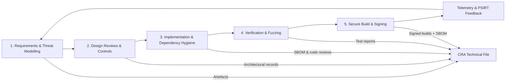

## Warum ein SDL erforderlich ist

Der CRA prüft nicht nur das End‑Binary; er verlangt, dass das Produkt **„entworfen, entwickelt und hergestellt“** wird, wobei Cybersicherheit berücksichtigt wird (Anlage I(1)(a–d)).[1] Das impliziert einen reproduzierbaren **Secure Development Lifecycle**, den Auditoren nachvollziehen können.  

Wir orientieren den SDL an **NIST SSDF** und **IEC 62443‑4‑1**, die von der Kommission als geeignete Rahmen zur Abdeckung von Anlage I genannt werden.[2][3] Verweisen Sie in Ihrem Technikdossier explizit auf diese Dokumente.

---

## 1. Security‑Anforderungen und Threat Modelling

Zu Projektbeginn:

- **Assets**, **Entry Points** und **Threat Actors** für Gerät und System identifizieren,  
- eine Liste von **Security‑Requirements** ableiten, die den Kontrollen der Anlage I zugeordnet sind (siehe „Grundlegende Sicherheitsanforderungen“).  

Nutzen Sie ein leichtgewichtiges STRIDE‑Modell für Embedded‑Systeme: Spoofing, Tampering, Repudiation, Information Disclosure, Denial of Service, Elevation of Privilege.

---

## 2. Design‑Reviews und technische Kontrollen

In der Architektur‑/Designphase:

- definieren, wie Identität, Secure Boot, Kommunikationssicherheit und Update‑Pfad umgesetzt werden (siehe „Embedded‑Kontrollen“),  
- Design‑Entscheidungen und gewählte Normen (ETSI EN 303 645, IEC 62443‑4‑2 etc.) dokumentieren und als Evidenz im Technikdossier referenzieren (siehe [References](./references)).  

---

## 3. Implementierungsqualität und Dependency‑Hygiene

Während der Implementierung:

- Coding‑Standards (MISRA‑C, CERT C) und statische Analyse anwenden,  
- alle **Third‑Party Dependencies** prüfen; nur aktiv gepflegte und lizenzkompatible Komponenten zulassen,  
- eine SBOM im Repo pflegen und bei Änderungen an Abhängigkeiten aktualisieren.  

---

## 4. Verifikation: statisch, dynamisch, Fuzzing

Vor jedem Release:

- **Statische Analyse** auf kritischen Modulen (Parser, Protokoll‑Handling, Kryptonutzung) ausführen,  
- **Unit‑/Integrationstests** implementieren, die Sicherheitsfunktionen abdecken (Access Control, Secure‑Boot‑Fehlermodi),  
- **Fuzzing** für Parser und Protokoll‑State‑Machines einsetzen; für Embedded kombiniert mit Host‑basierten Harnesses und HIL‑Tests.  

Ergebnisse, Defects und Fixes erfassen und mit CRA‑Evidenz sowie den Anforderungen aus Anlage I(1)(h) zu Schwachstellenmanagement und Tests verknüpfen.[1]

---

## 5. Secure Build, Signierung und Release

Für jedes Release‑Build:

- nach Möglichkeit reproduzierbare Builds anstreben (fixierte Toolchain‑Versionen, deterministische Flags),  
- Firmware‑Images mit offline geschützten Schlüsseln signieren und Signier‑Logs archivieren,  
- ein **SBOM + VEX**‑Paket erzeugen und an die Release‑Artefakte anhängen.  

Diese Artefakte fließen direkt in **Technikdossier** und **Developer Checklist** ein und erfüllen die Erwartungen aus Anlage I(2)(a–c) hinsichtlich Update‑Readiness.[1]

[1]: https://eur-lex.europa.eu/legal-content/EN/TXT/?uri=CELEX:32024R2847 "Regulation (EU) 2024/2847 — Annex I"  
[2]: https://csrc.nist.gov/pubs/sp/800/218/final "NIST SP 800-218 (SSDF)"  
[3]: https://webstore.iec.ch/publication/33615 "IEC 62443-4-1 SDL requirements"

