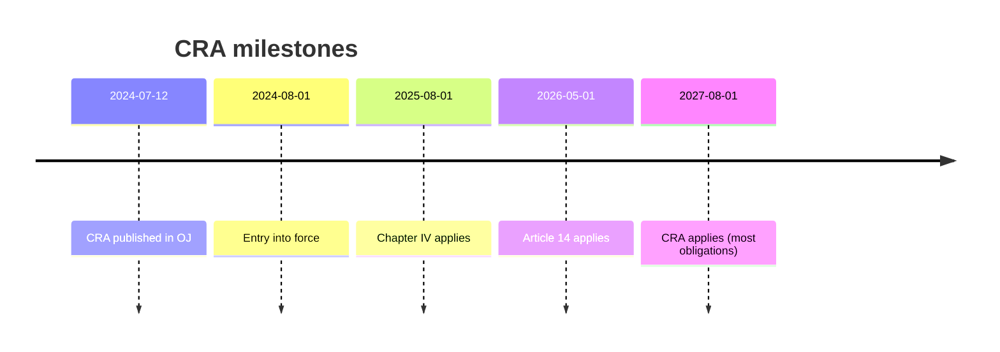
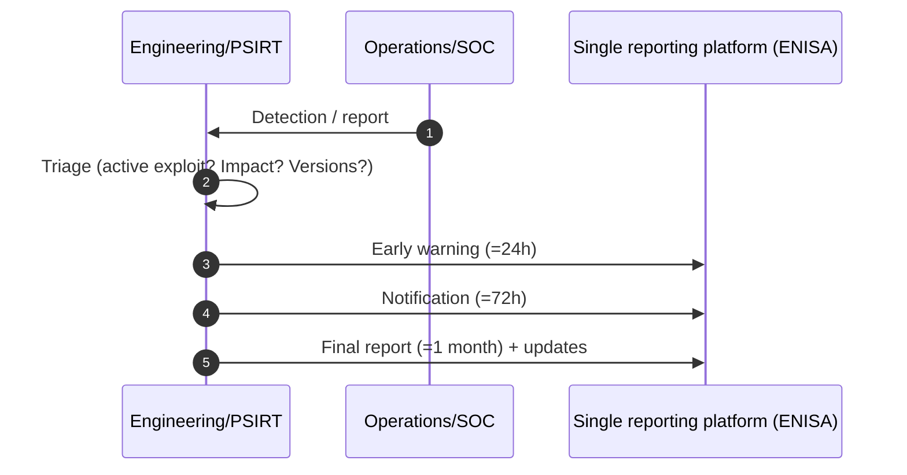
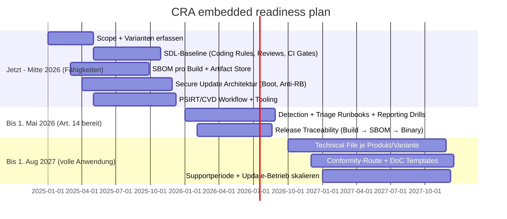

---
id: cra-timelines
slug: /security/cra/timelines-and-enforcement
title: Zeitachsen, Aufsicht und Sanktionen
sidebar_position: 9
---

## Warum Zeitachsen wichtig sind (Embedded)

CRA ist CE-Marking: Wenn es gilt, kann man Compliance nicht nachträglich „patchen“. Für langelebige Embedded-Produkte sind Supportperiode, Update-Logistik, Evidenzaufbewahrung und Reporting über Varianten oft die Knackpunkte.

---

## Wichtige CRA-Daten

Veröffentlicht: **12.07.2024**. Inkraft: **01.08.2024**. Anwendung (Art. 71):
- **+12 Monate (01.08.2025)**: Kapitel IV (Notified Bodies)
- **+21 Monate (01.05.2026)**: Art. 14 (Reporting-Timelines)
- **+36 Monate (01.08.2027)**: Hauptpflichten (Anhang I, Doku, Updates, CE/DoC, Aufsicht)

Nicht verwechseln: Inkraft vs Anwendung.

---

## „Bestehende Produkte“ und Long-Lived Devices

Maßgeblich ist **Inverkehrbringen**. Wenn Sie dasselbe Modell nach CRA-Anwendung platzieren, braucht diese Version Konformität + Technical File.

Fälle: gleiche HW neue FW → neuer Release mit SBOM/VEX, Tests, Update-Story, Supportperiode; HW-Respin → Risiko/Klassifizierung prüfen; Familien/SKUs → Evidenz pro Variante.

---

## Reporting-Timelines (Art. 14)

Ab **01.05.2026**: operativ bereit sein für 24h/72h/Final.

Erfordert Logging/Telemetrie, PSIRT-Workflow, schnelles Mapping Report → betroffene Builds (SBOM + Traceability).

---

## Marktüberwachung & Enforcement

Behörden können Doku anfordern, testen, Korrekturen verlangen (fix, beschränken, zurückrufen) und sanktionieren. Häufige Embedded-Fails: unsicherer/undokumentierter Updatepfad, fehlende SBOM (FW + Toolchain), kein Vuln-Handling/CVD, schwache Defaults (Debug offen, Default-Passwörter), „Paper Security“ ohne Tests.

---

## Sanktionen (Art. 64)

| Kategorie | Max-Bußgeld |
|---|---|
| Verstoß wesentliche Anforderungen / Kernpflichten (inkl. Reporting) | bis **€15 Mio** oder **2,5 %** Umsatz |
| Verstoß Economic-Operator-Pflichten (Doku, Kooperation, Supply-Chain) | bis **€10 Mio** oder **2 %** |
| Falsche/unvollständige/missweisende Infos an Behörden | bis **€5 Mio** oder **1 %** |

Hinweise: Erleichterungen für Kleinst-/KMU bei manchen Fristen; geringere Deckel für OSS Stewards.

---

## Roadmap (Beispiel, align zu Daten)

---

## Phasen (PT1/PT2/PT3) & Standards-Strategie

- **PT1**: Scope/Risk (Annex III), Supportperiode, Update-Policy, SBOM/VEX, PSIRT, Technical-File-Skizze; horizontale Standards nutzen.
- **PT2**: Kontrollen/Tests gemäß (künftigen) harmonisierten Standards; sonst horizontale Standards (z.B. 62443-4-2, 81001-5-1, ETSI EN 303 645) auf Anhang I mappen; vertikale Standards nach Domäne.
- **PT3**: Technical File final, gewählte Konformitätsbewertung (Self vs NB), DoC/CE fertig, Betrieb/Updates für Supportperiode sichern.

---

## Typische Probleme (Self-Check)

1. Inkraft vs Anwendung verwechselt → falsche Planung.
2. „Placing on the market“ für Firmware unklar → welches Build gehört zum CE-Dossier?
3. Supportperiode unklar → Pflichten laufen ins Leere.
4. Offline/Intermittent → trotzdem sicheres Update + Anleitung nötig.
5. Varianten-Explosion → Evidenz pro Variante nötig.
6. Reporting-Readiness unterschätzt → 24h/72h nicht sprinttauglich.
7. Lieferanten-Evidenzlücken → ohne SBOM/Tests/Vuln-Status der Zulieferer keine eigene Konformität.

---

## Referenzen

[1]: CRA, Art. 71 (Anwendungsdaten), Art. 14 (Reporting) https://eur-lex.europa.eu/eli/reg/2024/2847/oj  
[2]: CRA, Art. 64 (Bußgelder) https://eur-lex.europa.eu/eli/reg/2024/2847/oj
