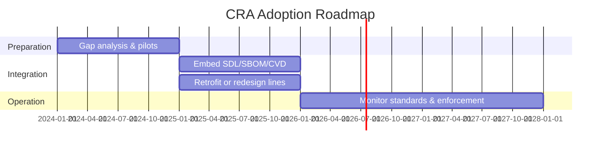

## Grober Zeitplan

Der CRA tritt in Kraft und gilt dann nach einer **Übergangsfrist** (24 Monate für die meisten Pflichten, 36 Monate für das Vulnerability‑Reporting).[1] Hersteller haben Zeit zur Anpassung, aber bestehende Produkte müssen adressiert werden, sobald neue Firmware‑ oder Hardware‑Revisionen in Verkehr gebracht werden.  

Nutzen Sie diese Zeit, um:

- Ihren SDL aufzusetzen,  
- Ihre Strategie für Dokumentation und SBOM zu definieren,  
- bestehende Produktlinien zu überprüfen.  

---

## Bestand vs. Neuentwicklungen

Wichtige Punkte für Embedded‑Hersteller:

- Neuentwicklungen sollten von Anfang an **CRA‑ready** sein,  
- für bestehende, langlebige Produkte planen, ob Sie:
  - CRA‑Kontrollen (Secure Boot, Updates, SBOM, CVD) nachrüsten, oder  
  - Produkte ausphasen, die sich nicht wirtschaftlich härten lassen.  

---

## Marktüberwachung und Durchsetzung

Nationale Behörden und benannte Stellen können gemäß Art. 43–49:

- Ihre technische Dokumentation anfordern,  
- Produkte auf grundlegende Sicherheitsprobleme testen,  
- Korrekturmaßnahmen oder Markt‑Rücknahmen anordnen.  

Bußgelder können erheblich sein, insbesondere bei Vernachlässigung des Schwachstellenmanagements oder unterlassener Bereitstellung von Sicherheitsupdates während des zugesagten Supportzeitraums (Art. 53–68).[1]

---

## Empfohlener Migrationspfad

Eine pragmatische Roadmap:

1. **Jahr 0–1** – Gap‑Analyse und Pilotprojekte.  
   - Aktuelle Praktiken gegen CRA‑Kontrollen mappen.  
   - Basisnormen wählen (IEC 62443‑4‑1/‑4‑2, ETSI EN 303 645) – siehe [References](./references).  

2. **Jahr 1–2** – Integration in die Produktlinien.  
   - SDL, SBOM und CVD in CI/CD integrieren.  
   - Provisioning‑ und Update‑Pipelines aktualisieren.  

3. **Kontinuierlich** – Monitoring von Normung und Leitfäden.  
   - CRA‑harmonisierte Normen über STAN4CRA verfolgen.  

Diese stufenweise Einführung entspricht den Erwartungen der Regulierer an die Reifeentwicklung der Hersteller und passt zu den Leitlinien der Kommission.[2]

[1]: https://eur-lex.europa.eu/legal-content/EN/TXT/?uri=CELEX:32024R2847 "Regulation (EU) 2024/2847 — Articles 71–72 and 43–68"  
[2]: https://digital-strategy.ec.europa.eu/en/policies/cra-summary "CRA summary — European Commission"

