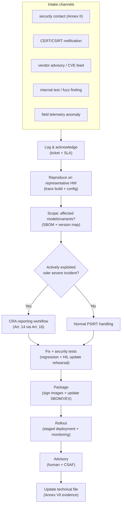

---
id: cra-vuln-handling
slug: /security/cra/vulnerability-handling
title: Vulnerability Handling und Reporting
sidebar_position: 7
---

## Warum Vulnerability Handling eine Kernpflicht ist

Für PDEs müssen Hersteller:
- Vulnerabilities **während der Supportperiode** handhaben (Art. 13(8)),
- Anforderungen aus **Anhang I, Teil II** umsetzen,
- **technische Doku** führen (Anhang VII),
- **Nutzerinfo + Kontakt** bereitstellen (Anhang II),
- und bestimmte Events **melden** (Art. 14-16).

Für Embedded sind PSIRT-Prozess, SBOM/VEX, Update-Pipeline und Telemetrie Compliance-Kontrollen, nicht „nice-to-have“.

---

## Definitionen (Art. 3)

- **Vulnerability**: Schwachstelle, die ausgenutzt werden kann.
- **Exploitable vulnerability**: praktisch ausnutzbar.
- **Actively exploited vulnerability**: belegte Ausnutzung in System ohne Erlaubnis des Betreibers.
- **Incident impacting the security of the PDE**: beeinträchtigt (oder kann) Verfügbarkeit/Authentizität/Integrität/Vertraulichkeit von Daten/Funktionen.
- **SBOM**: formale Liste der Komponenten + Supply-Chain-Bezüge.

Triage muss unterscheiden: CVE existiert vs. betroffen vs. aktiv ausgenutzt → unterschiedliche Pflichten/Timelines/Kommunikation.

---

## Anhang I Teil II als Engineering-Checkliste

1) **Vulnerabilities + Komponenten identifizieren** (SBOM) – maschinenlesbar, mind. Top-Level Dependencies, pro Build/Variante.[8]

2) **Ohne Verzögerung remediieren** (Security Updates, getrennt von Feature-Updates wenn möglich).[8]

3) **Regelmäßige Tests/Reviews** – Host-Fuzz + HIL, Ergebnisse build-gebunden.[8]

4) **Info zu behobenen Vulns veröffentlichen** (Beschreibung, betroffene Produkte, Impact/Severity, Remediation; Verzögerung nur bei begründetem Risiko; Advisories idealerweise CSAF).[8]

5) **CVD-Policy** haben und umsetzen (Safe Harbour, Timelines).[8]

6) **Meldekanal** bereitstellen (Single Point of Contact + ggf. PGP), in User-Doku genannt.[8][2]

7) **Sichere Update-Distribution** (ggf. automatisch) – Authentizität, Integrität, Anti-Rollback, Recovery.[8]

8) **Security Updates ohne Verzögerung, i.d.R. kostenfrei** plus Advisory.[8]

---

## PSIRT-Modell (Embedded)

Klarer Eigentümer, wiederholbare Artefakte, Traceability von Report → Fix → Update → Disclosure → Evidenz.

---

## Variantenbewusste Reichweite

Mehrere SoCs/Radios/Feature-Flags/Bootloader/Cloud-Endpoints → ohne Mapping Variant → Build → SBOM ist Impact-Analyse kaum möglich.

**Daumenregel:** Wenn Sie „Welche Binärfiles sind betroffen?“ in Stunden beantworten können, ist das Reporting reif.

---

## Meldepflichten (Art. 14) – Trigger & Zeitlinien

- **Actively exploited vulnerability** in PDE (Art. 14(1)).
- **Severe incident** mit Auswirkung auf PDE-Sicherheit (Art. 14(3)-(5)).

Beide gehen **gleichzeitig** an koordinierenden **CSIRT** + **ENISA** via **Single Reporting Platform** (Art. 16).

Zeiten:
- **=24h** Early Warning
- **=72h** Notification
- **=14 Tage nach verfügbarer Maßnahme**: Final Report (für Vuln) / **=1 Monat** (für Incident)

Mindestsatz parat haben: Produkt-ID (Modell/FW/Build), Nachweis aktiver Ausnutzung/Indikatoren, initiale Severity/Impact (CIA/Safety), sofortige Mitigations, Status Fix/Rollout.

---

## Nutzer informieren (Art. 14(8))

Bei **Actively exploited** Vulns/Incidents müssen betroffene Nutzer (ggf. alle) mit Mitigation/Correction informiert werden; wo passend, **maschinenlesbar** (z.B. CSAF).

---

## Supply-Chain-Koordination

- **Upstream-Meldung**: Schwachstelle in integrierter Komponente → Maintainer informieren, remediieren (Art. 13(6)).
- **Distributoren** informieren Hersteller ohne Verzögerung (Art. 20).
- **OSS Stewards** haben eigene Pflichten (Art. 24); Teile von Art. 14 können greifen.

Klärung per Vertrag: wer scannt, wer rebuild/signiert, wer Update-Endpoint hostet, wer kommuniziert, wer Telemetrie liefert.

---

## Was ins Technical File muss

Beschreibung von Design/Entwicklung/Produktion **und** Vulnerability Handling inkl. SBOM, CVD-Policy, Kontakt-Nachweis, technische Lösungen für sichere Updates. Alles versioniert und abrufbar.

---

## Häufige Probleme (und wie man sie entschärft)

1. **Produktgrenze unklar** → Reporting inkonsistent.
2. **Varianten-Explosion** → ohne Mapping wird Impact geraten.
3. **Keine Telemetrie** → Awareness zu spät, trotzdem 24h/72h gefordert.
4. **Offline/Air-gap** → Updates trotzdem sicher planen (Authentizität/Integrität/Recovery).
5. **Signing-Keys nicht krisentauglich** → wenn 1 Person + Laptop nötig, 24h/72h kaum haltbar.
6. **Security-Update mit Feature vermischt** → Kunden verweigern; Security-only Pfad vorsehen (Teil II(2)).
7. **Advisory ohne Produkt-ID-Strategie** → Feld kann „affected versions“ nicht mappen.
8. **OEM/ODM-Lücken** → wer advisories/Updates/Researcher-Kommunikation übernimmt, muss klar sein.
9. **Actively exploited vs exploitable verwechselt** → Evidenzschwelle/Entscheidungslog festhalten.
10. **Supportperiode-Mismatch** → CRA fordert mindestens fünf Jahre, außer erwartete Nutzung kürzer (Art. 13(8)).

---

## Referenzen

[1]: CRA (EUR-Lex) http://data.europa.eu/eli/reg/2024/2847/oj
[2]: CRA Artikel 3, 13, 14-17, Anhang II, Anhang I Teil II, Anhang VII https://eur-lex.europa.eu/legal-content/EN/TXT/?uri=CELEX:32024R2847
