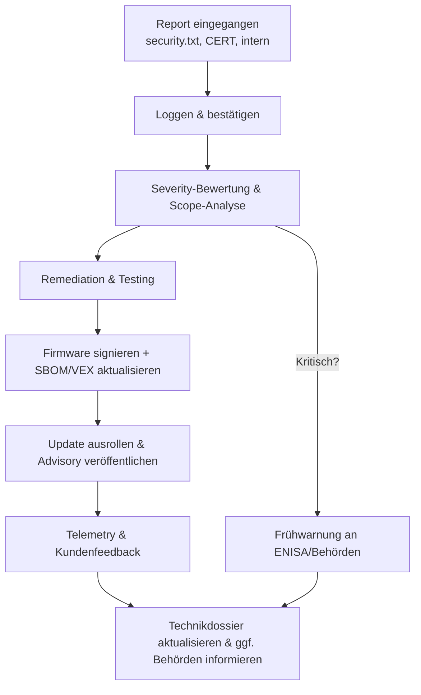

## Warum Schwachstellen‑Management zentral ist

Anlage I, Teil II und die Artikel 53–57 führen explizite Pflichten ein, u. a. für:

- den Empfang von Schwachstellenmeldungen,  
- Triage und Behebung,  
- Bereitstellung von Sicherheitsupdates,  
- Meldung bestimmter Vorfälle an Behörden.  

Das ist nicht optional, sondern Teil des Produktlebenszyklus.

---

## Coordinated Vulnerability Disclosure (CVD) Policy

Orientieren Sie sich an ISO/IEC 29147 und 30111:  

- veröffentlichen Sie eine **security.txt** oder Security‑Seite mit:
  - Kontaktadresse,  
  - Verschlüsselungs‑Key,  
  - erwarteten Reaktionszeiten,  
  - Test‑Scope und rechtlicher „Safe Harbour“‑Formulierung,  
- definieren Sie intern:
  - wer Meldungen entgegennimmt,  
  - wie sie im Ticket‑System erfasst werden,  
  - wie Erstbestätigung und Status‑Updates erfolgen.  

Die Policy sollte im Technikdossier referenziert und in nutzergerichteten Informationen (Anlage II) erwähnt werden.

---

## Intake, Triage und Remediation

Ein Embedded‑orientierter Ablauf:

1. **Intake**  
   - jede Meldung mit Kontaktdaten, betroffenen Versionen und ggf. PoC erfassen,  
   - die Schwere schnell beurteilen (CVSS, Exploitability).  

2. **Triage**  
   - Problem auf repräsentativer Hardware reproduzieren,  
   - alle betroffenen Produktvarianten mittels **SBOMs** und Konfigurationsdaten identifizieren.  

3. **Remediation**  
   - Root Cause beheben und Tests ergänzen, um Regressionen zu vermeiden,  
   - aktualisierte Firmware mit signierten Images und aktualisierter SBOM/VEX vorbereiten,  
   - Änderungen in Release‑Notes und Security‑Advisory dokumentieren.  

4. **Deployment und Nachverfolgung**  
   - Updates über die sichere Update‑Pipeline ausrollen,  
   - Crashes/Telemetry überwachen, die auf unvollständige Fixes hindeuten könnten.  

---

## Meldepflichten

Bei bestimmten Vorfällen – insbesondere mit erheblichem Sicherheits‑ oder Sicherheits‑ (Safety‑) Impact – verlangt der CRA eine **frühzeitige Warnung und Incident‑Meldung** an die zuständigen Behörden (über ENISA‑Plattformen).[1]  

Stellen Sie sicher, dass:

- Sie solche Vorfälle **erkennen** können (Logging/Monitoring),  
- klar ist, wer in Ihrer Organisation für Meldungen verantwortlich ist,  
- Ihre technische Dokumentation genügend Details enthält, um Auswirkungen und Mitigations zu erklären.  

---

## VEX zur Kommunikation der Exploitability nutzen

Wenn eine CVE eine Ihrer Abhängigkeiten betrifft:

- verwenden Sie VEX‑Dokumente, um anzugeben, ob die Schwachstelle  
  - betroffen / nicht betroffen / in Prüfung / behoben ist,  
- verknüpfen Sie VEX‑Einträge mit SBOM‑Komponenten und Produktversionen.  

So zeigen Sie Regulatoren und Kunden, dass Sie bekannte Schwachstellen systematisch verwalten – wie in Anlage I(2) und den Artikeln 55–57 gefordert.[1]

[1]: https://eur-lex.europa.eu/legal-content/EN/TXT/?uri=CELEX:32024R2847 "Regulation (EU) 2024/2847 — Annex I Part II and Articles 53–57"

