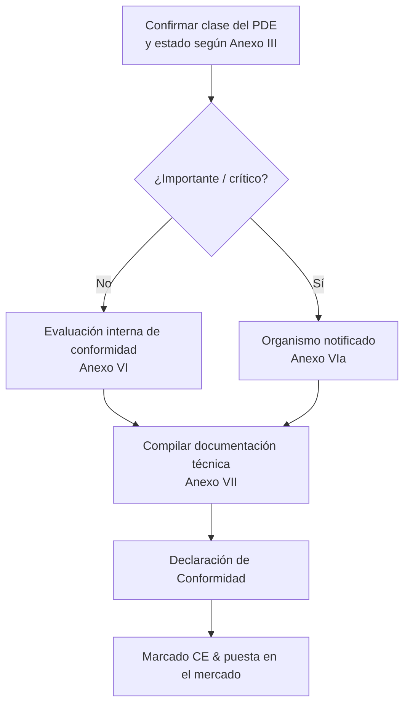

## CRA y ecosistema CE

El CRA es un **reglamento de marcado CE**, similar en espíritu a RED o EMC: debes demostrar que tu producto cumple sus requisitos esenciales antes de ponerlo en el mercado.[1]  

Para muchos PDE embebidos esto se realizará mediante **auto‑evaluación**; para productos importantes/críticos se requiere la intervención de un **organismo notificado** según los Anexos VI/VIa.[1]

---

## Evidencias necesarias

El núcleo de la evaluación de conformidad es tu **documentación técnica** y la **evidencia de proceso** generada por tu SDL, tus SBOM y tus flujos de gestión de vulnerabilidades.[1]  

Ejemplos:

- diagramas de arquitectura y modelos de amenazas,  
- mapeo de controles frente a los requisitos del Anexo I,  
- informes de pruebas y resúmenes de pruebas de penetración,  
- descripciones de procesos de aprovisionamiento y actualización,  
- SBOM junto con VEX u otros formatos de declaración de vulnerabilidades,  
- política CVD y registros de incidentes / gestión de vulnerabilidades.

---

## Rol de las normas

Hasta que existan normas armonizadas CRA citadas en el Diario Oficial, puedes basarte en normas **“state of the art”** referenciadas por la Comisión para demostrar la conformidad (art. 25).[1]  

Ejemplos típicos:

- **IEC 62443‑4‑1 / 4‑2** para seguridad industrial/embebida,  
- **ETSI EN 303 645** para IoT de consumo,  
- **NIST SSDF** para marcos de desarrollo seguro.  

Aplicar normas reconocidas te proporciona una **presunción de conformidad** para los controles correspondientes y facilita el trabajo del organismo notificado.

---

## Declaración de Conformidad (DoC)

La DoC es un documento breve, firmado por el fabricante, que:

- identifica el producto y sus versiones,  
- lista la legislación aplicable (CRA, RED, EMC, LVD, …),  
- referencia las normas y documentos internos utilizados para demostrar la conformidad,  
- identifica a la persona responsable en la UE.  

Mantén la DoC alineada con tu expediente técnico y actualízala cuando se produzcan cambios relevantes en firmware o funcionalidad, para seguir cumpliendo las obligaciones del art. 22.

---

## Lista de comprobación

Antes de declarar la conformidad, verifica:

- [ ] Ámbito y clasificación confirmados (PDE, importante/crítico). Ver [Scope & Definitions](./scope-and-definitions).  
- [ ] SDL definido y aplicado para la versión actual. Ver [SDL](./secure-development-lifecycle).  
- [ ] Controles técnicos embebidos mapeados a los requisitos del Anexo I. Ver [Embedded Technical Controls](./embedded-technical-controls).  
- [ ] Documentación técnica y paquete SBOM completos. Ver [Documentation & SBOM](./documentation-and-sbom).  
- [ ] Proceso de gestión de vulnerabilidades operativo; periodo de soporte definido. Ver [Vulnerability Handling](./vulnerability-handling).  

Esta lista se vincula directamente con la **Developer Checklist** usada por los equipos de ingeniería (ver [Developer Checklist](./developer-checklist)).

[1]: https://eur-lex.europa.eu/legal-content/EN/TXT/?uri=CELEX:32024R2847 "Regulation (EU) 2024/2847 — Articles 16–25 and Annexes VI/VII"

