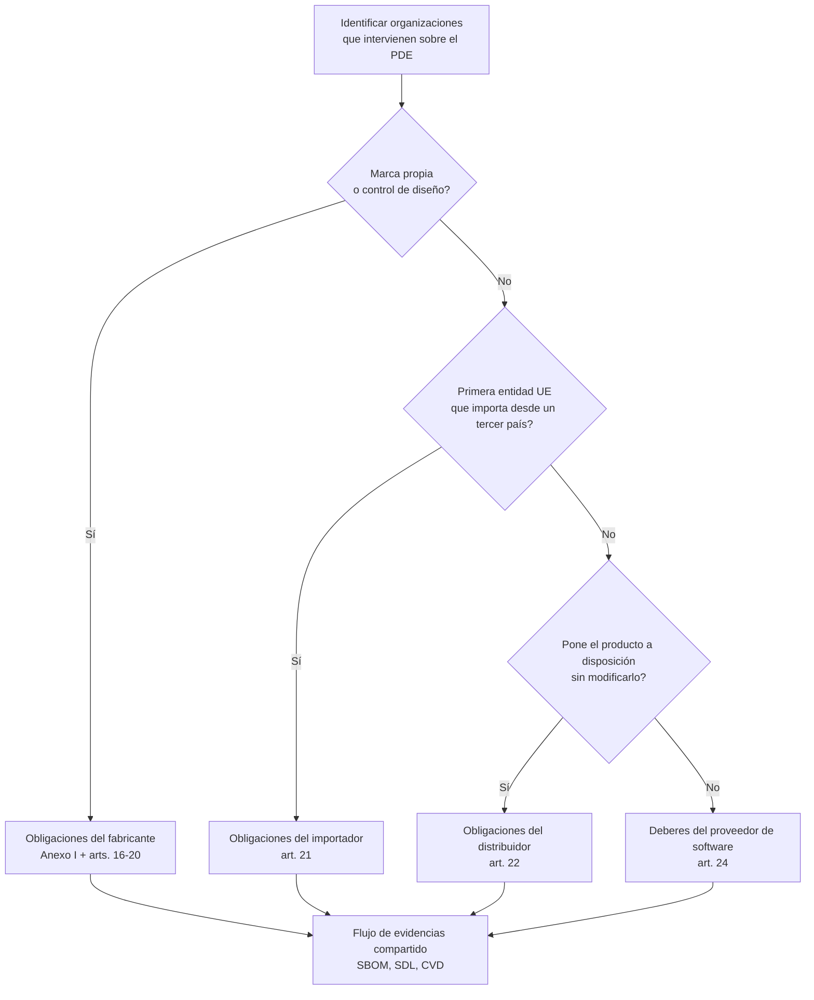

## Por qué importa el ámbito

Antes de invertir esfuerzo de ingeniería, necesitas saber **si tu producto entra en el ámbito del CRA** y, en tal caso, **en qué clase** se encuadra. De ello dependen:

- el nivel de exigencia de la **evaluación de conformidad**,  
- cuánta **documentación técnica** debes mantener,  
- y qué **obligaciones posteriores a la comercialización** se aplican.  

El CRA utiliza el término paraguas **“producto con elementos digitales” (PDE)** definido en el art. 3(1).[1] En la práctica, la mayoría de los dispositivos embebidos, pasarelas e imágenes de firmware en los que trabajas entrarán en esta definición.

> 📘 **Referencia.** Cuando necesites el texto jurídico exacto, consulta la publicación en el Diario Oficial del Reglamento (UE) 2024/2847.[1]

El art. 2(2) también aclara qué queda **fuera de ámbito**: por ejemplo, productos desarrollados exclusivamente para la seguridad nacional/defensa, prototipos de investigación altamente clasificados que no se ponen en el mercado, o software ofrecido gratuitamente sin monetización.[2] Utiliza estas exclusiones con prudencia y documenta el razonamiento en el expediente técnico CRA.

---

## ¿Está mi producto embebido dentro del ámbito?

Hazte estas preguntas (derivadas de los arts. 2–3 del CRA).[1][2]

1. **¿El producto contiene software o firmware capaz de ejecutar código?**  
   - Microcontrolador, SoC, PLC, router, gateway, sensor inteligente, etc.  
2. **¿Se comercializa en el mercado de la UE (o se pone en servicio) como producto?**  
   - Como dispositivo, integrado en una máquina o entregado como parte de un sistema.  
3. **¿Puede conectarse directa o indirectamente a una red?**  
   - Ethernet, Wi‑Fi, celular, bus de campo, BLE, USB, radio propietaria…  

Si la respuesta a las tres es “sí”, casi con seguridad estás tratando con un **PDE en el sentido del CRA**.  

Herramientas internas puras (por ejemplo, un jig de programación usado solo en laboratorio) suelen quedar fuera del ámbito, pero las placas, módulos o firmware que se envían a clientes no.

---

## Roles: quién es el “fabricante”

El CRA se centra en los **roles**, no en los títulos internos. El capítulo II asigna a cada rol obligaciones legales concretas, por lo que necesitas una definición precisa antes de repartir responsabilidades o documentación.

**Fabricante.** Es cualquier persona física o jurídica que introduce un PDE en el mercado bajo su propio nombre o marca mientras dirige el diseño, la lista de materiales y el ciclo de desarrollo seguro.[3] Si controlas el contenido del firmware o el expediente de marcado CE, eres el fabricante, incluso cuando el hardware provenga de un ODM/EMS.

**Importador.** Es el primer agente establecido en la UE que recibe un producto de un tercer país para su distribución. Debe verificar que la Declaración de Conformidad cubre la versión real del firmware, comprobar el marcado CE y la disponibilidad de la documentación técnica, y detener envíos si no se cumplen las condiciones del CRA.

**Distribuidor.** Pone el PDE a disposición sin modificarlo. Mantiene los datos de trazabilidad, evita comercializar lotes no conformes y apoya las acciones correctivas derivadas de la gestión de vulnerabilidades o de la vigilancia de mercado.

**Proveedor de software.** Un proveedor de firmware, SDK o servicio en la nube pasa a ser “supplier” según el art. 24, aunque el fabricante siga siendo responsable salvo acuerdo contractual contrario. Los proveedores siguen necesitando evidencias de SDL y gestión de vulnerabilidades que alimenten el expediente técnico del fabricante.

---

## Clases de criticidad (productos importantes / críticos)

El CRA distingue entre **PDE ordinarios** y aquellos considerados **importantes** o **críticos** (mayor riesgo). Ejemplos:

- sistemas de gestión de identidad, tokens de seguridad,  
- determinados componentes de control industrial,  
- sistemas operativos e hipervisores que ejecutan otros PDE (consulta directamente el Anexo III).[3]  

Para clases importantes/críticas:

- la **evaluación de conformidad por terceros** suele ser obligatoria,  
- los fallos de seguridad tienden a atraer mayor escrutinio regulatorio.

Si desarrollas MCUs de bajo consumo para sensores o pasarelas sencillas, probablemente estés en la categoría de **“PDE normal”**; aun así, verifica siempre el Anexo III antes de asumir que basta con la autoevaluación.[3] Documenta esta revisión en tu herramienta de seguimiento CRA (Jira, Notion, etc.) para que los auditores puedan reconstruir la decisión.

---

## Términos CRA clave

- **Vulnerabilidad**: debilidad que puede explotarse para comprometer confidencialidad, integridad o disponibilidad.  
- **Actualización de seguridad (parche)**: cambio de software/firmware que reduce o elimina una o varias vulnerabilidades o mejora la seguridad.  
- **Periodo de soporte**: tiempo durante el cual el fabricante se compromete a proporcionar actualizaciones de seguridad y gestión de vulnerabilidades.  
- **Puesta en el mercado**: primera vez que un producto se suministra para distribución o uso en la UE (no cada venta individual).  

Ten estos términos en mente (se corresponden directamente con el art. 3 y el Anexo I).[1] Aparecen de nuevo en las secciones sobre **SDL**, **gestión de vulnerabilidades** y **evaluación de conformidad**. En caso de duda, cita la definición exacta en revisiones de diseño o documentos de requisitos para que todos trabajen sobre la misma base.

\[1]: CRA Regulation (EU) 2024/2847 (Article 3 and Annex I) https://eur-lex.europa.eu/legal-content/EN/TXT/?uri=CELEX:32024R2847  
\[2]: CRA Regulation (EU) 2024/2847 (Article 2): https://eur-lex.europa.eu/legal-content/EN/TXT/?uri=CELEX:32024R2847  
\[3]: CRA Regulation (EU) 2024/2847 (Chapter II and Annex III): https://eur-lex.europa.eu/legal-content/EN/TXT/?uri=CELEX:32024R2847

