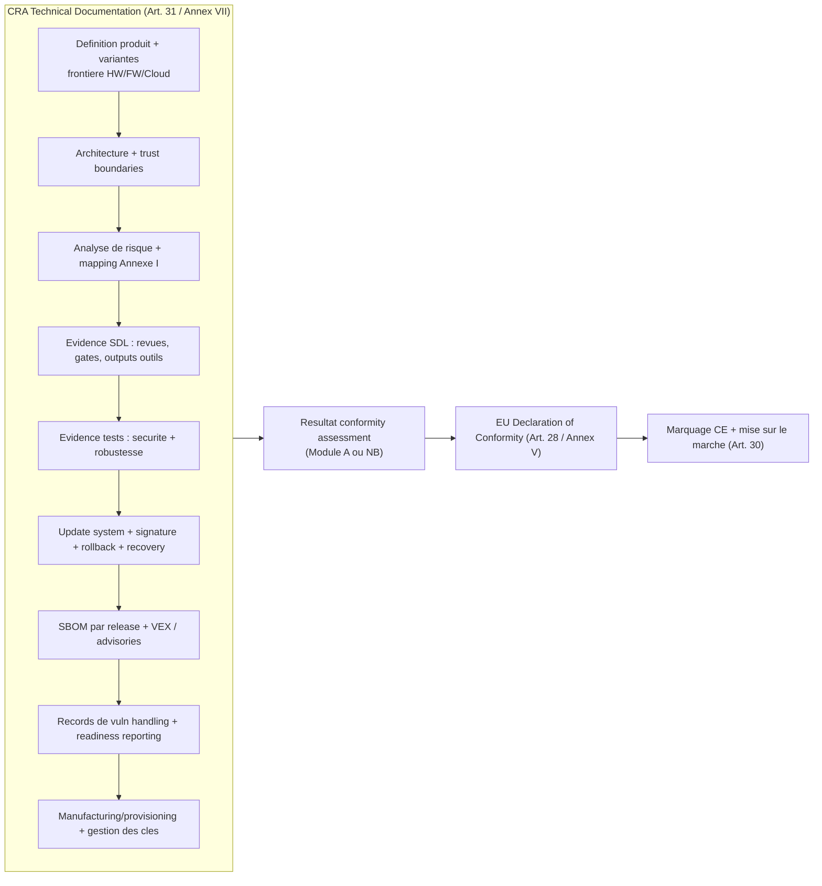

---
id: cra-conformity-assessment
slug: /security/cra/conformity-assessment
title: Conformity Assessment et marquage CE
sidebar_position: 8
last_update:
  author: 'Ayoub Bourjilat (AC6)'
  date: '2025-12-18'
---

## Pourquoi c'est crucial pour les produits embarques

Le CRA est un **reglement de marquage CE** : avant de mettre un PDE sur le marche EU, vous devez pouvoir **demontrer la conformite** aux exigences essentielles de securite (Annexe I) et garder les preuves dans un **package de documentation technique** (Art. 31 + Annexe VII).  
La conformite ne vise pas uniquement le binaire final : le CRA inclut explicitement **les "processus mis en place par le manufacturer"** (Art. 31, Art. 32). Votre SDL, SBOM et vuln handling font **partie de l'objet de conformite**.

Cette page explique **(1) comment choisir la route de conformite**, **(2) a quoi ressemble un set d'evidences CE-ready pour l'embarque**, et **(3) comment le garder valide sur plusieurs releases**.

---

## 1) Identifier la route de conformite (normal / important / critical)

La route CRA depend de si votre PDE est :
- PDE **"normal"** (non liste Important/Critical),
- **Important** (Annexe III, classe I ou II),
- **Critical** (Annexe IV).

Les **procedures de conformite sont a l'Article 32** et utilisees via **les modules de l'Annexe VIII** :
- **Module A** : Internal control (auto-evaluation)
- **Module B + C** : EU-type examination + conformity to type (Notified Body)
- **Module H** : Full quality assurance (Notified Body)
- **EU cybersecurity certification scheme** (si applicable) a un niveau d'assurance au moins "substantial" (Art. 27(8)-(9), Art. 32)

### Logique de decision (Article 32)

```mermaid
flowchart TD
  A[Start: Product with Digital Elements] --> B{Figure en Annexe IV ?}
  B -- Yes --> C[PDE CRITICAL]
  C --> C1{Certification cyber EU<br/>disponible et applicable ?}
  C1 -- Yes --> C2["Utiliser le scheme de certification EU<br/>(Art. 32(4)(a) + Art. 8(1))"]
  C1 -- No --> C3["Utiliser l'une des procedures Art. 32(3)<br/>(B+C ou H ou certification si dispo plus tard)"]

  B -- No --> D{Figure en Annexe III ?}
  D -- No --> E[PDE NORMAL]
  E --> E1["Choix : Module A, ou B+C, ou H, ou certification<br/>(Art. 32(1))"]

  D -- Yes --> F{Classe Annexe III ?}
  F -- Class I --> G[PDE IMPORTANT - Classe I]
  G --> G1{Standards harmonises / common specs / certification<br/>au moins "substantial" appliques ?}
  G1 -- Yes --> G2["Vous pouvez utiliser les routes Art. 32(1)<br/>(incl. Module A) pour les exigences couvertes"]
  G1 -- No --> G3["Pour les exigences non couvertes : B+C ou H<br/>(Art. 32(2))"]

  F -- Class II --> H[PDE IMPORTANT - Classe II]
  H --> H1["Doit utiliser : B+C ou H ou certification (substantial+)<br/>(Art. 32(3))"]
```

### Point cle embarque

Pour beaucoup d'equipes, la "surprise" est **Important Classe I** :
- vous *pouvez* rester en **Module A** _uniquement_ si les exigences pertinentes sont couvertes par des **standards harmonises**, **common specs**, ou **certification cyber EU** au bon niveau ;  
- sinon, Notified Body via **B+C** ou **H** pour les parties non couvertes (Art. 32(2)).

---

## 2) La documentation technique est l'ossature (Art. 31 + Annexe VII)

Article 31 est explicite :
- la doc technique doit contenir **toutes les donnees/details pertinents** montrant la conformite du produit **et** des processus du manufacturer a l'Annexe I ;  
- elle doit etre prete **avant mise sur le marche** et **mise a jour en continu**, au moins pendant la support period.

Structure pratique pour l'embarque :



### Specifiques embarques a verrouiller (questions auditeurs)

- **Objet exact** : revisions HW, SKU SoC, versions firmware, chaine de boot, services distants impactant la securite.
- **Trust boundaries** : ce qui est dans votre scope securite (MCU, gateway, app, cloud).
- **Update/rollback** : images signees, strategie anti-rollback, mode recovery, logs d'echec.
- **Lifecycle des cles** : provisioning, stockage, rotation, reponse a compromission.
- **Evidences par release** : SBOM, rapports de test, correctifs securite, release notes, et quels points Annexe I sont couverts.

---

## 3) Presomption de conformite : ne pas sur-vendre (Art. 27)

Presomption accordee uniquement si :
- vous appliquez des **standards harmonises** publies au JO, ou
- des **common specifications** adoptees par la Commission, ou
- un certificat/declaration cyber EU sous un scheme accepte (Art. 27(8)-(9)).

Le reste (IEC 62443, ETSI EN 303 645, NIST SSDF, etc.) reste d'excellente **evidence state-of-the-art**, mais **pas automatiquement une presomption** tant que non harmonise / reference / converti en common spec.

Approche pratique embarque :
- Utiliser des standards reconnus pour structurer controles et evidences,
- Surveiller quand ils deviennent **harmonises** (pour reclamer la presomption plus tard),
- Garder le mapping Annexe I comme **source of truth**.

---

## 4) EU Declaration of Conformity (Art. 28 / Annexe V) + DoC simplifiee (Annexe VI)

La **DoC UE** :
- affirme que les exigences Annexe I sont demontrees,
- suit le **modele Annexe V** et doit etre **mise a jour** (Art. 28).

Tips embarques :
- Traiter la DoC comme un **artefact versionne** lie a :
  - IDs de release firmware,
  - IDs de SBOM,
  - IDs de campagnes de test,
  - endpoints d'update (si securite impactee).

Si vous livrez une DoC simplifiee, respecter **l'Annexe VI** et inclure le lien vers la DoC complete (Art. 28 + Annexe VI).

---

## 5) Marquage CE (Art. 30) : realites hardware *et* software

Article 30 clarifie :
- CE visible/legible/indelebile sur le produit, ou sur emballage + DoC si impossible,
- et pour les PDE logiciel, CE peut figurer sur la DoC ou le site accompagnant le logiciel.

Pour firmware embarque livre avec un device :
- le marquage CE est generalement sur le device/packaging,
- mais il faut la traçabilite logicielle dans la doc technique et la DoC.

Si un Notified Body intervient via Module H, le marquage CE doit inclure son numero (Art. 30(4)).

---

## 6) "Substantial modification" et qui devient manufacturer (Art. 21-22)

Le CRA est strict sur **qui porte les obligations** :
- Un importer/distributor devient manufacturer s'il met sur le marche sous son nom/marque **ou** effectue une **modification substantielle** (Art. 21).
- Toute autre personne qui modifie substantiellement et met a disposition devient manufacturer pour la partie modifiee (ou le produit entier si impact global) (Art. 22).

Exemples embarques de "modification substantielle" :
- changer les cles de secure boot / trust anchors,
- desactiver des defaults securite,
- remplacer des libs crypto,
- modifier le mecanisme d'update,
- activer le debug en production,
- remplacer un composant securite cle (secure element, config enclave).

**Action** : definir une regle interne sur "ce qui est modification substantielle" et forcer un gate de revue conformite quand c'est le cas.

---

## 7) Checklist "CE-ready" minimale pour une release embarquee

- [ ] **Classification** faite (Normal / Annexe III classe I/II / Annexe IV) + rationale.
- [ ] **Route** selectionnee selon Art. 32 (Module A vs B+C vs H vs certification).
- [ ] **Mapping Annexe I** complete et lie aux evidences d'implementation.
- [ ] **Documentation technique** (Art. 31 / Annexe VII) mise a jour pour cette release.
- [ ] **DoC** creee/mise a jour (Art. 28 / Annexe V) et liee aux IDs de release.
- [ ] **Marquage CE** conforme aux regles (Art. 30), y compris cas logiciel si applicable.
- [ ] **Support period + infos user** disponibles (Art. 13 + Annexe II), alignees avec la realite update.
- [ ] **Packet d'evidence supply-chain** pret pour importers/distributors/OEM integrateurs.

---

## Problemes courants (et solutions)

### 1) "Produit = device, mais la securite depend du cloud/app"
**Pb :** on ne peut pas marquer CE "seulement la carte" si la securite repose sur du distant.  
**Fix :** documenter la *frontiere systeme securite* dans la doc technique : ce qui fait partie de l'environnement securite du PDE et quelles hypotheses s'appliquent.

### 2) "On ne sait pas si Annexe III ou IV"
**Pb :** mauvaise classification = mauvaise route de conformite.  
**Fix :** garder un cross-check ecrit vs items Annexes III/IV et le lier aux fonctions/usage marketing.

### 3) "On utilise IEC/ETSI/NIST - presomption de conformite ?"
**Pb :** confondre "bonne evidence" et "presomption legale".  
**Fix :** presomption seulement si conditions Art. 27 (harmonise / common specs / certification accepte). Sinon, indiquer "alignement state-of-the-art" + mapping Annexe I.

### 4) "Updates firmware changent le comportement - nouvelle DoC a chaque fois ?"
**Pb :** cadence release non geree casse la traçabilite.  
**Fix :** definir une politique : quelles releases exigent un refresh DoC (changements securite, nouvelles interfaces, nouvelle crypto, nouveau flux update) et garder des IDs de release traçables.

### 5) "Beaucoup de variantes (SoC / modules radio)"
**Pb :** evidences non bornees.  
**Fix :** creer une **matrice de variantes** : ce qui change, ce qui reste identique, et quels tests/evidences s'appliquent a chaque variante.

### 6) "ODM/OEM integre notre module - qui est manufacturer ?"
**Pb :** obligations bougent avec branding et modifications substantielles.  
**Fix :** definir contractuellement les responsabilites + fournir un "packet d'evidence" par release, mais se rappeler que le role legal suit la logique Art. 21-22.

---

## References (officielles)

[1]: Regulation (EU) 2024/2847 (Cyber Resilience Act) - Journal Officiel (ELI): http://data.europa.eu/eli/reg/2024/2847/oj  

[2]: Regulation (EU) 2024/2847 - texte consolide (CELEX): https://eur-lex.europa.eu/legal-content/EN/TXT/?uri=CELEX:32024R2847  


