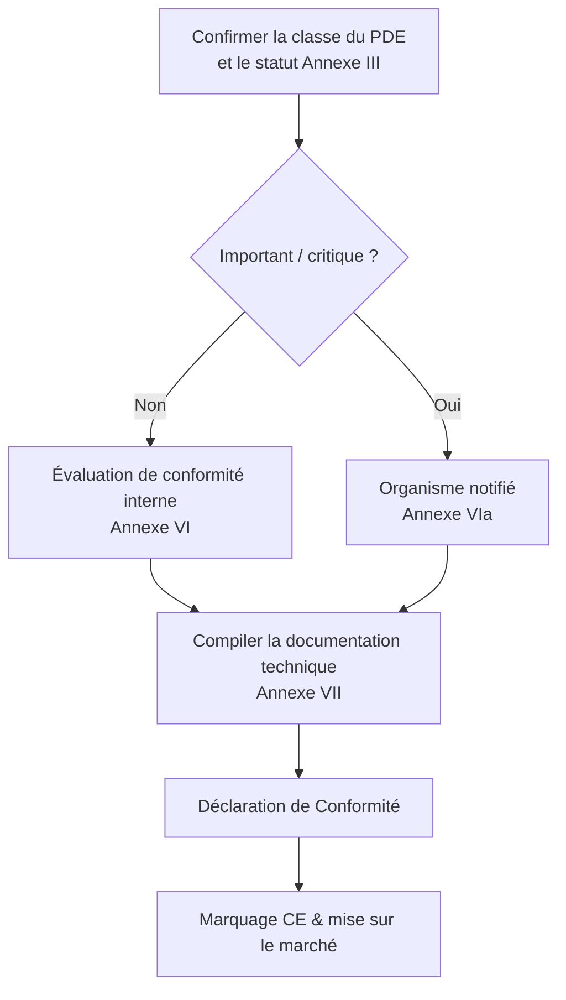

## CRA et écosystème CE

Le CRA est un **règlement de marquage CE**, dans l’esprit de la RED ou de la directive CEM : vous devez démontrer que votre produit satisfait à ses exigences essentielles avant sa mise sur le marché.[1]  

Pour de nombreux produits avec éléments numériques (PDE) embarqués, il s’agira d’une **auto‑évaluation** ; pour les produits importants/critiques, un **organisme notifié** intervient conformément aux Annexes VI/VIa.[1]

---

## Preuves requises

Le cœur de l’évaluation de conformité repose sur votre **documentation technique** et les **preuves de processus** produites par votre SDL, vos SBOM et vos flux de gestion des vulnérabilités.[1]  

Exemples :

- diagrammes d’architecture et modèles de menace,  
- cartographie des contrôles vers les exigences de l’Annexe I,  
- rapports de tests et résumés de tests d’intrusion,  
- description des processus de provisioning et de mise à jour,  
- SBOM accompagnées de VEX ou d’un format équivalent de déclaration de vulnérabilité,  
- politique de divulgation coordonnée (CVD) et enregistrements d’incidents / de gestion des vulnérabilités.

---

## Rôle des normes

Tant que les normes harmonisées CRA ne sont pas citées au Journal officiel, vous pouvez vous appuyer sur des normes **état de l’art** référencées par la Commission pour démontrer la conformité (Article 25).[1]  

Exemples typiques :

- **IEC 62443‑4‑1 / 4‑2** pour la sécurité industrielle/embarquée,  
- **ETSI EN 303 645** pour l’IoT grand public,  
- **NIST SSDF** pour le cycle de développement sécurisé.

L’application de normes reconnues vous donne une **présomption de conformité** et facilite la relation avec les organismes notifiés.

---

## Déclaration de Conformité (DoC)

La DoC est un document concis, signé par le fabricant, qui :

- identifie le produit et les versions,  
- liste la législation applicable (CRA, RED, CEM, LVD, …),  
- référence les normes et documents internes utilisés pour démontrer la conformité,  
- identifie la personne responsable dans l’UE.  

Maintenez la DoC alignée avec le dossier technique et mettez‑la à jour lors de modifications majeures du firmware ou des fonctionnalités afin de rester conforme à l’Article 22.

---

## Liste de vérification

Avant de revendiquer la conformité, vérifiez :

- [ ] Périmètre et classification confirmés (PDE, important/critique). Voir [Périmètre & définitions](./scope-and-definitions).  
- [ ] SDL défini et appliqué pour la version courante. Voir [SDL](./secure-development-lifecycle).  
- [ ] Contrôles techniques embarqués cartographiés aux exigences de l’Annexe I. Voir [Contrôles techniques embarqués](./embedded-technical-controls).  
- [ ] Documentation technique et pack SBOM complets. Voir [Documentation & SBOM](./documentation-and-sbom).  
- [ ] Processus de gestion des vulnérabilités opérationnel ; période de support définie. Voir [Gestion des vulnérabilités](./vulnerability-handling).  

Cette check‑list est reliée directement à la **check‑list développeur** utilisée par les équipes d’ingénierie (voir [Check‑list développeur](./developer-checklist)).

[1]: https://eur-lex.europa.eu/legal-content/EN/TXT/?uri=CELEX:32024R2847 "Regulation (EU) 2024/2847 — Articles 16–25 and Annexes VI/VII"

