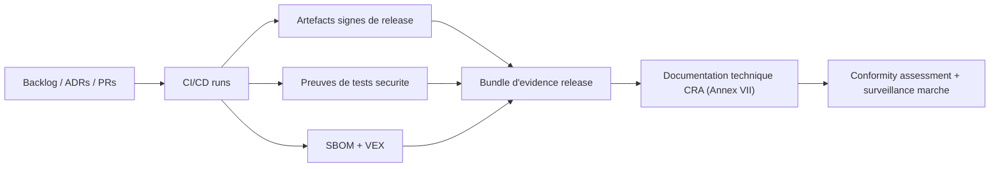
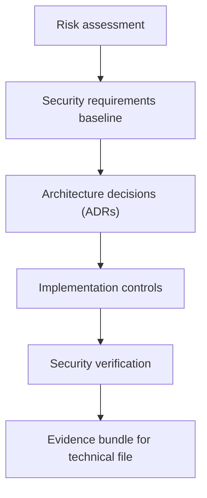
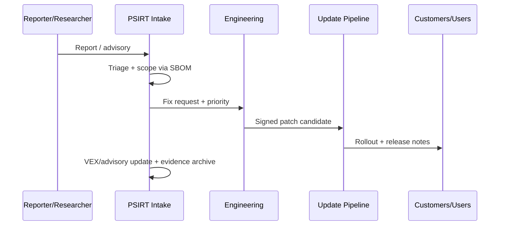

---
id: cra-developer-checklist
slug: /security/cra/developer-checklist
title: Checklist developpeur et templates
sidebar_position: 10
last_update:
  author: 'Ayoub Bourjilat (AC6)'
  date: '2025-12-18'
---

## Ce qu'est (ou n'est pas) cette checklist

Checklist **release-grade** pour produits embarques sous le CRA. Elle traduit les obligations CRA en taches ingenierie et force chaque case a pointer vers des **evidences** a placer dans votre dossier technique CRA.

Ce n'est **pas** un substitut a l'analyse legale ou au choix de route de conformity assessment. C'est l'outil quotidien pour firmware, plateforme et DevSecOps.

> **Regle evidence :** une case est "done" uniquement si elle pointe vers *au moins* : ID ticket/PR/MR, run CI, rapport de test, artefact signe, SBOM/VEX, doc design, ADR, ou decision datee.

---

## Ancres CRA (clauses qui pilotent la checklist)

Vous verrez souvent :

- **Designed, developed, produced** conforme a l'Annexe I Part I (obligation manufacturer).  
- **Cybersecurity risk assessment** documentee et incluse dans la doc technique.  
- **Due diligence** sur composants tiers (dont open source).  
- **Vulnerability handling** pendant la support period (Annexe I Part II).  
- **Mandatory reporting** pour *actively exploited vulnerabilities* et *severe incidents* (delais stricts).  
- **Documentation technique** (Annexe VII) + **user information** (Annexe II).

Pour la formulation exacte, citez le JO dans le dossier technique CRA.

---

## Layout repo recommande (Docusaurus + evidences)

Separer **docs de presentation** (Docusaurus) et **evidences audit** (technical file), mais les relier.

```
repo-root/
  docs/                         
  security/
    cra/
      releases/
        2025.12.0/
          00-scope-classification.md
          01-risk-assessment.md
          02-threat-model.md
          03-architecture.md
          04-controls-mapping.md
          05-test-evidence.md
          06-sbom-vex/
          07-release-attestation.md
          08-user-info-annex-ii.md
      templates/                # Templates de cette page
      adr/                      # Architecture Decision Records
  ci/
  firmware/
  bootloader/
```

---

## Pipeline evidence (flux de preuve vers le dossier technique)



---

## Modele de responsabilite (RACI compréhensible en audit)

| Work item | R | A | C | I |
|---|---|---|---|---|
| Scope/classification | Product security | Regulatory/Compliance | Firmware lead, Product | Sales, Support |
| Risk assessment | Product security | Engineering director | QA, Platform | PSIRT |
| Secure boot / identity / debug | Firmware lead | Engineering director | HW lead, Manufacturing | Support |
| CI hardening + signing | DevOps/Build lead | Engineering director | Product security | QA |
| SBOM/VEX generation | DevOps/Build lead | Product security | Firmware lead | Compliance |
| Security testing plan + execution | QA/Security test | QA lead | Firmware lead | Compliance |
| CVD + PSIRT process | PSIRT lead | Product security | Support, Legal | All teams |
| Article 14 reporting execution | PSIRT lead | Legal/Compliance | Product security | Exec staff |

---

## Checklist release (cocher par release, lier les preuves)

### 0) Scope, classification, frontieres

- [ ] **Portee PDE confirmee** (produit avec elements numeriques, remote data processing inclus si requis).  
  Evidence : `00-scope-classification.md` + ADR.
- [ ] **Statut important/critical verifie** vs Annex III/IV (documente meme si "not applicable").  
  Evidence : tableau cross-check annexes + rationale.
- [ ] **Carte de variantes figee** (variants SoC, revisions HW, feature flags, protocol profiles).  
  Evidence : `product-variants.yaml` + BOM par variante.
- [ ] **Intended use et environnement** (consumer/industrial, hypothèses connectivite, acces physique).  
  Evidence : `intended-use.md` + inputs threat model.
- [ ] **Support period declaree et consigne** (duree minimale et politique end-of-support).  
  Evidence : `support-period.md` + plan client.

> Conseil embarque : definir la portee par *image* (bootloader, app, radio), par *SKU hardware*, et par *dependance cloud*. L'audit foire souvent sur les frontieres floues.

---

### 1) Cybersecurity risk assessment

- [ ] **Analyse de risque cyber existe** pour le produit et est mise a jour pour cette release.  
  Evidence : `01-risk-assessment.md` + changelog.
- [ ] **Analyse couvre** : usage prevu + usage raisonnablement previsible, environnement, assets, duree d'usage attendue.  
  Evidence : sections d'analyse + refs.
- [ ] **Mapping Annexe I Part I inclus** : pour chaque exigence, applicabilite + implementation ou justification.  
  Evidence : `04-controls-mapping.md`.



---

### 2) Threat model (focus embarque)

- [ ] **Diagramme de contexte systeme** a jour : device, gateways, apps, processing distant, update servers, manufacturing.  
  Evidence : diagramme + historique de version.
- [ ] **Trust boundaries identifiees** (secure vs non-secure, debug boundary, update boundary, reseaux externes).  
  Evidence : section threat model "trust boundaries".
- [ ] **Attacker model documente** (remote, local avec acces physique, supply-chain adversary).  
  Evidence : `02-threat-model.md`.
- [ ] **Abuse/misuse cases** pour : chemin d'update, debug/service mode, provisioning, stack radio/reseau.  
  Evidence : liste menaces + mitigations.

---

### 3) Secure boot, identite, provisioning

- [ ] **Chaine de boot documentee** de la ROM au premier/second stage et app.  
  Evidence : `03-architecture.md` (section boot).
- [ ] **Authenticite & integrite** verifiees a chaque etape (signature + hash policy).  
  Evidence : code/config + tests d'echec.
- [ ] **Anti-rollback defini** (version monotone, compteur secure, fuses) et teste.  
  Evidence : politique de version + logs de test.
- [ ] **Identite device** definie (cle/cert par device) et protegee par RoT (SE, enclave, OTP, equivalent).  
  Evidence : doc hierarchie de cle + SOP provisioning.
- [ ] **Provisioning durci** (gestion des cles en usine, separation des taches, audit logs).  
  Evidence : procedure manufacturing + preuves d'access control.

---

### 4) Isolation runtime et memory safety (realite MCU)

- [ ] **Privilege separation activee** (MPU/MMU, taches non-privil, partitions securisees).  
  Evidence : config RTOS + memory map + tests.
- [ ] **Memory safety controls** : règles de bounds checking, parsing sur toutes entrees externes (network, serial, USB, fichiers).  
  Evidence : coding standard + checklist de PR + tests cibles.
- [ ] **Exploit-hardening flags** utilises si toolchain les supporte (stack protector, FORTIFY-like, W^X si possible).  
  Evidence : flags build + logs CI.
- [ ] **Watchdog et recovery** implementes/testes (fail-safe, reboot sûr, retries limites).  
  Evidence : logs HIL.

---

### 5) Interface hardening (pas de debug-by-default)

- [ ] **Ports debug proteges** (off en prod ou proteges par procedure service authentifiee).  
  Evidence : option bytes/fuses + test usine consigne.
- [ ] **Tous les services reseau inventories** et minimises.  
  Evidence : `attack-surface.md` + resultats scan.
- [ ] **Interfaces de management auth/authz** (roles, rate limits, lockout, sessions securisees).  
  Evidence : spec API + tests.
- [ ] **Secure-by-default** documente et valide (pas de default passwords, privileges minimaux, exposition minimale).  
  Evidence : matrice config par defaut + test automatise.

---

### 6) Cryptographie et lifecycle de cle

- [ ] **Crypto profile declare** (protocoles, algos, tailles de cle, RNG) et justifie "state of the art".  
  Evidence : doc profil crypto + rationale.
- [ ] **Lifecycle de cle couvert** : generation, stockage, usage, rotation, revocation, reponse compromission.  
  Evidence : plan de gestion de cle.
- [ ] **Regles de validation de certifs** (source temps, pinning, renouvellement, gestion echec).  
  Evidence : design comms securisees + tests.

---

### 7) Build, CI/CD, integrite release

- [ ] **Provenance build capturee** (commit, version toolchain, config, strategie reproducible ou traçabilite equivalent).  
  Evidence : `build-metadata.json`.
- [ ] **Cles de signature protegees** (HSM/ceremonie offline/enclave) et acces journalise.  
  Evidence : SOP signature + snapshot logs.
- [ ] **SBOM generee par build et par variante**, stockee avec artefacts.  
  Evidence : fichiers SBOM dans `06-sbom-vex/` + logs CI.
- [ ] **Governance dependances active** (allow/deny, scans vuln/licence, politique upgrade).  
  Evidence : politique deps + resultats de scan.

---

### 8) Verification securite (prouver que les controles fonctionnent)

- [ ] **Plan de test securite** existe et execute pour cette release.  
  Evidence : `05-test-evidence.md` + logs CI.
- [ ] **Tests negatifs** couvrent : signatures invalides, updates corrompues, certifs invalides, paquets malformes, bypass auth.  
  Evidence : cas de test + resultats.
- [ ] **Fuzzing** sur parsers/state machines (harness host + HIL periodique).  
  Evidence : rapports fuzz + corpus.
- [ ] **Pen-test / red-team** proportionnels au risque (services exposes, chemin update).  
  Evidence : resume rapport + tickets remediation.

---

### 9) Documentation pack (tech file + user info)

- [ ] **Bundle doc technique** a jour (archi, risk assessment, mapping controles, tests, provisioning, updates).  
  Evidence : `security/cra/releases/<ver>/` bundle.
- [ ] **Infos securite utilisateur** (support period, methode d'update, config securise, risques residuels).  
  Evidence : `08-user-info-annex-ii.md` + lien doc publique.
- [ ] **Inputs DoC UE** a jour (identification produit, standards utilises, info NB si applicable).  
  Evidence : draft DoC + liste de mapping version.

---

### 10) Vulnerability handling, updates, mandatory reporting

- [ ] **Contact CVD publie** (page securite / security.txt), cle de chiffrement, delais de reponse.  
  Evidence : URL + copie repo.
- [ ] **Workflow PSIRT operationnel** (intake, triage, fix, advisory, rollout, postmortem).  
  Evidence : runbook + templates ticket.
- [ ] **Mecanisme d'update teste end-to-end** (A/B ou swap, coupure courant, prevention rollback, recovery).  
  Evidence : logs HIL + tests automatisees update.
- [ ] **Playbook reporting Art. 14** existe et est repete : qui declare, quelles donnees, comment tenir 24h/72h pour actively exploited vulns et severe incidents.  
  Evidence : runbook reporting + on-call rota + trace dry-run.



---

## Templates (copier/coller)

### Template A - CRA Release Evidence Index

`07-release-attestation.md` :

```md
# CRA Release Evidence Index - <produit> <version>

## Identification
- Produit/SKU(s) :
- Revisions HW :
- IDs d'image firmware (bootloader/app/radio) :
- Commit/tag build :
- Date de release :

## Scope & classification
- Decision scope PDE (ADR) :
- Check Annex III/IV :

## Risk assessment
- Doc risk assessment :
- Changements vs release precedente :

## Controles clefs
- Evidence secure boot :
- Evidence debug locking :
- Evidence update mechanism :
- Evidence access control :

## SBOM/VEX
- Localisation SBOM(s) :
- Localisation VEX :
- Rapport de scan deps :

## Security testing
- IDs de run CI :
- Rapport fuzz :
- Resume pen-test :

## User information (Annex II)
- Support period :
- Instructions update :
- Risques residuels :

## Sign-off
- Firmware lead :
- Product security :
- QA :
- Date :
```

### Template B - ADR skeleton (decision securite)

`security/cra/adr/ADR-XXXX.md` :

```md
# ADR-XXXX: <Decision title>

## Contexte
- Scope produit :
- Menaces qui motivent la decision :
- Contraintes (ressources MCU, energie, cout, boot ROM, etc.) :

## Decision
- Ce qu'on decide :
- Pourquoi (rationale risque) :

## Proprietes securite
- Confidentiality :
- Integrity :
- Availability :
- Impact update/maintenance :

## Alternatives envisagees
- Option A :
- Option B :

## Consequences
- Ce qui change en implementation :
- Tests requis :
- Mises a jour documentaires requises :

## Liens
- Tickets/PRs :
- Section threat model :
- Section controls mapping :
```

### Template C - SBOM/VEX minimum

```md
# SBOM/VEX minimum bar (par release)

- Format SBOM : SPDX ou CycloneDX
- Granularite : par image firmware + par variante
- Doit inclure : bootloader, RTOS/kernel, middleware, crypto, protocol stacks, outils de build (quand faisable)
- VEX doit indiquer : affected / not affected / under investigation / fixed
- Stockage : avec artefacts signes, retention immutable
```

---

## Problemes frequents (et comment les eviter)

1. **Scope indefini** : firmware + remote processing + update services oublies.  
2. **Variant explosion** : 1 "produit" = 12 SKUs + 5 feature sets. Maintenir map variantes + evidences par variant group.  
3. **Support period ambigu** : promesse sales vs plan engineering. Creer un `support-period.md` autoritatif.  
4. **Update path non testable** : OK en lab, casse avec coupure courant/low flash. Faire des rehearsals HIL en gate.  
5. **Debug ouvert** : SWD/JTAG/factory shell toujours accessible. Rendre debug lock un test usine journalise.  
6. **SBOM incomplete** : bootloader/crypto/toolchain manquants. Lier generation SBOM au pipeline build.  
7. **Pas de readiness reporting** : delais 24h/72h impossibles sans on-call + template pre-rempli. Faire au moins un dry run.  
8. **Evidences dispersees** : controles la mais preuves eparpillees. Un dossier evidence par release, toujours.

---

## References

- Regulation (EU) 2024/2847 (Cyber Resilience Act) - Official Journal (ELI) : http://data.europa.eu/eli/reg/2024/2847/oj/eng  
- NIST SP 800-218 (SSDF) : https://csrc.nist.gov/pubs/sp/800/218/final  
- ISO/IEC 29147 (Vulnerability disclosure) : https://www.iso.org/standard/45170.html  
- ISO/IEC 30111 (Vulnerability handling processes) : https://www.iso.org/standard/69725.html  
- SPDX specifications : https://spdx.dev/specifications/  
- CycloneDX specification : https://cyclonedx.org/specification/  


