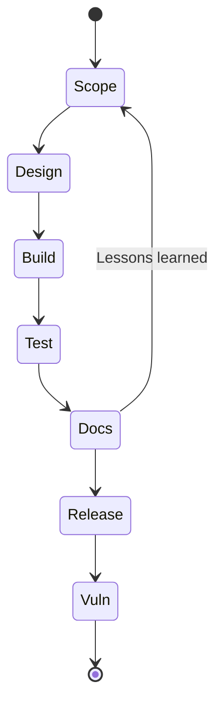

## Comment utiliser cette check‑list

Il s’agit d’une **check‑list vivante** destinée à être stockée dans votre dépôt (par exemple `doc/cra-checklist.md`). Elle relie les tâches d’ingénierie du quotidien aux preuves de l’Annexe I pour que chaque version puisse démontrer la conformité sans sprint de dernière minute.[1]  

**Règle d’or :** une case n’est réellement « faite » que si elle pointe vers des **preuves** :

- identifiant(s) de ticket,  
- liens de MR/PR,  
- artefacts / journaux de build,  
- rapports de tests,  
- SBOM + VEX (ou équivalent),  
- mises à jour de la documentation, des analyses de risque et des modèles de menace.

Cochez les éléments par version et reliez‑les aux tickets, MR/PR et documents.

---

## Mise en place du projet

- [ ] Produit classé comme entrant dans le périmètre du CRA (classe de PDE, important/critique). Voir [Périmètre & définitions](./scope-and-definitions).  
- [ ] Objectifs de sécurité définis (patrimoine à protéger, risque acceptable).  
- [ ] Modèle de menace créé ou mis à jour pour cette version (actifs, frontières de confiance, profil d’attaquant, cas d’abus).  

---

## Architecture et conception

- [ ] Stratégie d’identité et d’authentification (identité de dispositif, gestion des secrets, rôles).  
- [ ] Chaîne de secure boot définie (racine de confiance, format d’image, anti‑rollback).  
- [ ] Stratégie de journalisation et de télémétrie (événements clés, quotas, export).  

---

## Implémentation et dépendances

- [ ] Standards de codage sécurisés (MISRA‑C, CERT C, règles Rust `unsafe`, etc.).  
- [ ] Analyse statique configurée sur les modules critiques.  
- [ ] Gouvernance des dépendances (liste d’acceptation/refus, revue des nouveaux packages).  
- [ ] SBOM générée automatiquement à partir des manifestes.  

---

## Tests et validation

- [ ] Plan de tests couvrant les fonctionnalités de sécurité (authentification, mises à jour, journalisation).  
- [ ] Tests d’intégration sur cible ou banc HIL (chemins de boot, scénarios de mise à jour, coupures d’alimentation).  
- [ ] Fuzzing ou tests de robustesse sur les interfaces exposées.  

---

## Mise en production, support et fin de vie

- [ ] Période de support définie et communiquée.  
- [ ] Processus de publication des mises à jour documenté.  
- [ ] Processus de gestion des vulnérabilités opérationnel (CVD, PSIRT, suivi des CVE).  
- [ ] Stratégie de fin de vie (annonce, communication, options de migration).  

[1]: https://eur-lex.europa.eu/legal-content/EN/TXT/?uri=CELEX:32024R2847 "Regulation (EU) 2024/2847 — Annex I and Articles 16–24"

