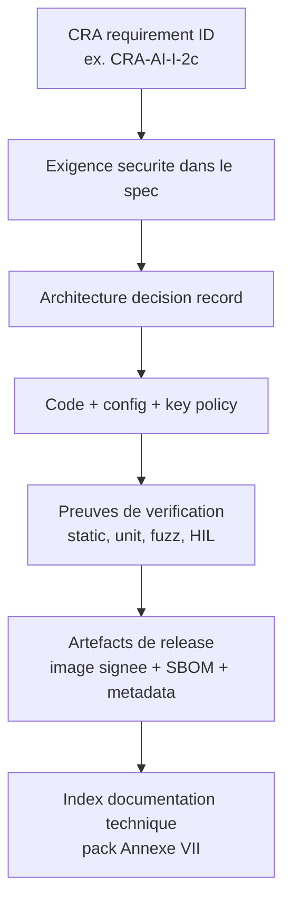
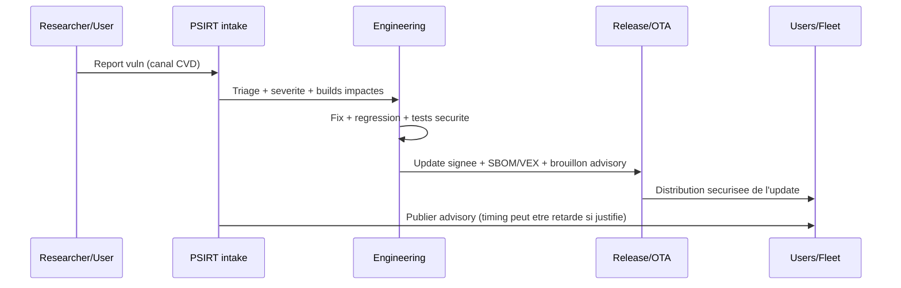
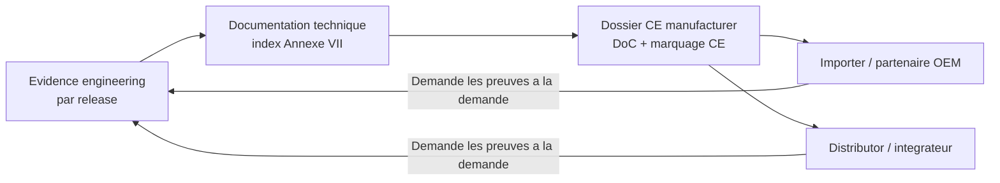

## Ce que cette page est (et n'est pas)

Traduction **orientee developpeur** du CRA : expliquer *ce que l'engineering doit implementer et garder en preuve* pour que le **manufacturer** puisse demontrer la conformite. Cela ne cree **pas** d'obligations legales individuelles pour chaque dev ; le CRA vise les **operateurs economiques** (manufacturer/importer/distributor/etc.).[1]

Pour l'embarque : **architecture + artefacts SDLC = preuves de conformite**, versionnees par release.[2][3]

---

## Ancres legale que les devs doivent implementer

Le CRA rend trois notions non optionnelles :

1) **Risk-based security engineering** (avant release, mis a jour si besoin). Le manufacturer doit faire une analyse de risque cyber et la garder dans la doc technique.[4][5]
2) **Essential cybersecurity requirements** integrees au produit (Annexe I, Part I). Concretement : exigences de design + controles d'implementation + verification.[2]
3) **Vulnerability handling + security updates** pendant la periode de support (Annexe I, Part II + Article 13 sur la support period). C'est une capacite operationnelle continue, pas une tache ponctuelle.[6][5]

:::note La documentation CRA est une fonctionnalite produit
La documentation technique doit etre creee **avant** la mise sur le marche et **mise a jour en continu au moins pendant la support period**.[3] Si l'engineering ne produit/versionne pas les artefacts, la conformite echoue, meme si le device est "secure en pratique".
:::

---

## Modele de responsabilite embarque (RACI utile en audit)

### Pourquoi le RACI compte

Les audits echouent plus souvent pour **propriete floue** que pour crypto manquante. Le CRA attend que le manufacturer montre "les moyens utilises" et "les processus mis en place" pour respecter l'Annexe I dans la doc technique.[3]

Baselines de propriete pour un PDE embarque (MCU/SoC + firmware + cloud/OTA optionnel) ; adaptez les roles a votre org.

| Activite / evidence | Firmware | HW/Silicon security | Backend/OTA | DevOps/CI | PSIRT | Product/PM | Compliance |
| --- | --- | --- | --- | --- | --- | --- | --- |
| Cybersecurity risk assessment | R | C | C | C | C | A | C |
| Exigences securite taggees Annexe I | R | C | C | C | C | A | C |
| Architecture decision records (ADR) | R | C | C | C | C | A | I |
| Secure boot / root-of-trust integration | R | A | C | C | I | I | I |
| Politique debug & lifecycle state | C | A | I | I | I | I | I |
| Secure update mechanism | R | C | A | C | C | C | I |
| SBOM + provenance generation | R | I | I | A | C | I | C |
| Security test plan & results | R | C | C | C | C | I | A |
| CVD policy + vuln intake pipeline | C | I | C | C | A | C | I |
| Support period statement & end-date | I | I | I | I | C | A | C |
| Technical documentation pack (Annex VII) | C | C | C | C | C | C | A |

Legende : **A** accountable (valide), **R** responsable (fait), **C** consulte, **I** informe.

---

## Traçabilite : transformer les clauses CRA en IDs ingenierie

Tagguez backlog, tests et docs de design avec des **IDs stables** alignes sur la structure CRA.

Exemples d'ID :
- `CRA-AI-I-2c-sec-updates-auto-default` (Annexe I, Part I, point (2)(c))
- `CRA-AI-II-7-secure-update-distribution` (Annexe I, Part II, point (7))
- `CRA-A13-8-support-period` (Article 13(8))

Pourquoi c'est utile :
- relie **design -> code -> tests -> evidence**,
- rend trivial la generation d'un "evidence index" pour la doc technique Annexe VII.[3]

---

## Checkpoints SDLC qui matchent bien le CRA

### 1) Checkpoint portee + classification (gate 0)

Engineering doit valider :
- le produit est un **PDE** et l'environnement d'exploitation est documente,
- s'il est **important/critique** (Annexes III/IV) car cela change la profondeur de l'evaluation,
- quelle est la **support period**, car elle pilote la strategie d'update et les couts lifecycle.[5][3]

Artefacts minimum :
- scope statement + diagramme de frontiere produit,
- entree initiale d'analyse de risque,
- brouillon de rationale support period (a finaliser avant release).

### 2) Checkpoint exigences securite (gate 1)

A partir de l'Annexe I, Part I, point (2), derivez des exigences systeme explicites, ex. :
- **secure-by-default configuration**,[2]
- **protection contre acces non autorise** et auth/authz robuste,[2]
- **confidentialite et integrite des donnees/code** (comms securisees, stockage securise),[2]
- **surface d'attaque minimale et impact reduit** (compartimentation, least privilege, protection memoire),[2]
- **hooks de logging/monitoring** pour detecter/analyser les incidents,[2]
- **mecanisme d'update robuste** (distribution securisee, politique d'update).[2][6]

Artefacts :
- liste des exigences securite taggee CRA,
- resume threat model + mapping mitigations,
- ADRs pour decisions majeures (root-of-trust, strategie update, identite).

### 3) Garde-fous d'implementation (gate 2)

L'Article 13 attend que le manufacturer garde les produits conformes en production et en change.[7] Pour l'embarque :

- **Reproducible builds** : scripts + versions toolchain figees.
- **Governance dependances** : manifests versionnes; composants tiers ne doivent pas compromettre la securite (due diligence).[5]
- **Coding rules imposees** : static analysis, reviews obligatoires, politique code unsafe pour Rust/C/C++.
- **Regles de gestion de cle** : pas de cle dans le code source; signature avec acces controle (HSM ou equivalent).

Artefacts :
- config CI, logs jobs SBOM, metadata de provenance build,
- checklists de review et registre des exceptions,
- SOP de manipulation du materiel crypto (qui signe, comment les cles sont protegees).

### 4) Release engineering (gate 3)

La release est l'endroit ou la "preuve" est creee :

- **Artefacts firmware signes** + hashes + metadata de version.
- **SBOM** liee au build shippe (definition CRA explicite).[8]
- **Preuve des rehearsals d'update** : coupure courant, chemins rollback, comportement recovery.
- **Instructions securite utilisateur** (Annexe II) coherentes avec ce qui est livre (ex. comment installer les security updates).[9]

Artefacts :
- manifest de release (hash d'image, ID de cle de signature, reference SBOM),
- rapports de test + logs HIL,
- release notes incluant changements securite.

### 5) Boucle post-market / PSIRT (gate 4)

Annexe I, Part II exige un **process de vuln handling** et une distribution securisee et rapide des updates.[6] Article 13 exige aussi la gestion efficace des vulnerabilites **pendant la support period**.[5]

Engineering doit maintenir :
- un canal d'intake vuln (single point of contact lie aux devoirs du manufacturer),[7]
- workflow triage + fix,
- mecanismes de distribution securisee d'updates,
- process d'avis public (avec option de retarder la publication si justifie).[6]

## Handoffs supply chain : ce que importateurs/distributeurs demanderont

Meme si nous livrons en direct, des partenaires peuvent etre **importers** ou **distributors**, avec obligations de verification/cooperation. Les importers doivent pouvoir fournir la doc technique sur demande et informer le manufacturer des vulnerabilites.[10] Les distributors doivent aussi cooperer et fournir les infos/documents necessaires pour prouver la conformite.[11]

Donc l'engineering doit generer par release un **CRA Evidence Pack** (minimum) :

- artefacts firmware signes + hashes + manifest,
- SBOM (et VEX si utilise) alignes sur le build shippe,
- resume tests securite,
- description du mecanisme d'update + comportement rollback/recovery,
- support period statement et date de fin,
- details de divulgation/contact vuln.

:::tip Attention OEM/ODM : "modification substantielle"
Si un importer/distributor (ou autre) fait une **modification substantielle** puis met le produit a disposition, il peut etre traite comme **manufacturer** et soumis aux Articles 13 et 14 pour ce qu'il a change (voire l'ensemble).[12][13] A refleter dans les contrats et guides d'integration.
:::

---

## Liste "must cover" specifique embarque (mappee a l'Annexe I)

Ce n'est pas le catalogue complet (voir **Embedded Technical Controls**), mais les sujets frequents en evaluation de conformite pour l'embarque.

| Sujet | Patterns embarques typiques | Ancre CRA |
| --- | --- | --- |
| Secure-by-default | debug verrouille en prod; comms securisees; least privilege par defaut | Annexe I Part I(2)(b)[2] |
| Surface d'attaque minimale | desactiver services inutiles; reduire ports/APIs exposes; diagnostics securises | Annexe I Part I(2)(j)[2] |
| Identite & access control | identite device, mutual auth, politique d'autorisation | Annexe I Part I(2)(d)[2] |
| Confidentialite & integrite | TLS ciphers modernes; firmware signe; stockage securise | Annexe I Part I(2)(e-f)[2] |
| Disponibilite | watchdog, rate limiting, modes fail-safe | Annexe I Part I(2)(h-i)[2] |
| Hooks logging/monitoring | taxonomie d'evenements; logs proteges; strategie d'export | Annexe I Part I(2)(l)[2] |
| Updates | updates signees; distribution securisee; rollback recovery | Annexe I Part I(2)(c) + Part II(7-8)[2][6] |
| Vulnerability handling | politique CVD; point de contact; advisories publics | Annexe I Part II(5-6)[6] |
| Composants tiers | due diligence dependances; reporting upstream | Article 13(5-6)[5] |

---

## Problemes frequents (et comment les eviter)

1. **"On est secure mais on ne peut pas le prouver."**  
   Fix : faites des artefacts de preuve des outputs premiers (ADRs, rapports tests, SBOM, logs d'update rehearsal) et indexez-les dans la doc technique.[3]

2. **Drift de scope en embarque.**  
   Fix : definir explicitement la frontiere produit (firmware device + bootloader + appli compagnon + endpoints cloud utilises pour updates). Versionner le diagramme de scope par release.

3. **Confusion de roles OEM/ODM/integrateurs.**  
   Fix : documenter qui controle build firmware, cles de signature, endpoints d'update, et support period. Si quelqu'un modifie des elements securite, traitez-le en cas potentiel de "modification substantielle".[12][13]

4. **Support period sous-estimee.**  
   Fix : decider tot et la valider vs duree de vie attendue ; le CRA impose une support period minimale (exception limitee si usage prevu plus court).[5]

5. **SBOM existe mais pas liee au binaire livre.**  
   Fix : generer la SBOM en CI a partir des entrees exactes du build, la stocker avec le manifest de release, et garder la definition conforme a l'Article 3.[8]

6. **Mecanisme d'update concu tard.**  
   Fix : traiter l'update securisee comme exigence d'architecture (bootloader, partitionnement, rollback, rotation de cles), pas comme une "feature" post-MVP.[2][6]

7. **Composants tiers = angle mort.**  
   Fix : maintenir une gouvernance des dependances; si une vuln est trouvee, reporter upstream et remedier selon l'Annexe I Part II.[5][6]

8. **Pas de vuln handling operationnel.**  
   Fix : mettre en place un PSIRT avec intake, triage, fix, advisory, et s'assurer que la distribution securisee d'updates peut livrer les correctifs "without delay".[6]

---

## References

[1]: https://eur-lex.europa.eu/legal-content/EN/TXT/?uri=CELEX:32024R2847 "Regulation (EU) 2024/2847 (CRA) - Chapter II obligations of economic operators"  
[2]: https://eur-lex.europa.eu/legal-content/EN/TXT/?uri=CELEX:32024R2847 "CRA Annex I, Part I - Essential cybersecurity requirements"  
[3]: https://eur-lex.europa.eu/legal-content/EN/TXT/?uri=CELEX:32024R2847 "CRA Article 31 + Annex VII - Technical documentation (mise a jour continue pendant la support period)"  
[4]: https://eur-lex.europa.eu/legal-content/EN/TXT/?uri=CELEX:32024R2847 "CRA Article 13(2-4) - Cybersecurity risk assessment dans la documentation technique"  
[5]: https://eur-lex.europa.eu/legal-content/EN/TXT/?uri=CELEX:32024R2847 "CRA Article 13(5-9) - Due diligence composants tiers + support period + vuln handling"  
[6]: https://eur-lex.europa.eu/legal-content/EN/TXT/?uri=CELEX:32024R2847 "CRA Annex I, Part II - Vulnerability handling and security updates"  
[7]: https://eur-lex.europa.eu/legal-content/EN/TXT/?uri=CELEX:32024R2847 "CRA Article 13(13-14) - Retention documentation et conformity en production"  
[8]: https://eur-lex.europa.eu/legal-content/EN/TXT/?uri=CELEX:32024R2847 "CRA Article 3(39) - Definition SBOM"  
[9]: https://eur-lex.europa.eu/legal-content/EN/TXT/?uri=CELEX:32024R2847 "CRA Annex II - User info dont installation des updates securite"  
[10]: https://eur-lex.europa.eu/legal-content/EN/TXT/?uri=CELEX:32024R2847 "CRA Article 19 - Obligations importers"  
[11]: https://eur-lex.europa.eu/legal-content/EN/TXT/?uri=CELEX:32024R2847 "CRA Article 20 - Obligations distributors"  
[12]: https://eur-lex.europa.eu/legal-content/EN/TXT/?uri=CELEX:32024R2847 "CRA Article 21 - Quand importer/distributor devient manufacturer"  
[13]: https://eur-lex.europa.eu/legal-content/EN/TXT/?uri=CELEX:32024R2847 "CRA Article 22 - Autres cas de modification substantielle"  
