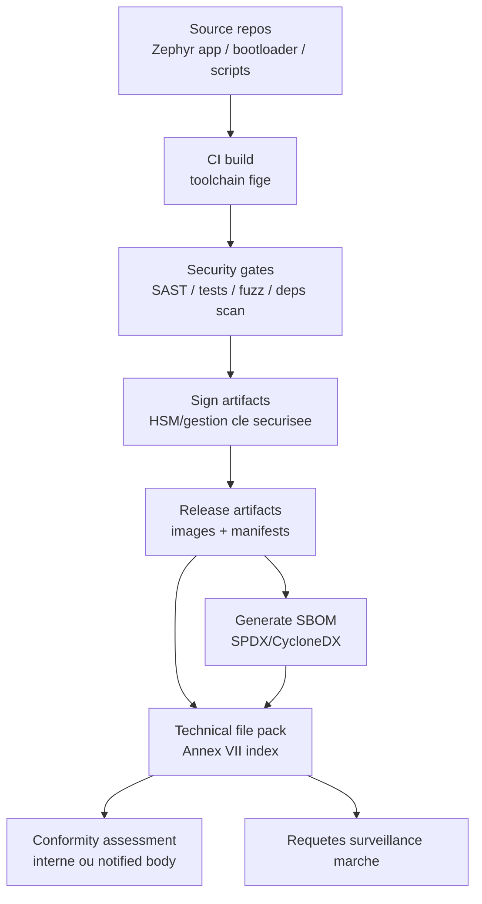
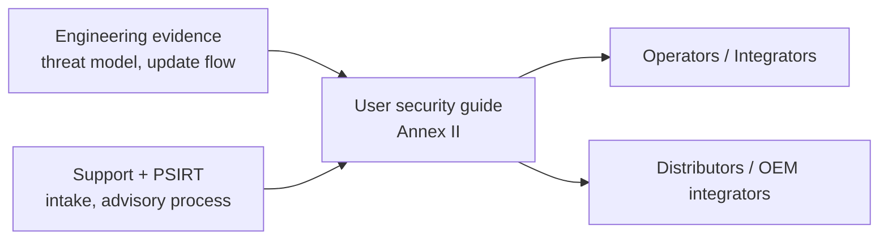
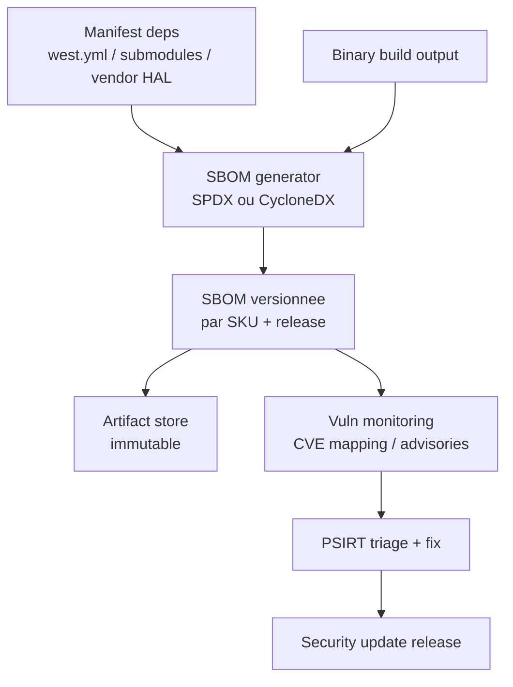

---
id: cra-docs-sbom
slug: /security/cra/documentation-and-sbom
title: Documentation, informations utilisateur et SBOM
sidebar_position: 6
last_update:
  author: 'Ayoub Bourjilat (AC6)'
  date: '2025-12-18'
---

## Ce que le CRA attend

Le CRA se traduit en trois sorties documentaires concretes :

1. **Documentation technique (technical file)**  
   Exigee par **l'Article 31** et detaillee dans **l'Annexe VII**. C'est le jeu de preuves structurees pour l'evaluation de conformite et la surveillance du marche.  
2. **Informations et instructions de securite a destination des utilisateurs**  
   Exigees par **l'Annexe II**. Ce dont les operateurs/clients ont besoin pour deployer et exploiter le produit de maniere securisee (instructions d'update et support period inclus).  
3. **Software Bill of Materials (SBOM)**  
   Exigee par **l'Annexe I, Part II(1)** et referencee a nouveau dans **l'Annexe VII(8)** (disponible pour les autorites sur demande motivee).

> Point cle : le CRA n'est pas seulement "soyez securise", mais "soyez securise *et prouvez-le* avec des evidences coherentes et versionnees".

---

## 1) Documentation technique (technical file)

### 1.1 Ancres legales a mapper a vos evidences

- **Article 31(1)** : la doc technique doit preciser les moyens utilises pour satisfaire les exigences essentielles de securite (Annexe I).  
- **Article 31(2)** : la doc technique doit etre **tenue a jour**.  
- **Article 13(13)** : conserver la doc technique et la DoC UE disponibles pour les autorites pendant **au moins 10 ans apres mise sur le marche, ou pendant la support period-le plus long des deux**.  
- **Annexe VII** : liste de contenu minimum.

**Implication embarquee :** traiter la doc technique comme un **evidence pack versionne** par variante firmware/hardware livree.

---

### 1.2 Contenu minimum (Annexe VII) - traduit pour l'embarque

Mapping Annexe VII vers livrables typiques (MCU/SoC + RTOS + bootloader + cloud/app optionnel).

#### (1) Description generale du produit
- Usage prevu et environnement (consumer / industriel / contraintes safety).
- Versions logicielles affectant la conformite (ex. version MCUboot, baseline Zephyr, libs crypto, stacks radio).
- Photos/markings/layout interne (cartes/modules : labels, revision ID, interfaces clefs ; inclure de quoi identifier l'appareil).
- Reference aux informations et instructions utilisateur (Annexe II).

#### (2) Processus de conception, developpement, production + vuln handling
- Description d'architecture avec **frontieres de composants et de confiance** :
  - chaine de boot (ROM → 1er stage → MCUboot → app)
  - split Secure/Non-secure (TrustZone-M/A si present)
  - stockage de cle + lifecycle state (OTP/fuses/secure element/PUF/flash signee)
  - remote data processing (si requis pour les fonctions prevues)
- Specification du process de vuln handling :
  - canal d'intake, triage, workflow de fix, release, publication d'advisory
  - reference a la politique de divulgation coordonnee (ou elle est publiee)
  - description de la **distribution securisee des updates** (comment les updates malveillantes sont prevenues)

#### (3) Controle des changements de conception et developpement
- Processus de change-control pour :
  - changements de configuration impactant la securite
  - changements crypto (algos, tailles de cle, ancres de confiance)
  - changements de pipeline d'update (cles de signature, format metadata, endpoints d'update)
- Evidence : traces de changements (tickets/PRs) reliees aux releases.

#### (4) Analyse de risque et mitigation
- Analyse de risque couvrant :
  - assets (secrets, fonctions safety, disponibilite, IP)
  - attaquants (remote, local, insider, supply-chain)
  - surfaces d'attaque (reseau, debug, chemin d'update, ports physiques, medias amovibles)
- Lier chaque risque aux controles de mitigation et aux exigences de l'Annexe I.

#### (5) Standards harmonises / common specs appliques (le cas echeant)
- Standards revendiques et leur scope :
  - ex. ETSI EN 303 645 pour consumer IoT
  - IEC 62443-4-2 pour exigences techniques (niveau composant)
  - NIST SSDF pour structurer le SDL (evidence process)
- Si aucun standard n'est applique, documenter l'approche alternative et la rationale.

#### (6) Rapports et resultats de test
Tests securite typiques embarques :
- tests negatifs secure boot (mauvaise signature, rollback, header corrompu)
- tests robustesse update (coupure courant pendant swap, download interrompu)
- fuzzing de protocoles/parsers (harness host + HIL smoke)
- rapports d'analyse statique pour modules critiques (parsers, auth, crypto use)
- resume pen-test (selon exposition et classe)

#### (7) Declaration UE de conformite
- Stockee avec le dossier technique, liee aux identifiants produit et versions logicielles.

#### (8) Disponibilite SBOM aux autorites
- SBOM preparee et **fournie sur demande motivee** (Annexe VII(8)).

---

### 1.3 Modele de traçabilite (pour des audits sans douleur)

Objectif : que chaque assertion remonte a un build et une variante.



**Astuce pratique :** garder un `evidence-index.yaml` par release listant chemins + hashes pour chaque evidence requise.

Exemple (minimal) :

```yaml
release_id: "prodX-1.2.0+build.458"
hardware_variants:
  - sku: "GW-MCXN-RevB"
    hw_rev: "B"
    secure_boot: "mcuboot-rsa3072"
artifacts:
  firmware_image:
    file: "artifacts/gw-mcxn/app_signed.bin"
    sha256: "..."
  sbom:
    file: "sbom/gw-mcxn-1.2.0.cdx.json"
    sha256: "..."
  test_report:
    file: "tests/security/update-powercut-report.md"
    sha256: "..."
```

---

## 2) Informations securite destinées aux utilisateurs (Annexe II)

L'Annexe II n'est pas du marketing ; c'est du **guidage operationnel de securite**.

Minimum a couvrir (Annexe II) :
- identification produit et manufacturer + contacts,
- point de contact vulnerability reporting (et ou il est publie),
- usage prevu, fonctions essentielles et proprietes de securite,
- consignes de mise en place/exploitation securisee (config incluse),
- instructions pour recevoir/verifier/installer les security updates,
- **support period** pour les security updates,
- contraintes / hypotheses importantes pour rester securise.



**Attentes embarque (ce que "bien" signifie) :**
- **UX update explicite** : comment declencher l'update, verifier l'etat, comportement en echec, recovery.
- **Posture securite explicite** : services exposes/desactives, politique credos par defaut (idealement : aucun), etat du debug en production.
- **Frontiere de scope explicite** : ce qui releve du produit vs infra externe (gateways, apps mobiles, endpoints cloud).

---

## 3) SBOM dans le CRA (ce que c'est et ce que ça n'est pas)

### 3.1 Ce que le CRA exige explicitement

**Annexe I, Part II(1)** : le manufacturer doit **etablir une SBOM** couvrant *au moins* les dependances top-level, dans un format machine courant.  
**Annexe VII(8)** : la SBOM fait partie du dossier technique et doit etre **fournie aux autorites sur demande motivee**.

Annexe II(9) ajoute : **si** vous rendez la SBOM disponible aux utilisateurs, fournir ou la recuperer.

> Important : le CRA n'impose pas de "publier la SBOM sur Internet". Il impose **d'en avoir une, coherente, et de pouvoir la fournir aux autorites**.

---

### 3.2 Portee SBOM embarquee (a inclure)

Pour un firmware, une SBOM "audit-proof" inclut typiquement :

- **Chaine de boot**
  - hypothese ROM immuable (documentee, pas un composant logiciel)
  - 1er stage bootloader (si applicable)
  - MCUboot + config (scheme de signature, politique rollback)
- **RTOS et middleware**
  - version Zephyr/FreeRTOS + hashes de modules
  - stacks reseau (TCP/IP, TLS/DTLS, CoAP/MQTT, BLE)
  - libs crypto (mbedTLS, TinyCrypt, PSA crypto, vendor HAL crypto)
- **Composants applicatifs**
  - parsers protocoles, interfaces management (mcumgr/DFU), agent device management
- **Outils de build impactant le binaire**
  - version toolchain, link scripts, code generators (si pertinents)

> Regle pratique : si un composant peut introduire une vuln dans le binaire livre (ou dans le pipeline d'update qui le produit), il doit etre dans la SBOM ou un "build BOM" lie.

---

### 3.3 Pipeline de generation SBOM (recommande)



**Bonne pratique variants :** generer **une SBOM par cible** (SKU / SoC / feature set), car les variantes compilent souvent des stacks differentes (BLE, Wi-Fi, cellular, drivers secure element, etc.).

---

### 3.4 A propos de VEX (utile, mais pas un mot-cle CRA)

Le CRA exige le vuln handling et la SBOM ; il n'impose pas un format "VEX".  
Cependant, une declaration type **VEX** est la façon la plus propre d'expliquer pourquoi une CVE s'applique ou non a votre build.

Si vous utilisez VEX, restez strict :
- identifier composant + version
- indiquer *affected / not affected / under investigation*
- expliquer la condition (feature non build, code path unreachable, patch downstream, etc.)
- lier a l'ID exact du build/SBOM

---

## Pack documentaire minimal, audit-ready (friendly embarque)

Structure qui mappe proprement a l'Annexe VII et survivra aux variantes :

1. `00-index/`
   - `evidence-index.yaml` (release IDs, hashes, variants)
2. `01-product-description/`
   - SKUs, revisions hardware, usage prevu, environnements supportes
3. `02-architecture-and-threat-model/`
   - context diagram, trust boundaries, chaine de boot, data flows
4. `03-risk-and-requirements/`
   - analyse de risque, table de mapping Annexe I, liste exigences securite
5. `04-sdl-and-testing/`
   - description SDL, plans/tests securite, notes fuzz harness
6. `05-production-provisioning-updates/`
   - procedure provisioning, gestion des cles, distribution d'update et recovery
7. `06-sbom-and-vuln-handling/`
   - SBOMs, process intake vuln, templates d'advisory
8. `07-user-facing-info/`
   - guide securite user/admin, instructions d'update, support period statement

---

## Problemes frequents (et comment les eviter)

Check pre-audit :

1. **"Quel est exactement le produit ?"**  
   Souvent device + app + gateway + cloud. Sans frontiere, docs incoherentes.  
2. **Variants firmware explosent les evidences.**  
   Radios/crypto/secure element differents → SBOMs et tests differents. Planifier le modele de variantes tot.  
3. **SBOM existe mais ne prouve pas qu'elle correspond au binaire shippe.**  
   Corriger avec stockage immutable + evidence-index + contraintes de build reproductible.  
4. **Instructions d'update vagues.**  
   Annexe II attend des etapes claires et comportement echec/recovery, pas juste "supporte OTA".  
5. **Gestion des cles = connaissance tribale.**  
   Provisioning et signature sont cœur de la conformite ; documenter qui signe, ou vivent les cles, rotation/revocation.  
6. **Preuves de tests non liees a la release.**  
   "On a fuzzé l'an dernier" n'est pas une evidence. Lier aux IDs de release et stocker immutable.  
7. **Support period pas concrete.**  
   Sans support period claire, obligations operationnelles tomberont. La publier dans les materiaux produit et metadonnees device si possible.

---

## References (sources primaires)

[1]: Regulation (EU) 2024/2847 (Cyber Resilience Act), EUR-Lex (texte consolide) - Articles 13 et 31 ; Annexes I, II, VII : https://eur-lex.europa.eu/legal-content/EN/TXT/?uri=CELEX:32024R2847  


