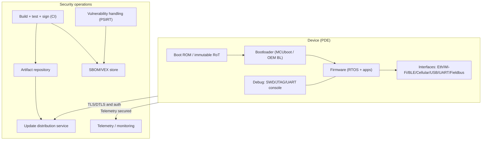
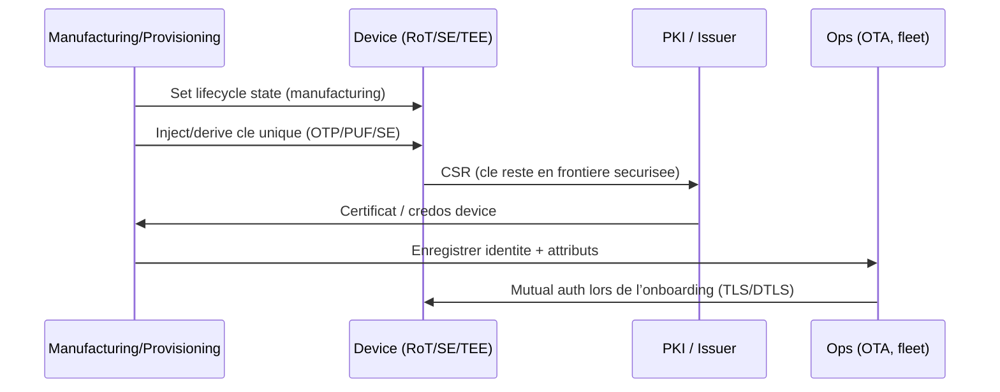
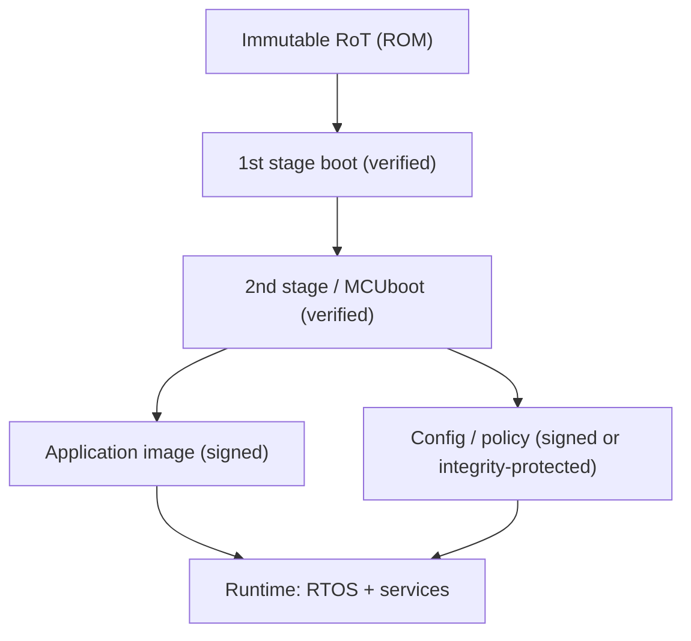
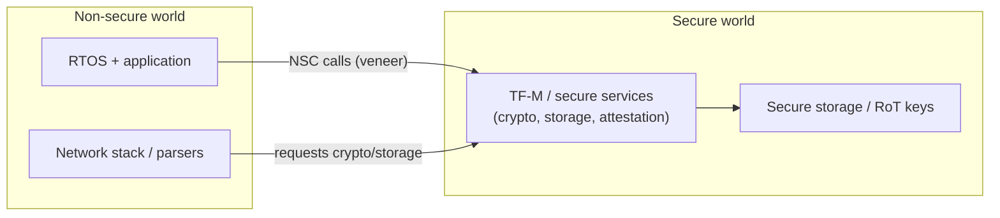
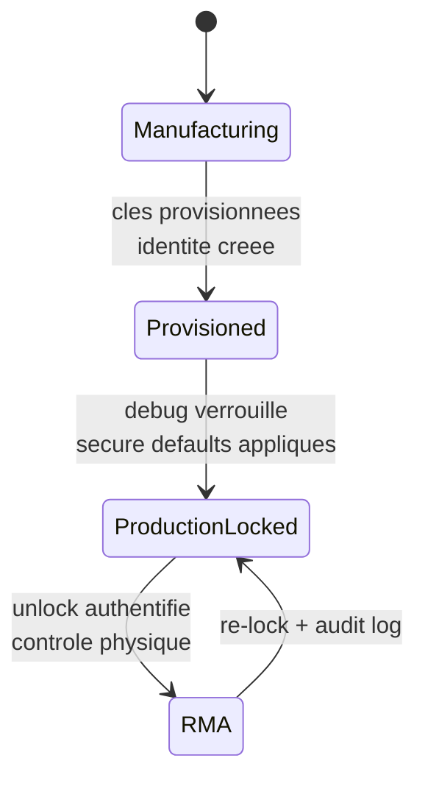
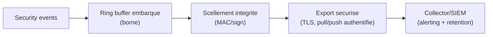
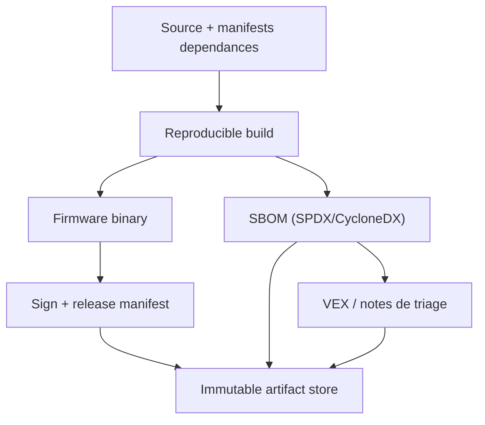

## Objet de cette cartographie

Cette page mappe les exigences de l’**Annexe I du CRA** vers des **controles techniques implementables** dans les produits embarques : fonctions CPU/SoC, firmware/chaine de boot, configuration RTOS, et pile update + vulnerability handling.

Elle sert de **guide de preuves** : chaque mapping inclut la clause CRA, ce qu’un evaluateur cherchera dans une architecture embarquee, et quels artefacts devraient exister dans la **documentation technique (Annexe VII)**.[1]

---

## 0) Modele de reference embarque (base de la cartographie)

Pour l’embarque, la conformite CRA couvre presque toujours **device + firmware + backend d’update**. La cartographie n’est credible que si la frontiere produit est explicite (voir aussi *Scope & Definitions*).

Idee cle : la plupart des clauses CRA se mappe a **plusieurs couches** (silicium → boot → runtime → ops).

---

## 1) Exigences "proprietes" CRA → controles embarques (Annexe I Part I)

L’Annexe I Part I(2)(a-m) est la liste actionnable. Ci-dessous, une **cartographie de controles** fidele au texte.

### 1.1 Tableau de mapping rapide (quoi implementer et ou)

| Clause CRA | Objectif de controle embarque | Controles embarques typiques (exemples) | Artefacts evidences (Annexe VII) |
| --- | --- | --- | --- |
| I(2)(a) no known exploitable vulns a la release | Eviter de shipper des vuln exploitables connues | SBOM + triage CVE; config securisee; fuzzing parsers; SAST C/C++; dependency gating | SBOM par build; log CVE/VEX; rapport tests securite |
| I(2)(b) secure-by-default + reset | Defauts sûrs jour 0 + factory reset | debug lock; services minimaux; creds uniques; comms securisees ON; reset usine efface secrets | Matrice secure defaults; spec + tests factory reset |
| I(2)(c) security updates (auto par defaut + opt-out) | Patchabilite + UX d’update sure | OTA signee; rollback-safe; rollout etage; auto update defaut (si applicable) + opt-out + report | Archi update; procedure deploiement; tests d’echec update |
| I(2)(d) protection acces non autorise + reporting | AuthN/AuthZ forte + audit | identite device; mutual auth; politique d’acces; rate limits; logs auth | Modele identite; spec proto auth; taxonomie evenements |
| I(2)(e) confidentialite | Proteger secrets/donnees sensibles | TLS/DTLS; stockage chiffre; secure element/TEE; zeroisation de cle | Profil crypto; plan key mgmt; classification data-flow |
| I(2)(f) integrite data/commands/program/config + report | Prevenir modifs non autorisees + detecter/report | secure boot; configs signees; checks integrite; anti-rollback; events corruption | Doc chaine boot; design signature config; logs tests corruption |
| I(2)(g) data minimisation | Collecter uniquement le necessaire | minimisation telemetrie; sampling/retention; desactivation identifiants non requis | Schema telemetrie + justification; politique de retention |
| I(2)(h) disponibilite fonctions essentielles | Resilience + mitigation DoS | watchdog; budgets ressources; bornes d’entree; rate limiting; mode recovery | Tests robustesse; limites ressources; procedure recovery |
| I(2)(i) minimiser impact sur autres | Ne pas nuire aux autres reseaux/devices | backoff et plafonds de taux; eviter comportement type scan; politique retry sûre | Spec comportement reseau; config de rate-limit |
| I(2)(j) limiter surfaces d’attaque | Reduc interfaces exposees | desactiver ports inutiles; suppression compile-time; mgmt authentifie; diag securises | Inventaire interfaces; matrice ports/services; hardening config |
| I(2)(k) reduire impact via mitigations exploitation | Contenir la compromission | MPU/MMU; TrustZone; separation privileges; flags hardening; sandbox | Design isolation; flags build; resume pen-test |
| I(2)(l) journaliser/monitorer activite interne + opt-out | Logs securite avec controle utilisateur | taxonomie events; logs tamper-resistant; export securise; semantique opt-out | Design logging; schema protection logs; API export |
| I(2)(m) suppression securisee + transfert securise | Decommissionnement sûr | secure wipe (flash interne/externe); migration authentifiee | Design + verification secure wipe; instructions utilisateur |
| I(1) niveau approprie base sur risques | Proportionnalite appuyee par analyse de risque | threat model; registre risques; rationale des controles par environnement | Analyse de risque mappee vers controles Annexe I |

**Source :** CRA Annexe I Part I(1)-(2).[1]

---

## 2) Hardware root of trust et identite device

### 2.1 Pourquoi c’est fondamental

Sans identite fiable et etat de boot prouve, difficile de credibiliser :
- protection acces non autorise (I(2)(d)),
- integrite (I(2)(f)),
- updates securisees (I(2)(c)),
- reduction d’impact (I(2)(k)).[1]

### 2.2 Pattern pratique embarque

**Objectif :** chaque device a une **identite crypto unique** ancree dans du materiel protege.

**Options typiques** (selon le SoC) :
- **OTP / eFuse** pour cle uniques ou KEK,
- **PUF-derived keys** (cle unique sans stocker les bits),
- **Secure element** externe ou **secure enclave / TEE** interne,
- Partition **TrustZone** pour crypto + stockage securise (Armv8-M/A).

#### Pipeline identite et provisioning

**Preuves a garder (dossier technique) :**
- spec provisioning (quoi est injecte/derive et ou),
- diagramme lifecycle (manufacturing → production → RMA),
- plan de rotation/revocation des cles/certs.

---

## 3) Secure boot et integrite mesuree (programme + configuration)

### 3.1 Ancre CRA

- protection d’integrite des programmes/config (I(2)(f))  
- reduction surface et mitigation exploitation (I(2)(j), I(2)(k))  
- updates securisees et anti-rollback en pratique (I(2)(c)).[1]

### 3.2 Chaine secure boot embarquee (design minimal credible)

**Decisions a prendre :**
- scheme de signature (type de cle, strategie de rotation),
- anti-rollback (compteurs monotones / politique de version),
- comportement en echec (mode recovery vs rollback slot),
- integrite config (bundles signes, commandes authentifiees).

**Preuves :**
- tests negatifs (mauvaise signature, version downgrade, flash corrompue),
- tests de coupure courant en cours d’update (voir section update),
- evenements de boot logs (verdict) relies a I(2)(l).[1]

---

## 4) Isolation runtime et controles memory-safety

### 4.1 Ancre CRA

- reduire impact des incidents via mitigations exploitation (I(2)(k))  
- limiter surface d’attaque (I(2)(j))  
- proteger confidentialite/integrite (I(2)(e)-(f)).[1]

### 4.2 Ce que signifie "exploitation mitigation" en embarque

Sans MMU complete, vous pouvez (et devez) utiliser :
- **MPU** (regions privilege vs unpriv, code RO, no-execute data si dispo),
- **TrustZone-M** (partition Secure/Non-secure + gateways securises),
- builds durcis (stack canaries, checks de bornes, W^X si supporte, protections controle de flux si toolchain le permet).

#### Esquisse TrustZone-M (concept)

**Preuves :**
- memory map (regions secure vs non-secure, regions MPU),
- liste des APIs privilegiees (ce qui requiert secure world / kernel),
- plan de tests prouvant les frontieres (tests negatifs).

---

## 5) Durcissement des interfaces et lifecycle debug

### 5.1 Ancre CRA

- secure-by-default (I(2)(b))  
- protection acces non autorise + reporting (I(2)(d))  
- reduction surface d’attaque (I(2)(j)).[1]

### 5.2 Inventaire d’interfaces obligatoire en pratique

Faire une liste unique :
- ports physiques (USB, UART, CAN, SWD/JTAG),
- surfaces radio (BLE, Wi-Fi, NFC),
- services logiciels (web UI, RPC, protocoles mgmt, endpoints update).

Pour chaque, indiquer :
- **active en production ?**
- **authentifie/autorise ?**
- **rate limite ?**
- **logge ?**
- **comment desactiver ?**

#### Machine a etats lifecycle debug (exemple)

**Preuves :**
- politique lifecycle (quand le debug est on, comment unlock, traces audit),
- rapport de configuration production (secure defaults, services desactives),
- notes de pen-test du plan de management.

---

## 6) Cryptographie et gestion des cles (state of the art)

### 6.1 Ancre CRA

- confidentialite via mecanismes "state of the art" (I(2)(e))  
- integrite et reporting de corruption (I(2)(f)).[1]

### 6.2 Ce qu’attendent les auditeurs (version embarquee)

Savoir montrer :
- **quels protocoles** (TLS/DTLS, MQTT over TLS, etc.),
- **quelles cipher suites** et tailles de cle (politique explicite),
- comment les cles sont generees, stockees, rotatees, revokeees, recuperees (RMA).

Rester simple et defensible :
- bibliotheques crypto maintenues,
- pas de protocols obsoletes ni cles faibles,
- regles de validation de certificats adapte es a votre contexte.

**Preuves :**
- document profil crypto,
- modele de confiance certifs (root CA, intermediaires, pinning),
- SOP de lifecycle de cle et plan d’incident (compromission de cle).

---

## 7) Hooks de logging / monitoring (niveau device)

### 7.1 Ancre CRA

Annexe I Part I(2)(l) : enregistrer et monitorer l’activite interne pertinente (acces/modif de donnees/services/fonctions), avec opt-out utilisateur.[1]

### 7.2 Patterns embarques

Even des devices limites doivent produire des events securite. Classes typiques :

- verdicts de boot (secure boot OK/KO),
- resultats auth/authz,
- tentatives d’update (download, verify, activate, rollback),
- changements de config,
- fautes d’integrite (signature fail, flags corruption),
- tentatives debug unlock / changements lifecycle.

#### Esquisse pipeline logging

**Preuves :**
- taxonomie events + mapping severite,
- design de protection des logs (anti-tamper / integrite),
- definition de l’**opt-out** (ce qui est desactive et ce qui reste requis pour safety/security).

---

## 8) Chemin d’update securise (device + flotte)

### 8.1 Ancre CRA (exact)

- Part I(2)(c) : security updates, auto-updates par defaut quand applicable, opt-out, notifications, report possible.[1]  
- Part II(2) : remedier sans delai, fournir des security updates ; separer updates securite / fonctionnalite si faisable.[1]  
- Part II(7)-(8) : mecanismes de distribution securises ; diffuser sans delai (et generalement gratuit) ; messages d’avis.[1]

### 8.2 Proprieties minimales pour un mecanisme d’update embarque

Credible si :

1. **Authenticity** : seules les images autorisees manufacturer s’installent (signature verifiee).
2. **Integrity** : corruption detectee avant activation (hash, verification).
3. **Anti-rollback** : politique empeche downgrade vers builds vulnerables.
4. **Power-fail safety** : recovery apres interruption (A/B, swap, mode recovery).
5. **Status transparency** : l’appareil peut rapporter l’etat d’update de facon securisee.
6. **Fleet control** : rollout etage + rollback flotte (gestion de risque).

#### Esquisse style Zephyr + MCUboot

**Preuves :**
- doc architecture update (device + backend),
- resultats de tests sur la matrice d’echec (download interrompu, swap interrompu, image corrompue),
- templates d’advisory (Part II(8)) et traces de rollout.

---

## 9) SBOM et controles supply-chain (realites firmware)

### 9.1 Ancre CRA

Annexe I Part II(1) : identifier/documenter vulnerabilites et composants, avec une **SBOM** en format machine courant, au moins pour les dependances top-level.[1]

### 9.2 Specifiques SBOM embarque (a inclure a minima)

Pour firmware, la SBOM doit couvrir :
- bootloader,
- RTOS,
- bibliotheques reseau/crypto,
- middleware (parsers, stacks de serialisation),
- HALs constructeur et SDK d’elements securises,
- composants toolchain pertinents pour la provenance.

#### Flux SBOM robuste

**Preuves :**
- SBOM par release liee au hash du build,
- log de triage CVE et (optionnel) statements VEX,
- preuve que les vuln sont remediees sans delai (Part II(2)).[1]

---

## 10) Checklist des "knobs" (ce que les equipes configurent vraiment)

### Hardware / SoC
- lifecycle state (manufacturing/production/RMA)
- stockage securise dispo (OTP/PUF/SE/TEE)
- politique debug lock (permanent vs unlock controle)
- compteurs monotones / stockage anti-rollback
- TRNG dispo + health checks

### Boot / firmware
- verification de signature pour boot et updates
- politique de version et regles rollback
- politique d’entree/sortie recovery mode
- integrite config (config signee / commandes authentifiees)

### RTOS / runtime
- separation de privilege (MPU/MMU, userspace)
- services crypto isoles (TEE ou secure partition si possible)
- flags de compilation hardening
- politiques de validation d’entree pour tous parsers/handlers
- limites ressources (heap, queues, connexions) pour la disponibilite

### Networking
- TLS/DTLS impose et configure (versions, suites)
- validation de certificats et ancres de confiance
- rate limiting/backoff pour ne pas nuire aux reseaux tiers (I(2)(i))

### Observabilite / logging
- taxonomie des evenements + retention
- protection d’integrite des logs
- auth pour l’export securise

---

## Problemes courants lors du mapping (specifique embarque)

Si l’application parait "dure", c’est souvent :

1. **Frontiere PDE floue** : device documente mais OTA/provisioning/telemetry absents (mapping updates/logging casse).  
2. **Explosion de variantes** : multiples memory maps/boot chains (A/B vs swap) mais evidences sur une seule voie.  
3. **Pas de politique lifecycle** : manufacturing vs production vs RMA non defini, donc debug/cles/rollback incoherents.  
4. **Modele d’identite non specifie** : "device a TLS" mais pas d’identite par device ni plan d’emission/revocation.  
5. **Anti-rollback absent** : mecanisme d’update permet downgrade vers firmware vuln (oppose I(2)(c)).  
6. **Logging present mais non securise** : logs falsifiables ou export non authentifie (affaiblit I(2)(l)).  
7. **Secure wipe non implemente** : reset usine laisse des secrets (I(2)(m)).  
8. **SBOM sans triage** : SBOM produite mais pas de process d’impact/remediation rapide (Part II(2)).  
9. **Opt-out ambigu** : opt-out logs/auto-updates non defini pour votre type de produit ; documenter interpretation + instructions utilisateur (Annexe II).  
10. **Evidences non versionnees** : controles existent mais artefacts non lies a un hash de release dans la doc technique (echec Annexe VII).

---

## References

[1]: Regulation (EU) 2024/2847 (Cyber Resilience Act) - Annexe I (Part I & Part II) (EUR-Lex) https://eur-lex.europa.eu/legal-content/EN/TXT/?uri=CELEX:32024R2847  
[2]: ETSI EN 303 645 v3.1.3 (Consumer IoT baseline) https://www.etsi.org/deliver/etsi_en/303600_303699/303645/03.01.03_60/en_303645v030103p.pdf  
[3]: IEC 62443-4-2 (IACS component technical security requirements) (standard reference; obtain via IEC/ISA)  
[4]: CRA Annexe VII - exigences de documentation technique (EUR-Lex) https://eur-lex.europa.eu/legal-content/EN/TXT/?uri=CELEX:32024R2847  
