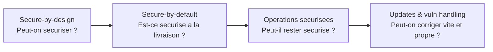
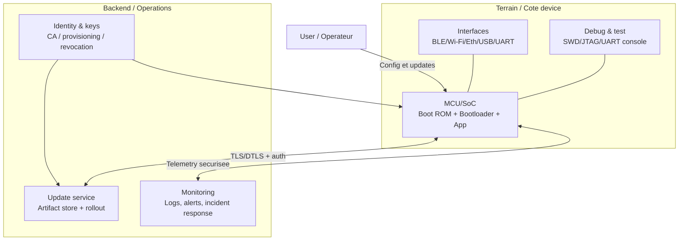
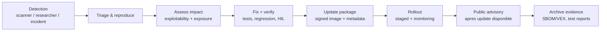
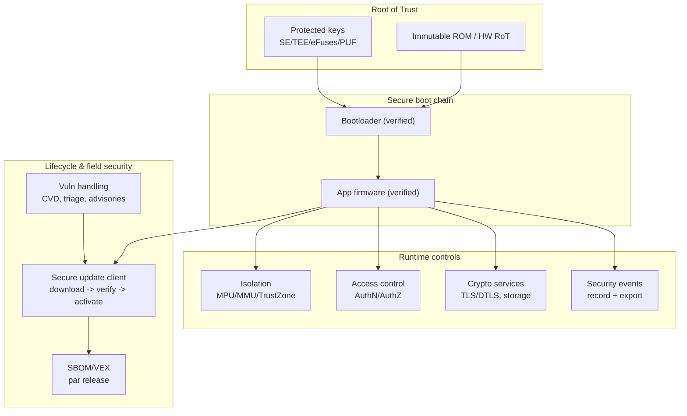
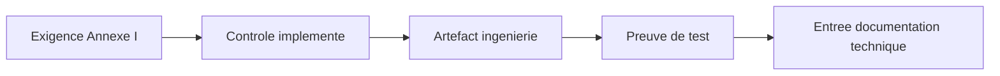

## Ce que le CRA demande vraiment (vue ingenierie)

Le CRA est neutre technologiquement mais **pas vague** : les produits avec elements numeriques doivent etre **concus, developpes et produits** pour atteindre un "niveau approprie de cybersecurite base sur les risques" (Annexe I, Part I(1)), puis livrer des **proprietes concretes** listees en Annexe I, Part I(2)(a-m).[1]

Pour l'embarque, la question pratique est :

> Pouvons-nous montrer—avec artefacts de conception, resultats de tests et procedures operationnelles—que l'appareil, le firmware et l'ecosysteme de mise a jour protegent **confidentialite, integrite, disponibilite**, et que nous pouvons garder le produit securise **pendant toute la periode de support** ?[1][2]

Cette page cible MCU/SoC (capteurs, gateways, PLC, devices indus/consumer) et traduit le CRA en controles implementables et preuves a archiver dans la **documentation technique** (Annexe VII).[4]

---

## Secure-by-design vs secure-by-default (ne pas confondre)

Les deux sont requis mais differents :

- **Secure-by-design** = decisions d'architecture qui rendent la securite possible (root of trust, chaine de boot, isolation, key lifecycle, update path, hooks de logging). Cote CRA, pilote par l'analyse de risque (Art. 13(2)-(3)) et doit mener au respect de l'Annexe I.[2][1]
- **Secure-by-default** = configuration livree sure au jour 0 sans expertise utilisateur. Le CRA exige une **configuration secure-by-default** a la mise sur le marche (Annexe I, Part I(2)(b)).[1]

Si secure-by-design est faible (pas de boot fiable, pas de protection de cle, pas de mecanisme d'update), secure-by-default devient un exercice de cases et la preuve sera faible.

---

## Modele de reference embarque (ce que l'auditeur cherche)

La preuve CRA est plus simple si vous definissez une **architecture de reference** puis montrez comment chaque exigence est appliquee a travers les frontieres de confiance.

Points clefs : clarifier (1) ce qui est dans le PDE, (2) quels services externes sont requis pour la securite (updates, identite, monitoring), (3) comment la compromission est contenue.

---

## Exigences essentielles CRA traduites pour l'embarque

Annexe I Part I est la checklist des proprietes de securite. Reference CRA gardee, traductions en controles + preuves embarquees.

### Part I(1) : "Niveau approprie de cybersecurite base sur les risques"

Obligation chapeau : justifier votre posture via une **analyse de risque cyber** documentee et maintenue (Art. 13(2)-(3)).[2] Cette analyse doit montrer comment l'Annexe I Part I(2) s'applique et comment vous l'implementiez.[2][1]

Resultat pratique :
- definir l'**environnement securite** (deploiement, hypotheses d'acces physique, exposition reseau),
- identifier les assets (cles, credos, fonctions safety, IP proprietaire),
- definir les capacites attaquant (remote, local, supply-chain),
- choisir des controles proportionnels a ce profil.

### Part I(2)(a) : "No known exploitable vulnerabilities" a la release

Les PDE doivent etre mis a disposition **sans vulnerabilites exploitables connues**.[1]

Traduction embarquee :
- scan de vulnerabilites pour **tous les composants tiers** (RTOS, stack TLS, bootloader, libs),
- composition firmware traçable (SBOM) et CVE connues triees (VEX si pertinent),
- tests securite (static analysis + fuzzing sur parsers/protocoles) en gate de release.

Preuves :
- rapport securite release, log de triage CVE, snapshot SBOM, resultats tests securite.[4][1]

### Part I(2)(b) : Secure-by-default + reset etat d'origine

Exigence explicite de **secure-by-default** et possibilite de **reset** a l'etat d'origine.[1]

Exemples embarques :
- ports debug verrouilles en production (ou gates via challenge signe / process RMA),
- pas de password admin par defaut ; si credos, ils sont uniques et rotates,
- services reseau off par defaut sauf necessaires (pas de telnet/FTP ouverts),
- factory reset efface les secrets et restaure le baseline durci.

Preuves :
- matrice "secure defaults" (features/services vs etat par defaut) + spec reset usine.[4][1]

### Part I(2)(c) : Mises a jour de securite (auto par defaut + opt-out)

Le CRA exige que les vulnerabilites soient traitees via des **security updates**, et, si applicable, **auto-updates** actives par defaut avec opt-out et possibilite de reporter temporairement.[1] Les instructions doivent expliquer comment couper l'auto-update.[3]

Traduction :
- mecanisme d'update securise : images signees, verifiees avant activation, safe rollback,
- politique d'update : rollout etage, checks compatibilite, recovery si coupure courant,
- UX de gestion : etat d'update clair et controle (opt-out / report si applicable).

Preuves :
- diagramme architecture update, politique de signature, procedure deploiement, logs de tests d'echec d'update.[4][1]

### Part I(2)(d) : Protection contre acces non autorise + reporting

Protections contre acces non autorise avec mecanismes adaptes et **reporting** des acces possibles.[1]

Traduction :
- identite device (credential/cert unique par appareil),
- authN/authZ pour actions de gestion (config, debug unlock, updates),
- rate limit / lockout contre brute force,
- journaux pour echecs auth et changements de privilege.

Preuves :
- modele de controle d'acces (roles), spec des protocoles auth, taxonomie des events/logs.[4][1]

### Part I(2)(e) : Confidentialite des donnees au repos/en transit

Protection de la confidentialite des donnees stockees/transmises/traitees (chiffrement up-to-date).[1]

Traduction :
- TLS/DTLS avec suites modernes,
- stockage chiffre des secrets (cles, tokens) via secure element/TEE ou derives,
- protection des assets sensibles en RAM (isolation + zeroisation au reset).

Preuves :
- profil crypto, plan de gestion des cles, document "data classification & flows".[4][1]

### Part I(2)(f) : Integrite des donnees/commandes/programmes/config + reporting

Protection de l'integrite contre manipulation non autorisee et **report** des corruptions.[1]

Traduction :
- secure boot verifiant signatures firmware (mesured boot si possible),
- config protege en integrite (bundles signes, compteurs monotones),
- attestation ou checks periodiques d'integrite pour zones critiques (flags boot, etat securite),
- reporting des corruptions via logs/telemetry (echecs signature, CRC fails).

Preuves :
- description chaine secure boot, design integrite config, cas de test d'echec d'integrite.[4][1]

### Part I(2)(g) : Data minimisation

Ne traiter que les donnees adequates, pertinentes et limitees au necessaire.[1]

Traduction :
- collecter uniquement la telemetrie requise pour securite/ops,
- eviter les identifiants always-on sans besoin,
- definir retention et politiques d'echantillonnage.

Preuves :
- schema de telemetrie avec justification par champ + politique de retention.[4][1]

### Part I(2)(h)+(i) : Disponibilite et ne pas nuire aux autres

Protection de la disponibilite des fonctions essentielles et reduction d'impact sur autres devices/reseaux.[1]

Traduction :
- watchdog + mode recovery,
- rate limiting des endpoints ; limites ressources (CPU, heap, queues),
- validation robuste des entrees pour parsers protocoles,
- decisions fail secure/fail close pour chemins critiques.

Preuves :
- analyse menace disponibilite, resultats de tests robustesse, budgets ressources.[4][1]

### Part I(2)(j)+(k) : Reduction surface d'attaque + mitigations exploitation

Limiter la surface d'attaque (interfaces externes) et reduire l'impact via mitigations.[1]

Traduction :
- desactiver peripheriques/stacks non utilises a la compilation,
- separer privilege/non-privilege (MPU/MMU; TrustZone-M/A si dispo),
- builds durcis : stack canaries, W^X si possible, hardening controle de flux si supporte,
- parsing strict pour toute donnee entrante (commandes, manifestes OTA, caracteristiques BLE).

Preuves :
- inventaire interfaces, design d'isolation, flags compilation/hardening, rationale des compromis.[4][1]

### Part I(2)(l) : Logging et monitoring d'activite pertinente (opt-out)

Enregistrer et monitorer l'activite interne pertinente (acces/modif de donnees/services/fonctions) avec opt-out utilisateur.[1]

Traduction :
- liste d'evenements securite : verdicts boot, echecs auth, tentatives debug unlock, echecs update, alarmes integrite,
- stockage des logs protege (anneau borne + protection d'integrite) ou export securise,
- chemin d'opt-out explicite quand le contexte produit l'exige (documenter la signification d'"opt-out" pour votre classe).

Preuves :
- taxonomie des evenements + schema protection log + securisation interface d'export.[4][1]

### Part I(2)(m) : Suppression securisee + transfert securise

Fournir un moyen simple de supprimer toutes les donnees et reglages de maniere permanente, et assurer un transfert securise si transfert possible.[1][3]

Traduction :
- "secure wipe" couvrant credos, donnees utilisateur, config (y compris flash externe),
- procedure decommissioning dans la doc utilisateur,
- si migration (ex. transfert config vers nouvelle unite), transfert authentifie et protege en confidentialite.

Preuves :
- design secure wipe + methode de verification + instructions utilisateur.[3][4][1]

---

## Annexe I Part II : Vulnerability handling (muscle du lifecycle)

Part II est obligatoire et souvent ratee parce que la securite est traitee comme une checklist de release unique.

Le CRA exige notamment : **SBOM**, remediation rapide via security updates, tests reguliers, divulgation publique apres update, politique CVD et point de contact, distribution d'updates securisee (potentiellement auto), updates sans delai et generalement gratuites.[1]

Prevoir :
- **updates tolérantes aux coupures** (slots A/B, swap/overwrite, mode recovery),
- **segmentation flotte** (variants, memory maps, SKUs regionaux),
- **longues periodes de support** avec contraintes silicon qui compliquent les backports,
- updates de securite separees des feature updates quand possible.[1]

---

## Assembler le tout : blueprint embarque "minimum credible"

Ce n'est pas le seul design valide, mais un pattern courant qui mappe proprement a l'Annexe I :

Chaque bloc se mappe aux proprietes Annexe I Part I(2) et aux process Part II.[1]

---

## Evidence : ce qui doit finir dans la documentation technique

La documentation technique CRA doit inclure (au minimum) la description d'architecture systeme, l'analyse de risque montrant comment l'Annexe I s'applique, les specs de traitement des vulnerabilites (SBOM et distribution d'updates securisee), et les rapports de test.[4][2]

Utilisez une "evidence map" pour repondre vite en audit :

Exemples :
- Annexe I(2)(c) updates -> design OTA signe -> logs de tests d'update -> Annexe VII item 2(b) + item 6.[1][4]
- Annexe I(2)(j) surface d'attaque -> inventaire interfaces -> scans + fuzz -> Annexe VII item 2(a) + item 6.[1][4]
- Part II(1) SBOM -> SBOM CycloneDX/SPDX -> archive par release -> Annexe VII item 2(b) + item 8 (sur demande).[1][4]

---

## Problemes frequents (checklist de revue)

Si vous ne savez pas comment implementer/documenter ce chapitre, c'est souvent l'un de ces problemes :

1. **Environnement securite flou** : hypotheses d'acces physique manquantes, donc "niveau approprie" non justifiable.[2][1]
2. **Pas d'histoire unique d'update** : plusieurs SKUs/boot paths, un seul documente/teste (casse Annexe I(2)(c)).[1][4]
3. **Debug non gouverne** : politiques SWD/JTAG/UART en connaissance tribale (touche secure-by-default et reduction surface).[1]
4. **Modele d'identite flou** : pas d'identite device claire, roles ou auth pour maintenance (echoue Annexe I(2)(d)).[1]
5. **Lifecycle de cle indefini** : provisioning, rotation, revocation, RMA non ingenieres (faible confid/integrite).[1]
6. **Logging traite comme "nice to have"** : pas de taxonomie, pas de protection, pas d'export, opt-out non defini.[1]
7. **Secure wipe oublie** : reset usine laisse des secrets (echoue Annexe I(2)(m) et instructions utilisateur).[1][3]
8. **SBOM sans operations** : SBOM genere une fois, pas de triage/VEX ni liaison aux gates de release (echoue Part II(1-2)).[1]
9. **"Availability" non testee** : watchdog/recovery existent mais jamais exercises sous DoS/exhaustion.[1]
10. **Preuves eparpillees** : artefacts existent mais non references/versionnes dans le dossier technique (douleur Annexe VII).[4]

Si vous ne fixez qu'une chose : construisez un **pipeline de release repetable** qui produit (1) artefacts signes, (2) SBOM/VEX, (3) resultats tests securite, (4) un court "rapport de couverture Annexe I" pointant vers les preuves par clause.[1][4]

---

## References

[1]: Regulation (EU) 2024/2847 (Cyber Resilience Act) - Annexe I (Part I & Part II) (EUR-Lex) https://eur-lex.europa.eu/legal-content/EN/TXT/?uri=CELEX:32024R2847  
[2]: Regulation (EU) 2024/2847 - Article 13 (analyse de risque, integration lifecycle, due diligence, lien vuln handling) https://eur-lex.europa.eu/legal-content/EN/TXT/?uri=CELEX:32024R2847  
[3]: Regulation (EU) 2024/2847 - Annexe II (user info : support period, install update, opt-out auto-update, decommissioning) https://eur-lex.europa.eu/legal-content/EN/TXT/?uri=CELEX:32024R2847  
[4]: Regulation (EU) 2024/2847 - Annexe VII (documentation technique : architecture, SBOM/CVD/distribution updates, analyse de risque, tests) https://eur-lex.europa.eu/legal-content/EN/TXT/?uri=CELEX:32024R2847  
[5]: Regulation (EU) 2024/2847 - Article 3 definitions (SBOM, vulnerability, exploitable vulnerability, actively exploited vulnerability, significant cybersecurity risk) https://eur-lex.europa.eu/legal-content/EN/TXT/?uri=CELEX:32024R2847  
[6]: NIST SP 800-218 (SSDF) https://csrc.nist.gov/publications/detail/sp/800-218/final  
[7]: ETSI EN 303 645 v3.1.3 (Consumer IoT baseline) https://www.etsi.org/deliver/etsi_en/303600_303699/303645/03.01.03_60/en_303645v030103p.pdf  
[8]: IEC 62443-4-2 (IACS component technical security requirements) (standard payant via IEC/ISA)  
